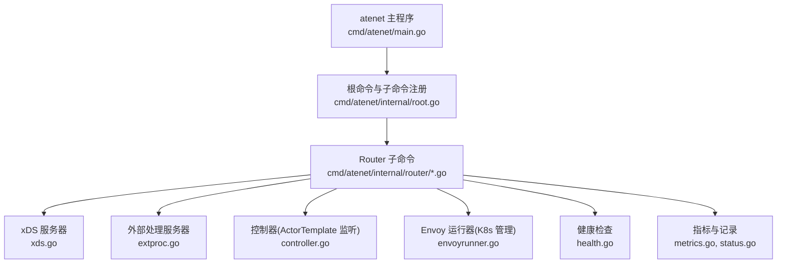
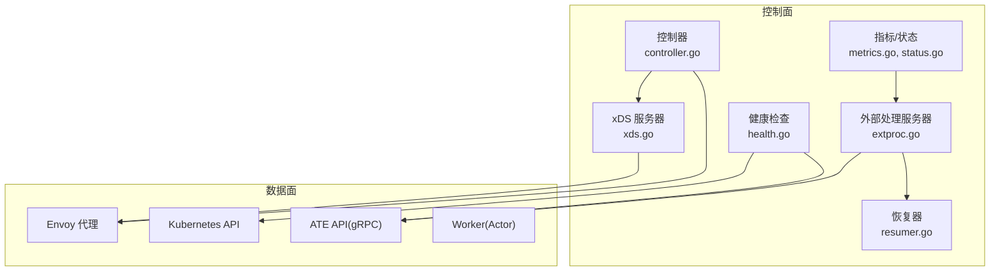
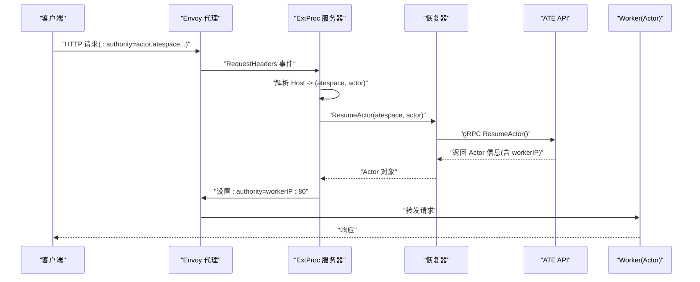
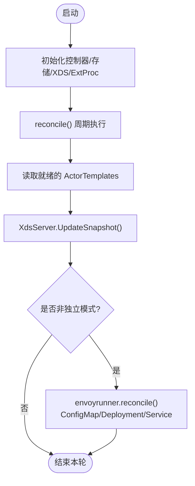
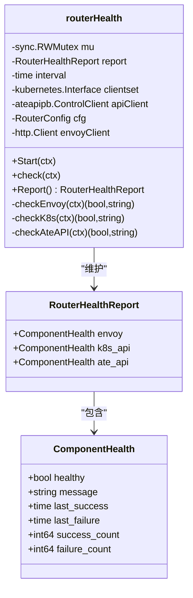
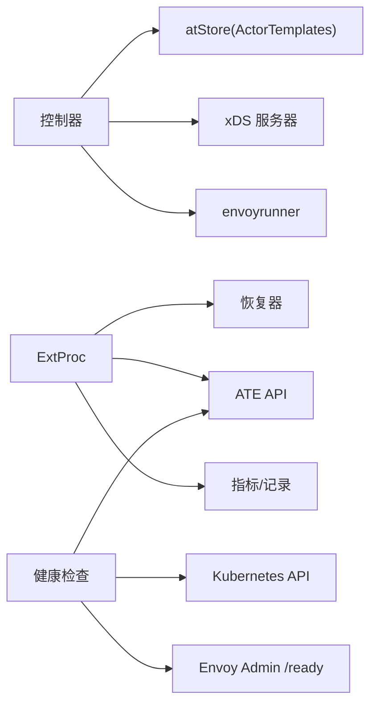

# 流量路由与恢复

<cite>
**本文引用的文件**   
- [cmd/atenet/main.go](file://cmd/atenet/main.go)
- [cmd/atenet/internal/root.go](file://cmd/atenet/internal/root.go)
- [cmd/atenet/internal/router/controller.go](file://cmd/atenet/internal/router/controller.go)
- [cmd/atenet/internal/router/extproc.go](file://cmd/atenet/internal/router/extproc.go)
- [cmd/atenet/internal/router/extproc_in.go](file://cmd/atenet/internal/router/extproc_in.go)
- [cmd/atenet/internal/router/extproc_out.go](file://cmd/atenet/internal/router/extproc_out.go)
- [cmd/atenet/internal/router/resumer.go](file://cmd/atenet/internal/router/resumer.go)
- [cmd/atenet/internal/router/xds.go](file://cmd/atenet/internal/router/xds.go)
- [cmd/atenet/internal/router/envoyrunner.go](file://cmd/atenet/internal/router/envoyrunner.go)
- [cmd/atenet/internal/router/atstore.go](file://cmd/atenet/internal/router/atstore.go)
- [cmd/atenet/internal/router/health.go](file://cmd/atenet/internal/router/health.go)
- [cmd/atenet/internal/router/metrics.go](file://cmd/atenet/internal/router/metrics.go)
- [cmd/atenet/internal/router/status.go](file://cmd/atenet/internal/router/status.go)
- [docs/architecture.md](file://docs/architecture.md)
</cite>

## 目录
1. [简介](#简介)
2. [项目结构](#项目结构)
3. [核心组件](#核心组件)
4. [架构总览](#架构总览)
5. [详细组件分析](#详细组件分析)
6. [依赖关系分析](#依赖关系分析)
7. [性能考量](#性能考量)
8. [故障排查指南](#故障排查指南)
9. [结论](#结论)
10. [附录](#附录)

## 简介
本文件聚焦于 Agent Substrate 的流量路由与自动恢复机制，围绕以下目标展开：
- 请求到达时的自动唤醒流程：在收到 HTTP 请求时如何触发暂停的 Actor 恢复。
- 路由控制器实现：包括路由规则的动态更新与状态同步。
- 健康检查机制：监控关键依赖的健康状态并支持故障转移。
- 流量分发策略：轮询、加权、基于会话的负载均衡（概念性说明）。
- 连接池管理与资源限制：Envoy 侧的连接与超时配置。
- 路由配置示例与故障恢复场景。
- 网络延迟监控与性能分析工具使用方法。

## 项目结构
atenet 是统一的网络守护进程，提供路由、外部处理、xDS 服务、健康检查与状态面板等能力。入口命令注册了 router 子命令，router 内部由控制器协调 xDS 与外部处理服务器，并通过 Envoy 作为数据面代理。

**图示来源** 
- [cmd/atenet/main.go:1-22](file://cmd/atenet/main.go#L1-L22)
- [cmd/atenet/internal/root.go:25-43](file://cmd/atenet/internal/root.go#L25-L43)
- [cmd/atenet/internal/router/controller.go:26-65](file://cmd/atenet/internal/router/controller.go#L26-L65)
- [cmd/atenet/internal/router/xds.go:71-104](file://cmd/atenet/internal/router/xds.go#L71-L104)
- [cmd/atenet/internal/router/extproc.go:38-56](file://cmd/atenet/internal/router/extproc.go#L38-L56)
- [cmd/atenet/internal/router/envoyrunner.go:36-48](file://cmd/atenet/internal/router/envoyrunner.go#L36-L48)
- [cmd/atenet/internal/router/health.go:47-72](file://cmd/atenet/internal/router/health.go#L47-L72)
- [cmd/atenet/internal/router/metrics.go:24-30](file://cmd/atenet/internal/router/metrics.go#L24-L30)
- [cmd/atenet/internal/router/status.go:132-150](file://cmd/atenet/internal/router/status.go#L132-L150)

**章节来源**
- [cmd/atenet/main.go:1-22](file://cmd/atenet/main.go#L1-L22)
- [cmd/atenet/internal/root.go:25-43](file://cmd/atenet/internal/root.go#L25-L43)

## 核心组件
- 外部处理服务器（ExtProc）：接收来自 Envoy 的请求头事件，解析 Host 获取 (atespace, actor)，调用恢复流程，返回目标地址以重写 :authority。
- 恢复器（ActorResumer）：对并发恢复进行去重与指数退避重试，保证幂等性与容错。
- xDS 服务器：生成并推送 Listener/Route/Cluster 快照给 Envoy，包含 ext_proc 过滤器、动态转发代理、可选 OTLP 追踪。
- 控制器（Controller）：周期性拉取 ActorTemplates，更新 xDS 快照；在非独立模式下管理 Envoy 的 Deployment/Service/ConfigMap。
- 健康检查：定时探测 Envoy、Kubernetes API、ATE API 的状态，输出汇总报告。
- 指标与状态面板：记录路由耗时直方图与最近请求日志，提供 JSON/HTML 视图。

**章节来源**
- [cmd/atenet/internal/router/extproc.go:38-56](file://cmd/atenet/internal/router/extproc.go#L38-L56)
- [cmd/atenet/internal/router/resumer.go:31-41](file://cmd/atenet/internal/router/resumer.go#L31-L41)
- [cmd/atenet/internal/router/xds.go:71-104](file://cmd/atenet/internal/router/xds.go#L71-L104)
- [cmd/atenet/internal/router/controller.go:26-65](file://cmd/atenet/internal/router/controller.go#L26-L65)
- [cmd/atenet/internal/router/health.go:47-72](file://cmd/atenet/internal/router/health.go#L47-L72)
- [cmd/atenet/internal/router/metrics.go:24-30](file://cmd/atenet/internal/router/metrics.go#L24-L30)
- [cmd/atenet/internal/router/status.go:132-150](file://cmd/atenet/internal/router/status.go#L132-L150)

## 架构总览
整体采用“控制面 + 数据面”分离：
- 控制面：atenet 内的 Controller、xDS、ExtProc、健康检查、指标与状态面板。
- 数据面：Envoy 作为入站代理，通过 ext_proc 将请求头交给 atenet 决策，再经动态转发代理将请求转发到具体 Worker。

**图示来源** 
- [cmd/atenet/internal/router/controller.go:88-110](file://cmd/atenet/internal/router/controller.go#L88-L110)
- [cmd/atenet/internal/router/xds.go:148-194](file://cmd/atenet/internal/router/xds.go#L148-L194)
- [cmd/atenet/internal/router/extproc.go:80-128](file://cmd/atenet/internal/router/extproc.go#L80-L128)
- [cmd/atenet/internal/router/resumer.go:46-104](file://cmd/atenet/internal/router/resumer.go#L46-L104)
- [cmd/atenet/internal/router/health.go:91-147](file://cmd/atenet/internal/router/health.go#L91-L147)

## 详细组件分析

### 自动唤醒流程（请求到达 → 恢复 → 路由）
当客户端向统一 DNS 后缀发起 HTTP 请求时，Envoy 拦截请求头并调用 ExtProc。ExtProc 解析 Host 得到 (atespace, actorName)，调用恢复器确保 Actor 处于运行态，随后将目标 Worker IP:Port 写入 :authority 并返回给 Envoy，最终由动态转发代理将请求转发至实际 Worker。

**图示来源** 
- [cmd/atenet/internal/router/extproc.go:130-188](file://cmd/atenet/internal/router/extproc.go#L130-L188)
- [cmd/atenet/internal/router/extproc_in.go:59-72](file://cmd/atenet/internal/router/extproc_in.go#L59-L72)
- [cmd/atenet/internal/router/extproc_out.go:35-44](file://cmd/atenet/internal/router/extproc_out.go#L35-44)
- [cmd/atenet/internal/router/resumer.go:46-104](file://cmd/atenet/internal/router/resumer.go#L46-L104)

**章节来源**
- [cmd/atenet/internal/router/extproc.go:80-128](file://cmd/atenet/internal/router/extproc.go#L80-L128)
- [cmd/atenet/internal/router/extproc_in.go:25-57](file://cmd/atenet/internal/router/extproc_in.go#L25-L57)
- [cmd/atenet/internal/router/extproc_out.go:23-44](file://cmd/atenet/internal/router/extproc_out.go#L23-44)
- [cmd/atenet/internal/router/resumer.go:31-41](file://cmd/atenet/internal/router/resumer.go#L31-L41)

### 路由控制器与动态更新
控制器周期性拉取已就绪的 ActorTemplates，生成 xDS 快照并推送给 Envoy；在非独立模式下，还会管理 Envoy 的 ConfigMap、Deployment 与 Service，确保数据面与控制面一致。

**图示来源** 
- [cmd/atenet/internal/router/controller.go:67-110](file://cmd/atenet/internal/router/controller.go#L67-L110)
- [cmd/atenet/internal/router/xds.go:148-194](file://cmd/atenet/internal/router/xds.go#L148-L194)
- [cmd/atenet/internal/router/envoyrunner.go:50-64](file://cmd/atenet/internal/router/envoyrunner.go#L50-L64)
- [cmd/atenet/internal/router/atstore.go:41-55](file://cmd/atenet/internal/router/atstore.go#L41-L55)

**章节来源**
- [cmd/atenet/internal/router/controller.go:26-65](file://cmd/atenet/internal/router/controller.go#L26-L65)
- [cmd/atenet/internal/router/envoyrunner.go:139-222](file://cmd/atenet/internal/router/envoyrunner.go#L139-L222)
- [cmd/atenet/internal/router/atstore.go:25-55](file://cmd/atenet/internal/router/atstore.go#L25-L55)

### 健康检查与故障转移
健康检查模块定期探测 Envoy、Kubernetes API、ATE API 的可用性，并维护成功/失败计数与时间戳。该报告可通过状态接口暴露，用于上层编排或告警。

**图示来源** 
- [cmd/atenet/internal/router/health.go:32-45](file://cmd/atenet/internal/router/health.go#L32-L45)
- [cmd/atenet/internal/router/health.go:47-72](file://cmd/atenet/internal/router/health.go#L47-L72)
- [cmd/atenet/internal/router/health.go:91-147](file://cmd/atenet/internal/router/health.go#L91-L147)
- [cmd/atenet/internal/router/health.go:210-218](file://cmd/atenet/internal/router/health.go#L210-L218)

**章节来源**
- [cmd/atenet/internal/router/health.go:91-147](file://cmd/atenet/internal/router/health.go#L91-L147)

### 流量分发策略（概念性说明）
当前代码中 Envoy 集群默认使用轮询策略，且未显式配置权重或会话粘性。若需引入加权或基于会话的负载均衡，可在 xDS 构建阶段调整 Cluster 的 LbPolicy 与相关策略字段（例如一致性哈希），并在快照更新时生效。

- 轮询：已在静态集群中启用。
- 加权：需在 ClusterLoadAssignment 中为端点分配权重。
- 基于会话：可启用一致性哈希策略，按 Cookie/Header 做粘性。

[本节为概念性说明，不直接分析具体文件]

### 连接池管理与资源限制
- 上游协议：HTTP/2 显式启用，利于复用连接。
- 连接超时：上游连接超时设置为较短值，避免长尾阻塞。
- ext_proc 消息超时：显式配置以避免默认过短导致的误判。
- 动态转发代理：内置 DNS 缓存，减少解析开销。

**章节来源**
- [cmd/atenet/internal/router/xds.go:227-272](file://cmd/atenet/internal/router/xds.go#L227-L272)
- [cmd/atenet/internal/router/xds.go:386-466](file://cmd/atenet/internal/router/xds.go#L386-L466)
- [cmd/atenet/internal/router/xds.go:336-355](file://cmd/atenet/internal/router/xds.go#L336-L355)

### 路由配置示例与故障恢复场景
- 路由配置示例：参考 xDS 构建函数中的 Listener/Route/Cluster 定义，以及 Envoy 运行时注入的 ext_proc 过滤器与动态转发代理过滤器。
- 故障恢复场景：
  - 恢复并发冲突：恢复器遇到 Aborted 错误会重试，避免重复拉起。
  - 上下文取消：恢复器在后台任务中使用固定超时，确保后续等待者仍可获得结果。
  - 健康检查失败：上报各依赖健康状态，便于上层编排进行故障转移或回滚。

**章节来源**
- [cmd/atenet/internal/router/xds.go:357-384](file://cmd/atenet/internal/router/xds.go#L357-L384)
- [cmd/atenet/internal/router/xds.go:386-466](file://cmd/atenet/internal/router/xds.go#L386-L466)
- [cmd/atenet/internal/router/resumer.go:61-86](file://cmd/atenet/internal/router/resumer.go#L61-L86)
- [cmd/atenet/internal/router/resumer.go:54-59](file://cmd/atenet/internal/router/resumer.go#L54-L59)
- [cmd/atenet/internal/router/health.go:91-147](file://cmd/atenet/internal/router/health.go#L91-L147)

### 网络延迟监控与性能分析工具
- 指标：
  - 路由耗时直方图：从 ExtProc 接收到请求到解析出目标 Worker 的耗时，不含 Actor 执行与响应时间。
  - 桶边界：覆盖毫秒到数十秒范围，便于观察 P95/P99。
- 追踪：
  - Envoy 侧可配置 OpenTelemetry gRPC 导出，结合 atenet 内 Span 传播，形成端到端链路。
- 诊断面板：
  - 状态接口支持 JSON/HTML 两种格式，展示最近请求、健康状态、模板列表与运行参数。

**章节来源**
- [cmd/atenet/internal/router/metrics.go:24-51](file://cmd/atenet/internal/router/metrics.go#L24-51)
- [cmd/atenet/internal/router/extproc.go:190-199](file://cmd/atenet/internal/router/extproc.go#L190-L199)
- [cmd/atenet/internal/router/xds.go:478-501](file://cmd/atenet/internal/router/xds.go#L478-L501)
- [cmd/atenet/internal/router/status.go:180-281](file://cmd/atenet/internal/router/status.go#L180-L281)

## 依赖关系分析
- 控制器依赖：
  - atStore：从 Kubernetes 或文件加载 ActorTemplates。
  - XdsServer：生成并推送 xDS 快照。
  - envoyrunner：管理 Envoy 的 K8s 资源。
- 外部处理服务器依赖：
  - ATE API：调用 ResumeActor 等控制面接口。
  - 恢复器：并发去重与重试。
  - 指标与记录：统计路由耗时与最近请求。
- 健康检查依赖：
  - Kubernetes API：版本探测。
  - ATE API：ListActors 探测连通性。
  - Envoy Admin：/ready 探测存活。

**图示来源** 
- [cmd/atenet/internal/router/controller.go:26-65](file://cmd/atenet/internal/router/controller.go#L26-L65)
- [cmd/atenet/internal/router/atstore.go:25-55](file://cmd/atenet/internal/router/atstore.go#L25-L55)
- [cmd/atenet/internal/router/extproc.go:38-56](file://cmd/atenet/internal/router/extproc.go#L38-L56)
- [cmd/atenet/internal/router/resumer.go:31-41](file://cmd/atenet/internal/router/resumer.go#L31-L41)
- [cmd/atenet/internal/router/health.go:91-147](file://cmd/atenet/internal/router/health.go#L91-L147)

**章节来源**
- [cmd/atenet/internal/router/controller.go:88-110](file://cmd/atenet/internal/router/controller.go#L88-L110)
- [cmd/atenet/internal/router/extproc.go:80-128](file://cmd/atenet/internal/router/extproc.go#L80-L128)
- [cmd/atenet/internal/router/health.go:91-147](file://cmd/atenet/internal/router/health.go#L91-L147)

## 性能考量
- 激活延迟目标：从唤醒事件到可接收流量的 P95 目标为 100ms。
- 高吞吐：单集群每秒唤醒事件目标约 1000。
- 优化点：
  - 恢复去重与指数退避降低控制面压力。
  - ext_proc 仅处理请求头，避免大体重载。
  - 动态转发代理 DNS 缓存减少解析开销。
  - 合理设置上游连接超时与消息超时，避免长尾。

[本节为通用指导，不直接分析具体文件]

## 故障排查指南
- 常见问题定位：
  - Host 解析失败：ExtProc 会返回 404 类错误，检查域名是否符合 <actor>.<atespace>.actors.resources.substrate.ate.dev 规范。
  - 恢复冲突：恢复器遇到 Aborted 会重试，关注日志中的重试次数与最终结果。
  - 健康检查失败：查看健康报告中的各组件状态与失败计数，确认 Envoy/K8S/ATE 连通性。
- 诊断手段：
  - 状态面板：访问 /statusz 获取 JSON/HTML 视图，查看最近请求与健康状态。
  - 指标：采集 atenet.router.route.duration 直方图，分析 P95/P99 变化。
  - 追踪：启用 Envoy OTLP 导出，结合服务端 Span 进行链路分析。

**章节来源**
- [cmd/atenet/internal/router/extproc.go:130-188](file://cmd/atenet/internal/router/extproc.go#L130-L188)
- [cmd/atenet/internal/router/resumer.go:61-86](file://cmd/atenet/internal/router/resumer.go#L61-L86)
- [cmd/atenet/internal/router/health.go:91-147](file://cmd/atenet/internal/router/health.go#L91-L147)
- [cmd/atenet/internal/router/status.go:180-281](file://cmd/atenet/internal/router/status.go#L180-L281)
- [cmd/atenet/internal/router/metrics.go:24-51](file://cmd/atenet/internal/router/metrics.go#L24-51)

## 结论
atenet 通过 ExtProc 与 xDS 协同，实现了“按需唤醒 + 动态路由”的高性能方案。控制器保障配置一致性，健康检查提供可观测性与故障转移基础，指标与追踪帮助定位瓶颈。对于更复杂的负载策略（加权、粘性），可在 xDS 层扩展，保持数据面灵活可控。

[本节为总结，不直接分析具体文件]

## 附录
- 参考文档：Agent Substrate 架构文档中对网络栈与自动唤醒的描述。

**章节来源**
- [docs/architecture.md:343-351](file://docs/architecture.md#L343-L351)
