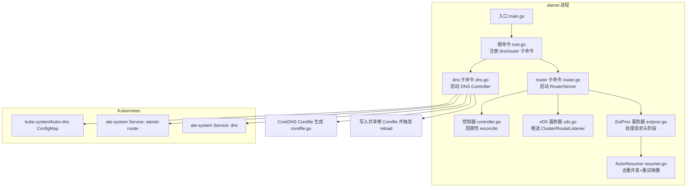
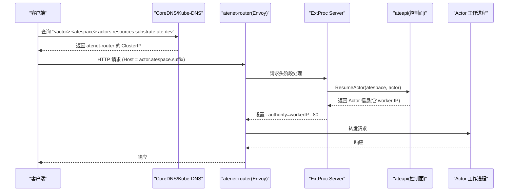
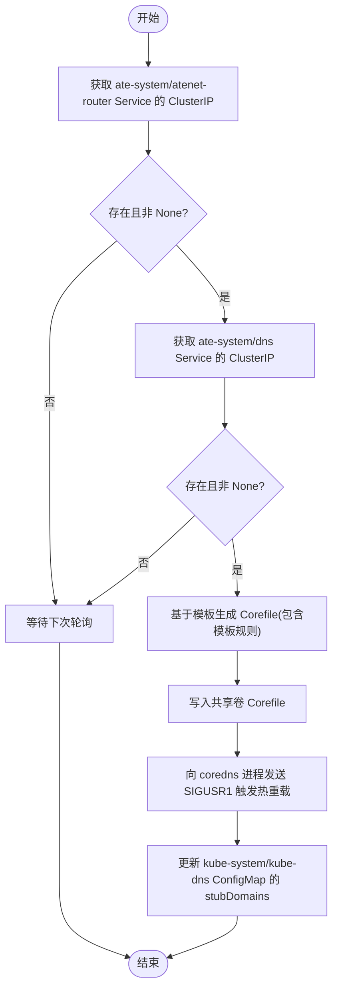
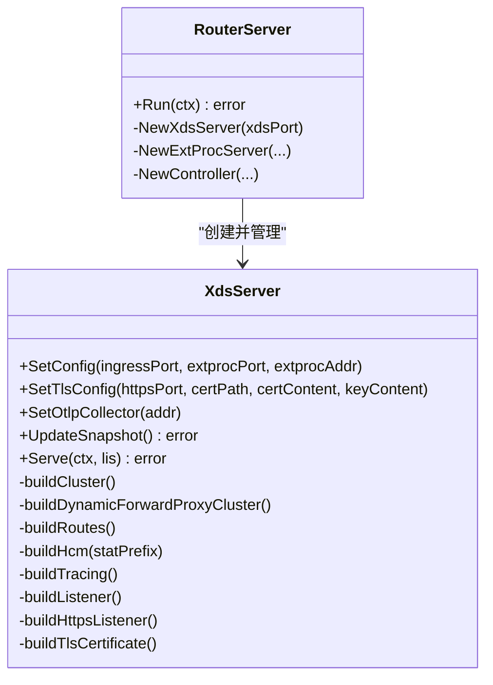
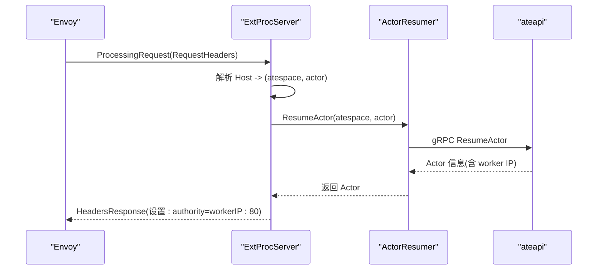
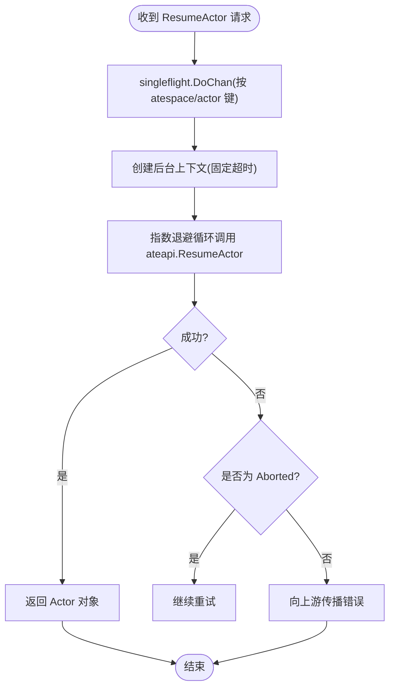
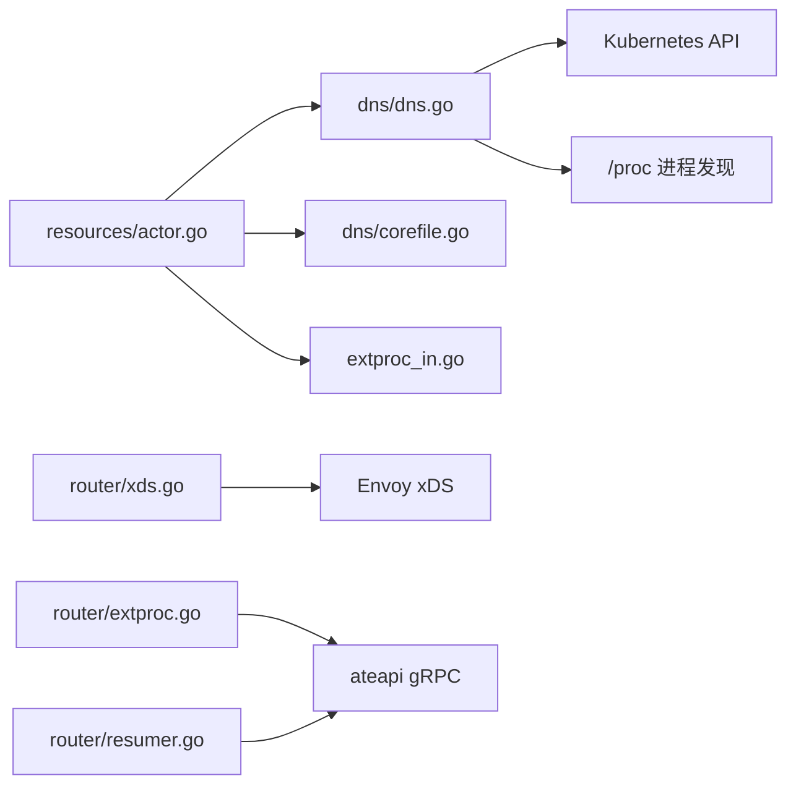

# 网络与DNS服务

<cite>
**本文引用的文件**   
- [cmd/atenet/main.go](file://cmd/atenet/main.go)
- [cmd/atenet/README.md](file://cmd/atenet/README.md)
- [cmd/atenet/internal/root.go](file://cmd/atenet/internal/root.go)
- [cmd/atenet/internal/dns.go](file://cmd/atenet/internal/dns.go)
- [cmd/atenet/internal/dns/dns.go](file://cmd/atenet/internal/dns/dns.go)
- [cmd/atenet/internal/dns/corefile.go](file://cmd/atenet/internal/dns/corefile.go)
- [cmd/atenet/internal/router/router.go](file://cmd/atenet/internal/router/router.go)
- [cmd/atenet/internal/router/controller.go](file://cmd/atenet/internal/router/controller.go)
- [cmd/atenet/internal/router/xds.go](file://cmd/atenet/internal/router/xds.go)
- [cmd/atenet/internal/router/extproc.go](file://cmd/atenet/internal/router/extproc.go)
- [cmd/atenet/internal/router/resumer.go](file://cmd/atenet/internal/router/resumer.go)
- [cmd/atenet/internal/router/extproc_in.go](file://cmd/atenet/internal/router/extproc_in.go)
- [cmd/atenet/internal/router/extproc_out.go](file://cmd/atenet/internal/router/extproc_out.go)
- [internal/resources/actor.go](file://internal/resources/actor.go)
</cite>

## 目录
1. [简介](#简介)
2. [项目结构](#项目结构)
3. [核心组件](#核心组件)
4. [架构总览](#架构总览)
5. [详细组件分析](#详细组件分析)
6. [依赖关系分析](#依赖关系分析)
7. [性能考虑](#性能考虑)
8. [故障诊断指南](#故障诊断指南)
9. [结论](#结论)
10. [附录](#附录)

## 简介
本文件面向 Agent Substrate 的网络与 DNS 子系统，系统性阐述 Uniform DNS Mesh 的设计与实现、DNS 解析服务架构与动态更新机制、Envoy 代理配置与管理、ExtProc 扩展处理器在认证鉴权与请求转换中的作用，以及“按请求唤醒暂停 Actor”的自动恢复流程。文档同时提供网络配置示例与调优建议，并给出监控指标与排障要点，帮助读者快速理解与落地使用。

## 项目结构
atenet 是一个统一二进制，包含两个子命令：
- dns：编排 CoreDNS 与 GKE kube-dns stub resolver，使集群内所有 Pod 可通过统一域名访问 Actor。
- router：作为 Envoy 的控制面（xDS）与外部处理（ExtProc）服务，负责将 HTTP 请求路由到目标 Actor 的工作进程，并在首次请求时按需唤醒暂停的 Actor。

图表来源
- [cmd/atenet/main.go:1-22](file://cmd/atenet/main.go#L1-L22)
- [cmd/atenet/internal/root.go:25-43](file://cmd/atenet/internal/root.go#L25-L43)
- [cmd/atenet/internal/dns.go:42-108](file://cmd/atenet/internal/dns.go#L42-L108)
- [cmd/atenet/internal/dns/dns.go:51-117](file://cmd/atenet/internal/dns/dns.go#L51-L117)
- [cmd/atenet/internal/dns/corefile.go:32-64](file://cmd/atenet/internal/dns/corefile.go#L32-L64)
- [cmd/atenet/internal/router/router.go:152-315](file://cmd/atenet/internal/router/router.go#L152-L315)
- [cmd/atenet/internal/router/controller.go:67-111](file://cmd/atenet/internal/router/controller.go#L67-L111)
- [cmd/atenet/internal/router/xds.go:148-194](file://cmd/atenet/internal/router/xds.go#L148-L194)
- [cmd/atenet/internal/router/extproc.go:80-128](file://cmd/atenet/internal/router/extproc.go#L80-L128)
- [cmd/atenet/internal/router/resumer.go:46-104](file://cmd/atenet/internal/router/resumer.go#L46-L104)

章节来源
- [cmd/atenet/README.md:1-42](file://cmd/atenet/README.md#L1-L42)
- [cmd/atenet/main.go:17-22](file://cmd/atenet/main.go#L17-L22)
- [cmd/atenet/internal/root.go:25-43](file://cmd/atenet/internal/root.go#L25-L43)

## 核心组件
- DNS Controller：周期拉取 ate-system 命名空间下的 atenet-router 与 dns 服务 IP，生成 CoreDNS Corefile 并写入共享卷，向 CoreDNS 进程发送信号触发热重载；同时将自定义 DNS 后缀指向 dns 服务的 IP 注入 kube-system/kube-dns ConfigMap 的 stubDomains，使全集群通过该后缀解析到 atenet。
- RouterServer：初始化追踪与指标、连接 ateapi、启动 xDS 与 ExtProc 服务、健康检查与状态端点；周期性 reconcile 以更新 xDS 快照。
- XdsServer：构建并推送 Envoy 的 Cluster/Route/Listener 资源，支持 HTTP/HTTPS 监听器、动态转发代理、ExtProc 过滤器链、可选 OTLP 追踪。
- ExtProcServer：在请求头阶段拦截，解析 Host/:authority 中的 Actor 引用，调用 ActorResumer 唤醒目标 Actor，并将 :authority 改写为工作进程地址，完成动态路由。
- ActorResumer：对同一 Actor 的并发唤醒进行去重与指数退避重试，保证幂等与稳定性。

章节来源
- [cmd/atenet/internal/dns/dns.go:51-117](file://cmd/atenet/internal/dns/dns.go#L51-L117)
- [cmd/atenet/internal/dns/corefile.go:32-64](file://cmd/atenet/internal/dns/corefile.go#L32-L64)
- [cmd/atenet/internal/router/router.go:152-315](file://cmd/atenet/internal/router/router.go#L152-L315)
- [cmd/atenet/internal/router/xds.go:148-194](file://cmd/atenet/internal/router/xds.go#L148-L194)
- [cmd/atenet/internal/router/extproc.go:80-128](file://cmd/atenet/internal/router/extproc.go#L80-L128)
- [cmd/atenet/internal/router/resumer.go:46-104](file://cmd/atenet/internal/router/resumer.go#L46-L104)

## 架构总览
Uniform DNS Mesh 的核心思想是：所有 Actor 通过统一的 DNS 后缀可达，客户端仅需要知道 <actor>.<atespace>.actors.resources.substrate.ate.dev 形式的域名即可发起 HTTP 请求。DNS 层将域名解析到 atenet-router 的入口，由 Envoy 在请求头阶段通过 ExtProc 动态唤醒目标 Actor，并将流量转发至其工作进程。

图表来源
- [cmd/atenet/internal/dns/dns.go:71-117](file://cmd/atenet/internal/dns/dns.go#L71-L117)
- [cmd/atenet/internal/dns/corefile.go:44-50](file://cmd/atenet/internal/dns/corefile.go#L44-L50)
- [cmd/atenet/internal/router/extproc.go:130-188](file://cmd/atenet/internal/router/extproc.go#L130-L188)
- [cmd/atenet/internal/router/resumer.go:46-104](file://cmd/atenet/internal/router/resumer.go#L46-L104)
- [internal/resources/actor.go:34-61](file://internal/resources/actor.go#L34-L61)

## 详细组件分析

### DNS 解析服务与 Uniform DNS Mesh
- 统一域名规范：<actor>.<atespace>.actors.resources.substrate.ate.dev，其中 atespace 保证跨命名空间的唯一性。
- CoreDNS 模板：根据 ActorDNSSuffix 与资源名正则构造 template 规则，匹配形如 <name>.<atespace>.suffix 的 FQDN，统一返回 atenet-router 的 ClusterIP。
- 动态更新：Controller 周期获取 atenet-router 与 dns 服务的 ClusterIP，若变化则重写 Corefile 并发送 SIGUSR1 给 coredns 进程触发热重载；同时更新 kube-system/kube-dns 的 stubDomains，使全集群将该后缀解析到自定义 DNS。

图表来源
- [cmd/atenet/internal/dns/dns.go:71-117](file://cmd/atenet/internal/dns/dns.go#L71-L117)
- [cmd/atenet/internal/dns/corefile.go:32-64](file://cmd/atenet/internal/dns/corefile.go#L32-L64)
- [cmd/atenet/internal/dns/dns.go:196-221](file://cmd/atenet/internal/dns/dns.go#L196-L221)
- [cmd/atenet/internal/dns/dns.go:144-189](file://cmd/atenet/internal/dns/dns.go#L144-L189)
- [internal/resources/actor.go:22-32](file://internal/resources/actor.go#L22-32)

章节来源
- [cmd/atenet/internal/dns/dns.go:51-117](file://cmd/atenet/internal/dns/dns.go#L51-L117)
- [cmd/atenet/internal/dns/corefile.go:32-64](file://cmd/atenet/internal/dns/corefile.go#L32-L64)
- [internal/resources/actor.go:34-61](file://internal/resources/actor.go#L34-L61)

### Envoy 代理配置与管理（xDS）
- 监听器：HTTP 监听器默认端口可配，HTTPS 监听器可选，支持从文件或内存注入证书。
- 过滤器链：ext_proc -> dynamic_forward_proxy -> router。ext_proc 在请求头阶段执行，dynamic_forward_proxy 基于 Host 动态解析上游，router 最终转发。
- 集群：
  - 本地 extproc 集群：静态指向 atenet 进程内的 ExtProc 服务。
  - 动态转发代理集群：启用 DNS 缓存，避免频繁解析。
  - 可选 OTLP 收集器集群：用于 Envoy 侧追踪上报。
- 快照更新：控制器周期性 reconcile，生成新快照并推送给 Envoy。

图表来源
- [cmd/atenet/internal/router/xds.go:92-146](file://cmd/atenet/internal/router/xds.go#L92-L146)
- [cmd/atenet/internal/router/xds.go:148-194](file://cmd/atenet/internal/router/xds.go#L148-L194)
- [cmd/atenet/internal/router/xds.go:227-334](file://cmd/atenet/internal/router/xds.go#L227-L334)
- [cmd/atenet/internal/router/xds.go:357-384](file://cmd/atenet/internal/router/xds.go#L357-L384)
- [cmd/atenet/internal/router/xds.go:386-466](file://cmd/atenet/internal/router/xds.go#L386-L466)
- [cmd/atenet/internal/router/xds.go:503-576](file://cmd/atenet/internal/router/xds.go#L503-L576)
- [cmd/atenet/internal/router/router.go:224-247](file://cmd/atenet/internal/router/router.go#L224-L247)

章节来源
- [cmd/atenet/internal/router/xds.go:148-194](file://cmd/atenet/internal/router/xds.go#L148-L194)
- [cmd/atenet/internal/router/controller.go:88-111](file://cmd/atenet/internal/router/controller.go#L88-L111)

### ExtProc 扩展处理器（请求头阶段）
- 职责：解析 Host/:authority 中的 Actor 引用，调用控制面唤醒目标 Actor，并将 :authority 改写为工作进程地址，从而将请求路由到具体实例。
- 错误处理：对无效 Host 或唤醒失败等情况，直接返回即时响应（例如 404），避免进入下游。
- 可观测性：记录路由耗时直方图，按模板命名空间与名称打标签；继承上游 traceparent，保持链路完整。

图表来源
- [cmd/atenet/internal/router/extproc.go:80-128](file://cmd/atenet/internal/router/extproc.go#L80-L128)
- [cmd/atenet/internal/router/extproc.go:130-188](file://cmd/atenet/internal/router/extproc.go#L130-L188)
- [cmd/atenet/internal/router/resumer.go:46-104](file://cmd/atenet/internal/router/resumer.go#L46-L104)
- [cmd/atenet/internal/router/extproc_in.go:59-72](file://cmd/atenet/internal/router/extproc_in.go#L59-L72)
- [cmd/atenet/internal/router/extproc_out.go:35-44](file://cmd/atenet/internal/router/extproc_out.go#L35-44)

章节来源
- [cmd/atenet/internal/router/extproc.go:80-128](file://cmd/atenet/internal/router/extproc.go#L80-L128)
- [cmd/atenet/internal/router/extproc_in.go:25-57](file://cmd/atenet/internal/router/extproc_in.go#L25-L57)
- [cmd/atenet/internal/router/extproc_out.go:23-68](file://cmd/atenet/internal/router/extproc_out.go#L23-68)

### 自动恢复机制（按请求唤醒暂停 Actor）
- 去重与重试：ActorResumer 使用 singleflight 对同一 Actor 的并发唤醒进行合并，避免重复唤醒；内部采用指数退避重试，兼容 Aborted 等临时错误。
- 超时隔离：后台唤醒操作使用独立上下文与固定超时，防止上游请求断开导致唤醒中断。
- 结果回写：成功返回 Actor 信息后，ExtProc 将 :authority 改写为工作进程地址，后续请求可直接命中。

图表来源
- [cmd/atenet/internal/router/resumer.go:46-104](file://cmd/atenet/internal/router/resumer.go#L46-L104)

章节来源
- [cmd/atenet/internal/router/resumer.go:31-104](file://cmd/atenet/internal/router/resumer.go#L31-L104)

## 依赖关系分析
- DNS 模块依赖 Kubernetes API 读取 Service 与 ConfigMap，并通过 /proc 定位 coredns 进程 PID 发送信号。
- Router 模块依赖 Kubernetes API 与 ateapi gRPC 接口，依赖 xDS 库推送配置，依赖 ExtProc 协议与 Envoy 交互。
- 资源命名与 DNS 后缀定义集中在 resources 包，被 DNS 与 ExtProc 共同复用，确保一致性。

图表来源
- [internal/resources/actor.go:22-32](file://internal/resources/actor.go#L22-32)
- [cmd/atenet/internal/dns/dns.go:223-252](file://cmd/atenet/internal/dns/dns.go#L223-L252)
- [cmd/atenet/internal/router/xds.go:196-225](file://cmd/atenet/internal/router/xds.go#L196-L225)
- [cmd/atenet/internal/router/extproc.go:80-128](file://cmd/atenet/internal/router/extproc.go#L80-L128)
- [cmd/atenet/internal/router/resumer.go:46-104](file://cmd/atenet/internal/router/resumer.go#L46-L104)

章节来源
- [internal/resources/actor.go:34-61](file://internal/resources/actor.go#L34-L61)
- [cmd/atenet/internal/dns/dns.go:223-252](file://cmd/atenet/internal/dns/dns.go#L223-L252)

## 性能考虑
- DNS 解析
  - 合理设置 CoreDNS 模板 TTL（当前模板中答案 TTL 为 60 秒），平衡一致性与缓存命中率。
  - 调整 DNS Controller 的重合间隔，避免过于频繁的 ConfigMap 与 Corefile 变更。
- Envoy 与 ExtProc
  - 启用动态转发代理的 DNS 缓存，减少上游解析开销。
  - 合理设置 ext_proc 消息超时与 HCM 追踪采样策略，避免阻塞主路径。
  - 使用 HTTPS 监听器时，优先挂载证书文件而非内存注入，降低运行时开销。
- 唤醒路径
  - ActorResumer 的去重与退避参数需结合业务峰值与超时预算调优，避免雪崩式唤醒。
  - 对热点 Actor 可在上层做预热或连接池复用，降低首请求延迟。

[本节为通用指导，不直接分析具体文件]

## 故障诊断指南
- DNS 无法解析
  - 检查 atenet-router 与 dns 服务是否已就绪且拥有 ClusterIP。
  - 确认 kube-system/kube-dns 的 stubDomains 是否已注入自定义 DNS 后缀与 IP。
  - 验证 Corefile 是否已更新并成功触发 coredns 热重载。
- 请求 404 或路由失败
  - 查看 ExtProc 日志，确认 Host 是否匹配预期格式。
  - 检查 ResumeActor 调用是否返回有效 worker IP。
  - 确认 :authority 改写是否正确。
- 追踪与指标
  - 检查 RouterServer 是否启用了 OTLP 收集器与 metrics 服务。
  - 观察 ExtProc 的路由耗时直方图与 outcome 标签分布。

章节来源
- [cmd/atenet/internal/dns/dns.go:71-117](file://cmd/atenet/internal/dns/dns.go#L71-L117)
- [cmd/atenet/internal/dns/dns.go:144-189](file://cmd/atenet/internal/dns/dns.go#L144-L189)
- [cmd/atenet/internal/dns/dns.go:196-221](file://cmd/atenet/internal/dns/dns.go#L196-L221)
- [cmd/atenet/internal/router/extproc.go:130-188](file://cmd/atenet/internal/router/extproc.go#L130-L188)
- [cmd/atenet/internal/router/router.go:176-194](file://cmd/atenet/internal/router/router.go#L176-L194)

## 结论
通过 Uniform DNS Mesh，Agent Substrate 实现了“按域名直达 Actor”的统一寻址模型。DNS 层将统一后缀解析到 atenet-router，Envoy 在请求头阶段借助 ExtProc 动态唤醒目标 Actor 并完成路由，既保证了高可扩展性，又提供了良好的可观测性与容错能力。配合合理的配置与调优，系统可在大规模场景下稳定运行。

[本节为总结性内容，不直接分析具体文件]

## 附录

### 网络配置示例（部署要点）
- atenet router
  - 以 Deployment 形式部署，包含 Envoy 与 atenet router 容器。
  - Service 暴露 80/443 端口供外部访问。
  - RBAC：读取与列举 ActorTemplate。
- atenet dns
  - 以 Deployment 形式部署，Service 暴露 TCP/UDP 53。
  - RBAC：读取与列举 kube-system 与 ate-system 的 Service。

章节来源
- [cmd/atenet/README.md:14-37](file://cmd/atenet/README.md#L14-L37)

### 关键配置项说明
- DNS Controller
  - interval：DNS 配置重合周期（秒）。
  - corefile-path：共享卷上的 Corefile 路径。
- RouterServer
  - http-port/https-port：Envoy 监听端口。
  - xds-port：xDS 服务端口。
  - extproc-port/extproc-addr：ExtProc 服务端口与地址。
  - envoy-cert-path：Envoy TLS 证书路径（为空时自动生成自签名证书用于测试）。
  - metrics-addr：Prometheus 指标导出地址。
  - otlp-collector-address：Envoy 侧追踪上报的 OTLP gRPC 地址（host:port）。

章节来源
- [cmd/atenet/internal/dns.go:101-107](file://cmd/atenet/internal/dns.go#L101-L107)
- [cmd/atenet/internal/router/router.go:66-91](file://cmd/atenet/internal/router/router.go#L66-L91)
- [cmd/atenet/internal/router/router.go:230-247](file://cmd/atenet/internal/router/router.go#L230-L247)
- [cmd/atenet/internal/router/xds.go:123-146](file://cmd/atenet/internal/router/xds.go#L123-L146)

### 监控指标与可观测性
- 追踪
  - ExtProc 与 Router 均集成 OpenTelemetry，ExtProc 会提取上游 traceparent 以保持链路。
  - 可选启用 Envoy 侧 OTLP 追踪，将 spans 发送至收集器。
- 指标
  - Router 暴露 Prometheus 指标端点。
  - ExtProc 记录路由耗时直方图，按模板命名空间与名称、outcome 打标签。

章节来源
- [cmd/atenet/internal/router/router.go:176-194](file://cmd/atenet/internal/router/router.go#L176-L194)
- [cmd/atenet/internal/router/extproc.go:190-199](file://cmd/atenet/internal/router/extproc.go#L190-L199)
- [cmd/atenet/internal/router/xds.go:468-501](file://cmd/atenet/internal/router/xds.go#L468-L501)
