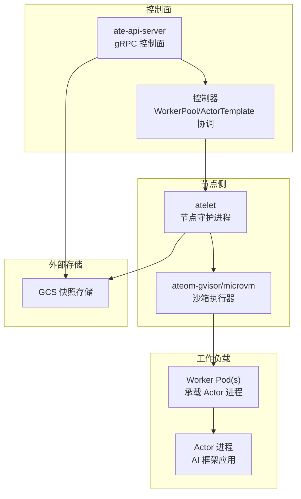
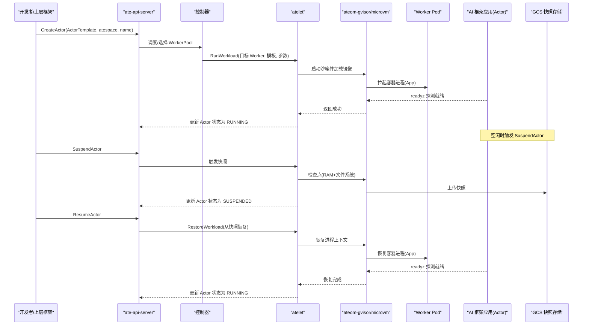
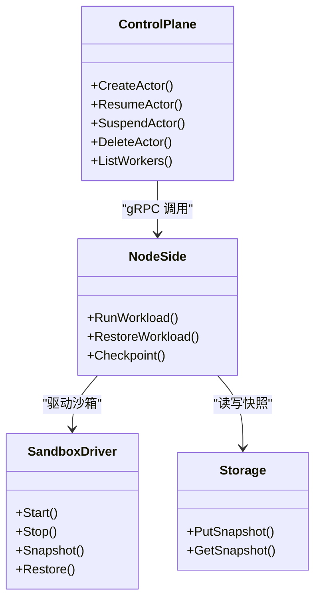

# AI框架兼容性

<cite>
**本文引用的文件列表**
- [README.md](file://README.md)
- [docs/api-guide.md](file://docs/api-guide.md)
- [demos/claude-code-multiplex/README.md](file://demos/claude-code-multiplex/README.md)
- [demos/claude-code-multiplex/claude-code-multiplex.yaml.tmpl](file://demos/claude-code-multiplex/claude-code-multiplex.yaml.tmpl)
- [demos/counter/README.md](file://demos/counter/README.md)
- [hack/install-demo-claude-code-multiplex.sh](file://hack/install-demo-claude-code-multiplex.sh)
- [internal/proto/ateletpb/atelet.pb.go](file://internal/proto/ateletpb/atelet.pb.go)
- [pkg/proto/ateapipb/ateapi.pb.go](file://pkg/proto/ateapipb/ateapi.pb.go)
</cite>

## 目录
1. [简介](#简介)
2. [项目结构](#项目结构)
3. [核心组件](#核心组件)
4. [架构总览](#架构总览)
5. [详细组件分析](#详细组件分析)
6. [依赖关系分析](#依赖关系分析)
7. [性能考量与调优建议](#性能考量与调优建议)
8. [故障排查指南](#故障排查指南)
9. [结论](#结论)
10. [附录：框架集成清单与最佳实践](#附录框架集成清单与最佳实践)

## 简介
本文件面向希望在 Agent Substrate 上运行主流 AI 框架（LangChain、Claude Code、CodeX 等）的工程师，提供兼容性说明、集成方式、状态持久化与会话管理、资源隔离的实现要点，以及分布式运行时（如 Agent Executor）的集成指引。文档同时给出针对各框架的性能调优建议与最佳实践模式，帮助在高密度多路复用场景下获得稳定、低延迟的执行体验。

## 项目结构
Agent Substrate 以 Kubernetes 为基础设施，通过自定义资源（WorkerPool、ActorTemplate、SandboxConfig）和 gRPC 控制面 API 实现“逻辑 Actor”在少量物理 Worker Pod 上的高并发复用。AI 框架应用以标准 OCI 容器镜像形式作为 Actor 运行，平台负责生命周期编排、快照/恢复、网络路由与身份注入。

图表来源
- [docs/api-guide.md:1-120](file://docs/api-guide.md#L1-L120)
- [internal/proto/ateletpb/atelet.pb.go:208-285](file://internal/proto/ateletpb/atelet.pb.go#L208-L285)
- [pkg/proto/ateapipb/ateapi.pb.go:1320-1376](file://pkg/proto/ateapipb/ateapi.pb.go#L1320-L1376)

章节来源
- [README.md:1-80](file://README.md#L1-L80)
- [docs/api-guide.md:1-120](file://docs/api-guide.md#L1-L120)

## 核心组件
- WorkerPool：定义物理“热”容量池，维护若干待机 Worker Pod，用于接收并执行 Actor 状态。
- ActorTemplate：定义具体 AI 应用的代码、环境、快照策略与沙箱类，是生成“黄金快照”的蓝图。
- SandboxConfig：集群级资源，解耦沙箱二进制（如 gVisor runsc 或 microVM 工具链），确保快照可恢复性。
- ate-api-server：暴露 gRPC 接口，供 CLI 与上层框架调用，管理 Actor 生命周期。
- atelet：节点守护进程，协调快照、恢复与资源迁移。
- ateom-gvisor/microvm：Pod 内辅助进程，驱动底层沙箱执行 checkpoint/restore。

章节来源
- [docs/api-guide.md:1-120](file://docs/api-guide.md#L1-L120)
- [docs/api-guide.md:180-222](file://docs/api-guide.md#L180-L222)
- [docs/api-guide.md:246-286](file://docs/api-guide.md#L246-L286)

## 架构总览
下图展示了从创建到运行、挂起/恢复的关键流程，以及与 AI 框架的关系。

图表来源
- [docs/api-guide.md:225-286](file://docs/api-guide.md#L225-L286)
- [internal/proto/ateletpb/atelet.pb.go:208-285](file://internal/proto/ateletpb/atelet.pb.go#L208-L285)
- [pkg/proto/ateapipb/ateapi.pb.go:1320-1376](file://pkg/proto/ateapipb/ateapi.pb.go#L1320-L1376)

## 详细组件分析

### LangChain 集成
- 适配思路：将 LangChain 应用打包为标准 OCI 镜像，作为 ActorTemplate 的容器运行。Substrate 会捕获进程内存与文件系统状态，从而保留对话历史与内部“思考过程”。
- 关键配置：
  - 使用 ActorTemplate 声明镜像、环境变量与快照位置。
  - 可选启用 readyz 探针，加速“黄金快照”准备与恢复后的快速就绪。
  - 通过 Uniform DNS Mesh 访问 Actor，便于外部系统调用。
- 安全与隔离：
  - 工具调用在沙箱中执行，避免越权访问宿主资源。
  - 可通过 SessionIdentity 服务获取稳定的会话身份令牌，与 ADK 生态兼容。
- 参考示例路径：
  - [docs/api-guide.md:303-311](file://docs/api-guide.md#L303-L311)
  - [docs/api-guide.md:103-112](file://docs/api-guide.md#L103-L112)
  - [docs/api-guide.md:129-147](file://docs/api-guide.md#L129-L147)

章节来源
- [docs/api-guide.md:303-311](file://docs/api-guide.md#L303-L311)
- [docs/api-guide.md:103-112](file://docs/api-guide.md#L103-L112)
- [docs/api-guide.md:129-147](file://docs/api-guide.md#L129-L147)

### Claude Code 与 CodeX 集成
- 适配思路：将 Claude Code 或 CodeX 封装为容器镜像，每个开发者一个 Actor，共享有限数量的 Worker Pod，闲置自动挂起，活跃时快速恢复。
- 示例演示：
  - 三套 ActorTemplate 对应三个不同任务，两个 Worker Pod 进行超分复用。
  - 通过 Secret 注入 API Key，ActorTemplate 通过 valueFrom.secretKeyRef 引用。
  - 部署脚本构建镜像并替换 digest-pinned 引用，保证可重现。
- 参考示例路径：
  - [demos/claude-code-multiplex/README.md:1-117](file://demos/claude-code-multiplex/README.md#L1-L117)
  - [demos/claude-code-multiplex/claude-code-multiplex.yaml.tmpl:1-149](file://demos/claude-code-multiplex/claude-code-multiplex.yaml.tmpl#L1-L149)
  - [hack/install-demo-claude-code-multiplex.sh:1-30](file://hack/install-demo-claude-code-multiplex.sh#L1-L30)

章节来源
- [demos/claude-code-multiplex/README.md:1-117](file://demos/claude-code-multiplex/README.md#L1-L117)
- [demos/claude-code-multiplex/claude-code-multiplex.yaml.tmpl:1-149](file://demos/claude-code-multiplex/claude-code-multiplex.yaml.tmpl#L1-L149)
- [hack/install-demo-claude-code-multiplex.sh:1-30](file://hack/install-demo-claude-code-multiplex.sh#L1-L30)

### 状态持久化与会话管理
- 状态持久化：
  - 通过 Snapshot 机制保存进程内存与文件系统状态至对象存储（如 GCS）。
  - 支持冷启动（绕过快照）与热恢复（从最近快照恢复）。
- 会话管理：
  - 通过 Uniform DNS Mesh 为每个 Actor 提供稳定域名，便于外部路由。
  - 通过 /run/ate/actor-id 读取当前 Actor 名称，避免在快照中固化错误标识。
  - 通过 SessionIdentity 服务签发 JWT/Cert，跨 Worker 迁移保持身份一致。
- 参考示例路径：
  - [docs/api-guide.md:225-286](file://docs/api-guide.md#L225-L286)
  - [docs/api-guide.md:103-112](file://docs/api-guide.md#L103-L112)
  - [docs/api-guide.md:289-297](file://docs/api-guide.md#L289-L297)

章节来源
- [docs/api-guide.md:225-286](file://docs/api-guide.md#L225-L286)
- [docs/api-guide.md:103-112](file://docs/api-guide.md#L103-L112)
- [docs/api-guide.md:289-297](file://docs/api-guide.md#L289-L297)

### 资源隔离与沙箱
- 沙箱类：
  - gVisor：轻量进程级沙箱，适合大多数 AI 应用。
  - microvm：基于 Kata + Cloud Hypervisor 的虚拟机级隔离，适用于强隔离需求。
- 二进制解耦：
  - SandboxConfig 集中管理 runsc 或 microVM 工具链版本，确保快照可恢复性。
- 参考示例路径：
  - [docs/api-guide.md:180-222](file://docs/api-guide.md#L180-L222)

章节来源
- [docs/api-guide.md:180-222](file://docs/api-guide.md#L180-L222)

### Agent Executor 集成指南
- 定位：Agent Executor 是一个分布式 Agent 运行时，可在 Agent Substrate 之上构建安全、可扩展的 Agent 编排层。
- 集成要点：
  - 使用 Substrate 提供的 gRPC API 管理 Actor 生命周期（Create/Resume/Suspend/Delete）。
  - 利用 WorkerPool 与 ActorTemplate 抽象，将 Agent 任务映射为 Actor，享受快照与复用能力。
  - 结合 Uniform DNS Mesh 与 SessionIdentity，实现可靠路由与身份传递。
- 参考链接与示例：
  - [README.md:58-61](file://README.md#L58-L61)
  - [docs/api-guide.md:246-286](file://docs/api-guide.md#L246-L286)

章节来源
- [README.md:58-61](file://README.md#L58-L61)
- [docs/api-guide.md:246-286](file://docs/api-guide.md#L246-L286)

## 依赖关系分析
- 控制面与节点侧：
  - ate-api-server 暴露 gRPC 接口，控制器协调 WorkerPool/ActorTemplate。
  - atelet 负责节点侧执行，调用 ateom 驱动底层沙箱。
- 数据流：
  - 快照写入 GCS，恢复时从 GCS 拉取。
  - 网络流量经 Router 路由到目标 Actor。
- 外部依赖：
  - 对象存储（GCS）用于快照。
  - 沙箱二进制（runsc 或 microVM 工具链）由 SandboxConfig 管理。

图表来源
- [docs/api-guide.md:246-286](file://docs/api-guide.md#L246-L286)
- [internal/proto/ateletpb/atelet.pb.go:208-285](file://internal/proto/ateletpb/atelet.pb.go#L208-L285)
- [pkg/proto/ateapipb/ateapi.pb.go:1320-1376](file://pkg/proto/ateapipb/ateapi.pb.go#L1320-L1376)

章节来源
- [docs/api-guide.md:246-286](file://docs/api-guide.md#L246-L286)
- [internal/proto/ateletpb/atelet.pb.go:208-285](file://internal/proto/ateletpb/atelet.pb.go#L208-L285)
- [pkg/proto/ateapipb/ateapi.pb.go:1320-1376](file://pkg/proto/ateapipb/ateapi.pb.go#L1320-L1376)

## 性能考量与调优建议
- 启动与就绪优化：
  - 为所有容器配置 readyz 探针，缩短“黄金快照”预热时间，提升恢复后首请求延迟。
  - 将昂贵初始化放入入口程序，使其被纳入快照，避免重复执行。
- 快照与恢复：
  - 合理设置快照位置与分区，减少 I/O 热点；对大模型权重考虑分层缓存。
  - 使用 digest-pinned 镜像，避免镜像变更导致快照不可恢复。
- 资源与调度：
  - 按工作负载特征划分 WorkerPool（CPU/GPU/内存密集型），并通过 workerSelector 精准匹配。
  - 使用 nodeSelector/tolerations/priorityClassName 控制节点亲和与优先级。
- 网络与路由：
  - 利用 Uniform DNS Mesh 就近路由，降低跨区延迟。
  - 对于高频短请求，考虑连接复用与长连接策略。
- 监控与观测：
  - 开启日志、指标与分布式追踪，关注快照大小、恢复耗时与首包延迟。
- 参考路径：
  - [docs/api-guide.md:129-147](file://docs/api-guide.md#L129-L147)
  - [docs/api-guide.md:19-79](file://docs/api-guide.md#L19-L79)
  - [docs/api-guide.md:239-243](file://docs/api-guide.md#L239-L243)

章节来源
- [docs/api-guide.md:129-147](file://docs/api-guide.md#L129-L147)
- [docs/api-guide.md:19-79](file://docs/api-guide.md#L19-L79)
- [docs/api-guide.md:239-243](file://docs/api-guide.md#L239-L243)

## 故障排查指南
- 常见问题定位：
  - 无法就绪：检查容器 readyz 端点是否可达、端口是否正确。
  - 快照失败：确认 GCS 权限与路径、镜像 digest 一致性。
  - 恢复异常：核对 SandboxConfig 版本与快照记录是否匹配。
  - 路由不通：验证 Uniform DNS Mesh 与 Host 头配置。
- 调试手段：
  - 查看 Worker Pod 日志与 atelet/ateom 输出。
  - 使用 kubectl-ate 查询 Actor 状态与 Worker 分配。
- 参考路径：
  - [docs/api-guide.md:129-147](file://docs/api-guide.md#L129-L147)
  - [demos/counter/README.md:56-79](file://demos/counter/README.md#L56-L79)

章节来源
- [docs/api-guide.md:129-147](file://docs/api-guide.md#L129-L147)
- [demos/counter/README.md:56-79](file://demos/counter/README.md#L56-L79)

## 结论
Agent Substrate 为各类 AI 框架提供了统一的执行与编排底座。通过将 LangChain、Claude Code、CodeX 等应用以 Actor 形态运行，平台实现了高效的状态持久化、会话管理与资源隔离，并在高密度复用场景下显著降低成本与延迟。配合 Agent Executor 等分布式运行时，可进一步构建安全、可扩展的 Agent 编排体系。

## 附录：框架集成清单与最佳实践
- LangChain
  - 将应用打包为镜像，定义 ActorTemplate，启用 readyz 探针。
  - 使用 SessionIdentity 获取稳定身份，结合 Uniform DNS Mesh 进行路由。
  - 参考路径：[docs/api-guide.md:303-311](file://docs/api-guide.md#L303-L311)
- Claude Code 与 CodeX
  - 使用示例模板与部署脚本快速上手，Secret 注入 API Key。
  - 通过多模板与少 Worker 展示超分复用效果。
  - 参考路径：[demos/claude-code-multiplex/README.md:1-117](file://demos/claude-code-multiplex/README.md#L1-L117)、[demos/claude-code-multiplex/claude-code-multiplex.yaml.tmpl:1-149](file://demos/claude-code-multiplex/claude-code-multiplex.yaml.tmpl#L1-L149)
- Agent Executor
  - 基于 gRPC API 管理 Actor 生命周期，结合 WorkerPool/ActorTemplate 抽象。
  - 参考路径：[README.md:58-61](file://README.md#L58-L61)、[docs/api-guide.md:246-286](file://docs/api-guide.md#L246-L286)
