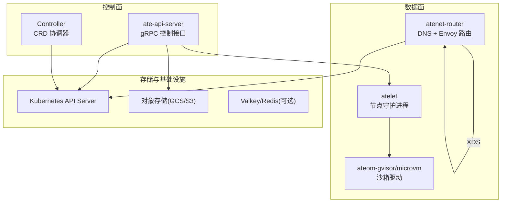
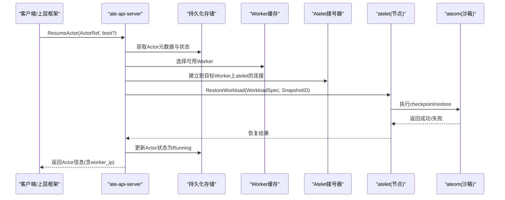
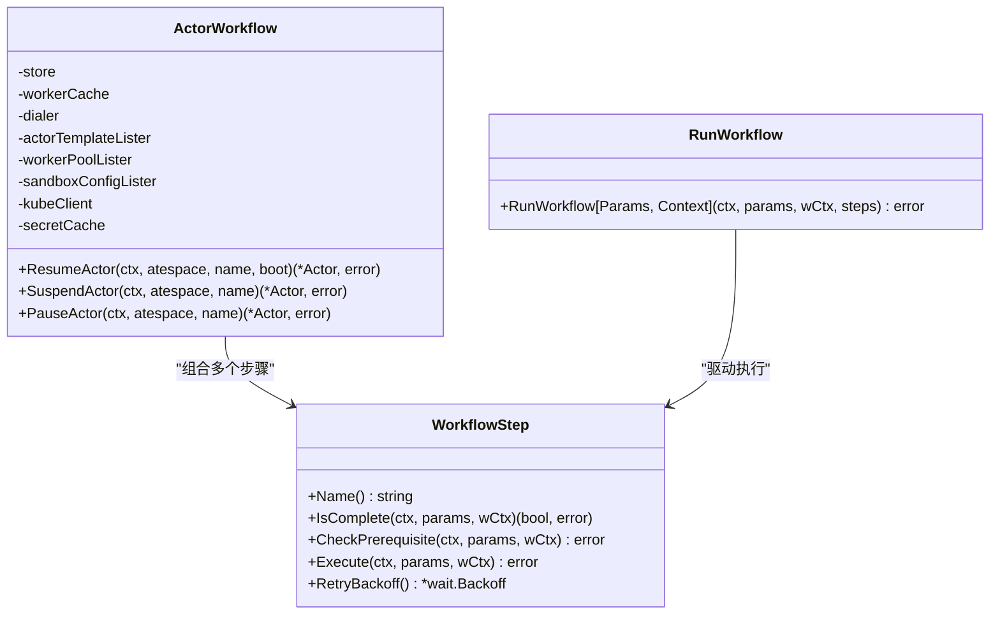
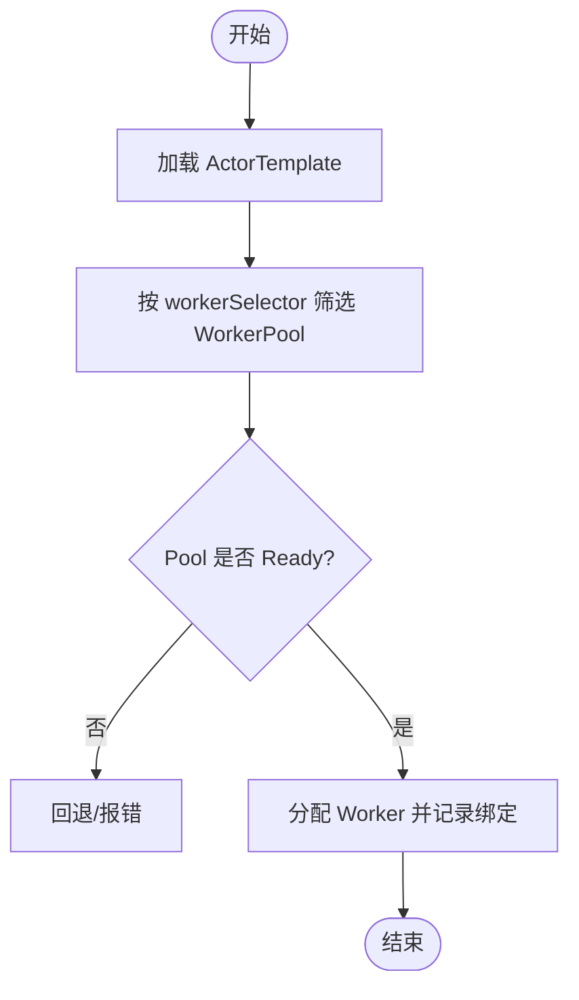
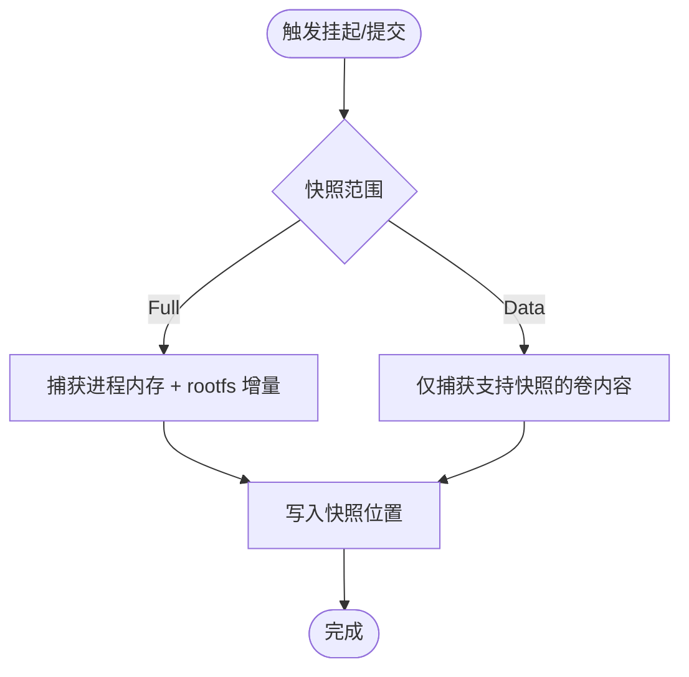
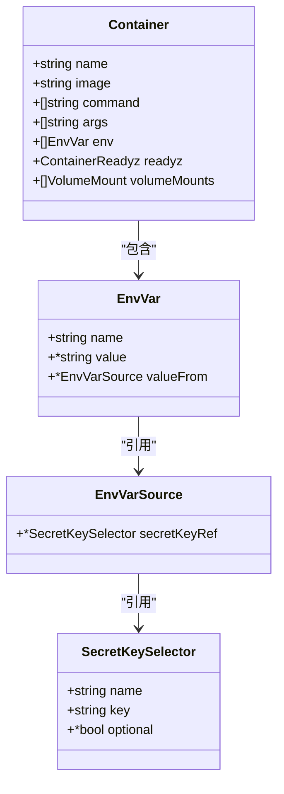
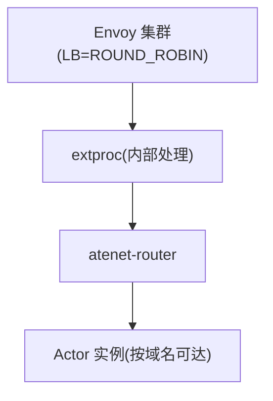
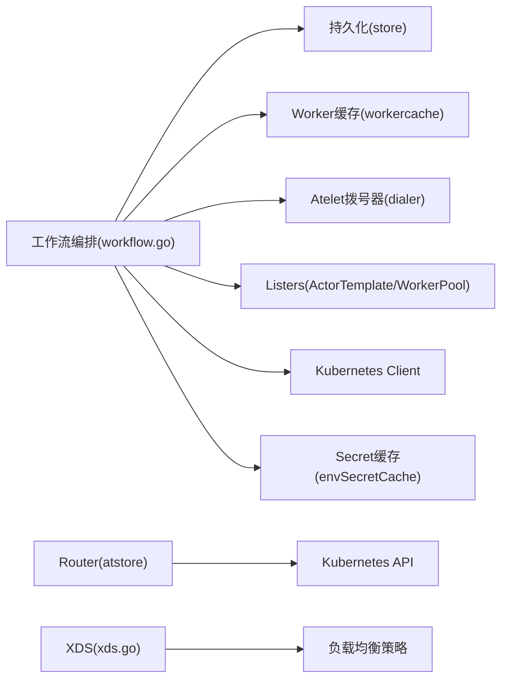

# Agent Executor兼容性

<cite>
**本文引用的文件列表**
- [README.md](file://README.md)
- [api-guide.md](file://docs/api-guide.md)
- [actortemplate_types.go](file://pkg/api/v1alpha1/actortemplate_types.go)
- [workerpool_types.go](file://pkg/api/v1alpha1/workerpool_types.go)
- [workflow.go](file://cmd/ateapi/internal/controlapi/workflow.go)
- [workload_spec.go](file://cmd/ateapi/internal/controlapi/workload_spec.go)
- [atstore.go](file://cmd/atenet/internal/router/atstore.go)
- [xds.go](file://cmd/atenet/internal/router/xds.go)
- [README.md（基准测试）](file://benchmarking/README.md)
</cite>

## 目录
1. [简介](#简介)
2. [项目结构](#项目结构)
3. [核心组件](#核心组件)
4. [架构总览](#架构总览)
5. [详细组件分析](#详细组件分析)
6. [依赖关系分析](#依赖关系分析)
7. [性能与调优](#性能与调优)
8. [故障排查指南](#故障排查指南)
9. [结论](#结论)
10. [附录：迁移清单与最佳实践](#附录：迁移清单与最佳实践)

## 简介
本文件面向希望将现有“Agent Executor”分布式运行时应用迁移到“Agent Substrate”平台的工程团队，提供从工作流定义转换、任务调度适配、状态管理映射，到Actor模板设计模式、环境变量注入、依赖管理、分布式执行环境配置（负载均衡、故障转移、弹性扩缩容），以及性能基准与调优建议的完整指南。

Agent Substrate 基于 Kubernetes 构建，通过“Actor + WorkerPool”模型实现高并发、低延迟的有状态代理运行。其控制面在 gRPC API 中暴露 Actor 生命周期操作，数据面由网络路由与侧车完成流量转发与寻址。平台支持快照/恢复机制，使进程级状态可跨物理节点快速迁移。

## 项目结构
仓库采用多模块、按职责分层的组织方式：
- pkg/api/v1alpha1：CRD 类型定义（ActorTemplate、WorkerPool、SandboxConfig 等）
- cmd/ateapi：控制面 API Server，包含工作流编排、资源解析、gRPC 服务
- cmd/atenet：网络控制器，集成 DNS、Envoy XDS 路由与外部处理扩展
- benchmarking：Locust 驱动的压测套件与监控部署脚本
- docs：API 使用指南、架构说明、可观测性文档等

图表来源
- [README.md:215-224](file://README.md#L215-L224)
- [api-guide.md:246-286](file://docs/api-guide.md#L246-L286)

章节来源
- [README.md:1-225](file://README.md#L1-L225)

## 核心组件
- ActorTemplate：描述一个“逻辑工作负载蓝图”，包括容器镜像、命令参数、环境变量、就绪探针、持久卷、快照策略、沙箱类别与调度选择器等。
- WorkerPool：定义“物理容量池”，即一组处于待命状态的 worker Pod，承载实际运行的 Actor。
- ate-api-server：控制面 gRPC 服务，负责 Actor 创建、恢复、挂起、删除等操作的工作流编排。
- atenet-router：统一 DNS 与 Envoy 路由，为每个 Actor 提供稳定可达的网络入口。
- atelet：节点级守护进程，负责与 ateom 交互，执行快照/恢复、资源拉取等。
- ateom-gvisor/microvm：Pod 内沙箱驱动，执行 runsc 或 microvm 的 checkpoint/restore。

章节来源
- [actortemplate_types.go:278-340](file://pkg/api/v1alpha1/actortemplate_types.go#L278-L340)
- [workerpool_types.go:54-89](file://pkg/api/v1alpha1/workerpool_types.go#L54-L89)
- [api-guide.md:246-286](file://docs/api-guide.md#L246-L286)

## 架构总览
下图展示了从 gRPC 请求到工作流执行、再到宿主机沙箱恢复的关键调用链。

图表来源
- [workflow.go:165-194](file://cmd/ateapi/internal/controlapi/workflow.go#L165-L194)
- [api-guide.md:258-264](file://docs/api-guide.md#L258-L264)

## 详细组件分析

### 工作流引擎与状态机
- 工作流步骤抽象：每个步骤需实现 IsComplete、CheckPrerequisite、Execute、RetryBackoff 四个方法，保证幂等性与前向恢复能力。
- 通用执行器 RunWorkflow：顺序遍历步骤，支持上下文取消、OpenTelemetry 追踪、指数退避重试（针对特定持久化冲突错误）。
- Actor 生命周期工作流：ResumeActor、SuspendActor、PauseActor 分别由若干步骤组成，例如加载 Actor、分配 Worker、调用 atelet 进行恢复/挂起/暂停、最终状态落盘。

图表来源
- [workflow.go:36-108](file://cmd/ateapi/internal/controlapi/workflow.go#L36-L108)
- [workflow.go:131-194](file://cmd/ateapi/internal/controlapi/workflow.go#L131-L194)

章节来源
- [workflow.go:36-129](file://cmd/ateapi/internal/controlapi/workflow.go#L36-L129)
- [workflow.go:165-224](file://cmd/ateapi/internal/controlapi/workflow.go#L165-L224)

### 工作流定义转换（从 Agent Executor 到 Substrate）
- 概念映射
  - “工作流/任务图” → Substrate 的 Actor 生命周期工作流（Resume/Suspend/Pause）
  - “任务实例” → Actor 实例（带唯一标识与所属 atespace）
  - “调度器” → WorkerPool + ActorTemplate.workerSelector 的组合筛选
  - “状态存储” → 控制面持久化 + 快照（内存+文件系统增量）
- 关键差异
  - Substrate 以“进程级快照”为核心，强调冷启动绕过与秒级恢复；Executor 若基于长驻进程或消息队列，需要将其状态序列化到外部存储并在恢复时重建。
  - Substrate 的环境变量在控制面解析并下发至 atelet，不直接写入公开 Actor API；Secret 引用需在模板命名空间存在且可访问。
- 迁移步骤建议
  - 将业务逻辑封装为容器镜像，并通过 ActorTemplate 声明式定义。
  - 将外部状态（数据库、KV）作为“外部依赖”，在应用启动阶段连接；或将关键状态放入 DurableDir 卷参与快照。
  - 将任务提交入口对接到 gRPC CreateActor/ResumeActor，或使用 kubectl-ate CLI 作为过渡。

章节来源
- [api-guide.md:225-236](file://docs/api-guide.md#L225-L236)
- [api-guide.md:246-286](file://docs/api-guide.md#L246-L286)

### 任务调度适配（WorkerPool 与选择器）
- WorkerPool 定义物理容量，支持副本数、镜像、沙箱类别、Pod 模板（NodeSelector/Tolerations/PriorityClassName/NodeAffinity/Resources）。
- ActorTemplate 的 workerSelector 限制可使用的 WorkerPool 集合；Actor 自身也可携带 worker_selector 进一步缩小范围。
- 调度流程：控制面根据模板与 Actor 的选择器匹配候选 WorkerPool，结合 atelet 上报的可用性信息进行分配。

图表来源
- [workerpool_types.go:54-89](file://pkg/api/v1alpha1/workerpool_types.go#L54-L89)
- [actortemplate_types.go:326-334](file://pkg/api/v1alpha1/actortemplate_types.go#L326-L334)

章节来源
- [workerpool_types.go:54-96](file://pkg/api/v1alpha1/workerpool_types.go#L54-L96)
- [actortemplate_types.go:326-334](file://pkg/api/v1alpha1/actortemplate_types.go#L326-L334)

### 状态管理映射（快照与持久卷）
- 快照策略：SnapshotsConfig 指定位置（如 GCS），支持 Full/Data 两种范围；onPause/onCommit 可差异化配置。
- 持久卷：仅支持 durableDir 类型的卷，参与快照并在恢复后保持内容一致。
- 就绪探针：readyz 用于阻塞直到容器 HTTP 端点返回 200，影响 Golden Snapshot 的时机与恢复成功判定。

图表来源
- [actortemplate_types.go:236-276](file://pkg/api/v1alpha1/actortemplate_types.go#L236-L276)
- [actortemplate_types.go:32-78](file://pkg/api/v1alpha1/actortemplate_types.go#L32-L78)
- [api-guide.md:129-147](file://docs/api-guide.md#L129-L147)

章节来源
- [actortemplate_types.go:236-276](file://pkg/api/v1alpha1/actortemplate_types.go#L236-L276)
- [actortemplate_types.go:32-78](file://pkg/api/v1alpha1/actortemplate_types.go#L32-L78)
- [api-guide.md:129-147](file://docs/api-guide.md#L129-L147)

### Actor 模板设计与最佳实践
- 参数注入与环境变量
  - 支持字面值 env 与 secretKeyRef；不支持 envFrom 与其他 valueFrom 源。
  - Secret 解析发生在控制面，具备短期缓存以减少 API 压力；缺失且非可选会失败。
- 依赖管理
  - 所有镜像必须使用固定 digest，避免破坏快照可恢复性。
  - 沙箱二进制由 SandboxConfig 集中管理，模板不再内嵌。
- 健康检查与启动优化
  - 强烈建议设置 readyz，缩短 Golden Snapshot 预热时间并确保恢复后立即可用。
  - 将昂贵初始化放入进程入口，以便被快照复用。

图表来源
- [actortemplate_types.go:80-136](file://pkg/api/v1alpha1/actortemplate_types.go#L80-L136)
- [actortemplate_types.go:169-234](file://pkg/api/v1alpha1/actortemplate_types.go#L169-L234)

章节来源
- [actortemplate_types.go:80-136](file://pkg/api/v1alpha1/actortemplate_types.go#L80-L136)
- [actortemplate_types.go:169-234](file://pkg/api/v1alpha1/actortemplate_types.go#L169-L234)
- [workload_spec.go:77-102](file://cmd/ateapi/internal/controlapi/workload_spec.go#L77-L102)
- [workload_spec.go:121-184](file://cmd/ateapi/internal/controlapi/workload_spec.go#L121-L184)

### 分布式执行环境配置
- 负载均衡
  - 网络层默认使用 ROUND_ROBIN 策略分发到 extproc 后端。
- 故障转移
  - 控制面工作流具备幂等与前向恢复能力；步骤失败可通过客户端重试。
  - 锁机制防止同一 Actor 并发操作冲突。
- 弹性扩缩容
  - 通过调整 WorkerPool.spec.replicas 实现水平扩容；配合 HPA 或自定义控制器自动伸缩。
  - NodeSelector/Tolerations/NodeAffinity 可将 worker 调度到合适节点族（如 GPU 节点）。

图表来源
- [xds.go:236-272](file://cmd/atenet/internal/router/xds.go#L236-L272)

章节来源
- [xds.go:236-272](file://cmd/atenet/internal/router/xds.go#L236-L272)
- [workerpool_types.go:22-52](file://pkg/api/v1alpha1/workerpool_types.go#L22-L52)

## 依赖关系分析
- 控制面依赖
  - 工作流编排依赖 store、workerCache、dialer、listers、kubeClient、secretCache。
  - 环境变量解析依赖 kubeClient 读取 Secret，并使用本地 TTL 缓存。
- 网络与控制平面
  - atenet 从 Kubernetes 读取 ActorTemplate 列表，过滤出 Ready 状态供路由使用。
  - XDS 配置生成包含负载均衡策略与 DNS 缓存配置。

图表来源
- [workflow.go:131-163](file://cmd/ateapi/internal/controlapi/workflow.go#L131-L163)
- [workload_spec.go:121-191](file://cmd/ateapi/internal/controlapi/workload_spec.go#L121-L191)
- [atstore.go:25-55](file://cmd/atenet/internal/router/atstore.go#L25-L55)
- [xds.go:236-272](file://cmd/atenet/internal/router/xds.go#L236-L272)

章节来源
- [workflow.go:131-163](file://cmd/ateapi/internal/controlapi/workflow.go#L131-L163)
- [workload_spec.go:121-191](file://cmd/ateapi/internal/controlapi/workload_spec.go#L121-L191)
- [atstore.go:25-55](file://cmd/atenet/internal/router/atstore.go#L25-L55)
- [xds.go:236-272](file://cmd/atenet/internal/router/xds.go#L236-L272)

## 性能与调优
- 基准测试方法
  - 使用 Locust 套件进行压测，支持用户类、并发曲线、追踪开关等配置。
  - 可通过安装脚本一键部署压测环境与监控栈（Prometheus/Grafana）。
- 指标与追踪
  - 启用 OpenTelemetry 收集 trace，便于定位慢路径与热点。
- 调优建议
  - 合理设置 WorkerPool 副本数与资源请求/限制，确保节点亲和与容忍度满足需求。
  - 为容器配置 readyz，减少恢复后的首包延迟。
  - 使用固定镜像 digest，避免快照失效导致的冷启动放大。
  - 对 Secret 频繁读取场景，利用内置缓存降低 API 压力。

章节来源
- [README.md（基准测试）:1-90](file://benchmarking/README.md#L1-L90)
- [api-guide.md:129-147](file://docs/api-guide.md#L129-L147)

## 故障排查指南
- 常见错误
  - 环境变量解析失败：Secret 不存在或键缺失，且未标记为可选。
  - 就绪探针失败：容器未正确暴露 /readyz 或端口不可达，导致恢复超时。
  - 并发冲突：同一 Actor 同时发起多个操作，被锁拒绝。
- 定位手段
  - 查看工作流步骤的错误日志与 span 信息。
  - 检查 WorkerPool 与 ActorTemplate 的 Phase 是否为 Ready。
  - 确认网络路由与 DNS 可达性。

章节来源
- [workload_spec.go:152-184](file://cmd/ateapi/internal/controlapi/workload_spec.go#L152-L184)
- [workflow.go:256-279](file://cmd/ateapi/internal/controlapi/workflow.go#L256-L279)
- [api-guide.md:129-147](file://docs/api-guide.md#L129-L147)

## 结论
通过将 Agent Executor 的应用形态抽象为 ActorTemplate 与 WorkerPool，并利用 Substrate 的进程级快照与统一网络路由，可实现从“任务调度 + 状态管理”到“即时恢复 + 高密度复用”的平滑迁移。建议在迁移过程中优先完善就绪探针与快照策略，结合基准测试持续验证性能与稳定性。

## 附录：迁移清单与最佳实践
- 工作流定义转换
  - 将任务图转换为 Actor 生命周期操作（Create/Resume/Suspend/Delete）。
  - 将外部状态持久化到 DurableDir 或外部系统，确保恢复后可重建。
- 任务调度适配
  - 使用 workerSelector 限定 WorkerPool 集合；必要时为不同工作负载创建独立 Pool。
- 状态管理映射
  - 配置 SnapshotsConfig 的 location 与范围；谨慎选择 onCommit 与 onPause 的差异。
- Actor 模板设计
  - 使用固定镜像 digest；配置 readyz；将初始化逻辑前置。
  - 使用 secretKeyRef 注入敏感信息，避免硬编码。
- 分布式环境配置
  - 调整 WorkerPool 副本与资源；配置 NodeSelector/Tolerations/NodeAffinity。
  - 利用 XDS 的负载均衡策略与 DNS 缓存提升吞吐与稳定性。
- 性能基准与调优
  - 使用 Locust 套件进行端到端压测；开启 tracing 定位瓶颈。
  - 依据指标动态扩缩容，关注恢复延迟与首包时延。
