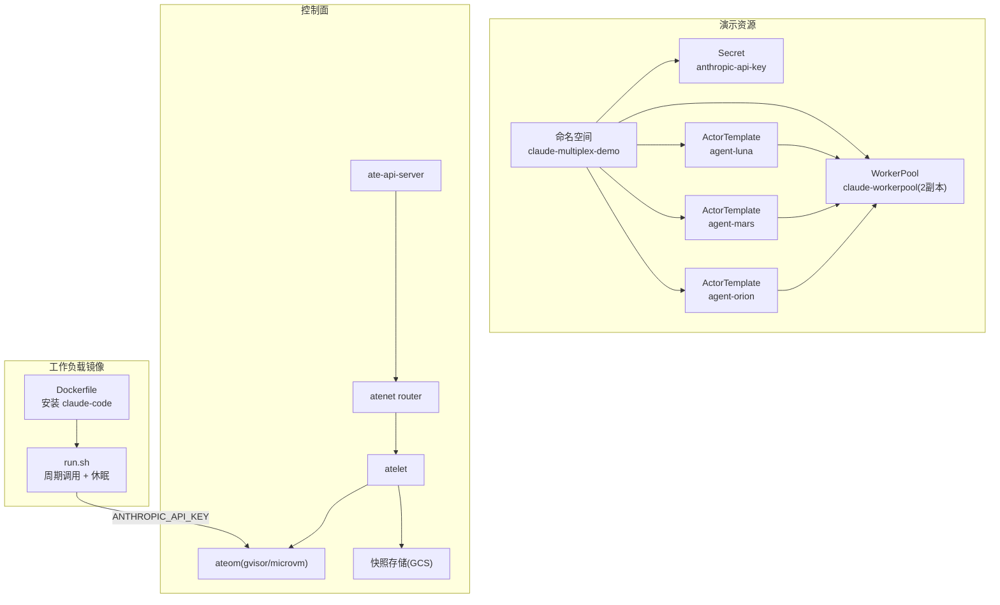
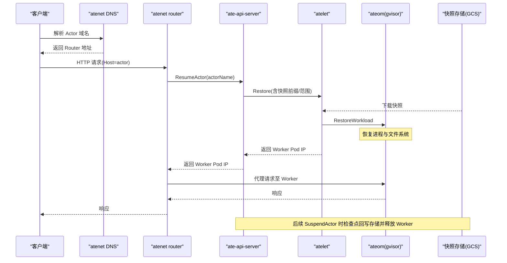
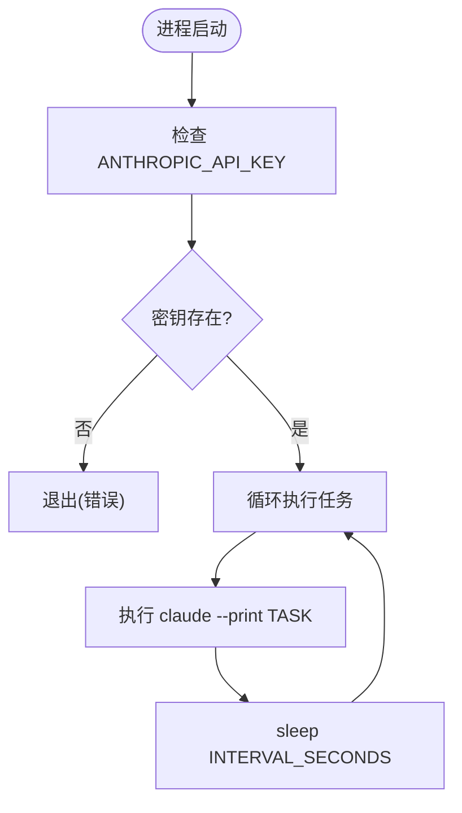
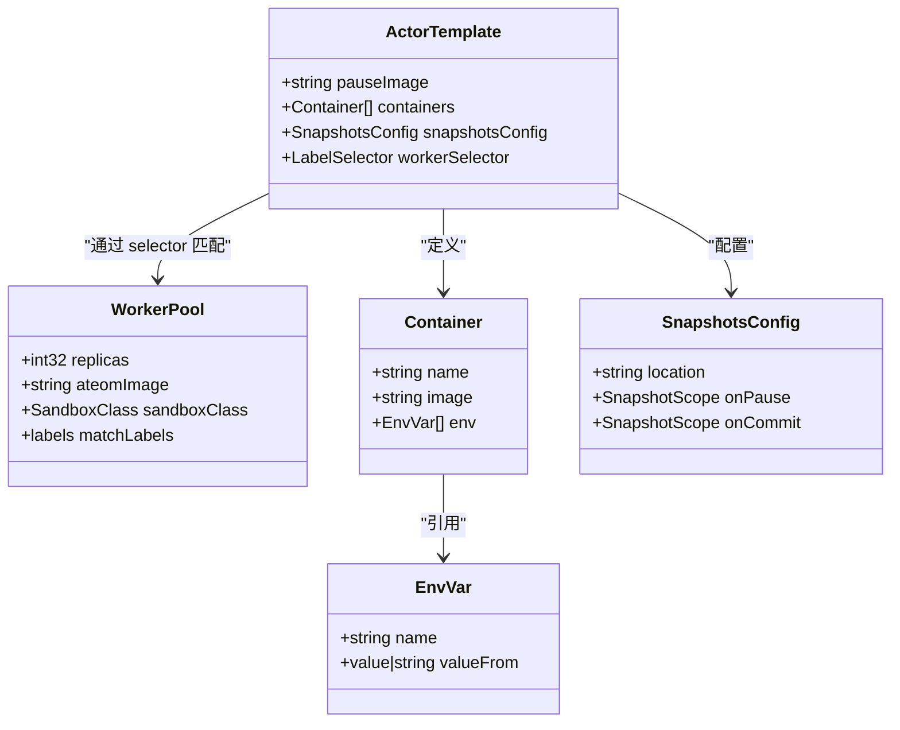
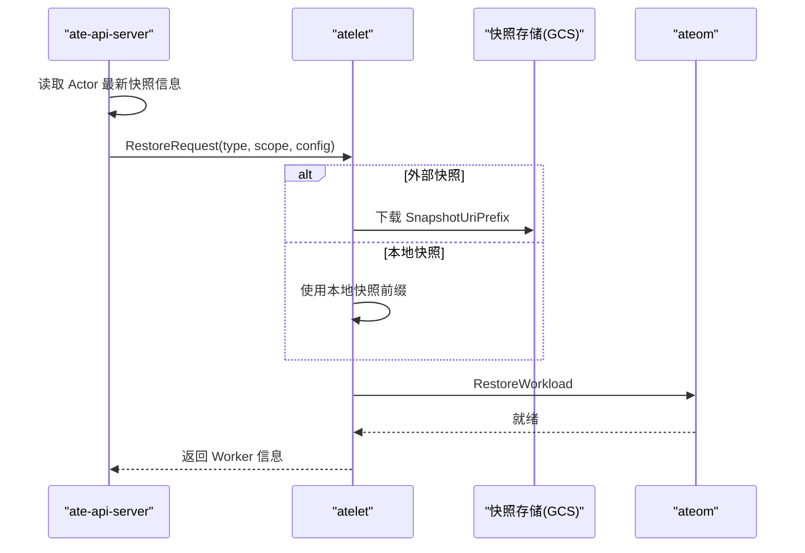
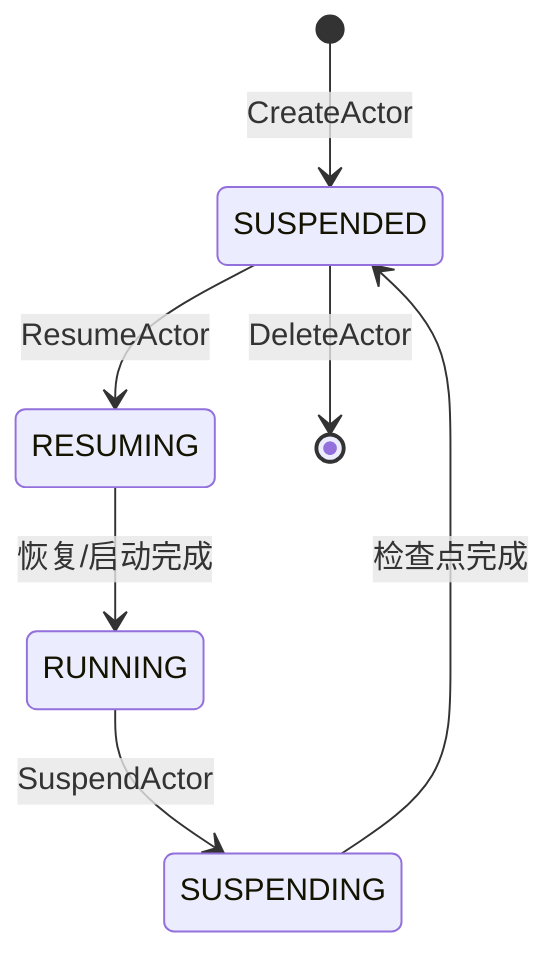
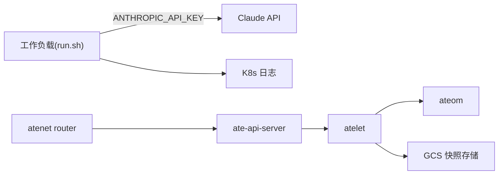

# Claude Code集成

<cite>
**本文引用的文件**   
- [README.md](file://demos/claude-code-multiplex/README.md)
- [Dockerfile](file://demos/claude-code-multiplex/workload/Dockerfile)
- [run.sh](file://demos/claude-code-multiplex/workload/run.sh)
- [claude-code-multiplex.yaml.tmpl](file://demos/claude-code-multiplex/claude-code-multiplex.yaml.tmpl)
- [install-demo-claude-code-multiplex.sh](file://hack/install-demo-claude-code-multiplex.sh)
- [server.go](file://demos/claude-code-multiplex/ui/server.go)
- [actortemplate_types.go](file://pkg/api/v1alpha1/actortemplate_types.go)
- [workerpool_types.go](file://pkg/api/v1alpha1/workerpool_types.go)
- [workflow_resume.go](file://cmd/ateapi/internal/controlapi/workflow_resume.go)
- [architecture.md](file://docs/architecture.md)
</cite>

## 目录
1. [简介](#简介)
2. [项目结构](#项目结构)
3. [核心组件](#核心组件)
4. [架构总览](#架构总览)
5. [详细组件分析](#详细组件分析)
6. [依赖关系分析](#依赖关系分析)
7. [性能与多路复用优化](#性能与多路复用优化)
8. [故障排查指南](#故障排查指南)
9. [结论](#结论)
10. [附录：部署清单与环境变量](#附录部署清单与环境变量)

## 简介
本文件面向在 Agent Substrate 上以 Actor 方式运行 Claude Code 驱动的智能体，提供从容器化构建、环境变量配置（ANTHROPIC_API_KEY）、状态持久化与会话管理，到 WorkerPool 与 ActorTemplate 的完整部署示例。重点说明在多路复用模式下，如何通过挂起/恢复机制将多个智能体共享少量 Worker Pod，从而实现资源优化与成本降低。

## 项目结构
Claude Code 多路复用演示包含以下关键部分：
- 工作负载镜像源：基于 Node 基础镜像安装 Claude Code CLI，并通过入口脚本周期性执行任务并休眠，利用空闲窗口触发 Substrate 的挂起/恢复调度。
- 模板与资源清单：通过一个 envsubst 模板一次性声明命名空间、Secret、WorkerPool 与多个 ActorTemplate，实现“三智能体、两 Pod”的多路复用场景。
- 安装脚本：负责构建并推送工作负载镜像、注入环境变量与快照存储位置，然后应用清单。
- 演示 UI：轻量 HTTP 服务，读取 ateapi gRPC 与 K8s API，展示智能体与 Worker 的状态与日志。

图表来源
- [claude-code-multiplex.yaml.tmpl:24-149](file://demos/claude-code-multiplex/claude-code-multiplex.yaml.tmpl#L24-L149)
- [Dockerfile:15-30](file://demos/claude-code-multiplex/workload/Dockerfile#L15-L30)
- [run.sh:17-51](file://demos/claude-code-multiplex/workload/run.sh#L17-L51)
- [architecture.md:353-396](file://docs/architecture.md#L353-L396)

章节来源
- [README.md:37-58](file://demos/claude-code-multiplex/README.md#L37-L58)
- [install-demo-claude-code-multiplex.sh:32-82](file://hack/install-demo-claude-code-multiplex.sh#L32-L82)

## 核心组件
- 工作负载镜像与入口
  - Dockerfile 使用 node:20-slim 基础镜像，全局安装 @anthropic-ai/claude-code，并将 run.sh 作为入口。
  - run.sh 校验 ANTHROPIC_API_KEY，循环执行 claude --print TASK，并在 INTERVAL_SECONDS 后休眠；该空闲窗口是 Substrate 判定可挂起的依据。
- 资源模板
  - 通过模板创建 Secret（存放 ANTHROPIC_API_KEY），定义 2 副本的 WorkerPool，以及三个 ActorTemplate（luna、mars、orion），每个模板指定不同的 TASK 与相同的快照存储 location。
  - 所有容器镜像均使用 sha256 固定引用，确保快照一致性。
- 安装脚本
  - 使用 docker buildx 构建并推送工作负载镜像，解析 digest 后替换模板中的 WORKLOAD_IMAGE、BUCKET_NAME、ANTHROPIC_API_KEY，再 apply 到集群。
- 演示 UI
  - 通过 ateapi gRPC 获取 Worker/Actor 列表与状态，结合 K8s client-go 拉取 Pod 日志，提供可视化面板。

章节来源
- [Dockerfile:15-30](file://demos/claude-code-multiplex/workload/Dockerfile#L15-L30)
- [run.sh:17-51](file://demos/claude-code-multiplex/workload/run.sh#L17-L51)
- [claude-code-multiplex.yaml.tmpl:24-149](file://demos/claude-code-multiplex/claude-code-multiplex.yaml.tmpl#L24-L149)
- [install-demo-claude-code-multiplex.sh:32-82](file://hack/install-demo-claude-code-multiplex.sh#L32-L82)
- [server.go:166-202](file://demos/claude-code-multiplex/ui/server.go#L166-L202)

## 架构总览
下图展示了请求进入、自动恢复、代理转发与挂起回写的端到端流程，以及快照存储的作用。

图表来源
- [architecture.md:353-396](file://docs/architecture.md#L353-L396)
- [workflow_resume.go:356-392](file://cmd/ateapi/internal/controlapi/workflow_resume.go#L356-L392)

## 详细组件分析

### 工作负载镜像与运行模型
- 镜像构建
  - 基础镜像：node:20-slim
  - 安装：npm install -g @anthropic-ai/claude-code@latest
  - 入口：COPY run.sh 并设置 ENTRYPOINT
- 运行逻辑
  - 启动时校验 ANTHROPIC_API_KEY，缺失则退出
  - 循环执行 claude --print "${TASK}"，输出到 stdout 便于 kubectl logs 采集
  - 每次 tick 结束后 sleep INTERVAL_SECONDS，形成空闲窗口供 Substrate 挂起

图表来源
- [run.sh:26-51](file://demos/claude-code-multiplex/workload/run.sh#L26-L51)
- [Dockerfile:21-30](file://demos/claude-code-multiplex/workload/Dockerfile#L21-L30)

章节来源
- [Dockerfile:15-30](file://demos/claude-code-multiplex/workload/Dockerfile#L15-L30)
- [run.sh:17-51](file://demos/claude-code-multiplex/workload/run.sh#L17-L51)

### 资源模板与多路复用
- WorkerPool
  - replicas: 2，选择 ateomImage 为 gvisor 运行时
  - 标签 workload: claude-multiplex 用于匹配 ActorTemplate 的 workerSelector
- ActorTemplate
  - 三个模板分别对应 luna、mars、orion，各自设定 ACTOR_NAME、TASK、INTERVAL_SECONDS
  - ANTHROPIC_API_KEY 通过 valueFrom.secretKeyRef 引用 Secret
  - snapshotsConfig.location 指向 GCS 路径，用于挂起/恢复时的快照读写
- 多路复用原理
  - 3 个 Actor 竞争 2 个 Worker Pod，Substrate 会在空闲时将未绑定的 Actor 挂起，待有可用 Worker 时再恢复

图表来源
- [workerpool_types.go:54-89](file://pkg/api/v1alpha1/workerpool_types.go#L54-L89)
- [actortemplate_types.go:283-340](file://pkg/api/v1alpha1/actortemplate_types.go#L283-L340)
- [actortemplate_types.go:251-276](file://pkg/api/v1alpha1/actortemplate_types.go#L251-L276)
- [actortemplate_types.go:169-234](file://pkg/api/v1alpha1/actortemplate_types.go#L169-L234)
- [claude-code-multiplex.yaml.tmpl:44-149](file://demos/claude-code-multiplex/claude-code-multiplex.yaml.tmpl#L44-L149)

章节来源
- [claude-code-multiplex.yaml.tmpl:44-149](file://demos/claude-code-multiplex/claude-code-multiplex.yaml.tmpl#L44-L149)
- [workerpool_types.go:54-89](file://pkg/api/v1alpha1/workerpool_types.go#L54-L89)
- [actortemplate_types.go:251-276](file://pkg/api/v1alpha1/actortemplate_types.go#L251-L276)
- [actortemplate_types.go:169-234](file://pkg/api/v1alpha1/actortemplate_types.go#L169-L234)

### 环境变量与密钥管理
- ANTHROPIC_API_KEY
  - 由 Secret anthropic-api-key 提供，ActorTemplate 通过 valueFrom.secretKeyRef 注入到容器环境变量
  - 工作负载入口脚本在启动时严格校验该变量，缺失即拒绝启动
- BUCKET_NAME
  - 用于 snapshotsConfig.location，指向 GCS 快照存储路径
- 其他
  - ACTOR_NAME、TASK、INTERVAL_SECONDS 由模板直接赋值，区分不同智能体的行为与节奏

章节来源
- [claude-code-multiplex.yaml.tmpl:31-88](file://demos/claude-code-multiplex/claude-code-multiplex.yaml.tmpl#L31-L88)
- [run.sh:26-31](file://demos/claude-code-multiplex/workload/run.sh#L26-L31)

### 状态持久化与会话管理
- 快照范围
  - OnPause/OnCommit 支持 Full 或 Data；onCommit 必须是 onPause 的子集
  - 模板中默认 Full，适合需要保留进程内存与 rootfs 差异的场景
- 恢复流程
  - ResumeActor 时根据 Actor 最新快照信息选择本地或外部快照前缀，按范围调用 RestoreRequest
- 挂载卷
  - 当前演示未使用 DurableDir 卷；如需跨恢复持久化数据，可在 ActorTemplate 中声明 durableDir 类型卷并按需挂载

图表来源
- [workflow_resume.go:356-392](file://cmd/ateapi/internal/controlapi/workflow_resume.go#L356-L392)
- [actortemplate_types.go:251-276](file://pkg/api/v1alpha1/actortemplate_types.go#L251-L276)

章节来源
- [actortemplate_types.go:251-276](file://pkg/api/v1alpha1/actortemplate_types.go#L251-L276)
- [workflow_resume.go:356-392](file://cmd/ateapi/internal/controlapi/workflow_resume.go#L356-L392)

### 挂起/恢复机制与多智能体共享 Pod
- 生命周期状态
  - SUSPENDED → RESUMING → RUNNING → SUSPENDING → SUSPENDED
- 多智能体共享 Pod
  - 当 Worker 被占用且新任务到来时，Substrate 会将空闲 Actor 挂起（写入快照）并释放 Worker，随后将新任务绑定到可用 Worker
  - 当 Worker 再次可用时，对挂起的 Actor 进行恢复并继续执行

图表来源
- [architecture.md:386-396](file://docs/architecture.md#L386-L396)

章节来源
- [architecture.md:353-396](file://docs/architecture.md#L353-L396)

### 部署示例与安装流程
- 前置条件
  - 已安装 Agent Substrate，kubectl 可用，网络可达 ateapi gRPC
  - 准备 Anthropic API Key、GCS 快照桶名、KO_DOCKER_REPO 与 docker buildx
- 一键部署
  - 设置环境变量后执行安装脚本，自动构建镜像、注入参数并 apply 模板
- 清理
  - 使用删除命令移除命名空间与相关资源

章节来源
- [README.md:46-58](file://demos/claude-code-multiplex/README.md#L46-L58)
- [install-demo-claude-code-multiplex.sh:55-82](file://hack/install-demo-claude-code-multiplex.sh#L55-L82)
- [install-demo-claude-code-multiplex.sh:84-98](file://hack/install-demo-claude-code-multiplex.sh#L84-L98)

## 依赖关系分析
- 工作负载依赖
  - 运行期依赖 ANTHROPIC_API_KEY 访问 Claude API
  - 通过 stdout 输出日志，便于 K8s 日志系统采集
- 控制面依赖
  - ate-api-server 协调 Resume/Suspend 流程
  - atenet router 负责按 Actor 名称路由到具体 Worker
  - atelet 负责与 ateom 交互，执行恢复/启动/检查点
  - 快照存储（GCS）用于持久化进程与文件系统差异

图表来源
- [run.sh:17-51](file://demos/claude-code-multiplex/workload/run.sh#L17-L51)
- [architecture.md:353-396](file://docs/architecture.md#L353-L396)

章节来源
- [run.sh:17-51](file://demos/claude-code-multiplex/workload/run.sh#L17-L51)
- [architecture.md:353-396](file://docs/architecture.md#L353-L396)

## 性能与多路复用优化
- 合理设置 INTERVAL_SECONDS
  - 较长的空闲间隔有助于提高多路复用率，减少频繁挂起/恢复开销
- 调整 WorkerPool 副本数
  - 根据活跃智能体数量与任务时长，平衡副本数与利用率
- 快照范围选择
  - 若仅需持久化数据，可使用 Data 范围以减少快照体积与 I/O
- 镜像固定版本
  - 使用 sha256 固定镜像引用，避免变更导致快照失效
- 观察指标
  - 通过演示 UI 查看 Worker 占用与 Actor 状态，评估挂起/恢复频率与队列等待时间

[本节为通用指导，不直接分析具体文件]

## 故障排查指南
- ANTHROPIC_API_KEY 未设置
  - 现象：工作负载启动即退出
  - 处理：确认 Secret 存在且 ActorTemplate 正确引用
- 无法连接 ateapi
  - 现象：UI 显示 ateapi 不可用
  - 处理：确认端口转发或服务发现正常
- 快照失败或恢复异常
  - 现象：Resume 失败或恢复后状态不一致
  - 处理：检查 GCS 路径权限与快照前缀，确认 onCommit/onPause 范围一致
- 日志为空或无法拉取
  - 现象：UI 日志接口返回 503
  - 处理：确认 K8s 上下文可用，或在集群内运行 UI

章节来源
- [run.sh:26-31](file://demos/claude-code-multiplex/workload/run.sh#L26-L31)
- [server.go:166-202](file://demos/claude-code-multiplex/ui/server.go#L166-L202)
- [server.go:445-473](file://demos/claude-code-multiplex/ui/server.go#L445-L473)

## 结论
通过将 Claude Code 驱动的智能体封装为 Actor，并利用 Substrate 的挂起/恢复与快照能力，可以在少量 Worker Pod 上高效承载大量智能体。配合合理的空闲间隔、快照范围与资源规划，可实现显著的资源优化与成本节约。

[本节为总结性内容，不直接分析具体文件]

## 附录：部署清单与环境变量
- 必需环境变量
  - ANTHROPIC_API_KEY：Claude API 密钥
  - BUCKET_NAME：快照存储桶名
  - KO_DOCKER_REPO：工作负载镜像仓库
- 可选环境变量（UI）
  - PORT：UI 监听端口
  - ATEAPI_ADDR：ateapi gRPC 地址
  - DEMO_NAMESPACE：过滤的命名空间

章节来源
- [install-demo-claude-code-multiplex.sh:100-104](file://hack/install-demo-claude-code-multiplex.sh#L100-L104)
- [README.md:81-89](file://demos/claude-code-multiplex/README.md#L81-L89)
