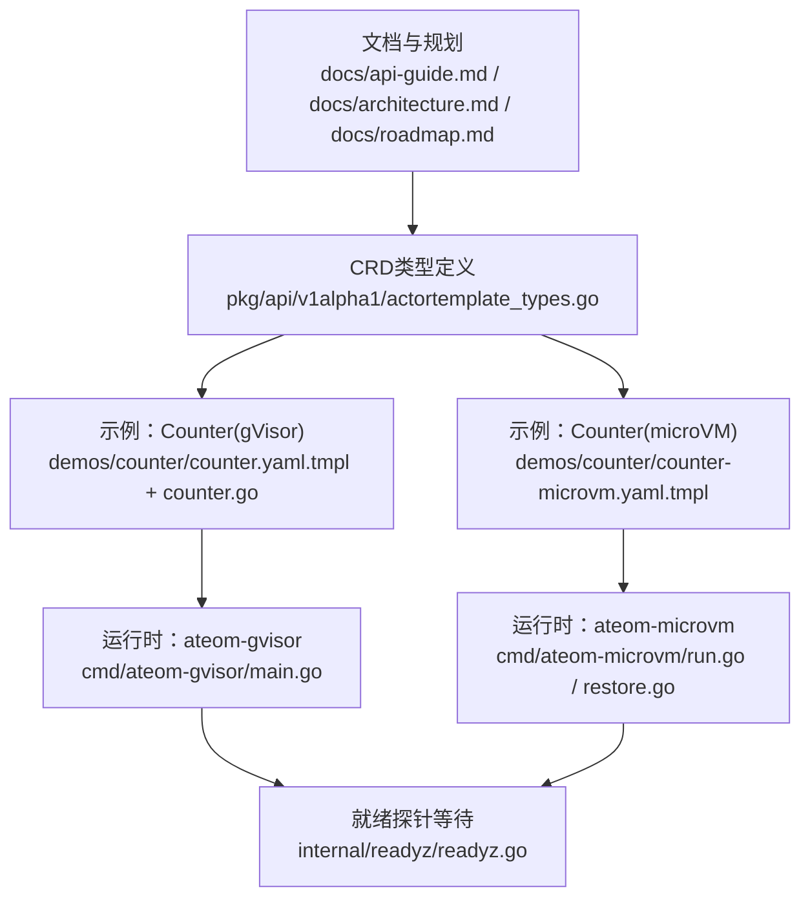
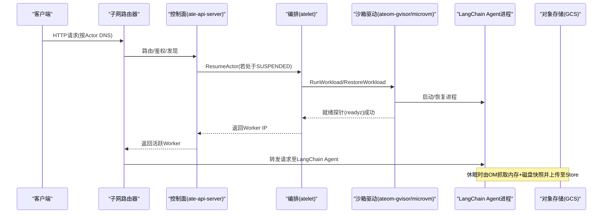
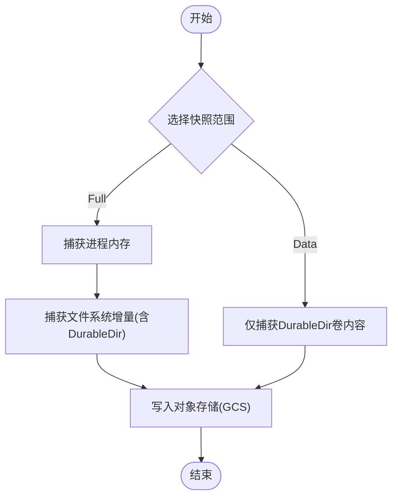
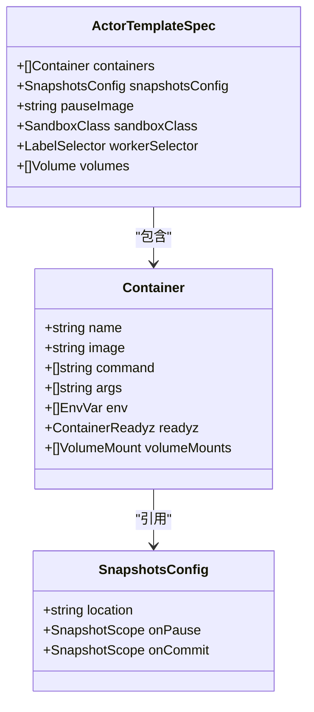
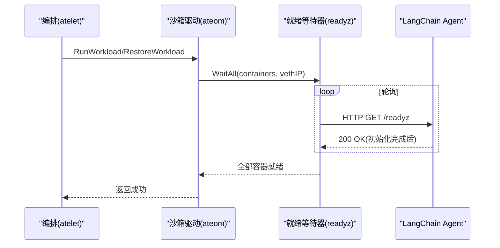
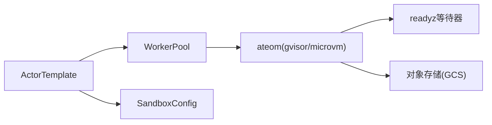

# LangChain支持

<cite>
**本文引用的文件**
- [README.md](file://README.md)
- [docs/api-guide.md](file://docs/api-guide.md)
- [docs/architecture.md](file://docs/architecture.md)
- [docs/roadmap.md](file://docs/roadmap.md)
- [pkg/api/v1alpha1/actortemplate_types.go](file://pkg/api/v1alpha1/actortemplate_types.go)
- [demos/counter/README.md](file://demos/counter/README.md)
- [demos/counter/counter.go](file://demos/counter/counter.go)
- [demos/counter/counter.yaml.tmpl](file://demos/counter/counter.yaml.tmpl)
- [demos/counter/counter-microvm.yaml.tmpl](file://demos/counter/counter-microvm.yaml.tmpl)
- [cmd/ateom-gvisor/main.go](file://cmd/ateom-gvisor/main.go)
- [cmd/ateom-microvm/run.go](file://cmd/ateom-microvm/run.go)
- [cmd/ateom-microvm/restore.go](file://cmd/ateom-microvm/restore.go)
- [internal/readyz/readyz.go](file://internal/readyz/readyz.go)
</cite>

## 目录
1. [简介](#简介)
2. [项目结构](#项目结构)
3. [核心组件](#核心组件)
4. [架构总览](#架构总览)
5. [详细组件分析](#详细组件分析)
6. [依赖关系分析](#依赖关系分析)
7. [性能与可靠性考虑](#性能与可靠性考虑)
8. [故障排查指南](#故障排查指南)
9. [结论](#结论)
10. [附录](#附录)

## 简介
本文件面向使用LangChain构建的应用，提供将其作为Actor部署到Agent Substrate平台的完整指南。内容涵盖：
- 容器化要求、镜像固定策略与依赖管理
- 状态同步机制（内存快照与持久卷）
- Counter示例的完整实现分析（自定义状态持久化、内存快照保存与恢复、与Substrate API集成）
- LangChain特有的链式调用处理、工具调用管理与错误恢复的配置建议
- 通过ActorTemplate将LangChain Agent作为有状态服务运行在沙箱中，利用平台级休眠/唤醒能力保留“思考过程”和对话历史

## 项目结构
与LangChain支持相关的关键位置包括：
- 文档与API说明：docs/api-guide.md、docs/architecture.md、docs/roadmap.md
- CRD定义：pkg/api/v1alpha1/actortemplate_types.go
- 示例应用：demos/counter/*（含gVisor与microVM两种变体）
- 运行时就绪探针等待逻辑：cmd/ateom-gvisor/main.go、cmd/ateom-microvm/run.go、cmd/ateom-microvm/restore.go、internal/readyz/readyz.go

图表来源
- [docs/api-guide.md:1-311](file://docs/api-guide.md#L1-L311)
- [docs/architecture.md:429-464](file://docs/architecture.md#L429-L464)
- [pkg/api/v1alpha1/actortemplate_types.go:236-276](file://pkg/api/v1alpha1/actortemplate_types.go#L236-L276)
- [demos/counter/counter.yaml.tmpl:1-62](file://demos/counter/counter.yaml.tmpl#L1-L62)
- [demos/counter/counter-microvm.yaml.tmpl:1-127](file://demos/counter/counter-microvm.yaml.tmpl#L1-L127)
- [cmd/ateom-gvisor/main.go:228-230](file://cmd/ateom-gvisor/main.go#L228-L230)
- [cmd/ateom-microvm/run.go:348-350](file://cmd/ateom-microvm/run.go#L348-L350)
- [cmd/ateom-microvm/restore.go:177-179](file://cmd/ateom-microvm/restore.go#L177-L179)
- [internal/readyz/readyz.go](file://internal/readyz/readyz.go)

章节来源
- [README.md:50-53](file://README.md#L50-L53)
- [docs/api-guide.md:1-311](file://docs/api-guide.md#L1-L311)
- [docs/architecture.md:429-464](file://docs/architecture.md#L429-L464)

## 核心组件
- ActorTemplate：描述LangChain应用的容器镜像、环境变量、就绪探针、快照策略等；是生成“黄金快照”的蓝图。
- WorkerPool：提供物理“热”计算容量，承载实际执行Actor的沙箱进程。
- SandboxConfig：集中管理沙箱二进制（如gVisor runsc或microVM工具链），确保跨模板一致性与可升级性。
- ateom（gVisor/microVM）：工作节点内的沙箱驱动，负责启动/恢复进程并等待就绪探针。
- readyz等待器：统一实现各容器的HTTP就绪探测，阻塞Run/Restore直到所有容器返回200。

章节来源
- [docs/api-guide.md:83-176](file://docs/api-guide.md#L83-L176)
- [docs/api-guide.md:180-222](file://docs/api-guide.md#L180-L222)
- [cmd/ateom-gvisor/main.go:228-230](file://cmd/ateom-gvisor/main.go#L228-L230)
- [cmd/ateom-microvm/run.go:348-350](file://cmd/ateom-microvm/run.go#L348-L350)
- [cmd/ateom-microvm/restore.go:177-179](file://cmd/ateom-microvm/restore.go#L177-L179)

## 架构总览
下图展示了从用户请求到LangChain Agent执行的端到端流程，以及休眠/唤醒时的快照路径。

图表来源
- [docs/api-guide.md:225-236](file://docs/api-guide.md#L225-L236)
- [docs/architecture.md:429-464](file://docs/architecture.md#L429-L464)
- [cmd/ateom-gvisor/main.go:228-230](file://cmd/ateom-gvisor/main.go#L228-L230)
- [cmd/ateom-microvm/run.go:348-350](file://cmd/ateom-microvm/run.go#L348-L350)
- [cmd/ateom-microvm/restore.go:177-179](file://cmd/ateom-microvm/restore.go#L177-L179)

## 详细组件分析

### 容器化与依赖管理（LangChain应用）
- 镜像固定：容器镜像必须使用摘要固定（sha256），以保证快照可复现且版本一致。
- 入口与参数：command/args解析遵循Kubernetes语义；若最终argv为空，Run/Restore失败。
- 环境变量：支持字面值与SecretKeyRef；Secret变更不会自动重启或使快照失效，需显式生命周期操作。
- 就绪探针：推荐为每个容器配置readyz，以阻塞Run/Restore直至应用真正可用；全部容器声明readyz时可跳过默认预热等待。
- 身份注入：/run/ate目录挂载只读身份信息，便于读取actor-id等上下文。

章节来源
- [docs/api-guide.md:113-146](file://docs/api-guide.md#L113-L146)
- [docs/api-guide.md:148-176](file://docs/api-guide.md#L148-L176)
- [docs/api-guide.md:103-112](file://docs/api-guide.md#L103-L112)

### 状态同步与持久化策略
- 快照范围：
  - Full：包含进程内存与整个文件系统增量（含DurableDir）。
  - Data：仅包含支持快照的卷内容（当前为DurableDir），不包含进程内存与其他rootfs。
- 触发时机：
  - onPause：暂停时快照范围。
  - onCommit：提交时快照范围，必须是onPause的子集。
- 存储位置：GCS桶路径，由ActorTemplate的snapshotsConfig.location指定。
- 一致性约束：快照与代码版本绑定，确保恢复一致性。

图表来源
- [pkg/api/v1alpha1/actortemplate_types.go:236-276](file://pkg/api/v1alpha1/actortemplate_types.go#L236-L276)
- [docs/architecture.md:448-464](file://docs/architecture.md#L448-L464)

章节来源
- [pkg/api/v1alpha1/actortemplate_types.go:236-276](file://pkg/api/v1alpha1/actortemplate_types.go#L236-L276)
- [docs/architecture.md:448-464](file://docs/architecture.md#L448-L464)

### Counter示例完整实现分析
- 应用行为：
  - 提供HTTP接口，每次请求递增内存计数器与文件计数器，并返回当前Pod IP与计数结果。
  - 初始化阶段写入随机文件，随后设置就绪标志位，/readyz仅在初始化完成后返回200。
- 持久化策略：
  - 文件计数器通过DurableDir卷持久化，跨休眠/恢复保持。
  - 内存计数器随进程快照保存，在不同Worker上恢复后继续增长。
- 部署清单：
  - gVisor变体：定义WorkerPool与ActorTemplate，启用readyz探针，挂载DurableDir，配置快照位置。
  - microVM变体：通过SandboxConfig引入云超管工具链，ActorTemplate匹配sandboxClass，验证内存快照跨Worker存活。

图表来源
- [pkg/api/v1alpha1/actortemplate_types.go:80-136](file://pkg/api/v1alpha1/actortemplate_types.go#L80-L136)
- [pkg/api/v1alpha1/actortemplate_types.go:250-276](file://pkg/api/v1alpha1/actortemplate_types.go#L250-L276)
- [pkg/api/v1alpha1/actortemplate_types.go:283-340](file://pkg/api/v1alpha1/actortemplate_types.go#L283-L340)

章节来源
- [demos/counter/counter.go:64-124](file://demos/counter/counter.go#L64-L124)
- [demos/counter/counter.yaml.tmpl:40-62](file://demos/counter/counter.yaml.tmpl#L40-L62)
- [demos/counter/counter-microvm.yaml.tmpl:105-127](file://demos/counter/counter-microvm.yaml.tmpl#L105-L127)
- [demos/counter/README.md:1-116](file://demos/counter/README.md#L1-L116)

### 就绪探针与启动/恢复时序
- 就绪探针等待：
  - gVisor与microVM均在Run/Restore成功后，轮询容器内部IP的HTTP端口，直到所有声明readyz的容器返回200。
  - 轮询策略高并发、低延迟，避免长时间阻塞。
- 对LangChain的意义：
  - 建议在Agent进程启动时完成模型加载、连接池初始化等耗时操作，并通过/readyz暴露真实就绪信号，从而缩短冷启动与恢复后的首请求延迟。

图表来源
- [cmd/ateom-gvisor/main.go:228-230](file://cmd/ateom-gvisor/main.go#L228-L230)
- [cmd/ateom-microvm/run.go:348-350](file://cmd/ateom-microvm/run.go#L348-L350)
- [cmd/ateom-microvm/restore.go:177-179](file://cmd/ateom-microvm/restore.go#L177-L179)
- [internal/readyz/readyz.go](file://internal/readyz/readyz.go)

章节来源
- [cmd/ateom-gvisor/main.go:228-230](file://cmd/ateom-gvisor/main.go#L228-L230)
- [cmd/ateom-microvm/run.go:348-350](file://cmd/ateom-microvm/run.go#L348-L350)
- [cmd/ateom-microvm/restore.go:177-179](file://cmd/ateom-microvm/restore.go#L177-L179)

### 与Substrate API的集成方式
- 控制面gRPC API：
  - CreateActor：注册新Actor，关联ActorTemplate。
  - ResumeActor：从快照恢复或冷启动，返回Worker IP。
  - SuspendActor：休眠并持久化快照。
  - DeleteActor：删除已休眠的Actor。
- 会话身份：
  - SessionIdentity服务提供MintJWT/MintCert，便于LangChain工具链进行安全认证。

章节来源
- [docs/api-guide.md:246-296](file://docs/api-guide.md#L246-L296)

### LangChain特有：链式调用、工具调用与错误恢复
- 链式调用与工具调用：
  - 将LangChain Agent作为Actor运行，其内部链路与工具调用可在沙箱内安全执行；外部工具可通过Actor间通信或受控网络访问。
  - 结合SessionIdentity为工具调用提供稳定身份。
- 错误恢复与幂等：
  - 由于进程可被休眠/恢复，建议对外部I/O与LLM调用增加重试与幂等设计，避免重复副作用。
  - 将关键中间状态落盘（DurableDir）或在内存中有序记录，以便恢复后快速定位断点。
- 资源与超时：
  - 合理设置工具调用的超时与熔断，避免长尾任务阻塞Agent主循环。
  - 结合WorkerPool弹性与标签选择器，将重型工具调度到专用池。

章节来源
- [docs/api-guide.md:303-311](file://docs/api-guide.md#L303-L311)
- [docs/roadmap.md:92-100](file://docs/roadmap.md#L92-L100)

## 依赖关系分析
- 组件耦合：
  - ActorTemplate与WorkerPool通过sandboxClass与workerSelector进行强约束匹配。
  - ateom与readyz紧密耦合，确保Run/Restore语义正确。
- 外部依赖：
  - 对象存储（GCS）用于快照持久化。
  - 沙箱二进制由SandboxConfig统一管理，避免模板侧碎片化。

图表来源
- [pkg/api/v1alpha1/actortemplate_types.go:283-340](file://pkg/api/v1alpha1/actortemplate_types.go#L283-L340)
- [docs/api-guide.md:180-222](file://docs/api-guide.md#L180-L222)
- [docs/architecture.md:429-464](file://docs/architecture.md#L429-L464)

章节来源
- [pkg/api/v1alpha1/actortemplate_types.go:283-340](file://pkg/api/v1alpha1/actortemplate_types.go#L283-L340)
- [docs/api-guide.md:180-222](file://docs/api-guide.md#L180-L222)
- [docs/architecture.md:429-464](file://docs/architecture.md#L429-L464)

## 性能与可靠性考虑
- 启动优化：
  - 将模型加载、连接池建立等放入进程入口，纳入黄金快照，减少恢复后的冷启动开销。
  - 为所有容器配置readyz，避免不必要的预热等待。
- 快照策略：
  - 高频提交场景可使用onCommit=Data降低快照体积；重要检查点使用onPause=Full保证一致性。
- 弹性与隔离：
  - 通过WorkerPool标签与workerSelector将不同负载隔离到不同池，提升整体吞吐与稳定性。
- 观测与诊断：
  - 结合日志与指标，监控/readyz成功率、首请求延迟、快照大小与耗时。

[本节为通用指导，不直接分析具体文件]

## 故障排查指南
- 常见症状与定位：
  - 首次请求失败或超时：检查容器是否实现/readyz并在初始化完成后返回200。
  - 恢复后状态不一致：确认onPause/onCommit快照范围是否符合预期，必要时调整策略。
  - Worker不可用或分配失败：核对sandboxClass与workerSelector匹配关系。
- 参考实现与测试：
  - Counter示例提供了完整的就绪探针与持久化验证路径，可作为对照。
  - 功能测试覆盖了ResumeActor在不同池标签变化下的释放与崩溃状态。

章节来源
- [demos/counter/counter.go:87-94](file://demos/counter/counter.go#L87-L94)
- [demos/counter/counter.yaml.tmpl:45-58](file://demos/counter/counter.yaml.tmpl#L45-L58)
- [cmd/ateapi/internal/controlapi/functional_test.go:1749-1826](file://cmd/ateapi/internal/controlapi/functional_test.go#L1749-L1826)

## 结论
通过将LangChain Agent定义为ActorTemplate，并利用Substrate的进程级快照与沙箱能力，可实现：
- 无感休眠/唤醒，保留“思考过程”与对话历史
- 安全的工具执行环境
- 灵活的弹性与多租户隔离
- 标准化的部署与运维体验

[本节为总结，不直接分析具体文件]

## 附录
- 安装与运行Counter示例的步骤请参考示例README。
- 如需microVM变体，参考对应模板与脚本说明。

章节来源
- [demos/counter/README.md:1-116](file://demos/counter/README.md#L1-L116)
- [demos/counter/counter-microvm.yaml.tmpl:1-127](file://demos/counter/counter-microvm.yaml.tmpl#L1-L127)
