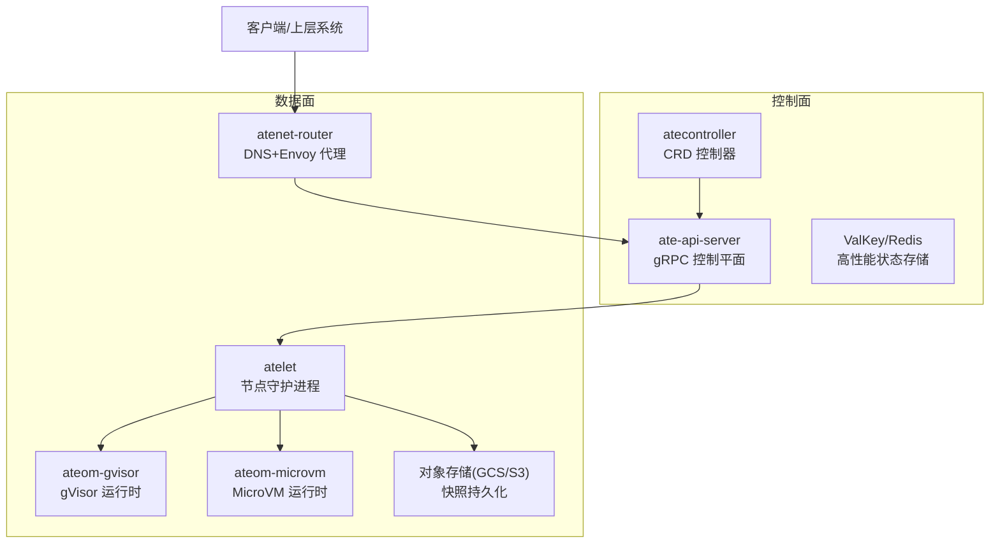
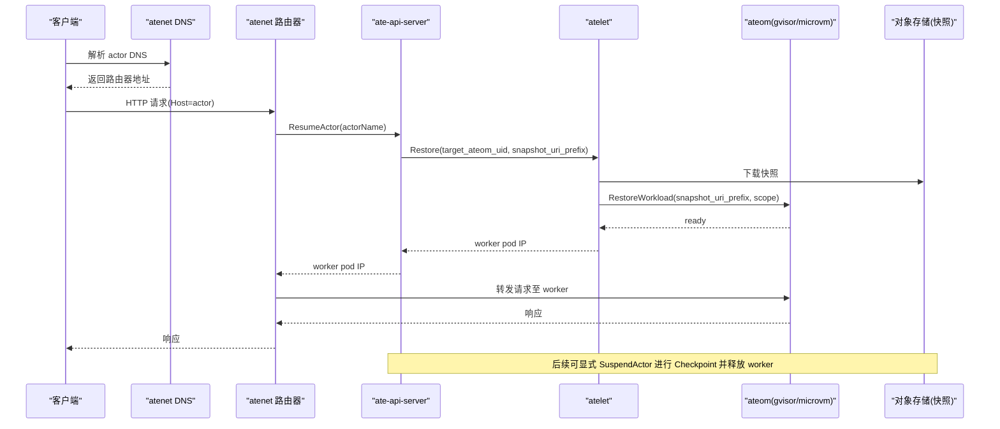
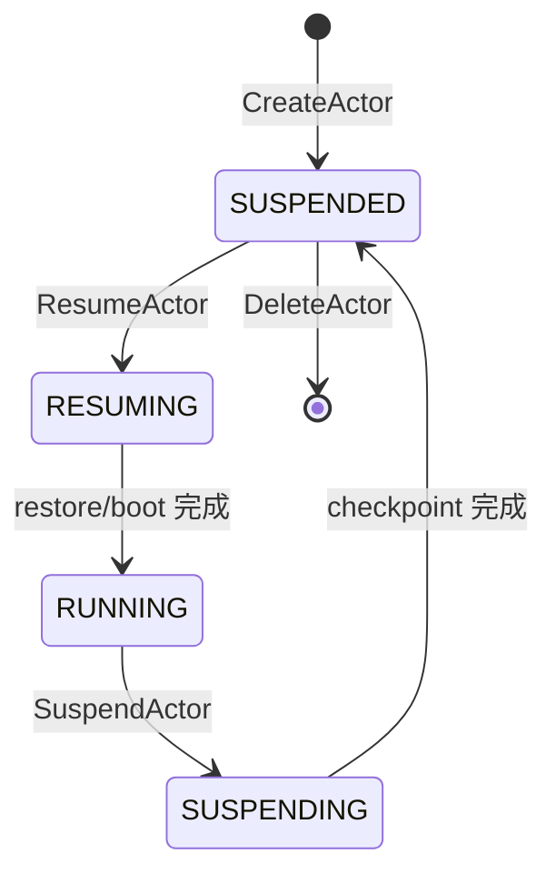
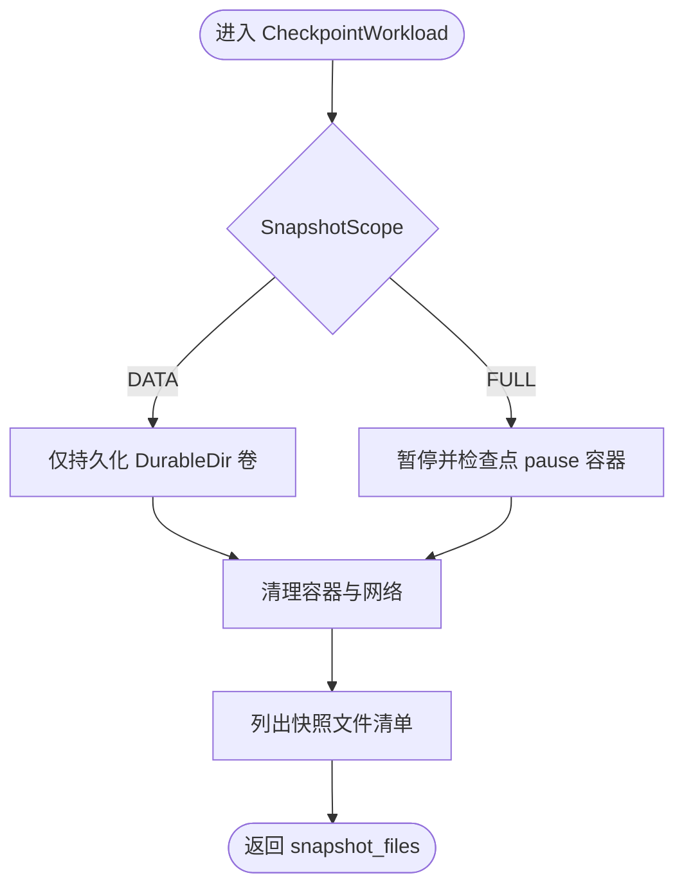
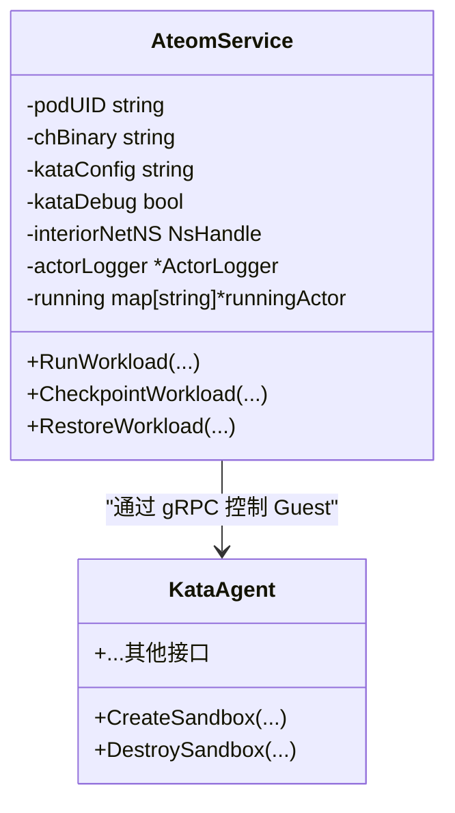
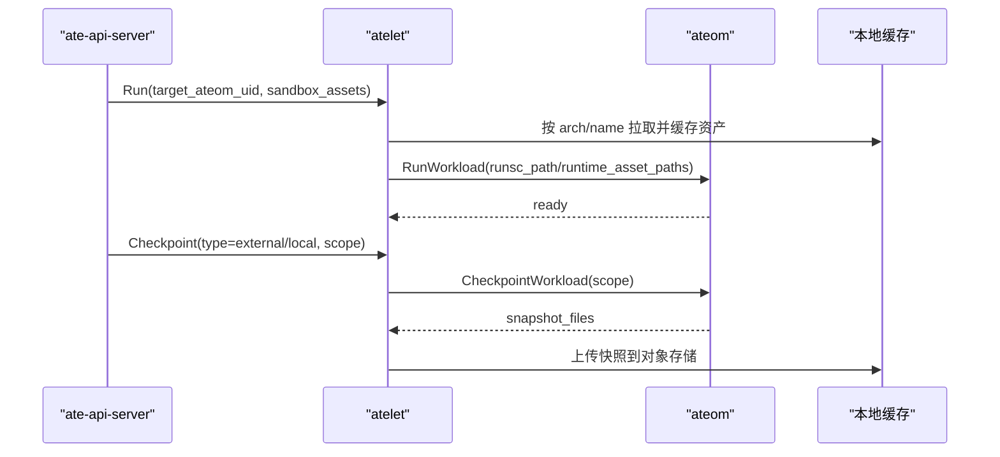
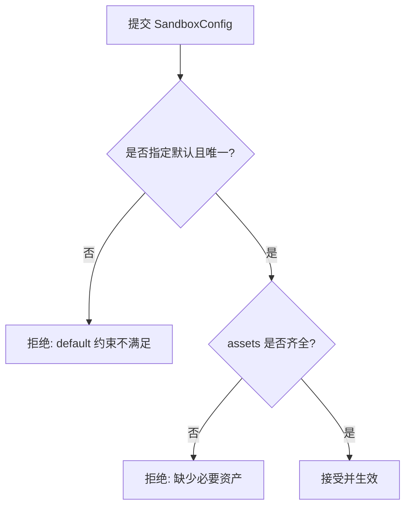
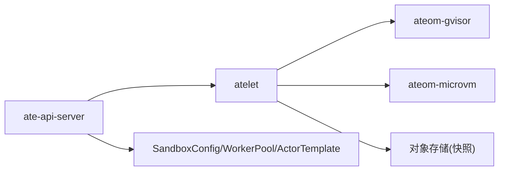
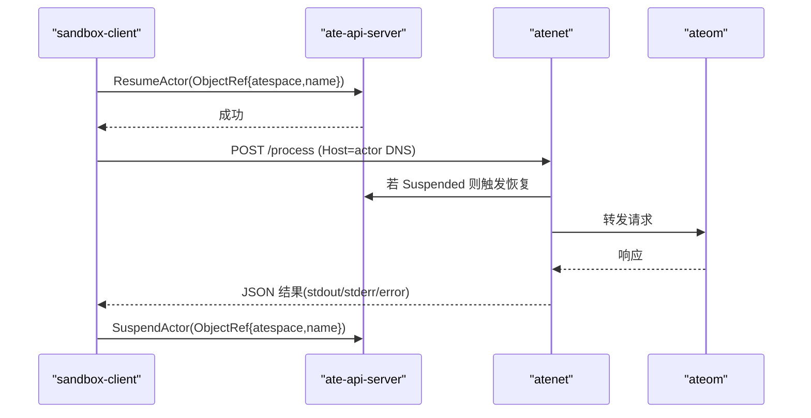

# 沙箱框架集成

<cite>
**本文引用的文件**   
- [README.md](file://README.md)
- [架构文档](file://docs/architecture.md)
- [ateom.proto](file://internal/proto/ateompb/ateom.proto)
- [atelet.proto](file://internal/proto/ateletpb/atelet.proto)
- [gVisor 运行时主程序](file://cmd/ateom-gvisor/main.go)
- [MicroVM 运行时主程序](file://cmd/ateom-microvm/main.go)
- [SandboxConfig CRD 类型定义](file://pkg/api/v1alpha1/sandboxconfig_types.go)
- [SandboxConfig 校验测试](file://pkg/api/v1alpha1/sandboxconfig_validation_test.go)
- [atelet 沙箱资产拉取逻辑](file://cmd/atelet/sandbox_assets.go)
- [MicroVM 资产准备说明](file://hack/microvm-assets/README.md)
- [Kata Agent gRPC 接口（片段）](file://cmd/ateom-microvm/internal/third_party/kata/agentpb/agent.proto)
- [Kata Agent gRPC 生成代码（片段）](file://cmd/ateom-microvm/internal/third_party/kata/agentpb/agent.pb.go)
- [Sandbox 演示客户端](file://demos/sandbox/client/main.go)
- [Sandbox 演示 README](file://demos/sandbox/README.md)
</cite>

## 目录
1. [简介](#简介)
2. [项目结构](#项目结构)
3. [核心组件](#核心组件)
4. [架构总览](#架构总览)
5. [详细组件分析](#详细组件分析)
6. [依赖关系分析](#依赖关系分析)
7. [性能与选择建议](#性能与选择建议)
8. [故障排除指南](#故障排除指南)
9. [结论](#结论)
10. [附录：客户端 API 使用指南](#附录客户端-api-使用指南)

## 简介
本文件面向希望在通用沙箱框架中开发自定义沙箱运行时的工程师，系统性阐述以下主题：
- 沙箱生命周期管理：创建、激活（恢复）、休眠（检查点）、删除的状态机与流程。
- 进程隔离机制：基于 gVisor 与 MicroVM 两种后端的隔离差异与实现要点。
- 文件系统访问控制：工作卷快照范围、只读根镜像与可写层策略。
- 网络通信配置：veth 对、命名空间、nftables 规则与 DNS 路由。
- 沙箱客户端 API：连接建立、命令执行、状态监控与资源清理。
- 后端特性对比与选择建议：gVisor 与 MicroVM 的优缺点、适用场景与性能权衡。
- 故障排除方法：常见问题定位与修复建议。

## 项目结构
本项目在 Kubernetes 之上提供“Actor”级别的超大规模复用能力，通过“预热 Worker Pod + 沙箱运行时”的组合，将 Actor 的生命周期与 Pod 解耦，从而实现亚秒级唤醒与高并发复用。

图表来源
- [架构文档:308-352](file://docs/architecture.md#L308-L352)
- [README.md:215-225](file://README.md#L215-L225)

章节来源
- [README.md:1-120](file://README.md#L1-L120)
- [架构文档:1-120](file://docs/architecture.md#L1-L120)

## 核心组件
- ate-api-server：暴露 gRPC 控制面，编排 Actor 的 Resume/Suspend 工作流，维护 Actor↔Worker 映射。
- atenet：统一 DNS 与 Envoy 代理，拦截请求并触发按需恢复。
- atelet：节点级守护进程，负责调度到具体 Worker Pod，协调快照下载/上传与运行时操作。
- ateom-gvisor / ateom-microvm：Worker Pod 内的沙箱管家，分别驱动 runsc 或 Kata+Cloud Hypervisor 完成 Run/Checkpoint/Restore。
- SandboxConfig：集群级配置，声明各沙箱类所需的二进制资产（如 runsc、cloud-hypervisor、kata-image 等）。

章节来源
- [架构文档:308-352](file://docs/architecture.md#L308-L352)
- [SandboxConfig CRD 类型定义:21-79](file://pkg/api/v1alpha1/sandboxconfig_types.go#L21-L79)

## 架构总览
下图展示从客户端请求到 Actor 恢复执行的端到端时序，以及状态机流转。

图表来源
- [架构文档:359-384](file://docs/architecture.md#L359-L384)
- [atelet.proto:21-33](file://internal/proto/ateletpb/atelet.proto#L21-L33)
- [ateom.proto:34-48](file://internal/proto/ateompb/ateom.proto#L34-L48)

图表来源
- [架构文档:386-396](file://docs/architecture.md#L386-L396)

## 详细组件分析

### 组件一：gVisor 运行时（ateom-gvisor）
职责
- 在 Worker Pod 内为每个 Actor 创建独立网络命名空间，建立 veth 对，配置 nftables 规则以实现入站 DNAT 与出站 SNAT/Masquerade。
- 调用 runsc 子命令完成 pause 容器与应用容器的 create/start/checkpoint/restore。
- 等待容器就绪（HTTP readyz），确保恢复后可立即服务。

关键流程
- RunWorkload：设置网络 → 启动 pause 容器 → 启动应用容器 → 等待 readyz。
- CheckpointWorkload：按 scope 决定仅持久化数据卷或完整内存+文件系统；完成后清理容器与网络。
- RestoreWorkload：根据 scope 选择 fs-restore 或 full restore，再启动应用容器并等待 readyz。

图表来源
- [gVisor 运行时主程序:239-324](file://cmd/ateom-gvisor/main.go#L239-L324)
- [ateom.proto:97-144](file://internal/proto/ateompb/ateom.proto#L97-L144)

章节来源
- [gVisor 运行时主程序:180-437](file://cmd/ateom-gvisor/main.go#L180-L437)
- [gVisor 运行时主程序:439-771](file://cmd/ateom-gvisor/main.go#L439-L771)
- [gVisor 运行时主程序:858-901](file://cmd/ateom-gvisor/main.go#L858-L901)
- [ateom.proto:50-95](file://internal/proto/ateompb/ateom.proto#L50-L95)

### 组件二：MicroVM 运行时（ateom-microvm）
职责
- 以 Kata Containers + Cloud Hypervisor 为基础，在 Worker Pod 内拉起微虚拟机承载 Actor。
- 支持内存级快照与 guest RAM 中的 tmpfs overlay 捕获 rootfs 写入，结合 userfaultfd 按需分页恢复。
- 处理挂载传播（rshared）以满足 virtio-fs 共享需求，并通过内部 netns 与 kata 对接网络。

关键流程
- 初始化：创建 ateom 目录、子进程回收器、共享挂载点、内部 netns，注册 gRPC 服务。
- Run/Checkpoint/Restore：通过 kata agent 与 CH 交互，完成沙箱生命周期与快照/恢复。

图表来源
- [MicroVM 运行时主程序:184-226](file://cmd/ateom-microvm/main.go#L184-L226)
- [Kata Agent gRPC 接口（片段）:67-82](file://cmd/ateom-microvm/internal/third_party/kata/agentpb/agent.proto#L67-L82)
- [Kata Agent gRPC 生成代码（片段）:1938-2080](file://cmd/ateom-microvm/internal/third_party/kata/agentpb/agent.pb.go#L1938-L2080)

章节来源
- [MicroVM 运行时主程序:73-154](file://cmd/ateom-microvm/main.go#L73-L154)
- [MicroVM 运行时主程序:156-182](file://cmd/ateom-microvm/main.go#L156-L182)
- [Kata Agent gRPC 接口（片段）:306-360](file://cmd/ateom-microvm/internal/third_party/kata/agentpb/agent.proto#L306-L360)
- [Kata Agent gRPC 生成代码（片段）:1938-2080](file://cmd/ateom-microvm/internal/third_party/kata/agentpb/agent.pb.go#L1938-L2080)

### 组件三：节点编排（atelet）与沙箱资产
职责
- 根据 SandboxAssets 描述，按架构与名称拉取并缓存沙箱二进制（如 runsc、cloud-hypervisor、kata-image 等）。
- 在 Run/Restore 时传递已下载的本地路径给 ateom；在 Checkpoint 时读取当前运行版本并记录进快照清单。

图表来源
- [atelet.proto:35-76](file://internal/proto/ateletpb/atelet.proto#L35-L76)
- [atelet 沙箱资产拉取逻辑:91-115](file://cmd/atelet/sandbox_assets.go#L91-L115)

章节来源
- [atelet.proto:1-239](file://internal/proto/ateletpb/atelet.proto#L1-L239)
- [atelet 沙箱资产拉取逻辑:91-115](file://cmd/atelet/sandbox_assets.go#L91-L115)

### 组件四：SandboxConfig 与资产校验
- SandboxClass：gvisor 与 microvm 两类运行时族。
- Assets：按架构→资产名映射，gvisor 要求包含 runsc；microvm 需要一组必要资产（如 cloud-hypervisor、kata-kernel、kata-image、virtiofsd 等）。
- 校验：通过 ValidatingAdmissionPolicy 与单元测试保证必填字段完整性与 SHA256 格式正确性。

图表来源
- [SandboxConfig CRD 类型定义:21-79](file://pkg/api/v1alpha1/sandboxconfig_types.go#L21-L79)
- [SandboxConfig 校验测试:110-175](file://pkg/api/v1alpha1/sandboxconfig_validation_test.go#L110-L175)

章节来源
- [SandboxConfig CRD 类型定义:21-79](file://pkg/api/v1alpha1/sandboxconfig_types.go#L21-L79)
- [SandboxConfig 校验测试:110-175](file://pkg/api/v1alpha1/sandboxconfig_validation_test.go#L110-L175)

## 依赖关系分析
- 控制面与数据面解耦：API Server 仅做编排与状态维护，实际执行下沉到 atelet 与 ateom。
- 运行时抽象：ateom 通过统一的 gRPC 接口屏蔽 gVisor 与 MicroVM 的差异，便于扩展新的沙箱后端。
- 资产版本锁定：SandboxAssets 与快照清单绑定，确保跨节点/跨 Pod 的恢复一致性。

图表来源
- [架构文档:308-352](file://docs/architecture.md#L308-L352)
- [SandboxConfig CRD 类型定义:81-117](file://pkg/api/v1alpha1/sandboxconfig_types.go#L81-L117)

章节来源
- [架构文档:308-352](file://docs/architecture.md#L308-L352)
- [SandboxConfig CRD 类型定义:81-117](file://pkg/api/v1alpha1/sandboxconfig_types.go#L81-L117)

## 性能与选择建议
- gVisor（默认）
  - 优点：轻量、启动快、与容器生态兼容性好；适合大多数 AI 推理/工具调用场景。
  - 注意：当前 gVisor 后端在检查点时需要特定 runsc 参数以规避网络恢复问题。
- MicroVM
  - 优点：更强的隔离性与内核态边界；适合对安全隔离有更高要求的负载。
  - 注意：需要 KVM 与 vhost 设备；资产需按节点架构准备；guest 内存快照与 tmpfs overlay 带来额外开销。

选择建议
- 优先 gVisor：追求低延迟与高密度复用的通用 AI 工作负载。
- 选择 MicroVM：需要更强隔离、多租户强安全边界的场景。

章节来源
- [架构文档:335-342](file://docs/architecture.md#L335-L342)
- [MicroVM 资产准备说明:26-56](file://hack/microvm-assets/README.md#L26-L56)

## 故障排除指南
- 网络不可达/端口不通
  - 检查 Worker Pod 是否启用 IPv4 转发与 nftables 规则是否正确安装。
  - 确认 ateom 内部 netns 的 veth 对与默认网关配置。
- 容器未就绪
  - 确认 Readyz HTTP 探测路径与端口配置正确，且应用已在预期端口监听。
- 快照失败或无法恢复
  - 核对 SnapshotScope 与 DurableDir 卷配置；确认对象存储 URI 前缀与权限。
  - 验证 SandboxAssets 的版本与快照清单一致，避免 runsc/CH 版本不匹配。
- MicroVM 启动失败
  - 确认宿主机具备 KVM 与 vhost 设备；检查挂载传播（rshared）是否生效。
  - 核对 assets 是否齐全且与节点架构匹配。

章节来源
- [gVisor 运行时主程序:661-771](file://cmd/ateom-gvisor/main.go#L661-L771)
- [gVisor 运行时主程序:858-901](file://cmd/ateom-gvisor/main.go#L858-L901)
- [MicroVM 运行时主程序:156-182](file://cmd/ateom-microvm/main.go#L156-L182)
- [MicroVM 资产准备说明:26-56](file://hack/microvm-assets/README.md#L26-L56)

## 结论
本框架通过“控制面编排 + 节点级编排 + 沙箱运行时”的分层设计，实现了 Actor 级别的高密度复用与快速唤醒。gVisor 与 MicroVM 双后端覆盖不同安全与性能诉求，配合 SandboxConfig 的资产版本锁定与 atelet 的统一抽象，使扩展新沙箱后端成为可能。建议在通用 AI 场景优先采用 gVisor，在强隔离需求下选择 MicroVM，并结合快照范围与网络策略优化整体性能与稳定性。

## 附录：客户端 API 使用指南
- 连接建立
  - 通过 gRPC 连接 ate-api-server，使用 TLS 传输凭证（示例中为跳过证书校验用于演示）。
- 命令执行
  - 通过 HTTP POST /process 向 atenet 发送命令，Host 头设置为 Actor 的 DNS 名称，由路由器触发恢复并转发到目标 Worker。
- 状态监控
  - 可通过控制面 API 查询 Actor 状态（RUNNING/SUSPENDED），或在日志中观察生命周期事件。
- 资源清理
  - 退出时自动调用 SuspendActor，将内存与文件系统状态检查点至对象存储并释放 Worker。

图表来源
- [Sandbox 演示客户端:51-113](file://demos/sandbox/client/main.go#L51-L113)
- [Sandbox 演示客户端:174-206](file://demos/sandbox/client/main.go#L174-L206)
- [Sandbox 演示 README:40-97](file://demos/sandbox/README.md#L40-L97)

章节来源
- [Sandbox 演示客户端:51-113](file://demos/sandbox/client/main.go#L51-L113)
- [Sandbox 演示客户端:174-206](file://demos/sandbox/client/main.go#L174-L206)
- [Sandbox 演示 README:40-97](file://demos/sandbox/README.md#L40-L97)
