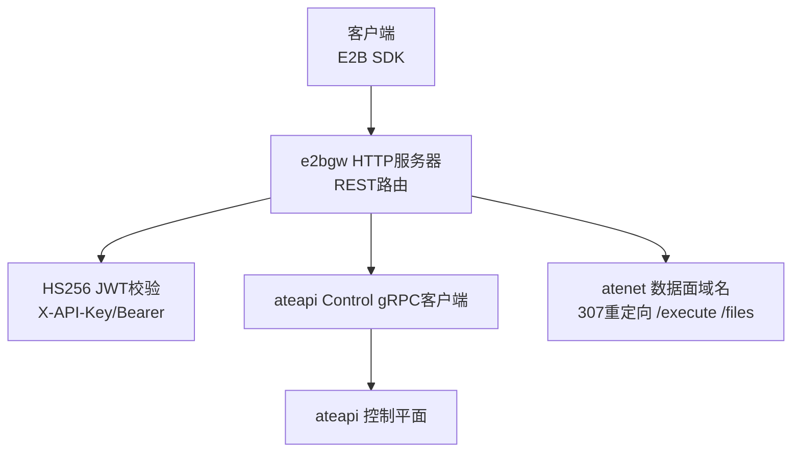
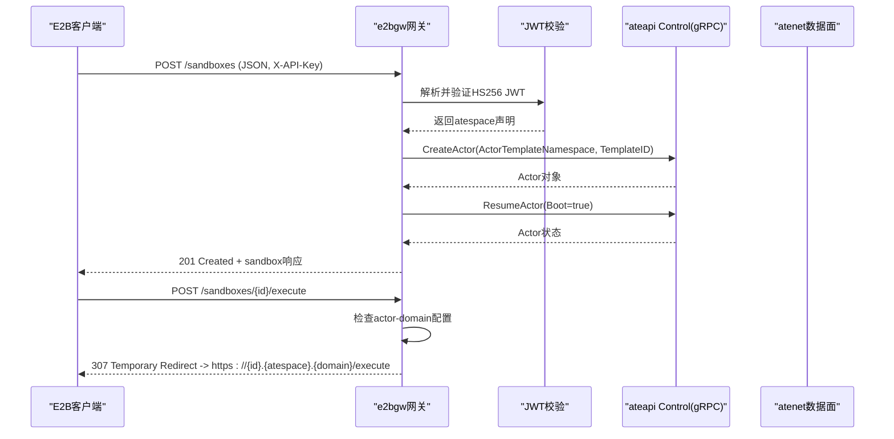
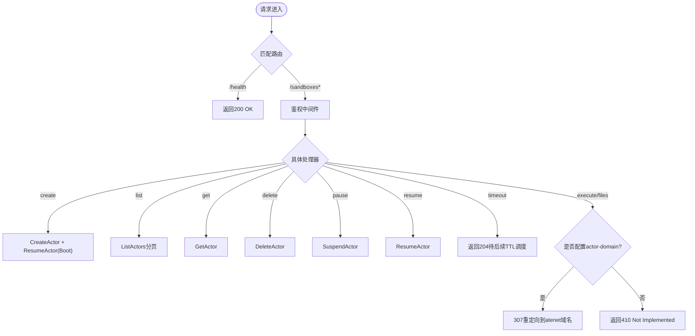
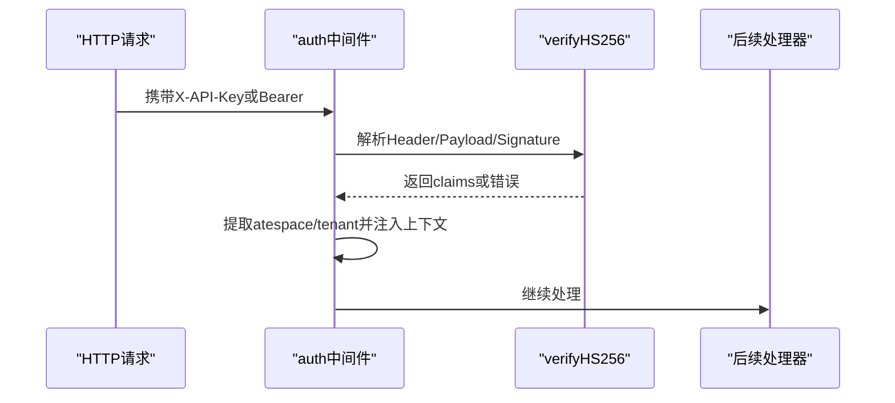
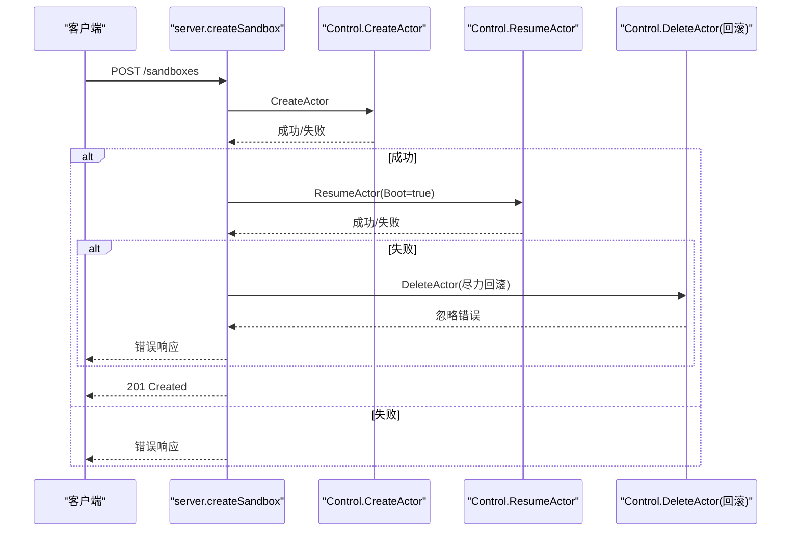
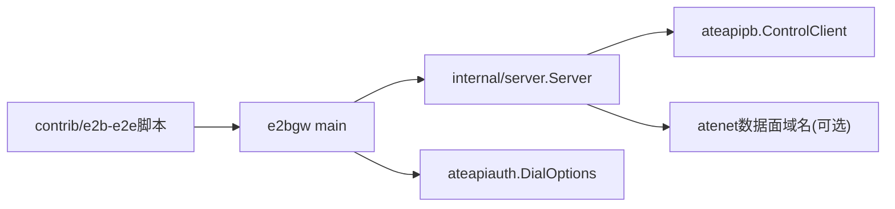

# E2B协议网关

<cite>
**本文引用的文件**
- [cmd/e2bgw/main.go](file://cmd/e2bgw/main.go)
- [cmd/e2bgw/internal/server/server.go](file://cmd/e2bgw/internal/server/server.go)
- [cmd/e2bgw/internal/server/jwt.go](file://cmd/e2bgw/internal/server/jwt.go)
- [contrib/e2b-e2e/README.md](file://contrib/e2b-e2e/README.md)
- [xuanji.md](file://xuanji.md)
- [pkg/proto/ateapipb/ateapi.proto](file://pkg/proto/ateapipb/ateapi.proto)
</cite>

## 目录
1. [简介](#简介)
2. [项目结构](#项目结构)
3. [核心组件](#核心组件)
4. [架构总览](#架构总览)
5. [详细组件分析](#详细组件分析)
6. [依赖关系分析](#依赖关系分析)
7. [性能与可靠性](#性能与可靠性)
8. [故障排查指南](#故障排查指南)
9. [结论](#结论)
10. [附录](#附录)

## 简介
E2B协议网关（e2bgw）是一个将E2B REST API表面翻译为substrate ateapi Control gRPC调用的服务。它使未修改的E2B SDK能够驱动substrate Actor，实现沙箱生命周期管理（创建、暂停、恢复、删除、列举等），并将数据面请求（执行、文件）通过307重定向转发到Actor自身的atenet域名（M4阶段接入）。该网关使用HS256 JWT进行API Key鉴权，并通过gRPC安全连接调用ateapi控制平面。

## 项目结构
- 入口程序：cmd/e2bgw/main.go
- 网关HTTP服务与路由：cmd/e2bgw/internal/server/server.go
- JWT校验逻辑：cmd/e2bgw/internal/server/jwt.go
- E2B协议验收脚本：contrib/e2b-e2e/*
- ateapi控制平面接口定义：pkg/proto/ateapipb/ateapi.proto
- xuanji分支改动登记：xuanji.md

图表来源
- [cmd/e2bgw/main.go:40-100](file://cmd/e2bgw/main.go#L40-L100)
- [cmd/e2bgw/internal/server/server.go:61-79](file://cmd/e2bgw/internal/server/server.go#L61-L79)
- [cmd/e2bgw/internal/server/jwt.go:29-75](file://cmd/e2bgw/internal/server/jwt.go#L29-L75)

章节来源
- [cmd/e2bgw/main.go:15-52](file://cmd/e2bgw/main.go#L15-L52)
- [cmd/e2bgw/internal/server/server.go:15-79](file://cmd/e2bgw/internal/server/server.go#L15-L79)
- [contrib/e2b-e2e/README.md:1-24](file://contrib/e2b-e2e/README.md#L1-L24)
- [xuanji.md:22-31](file://xuanji.md#L22-L31)

## 核心组件
- HTTP服务器与路由：提供E2B REST端点（/sandboxes、/sandboxes/{id}、/sandboxes/{id}/pause、/resume、/timeout、/execute、/files、/health），统一鉴权后分发处理。
- 鉴权中间件：从X-API-Key或Authorization: Bearer读取JWT，使用HS256校验并提取atespace/tenant声明注入上下文。
- ateapi控制平面适配：将E2B请求映射为CreateActor/GetActor/DeleteActor/SuspendActor/ResumeActor/ListActors调用，并进行错误码映射。
- 数据面重定向：当配置了actor-domain时，将/sandboxes/{id}/execute和/files以307临时重定向至https://{sandbox-id}.{atespace}.{actor-domain}{path}。

章节来源
- [cmd/e2bgw/internal/server/server.go:61-79](file://cmd/e2bgw/internal/server/server.go#L61-L79)
- [cmd/e2bgw/internal/server/server.go:81-118](file://cmd/e2bgw/internal/server/server.go#L81-L118)
- [cmd/e2bgw/internal/server/server.go:137-253](file://cmd/e2bgw/internal/server/server.go#L137-L253)
- [cmd/e2bgw/internal/server/jwt.go:29-75](file://cmd/e2bgw/internal/server/jwt.go#L29-L75)

## 架构总览
E2B协议网关作为控制平面的代理层，屏蔽底层ateapi gRPC细节，向上暴露稳定的E2B REST接口；同时负责数据面路由策略（按M4规划重定向至atenet域名）。

图表来源
- [cmd/e2bgw/internal/server/server.go:61-79](file://cmd/e2bgw/internal/server/server.go#L61-L79)
- [cmd/e2bgw/internal/server/server.go:137-174](file://cmd/e2bgw/internal/server/server.go#L137-L174)
- [cmd/e2bgw/internal/server/server.go:242-253](file://cmd/e2bgw/internal/server/server.go#L242-L253)
- [cmd/e2bgw/internal/server/jwt.go:29-75](file://cmd/e2bgw/internal/server/jwt.go#L29-L75)

## 详细组件分析

### 网关HTTP服务与路由
- 注册E2B REST端点：/sandboxes（POST/GET）、/sandboxes/{id}（GET/DELETE）、/sandboxes/{id}/pause、/resume、/timeout、/execute、/files、/health。
- 所有业务端点均经过auth中间件，健康检查直接返回200。
- 数据面端点根据是否配置actor-domain决定返回307重定向或返回“未实现”。

图表来源
- [cmd/e2bgw/internal/server/server.go:61-79](file://cmd/e2bgw/internal/server/server.go#L61-L79)
- [cmd/e2bgw/internal/server/server.go:137-253](file://cmd/e2bgw/internal/server/server.go#L137-L253)

章节来源
- [cmd/e2bgw/internal/server/server.go:61-79](file://cmd/e2bgw/internal/server/server.go#L61-L79)
- [cmd/e2bgw/internal/server/server.go:137-253](file://cmd/e2bgw/internal/server/server.go#L137-L253)

### 鉴权中间件与JWT校验
- 支持两种头部：X-API-Key或Authorization: Bearer。
- 仅接受HS256算法的JWS，校验签名并检查exp过期时间。
- 从claims中读取atespace（兼容旧版tenant字段），并将其注入请求上下文供后续处理器使用。

图表来源
- [cmd/e2bgw/internal/server/server.go:81-118](file://cmd/e2bgw/internal/server/server.go#L81-L118)
- [cmd/e2bgw/internal/server/jwt.go:29-75](file://cmd/e2bgw/internal/server/jwt.go#L29-L75)

章节来源
- [cmd/e2bgw/internal/server/server.go:81-118](file://cmd/e2bgw/internal/server/server.go#L81-L118)
- [cmd/e2bgw/internal/server/jwt.go:29-75](file://cmd/e2bgw/internal/server/jwt.go#L29-L75)

### 控制平面适配与错误映射
- 将E2B语义映射到ateapi Control gRPC方法：CreateActor、GetActor、DeleteActor、SuspendActor、ResumeActor、ListActors。
- 创建沙箱流程：先CreateActor，再ResumeActor(Boot=true)，失败时尝试回滚DeleteActor以避免资源泄漏。
- 将gRPC状态码映射为HTTP状态码（NotFound→404、AlreadyExists→409、InvalidArgument→400、PermissionDenied→403、Unauthenticated→401、FailedPrecondition→409、ResourceExhausted→429、Unavailable→503等）。

图表来源
- [cmd/e2bgw/internal/server/server.go:137-174](file://cmd/e2bgw/internal/server/server.go#L137-L174)
- [cmd/e2bgw/internal/server/server.go:305-337](file://cmd/e2bgw/internal/server/server.go#L305-L337)

章节来源
- [cmd/e2bgw/internal/server/server.go:137-174](file://cmd/e2bgw/internal/server/server.go#L137-L174)
- [cmd/e2bgw/internal/server/server.go:305-337](file://cmd/e2bgw/internal/server/server.go#L305-L337)

### 数据面重定向
- 当配置了actor-domain时，/execute和/files返回307临时重定向到https://{sandbox-id}.{atespace}.{actor-domain}{path}，由atenet在M4阶段提供服务。
- 未配置时返回“未实现”，提示需要设置参数。

章节来源
- [cmd/e2bgw/internal/server/server.go:242-253](file://cmd/e2bgw/internal/server/server.go#L242-L253)

## 依赖关系分析
- e2bgw依赖ateapiauth提供的gRPC拨号选项（CA、ServerName、TokenFile、ClientCredBundle）以安全连接ateapi。
- 网关通过ateapipb.ControlClient调用控制平面，接口定义位于pkg/proto/ateapipb/ateapi.proto。
- 验收资产位于contrib/e2b-e2e，用于对E2B REST表面进行端到端测试与回归验证。

图表来源
- [cmd/e2bgw/main.go:66-100](file://cmd/e2bgw/main.go#L66-L100)
- [cmd/e2bgw/internal/server/server.go:36-45](file://cmd/e2bgw/internal/server/server.go#L36-L45)
- [contrib/e2b-e2e/README.md:1-24](file://contrib/e2b-e2e/README.md#L1-L24)

章节来源
- [cmd/e2bgw/main.go:66-100](file://cmd/e2bgw/main.go#L66-L100)
- [cmd/e2bgw/internal/server/server.go:36-45](file://cmd/e2bgw/internal/server/server.go#L36-L45)
- [contrib/e2b-e2e/README.md:1-24](file://contrib/e2b-e2e/README.md#L1-L24)
- [pkg/proto/ateapipb/ateapi.proto](file://pkg/proto/ateapipb/ateapi.proto)

## 性能与可靠性
- 轻量级无第三方JWT库：自定义HS256校验，减少依赖与攻击面。
- 幂等性与回滚：创建沙箱失败时尽力回滚DeleteActor，避免孤儿Actor。
- 错误映射：将gRPC状态码转换为HTTP语义，便于上层SDK正确处理。
- 可扩展性：通过ControlAPI接口抽象，便于替换实现进行单元测试。
- 数据面解耦：/execute与/files通过重定向交由atenet处理，网关保持无状态。

[本节为通用指导，不直接分析具体文件]

## 故障排查指南
- 鉴权失败
  - 现象：401 Unauthorized，消息“missing API key”或“invalid API key”。
  - 排查：确认请求头包含X-API-Key或Authorization: Bearer；确认HS256密钥一致；确认JWT未过期且包含atespace/tenant声明。
  - 参考位置：[cmd/e2bgw/internal/server/server.go:81-118](file://cmd/e2bgw/internal/server/server.go#L81-L118)、[cmd/e2bgw/internal/server/jwt.go:29-75](file://cmd/e2bgw/internal/server/jwt.go#L29-L75)

- 创建沙箱失败
  - 现象：4xx/5xx错误，消息包含操作名与gRPC错误信息。
  - 排查：检查ateapi连接与证书配置；确认模板命名空间与模板名称正确；关注ResumeActor失败时的回滚日志。
  - 参考位置：[cmd/e2bgw/internal/server/server.go:137-174](file://cmd/e2bgw/internal/server/server.go#L137-L174)、[cmd/e2bgw/internal/server/server.go:305-337](file://cmd/e2bgw/internal/server/server.go#L305-L337)

- 数据面不可用
  - 现象：/execute或/files返回410 Not Implemented。
  - 排查：确认已设置--actor-domain；确保M4阶段atenet域名可解析并可访问。
  - 参考位置：[cmd/e2bgw/internal/server/server.go:242-253](file://cmd/e2bgw/internal/server/server.go#L242-L253)

- 健康检查
  - 使用GET /health验证网关进程存活。
  - 参考位置：[cmd/e2bgw/internal/server/server.go:73-75](file://cmd/e2bgw/internal/server/server.go#L73-L75)

章节来源
- [cmd/e2bgw/internal/server/server.go:81-118](file://cmd/e2bgw/internal/server/server.go#L81-L118)
- [cmd/e2bgw/internal/server/server.go:137-174](file://cmd/e2bgw/internal/server/server.go#L137-L174)
- [cmd/e2bgw/internal/server/server.go:242-253](file://cmd/e2bgw/internal/server/server.go#L242-L253)
- [cmd/e2bgw/internal/server/server.go:305-337](file://cmd/e2bgw/internal/server/server.go#L305-L337)
- [cmd/e2bgw/internal/server/server.go:73-75](file://cmd/e2bgw/internal/server/server.go#L73-L75)

## 结论
E2B协议网关以最小依赖实现了E2B REST到ateapi Control的稳定桥接，提供安全的HS256鉴权、完整的沙箱生命周期管理以及数据面重定向能力。其设计清晰、错误映射完善、具备回滚机制，并通过验收脚本保障向后兼容。随着M4阶段atenet数据面接入，网关将完全解耦数据面处理，进一步提升扩展性与可维护性。

[本节为总结，不直接分析具体文件]

## 附录
- 运行参数
  - --listen-address：监听地址（默认0.0.0.0:8080）
  - --ateapi-conn-spec：ateapi gRPC目标（默认dns:///api.ate-system.svc:443）
  - --ateapi-ca-file：ateapi服务端证书CA bundle
  - --ateapi-server-name：期望的ateapi TLS Server Name（SNI）
  - --ateapi-token-file：Kubernetes ServiceAccount令牌文件
  - --ateapi-client-cred-bundle：客户端证书凭证bundle
  - --jwt-secret-file：HS256密钥文件路径
  - --template-namespace：ActorTemplates所在命名空间（默认ate-wasm）
  - --actor-domain：atenet数据面域名后缀（启用数据面重定向）

- 关键端点
  - POST /sandboxes：创建并启动沙箱
  - GET /sandboxes：列举当前atespace下的沙箱
  - GET /sandboxes/{id}：获取沙箱详情
  - DELETE /sandboxes/{id}：删除沙箱
  - POST /sandboxes/{id}/pause：暂停沙箱
  - POST /sandboxes/{id}/resume：恢复沙箱
  - POST /sandboxes/{id}/timeout：接受超时设置（待后续TTL调度）
  - POST /sandboxes/{id}/execute：数据面执行（307重定向）
  - POST /sandboxes/{id}/files：数据面文件（307重定向）
  - GET /health：健康检查

章节来源
- [cmd/e2bgw/main.go:40-52](file://cmd/e2bgw/main.go#L40-L52)
- [cmd/e2bgw/internal/server/server.go:61-79](file://cmd/e2bgw/internal/server/server.go#L61-L79)
- [xuanji.md:22-31](file://xuanji.md#L22-L31)