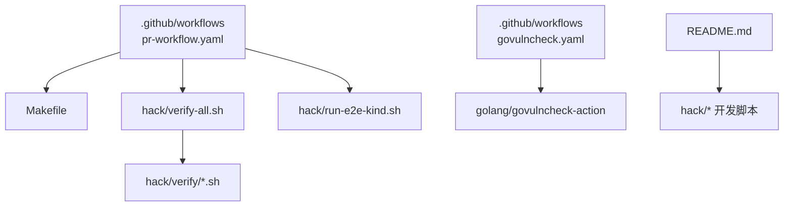
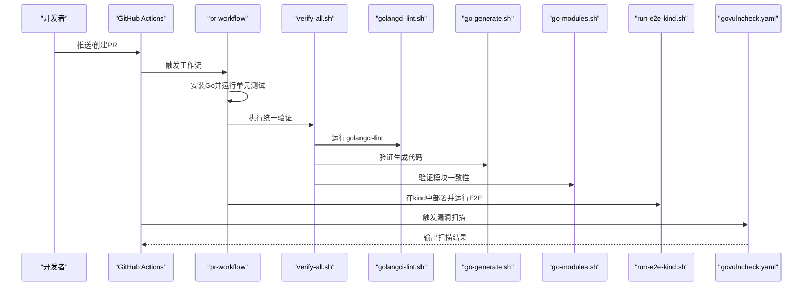
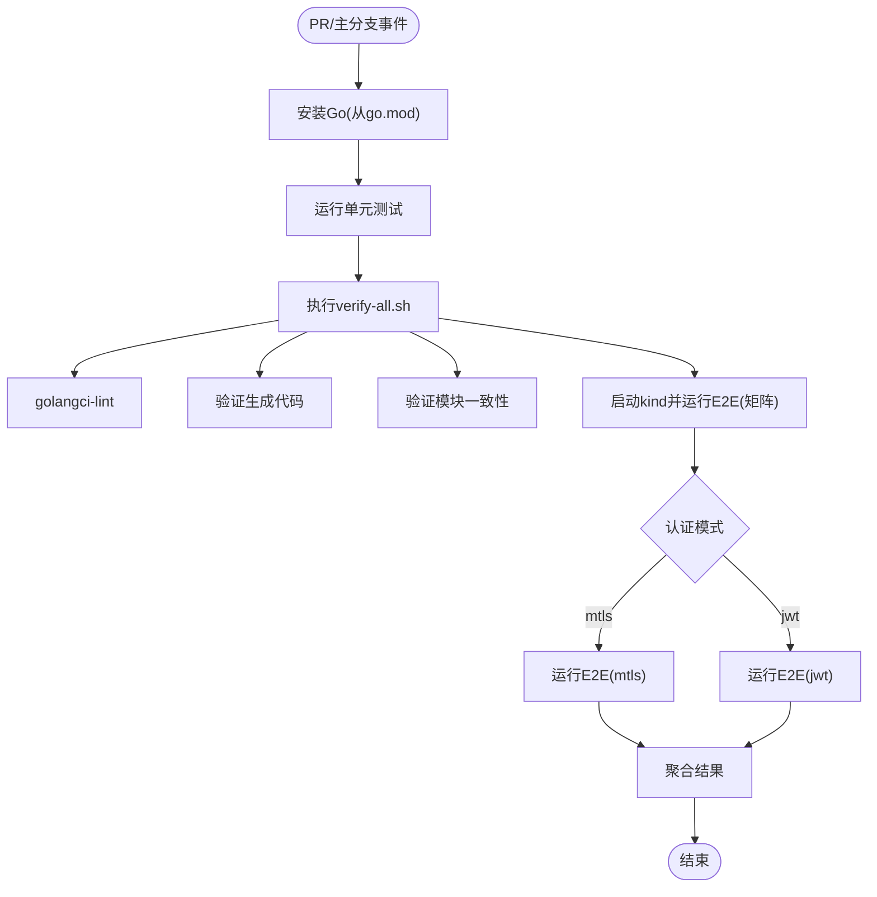
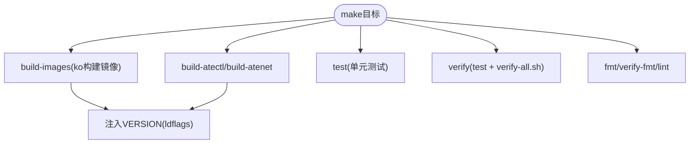
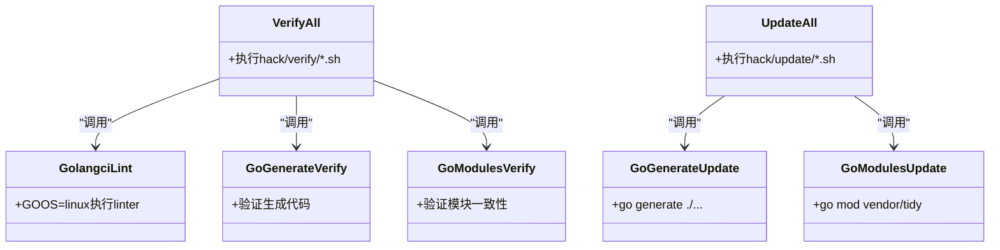
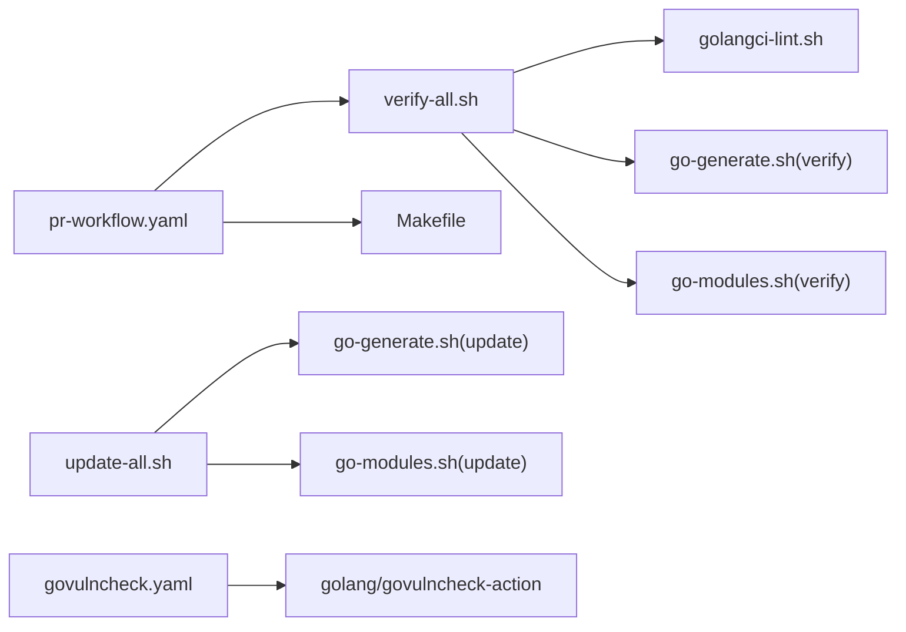

# CI/CD流水线集成

<cite>
**本文引用的文件**
- [pr-workflow.yaml](file://.github/workflows/pr-workflow.yaml)
- [govulncheck.yaml](file://.github/workflows/govulncheck.yaml)
- [Makefile](file://Makefile)
- [verify-all.sh](file://hack/verify-all.sh)
- [update-all.sh](file://hack/update-all.sh)
- [golangci-lint.sh](file://hack/verify/golangci-lint.sh)
- [go-generate.sh](file://hack/verify/go-generate.sh)
- [go-modules.sh](file://hack/verify/go-modules.sh)
- [go-generate.sh](file://hack/update/go-generate.sh)
- [go-modules.sh](file://hack/update/go-modules.sh)
- [README.md](file://README.md)
</cite>

## 目录
1. [简介](#简介)
2. [项目结构](#项目结构)
3. [核心组件](#核心组件)
4. [架构总览](#架构总览)
5. [详细组件分析](#详细组件分析)
6. [依赖关系分析](#依赖关系分析)
7. [性能与稳定性考量](#性能与稳定性考量)
8. [故障排查指南](#故障排查指南)
9. [结论](#结论)
10. [附录：自定义CI/CD流水线配置指南](#附录自定义cicd流水线配置指南)

## 简介
本文件面向Agent Substrate的CI/CD流水线集成，覆盖GitHub Actions工作流、自动化测试执行、代码质量检查、构建与发布流程，以及本地开发环境的自动化脚本使用方法（代码生成、依赖更新、版本管理）。同时提供自定义CI/CD流水线的配置指南，帮助团队在现有基础上扩展或调整流水线。

## 项目结构
仓库采用“按功能分层 + 工具脚本集中”的组织方式：
- GitHub Actions工作流位于 .github/workflows 下，包含PR/主分支触发的工作流与安全扫描工作流。
- Makefile提供统一的构建、测试、格式化、lint、验证入口。
- hack/verify 与 hack/update 分别封装“校验类”和“更新类”子任务，便于组合调用。
- README.md提供快速开始与开发环境说明。

图表来源
- [pr-workflow.yaml:1-133](file://.github/workflows/pr-workflow.yaml#L1-L133)
- [govulncheck.yaml:1-35](file://.github/workflows/govulncheck.yaml#L1-L35)
- [Makefile:1-99](file://Makefile#L1-L99)
- [verify-all.sh:1-29](file://hack/verify-all.sh#L1-L29)
- [README.md:97-193](file://README.md#L97-L193)

章节来源
- [pr-workflow.yaml:1-133](file://.github/workflows/pr-workflow.yaml#L1-L133)
- [govulncheck.yaml:1-35](file://.github/workflows/govulncheck.yaml#L1-L35)
- [Makefile:1-99](file://Makefile#L1-L99)
- [verify-all.sh:1-29](file://hack/verify-all.sh#L1-L29)
- [README.md:97-193](file://README.md#L97-L193)

## 核心组件
- PR/主分支工作流（pr-workflow）
  - 触发条件：pull_request、push到main、每周定时任务（用于缓存预热）。
  - 主要作业：
    - run-tests：安装Go并运行单元测试，随后执行统一验证脚本。
    - e2e-test-matrix：基于认证模式矩阵（mtls/jwt）在kind集群中部署系统、示例应用，并运行端到端测试；包含微虚拟机资产缓存、KVM启用、磁盘清理等优化步骤。
    - e2e-test：汇总矩阵结果，任一失败则整体失败。
- 安全扫描工作流（govulncheck）
  - 触发条件：push到main、每周定时任务。
  - 使用官方golang/govulncheck-action对全部包进行漏洞扫描。
- 构建与验证入口（Makefile）
  - build-images：通过ko构建镜像，注入版本号ldflags。
  - build-atectl/atenet：编译二进制。
  - test：运行所有单元测试。
  - verify：运行test后执行hack/verify-all.sh。
  - fmt/verify-fmt/lint：格式化与golangci-lint检查。
- 统一验证与更新脚本
  - verify-all.sh：遍历并执行hack/verify下的所有*.sh。
  - update-all.sh：遍历并执行hack/update下的所有*.sh。
  - golangci-lint.sh：以GOOS=linux执行linter，避免macOS平台差异导致类型检查失败。
  - go-generate.sh / go-modules.sh：验证生成的代码与模块一致性。
  - update/go-generate.sh / update/go-modules.sh：执行go generate与依赖整理。

章节来源
- [pr-workflow.yaml:1-133](file://.github/workflows/pr-workflow.yaml#L1-L133)
- [govulncheck.yaml:1-35](file://.github/workflows/govulncheck.yaml#L1-L35)
- [Makefile:1-99](file://Makefile#L1-L99)
- [verify-all.sh:1-29](file://hack/verify-all.sh#L1-L29)
- [update-all.sh:1-29](file://hack/update-all.sh#L1-L29)
- [golangci-lint.sh:1-31](file://hack/verify/golangci-lint.sh#L1-L31)
- [go-generate.sh:1-23](file://hack/verify/go-generate.sh#L1-L23)
- [go-modules.sh:1-23](file://hack/verify/go-modules.sh#L1-L23)
- [go-generate.sh:1-23](file://hack/update/go-generate.sh#L1-L23)
- [go-modules.sh:1-24](file://hack/update/go-modules.sh#L1-L24)

## 架构总览
下图展示从提交到测试、质量检查、E2E与漏洞扫描的整体流程，以及与本地开发脚本的对应关系。

图表来源
- [pr-workflow.yaml:1-133](file://.github/workflows/pr-workflow.yaml#L1-L133)
- [verify-all.sh:1-29](file://hack/verify-all.sh#L1-L29)
- [golangci-lint.sh:1-31](file://hack/verify/golangci-lint.sh#L1-L31)
- [go-generate.sh:1-23](file://hack/verify/go-generate.sh#L1-L23)
- [go-modules.sh:1-23](file://hack/verify/go-modules.sh#L1-L23)
- [govulncheck.yaml:1-35](file://.github/workflows/govulncheck.yaml#L1-L35)

## 详细组件分析

### 组件A：PR/主分支工作流（pr-workflow）
- 触发策略
  - pull_request：对所有PR执行基础测试与验证。
  - push to main：同步执行测试与验证，确保主干质量。
  - schedule：每周定时任务，刷新微虚拟机资产缓存，提升后续PR命中率。
- 关键作业
  - run-tests：安装Go（从go.mod读取版本），运行单元测试，再执行verify-all.sh。
  - e2e-test-matrix：
    - 矩阵维度：auth-mode=[mtls,jwt]。
    - 资源准备：清理磁盘、缓存微虚拟机资产、安装构建依赖、启用KVM。
    - 环境搭建：创建kind集群、安装Agent Substrate（支持--auth-mode参数）、部署微虚拟机与gVisor示例。
    - 等待就绪：等待Actortemplate就绪。
    - 执行E2E：分别针对gVisor与microvm场景运行测试套件。
    - 失败诊断：收集相关命名空间与Pod日志。
  - e2e-test：聚合矩阵结果，任一失败即失败。
- 可观测性与排障
  - 失败时自动dump关键资源与日志，便于定位问题。

图表来源
- [pr-workflow.yaml:1-133](file://.github/workflows/pr-workflow.yaml#L1-L133)

章节来源
- [pr-workflow.yaml:1-133](file://.github/workflows/pr-workflow.yaml#L1-L133)

### 组件B：安全扫描工作流（govulncheck）
- 触发策略：push到main与每周定时任务。
- 行为：使用golang/govulncheck-action对./...进行漏洞扫描，报告潜在安全问题。
- 建议：将结果作为PR门禁的一部分，或在weekly报告中跟踪修复进度。

章节来源
- [govulncheck.yaml:1-35](file://.github/workflows/govulncheck.yaml#L1-L35)

### 组件C：构建与发布（Makefile）
- 构建镜像
  - 使用ko构建多个组件镜像，并通过ldflags注入版本号。
- 构建CLI与网络组件
  - 编译kubectl-ate与atenet二进制。
- 测试与验证
  - test：运行所有单元测试。
  - verify：先运行test，再执行hack/verify-all.sh。
- 代码质量
  - fmt：格式化代码。
  - verify-fmt：校验格式。
  - lint：运行golangci-lint。
- 版本管理
  - VERSION默认取自git describe，可通过命令行覆盖。
  - LDFLAGS将版本号注入internal/version包。

图表来源
- [Makefile:1-99](file://Makefile#L1-L99)

章节来源
- [Makefile:1-99](file://Makefile#L1-L99)

### 组件D：统一验证与更新脚本
- verify-all.sh
  - 遍历并顺序执行hack/verify下的所有*.sh，保证验证项一致且可维护。
- update-all.sh
  - 遍历并顺序执行hack/update下的所有*.sh，统一更新流程。
- golangci-lint.sh
  - 通过hack/run-tool.sh解析工具路径，并以GOOS=linux执行，避免跨平台类型检查差异。
- go-generate.sh / go-modules.sh（verify）
  - 校验生成代码与模块状态是否与源码一致。
- update/go-generate.sh / update/go-modules.sh（update）
  - 执行go generate与依赖整理（vendor/tidy）。

图表来源
- [verify-all.sh:1-29](file://hack/verify-all.sh#L1-L29)
- [update-all.sh:1-29](file://hack/update-all.sh#L1-L29)
- [golangci-lint.sh:1-31](file://hack/verify/golangci-lint.sh#L1-L31)
- [go-generate.sh:1-23](file://hack/verify/go-generate.sh#L1-L23)
- [go-modules.sh:1-23](file://hack/verify/go-modules.sh#L1-L23)
- [go-generate.sh:1-23](file://hack/update/go-generate.sh#L1-L23)
- [go-modules.sh:1-24](file://hack/update/go-modules.sh#L1-L24)

章节来源
- [verify-all.sh:1-29](file://hack/verify-all.sh#L1-L29)
- [update-all.sh:1-29](file://hack/update-all.sh#L1-L29)
- [golangci-lint.sh:1-31](file://hack/verify/golangci-lint.sh#L1-L31)
- [go-generate.sh:1-23](file://hack/verify/go-generate.sh#L1-L23)
- [go-modules.sh:1-23](file://hack/verify/go-modules.sh#L1-L23)
- [go-generate.sh:1-23](file://hack/update/go-generate.sh#L1-L23)
- [go-modules.sh:1-24](file://hack/update/go-modules.sh#L1-L24)

## 依赖关系分析
- 工作流与脚本
  - pr-workflow依赖Makefile中的test与verify-all.sh，并在E2E阶段调用hack/run-e2e-kind.sh。
  - govulncheck独立于其他工作流，仅依赖Go环境与golang/govulncheck-action。
- 验证链
  - verify-all.sh串联golangci-lint、go-generate、go-modules等校验脚本，形成一致的CI门禁。
- 更新链
  - update-all.sh串联go generate与依赖整理，便于本地与CI保持一致的更新行为。

图表来源
- [pr-workflow.yaml:1-133](file://.github/workflows/pr-workflow.yaml#L1-L133)
- [verify-all.sh:1-29](file://hack/verify-all.sh#L1-L29)
- [golangci-lint.sh:1-31](file://hack/verify/golangci-lint.sh#L1-L31)
- [go-generate.sh:1-23](file://hack/verify/go-generate.sh#L1-L23)
- [go-modules.sh:1-23](file://hack/verify/go-modules.sh#L1-L23)
- [update-all.sh:1-29](file://hack/update-all.sh#L1-L29)
- [go-generate.sh:1-23](file://hack/update/go-generate.sh#L1-L23)
- [go-modules.sh:1-24](file://hack/update/go-modules.sh#L1-L24)
- [govulncheck.yaml:1-35](file://.github/workflows/govulncheck.yaml#L1-L35)

章节来源
- [pr-workflow.yaml:1-133](file://.github/workflows/pr-workflow.yaml#L1-L133)
- [verify-all.sh:1-29](file://hack/verify-all.sh#L1-L29)
- [update-all.sh:1-29](file://hack/update-all.sh#L1-L29)
- [govulncheck.yaml:1-35](file://.github/workflows/govulncheck.yaml#L1-L35)

## 性能与稳定性考量
- 缓存优化
  - 微虚拟机资产缓存：基于assemble.sh哈希键值，减少重复构建virtiofsd等耗时步骤。
  - 定时任务刷新缓存：每周一次，避免GitHub缓存过期导致的冷启动。
- 资源限制
  - 清理runner磁盘空间，释放dotnet、android、ghc等占用较大的目录。
  - 启用KVM规则，使microvm沙箱类与gVisor在同一节点上并行工作。
- 并行与矩阵
  - 使用矩阵并行执行不同认证模式的E2E，缩短整体时间。
- 失败快速收敛
  - fail-fast=false确保所有矩阵用例均执行，便于一次性发现多环境问题。

[本节为通用指导，不直接分析具体文件]

## 故障排查指南
- 常见失败点
  - 单元测试失败：查看run-tests步骤日志，确认Go版本与依赖是否匹配。
  - 验证失败：verify-all.sh会逐个执行校验脚本，关注golangci-lint、go-generate、go-modules的具体报错。
  - E2E失败：e2e-test-matrix在失败时会dump关键资源与日志，优先检查Actortemplate、WorkerPool、Pod状态与容器日志。
- 定位建议
  - 认证模式：区分mtls与jwt两种模式的问题，必要时单独复现。
  - 微虚拟机：确认KVM已启用、资产缓存命中、rustfs可用。
  - 网络与路由：检查atenet-router服务与端口转发是否正常。
- 参考入口
  - 本地快速开始与安装脚本见README.md的快速开始部分。

章节来源
- [pr-workflow.yaml:1-133](file://.github/workflows/pr-workflow.yaml#L1-L133)
- [README.md:97-193](file://README.md#L97-L193)

## 结论
本项目已具备完善的CI/CD能力：PR/主分支工作流覆盖单元测试、代码质量与E2E；安全扫描工作流定期扫描依赖漏洞；Makefile提供统一的构建、测试与验证入口；verify/update脚本体系化地组织校验与更新流程。结合缓存与矩阵策略，流水线在速度与稳定性之间取得良好平衡。

[本节为总结性内容，不直接分析具体文件]

## 附录：自定义CI/CD流水线配置指南
- 新增工作流
  - 在.github/workflows目录下新增yaml文件，定义触发条件与jobs。
  - 复用现有脚本：如需要统一验证，可在steps中调用hack/verify-all.sh；如需更新，调用hack/update-all.sh。
- 复用Makefile目标
  - 在actions中直接调用make test、make verify、make lint等目标，保持本地与CI一致。
- 扩展E2E矩阵
  - 在strategy.matrix中添加新的维度（例如不同的运行时、存储后端或认证模式），并在steps中根据矩阵变量传入相应参数。
- 引入新质量门禁
  - 在verify-all.sh中添加新的校验脚本（如shellcheck、license检查），即可被CI自动执行。
- 版本管理与发布
  - 使用Makefile的VERSION与LDFLAGS机制注入版本信息。
  - 若需发布制品，可在workflow中增加publish job，调用ko或docker构建镜像并推送到镜像仓库。
- 安全扫描增强
  - 在PR门禁中加入govulncheck或其他安全工具，阻断存在高危漏洞的合并。

[本节为概念性指导，不直接分析具体文件]
