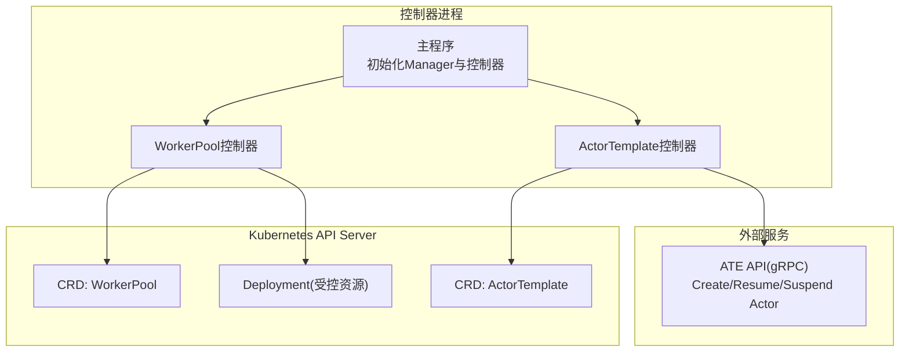
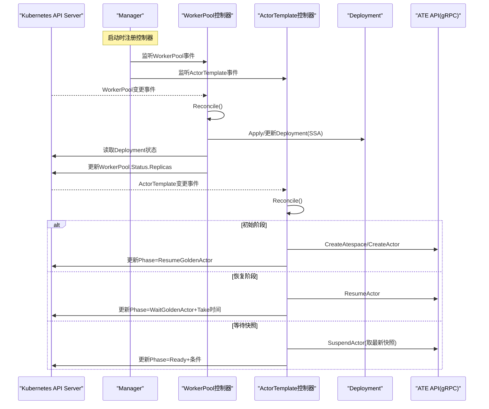
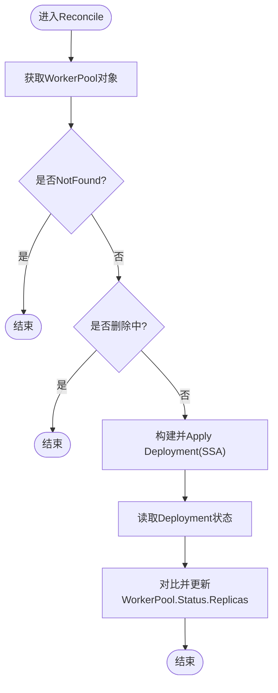
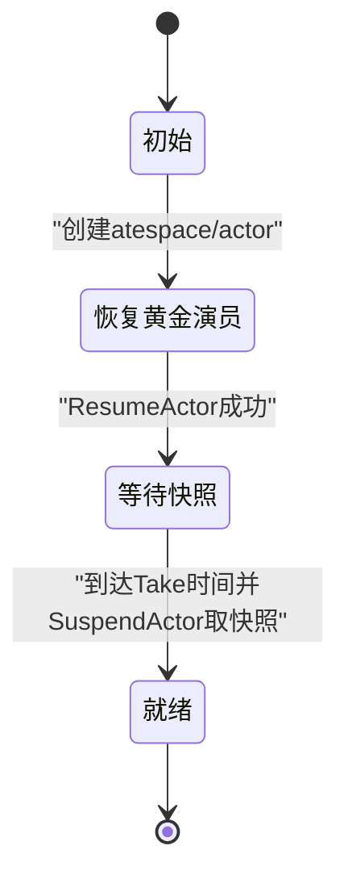
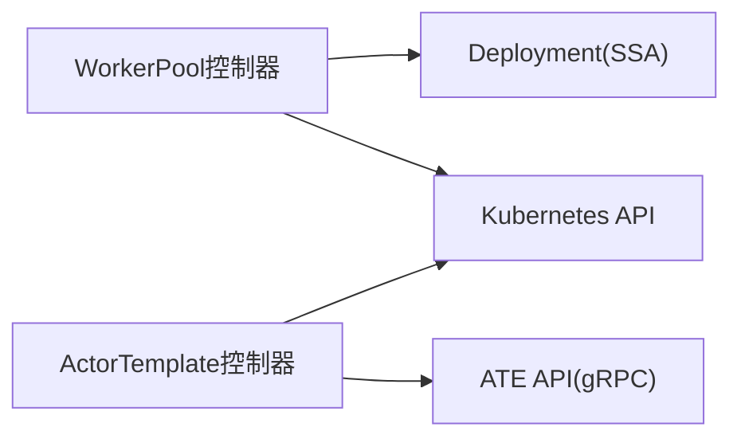

# Controller-Runtime集成

<cite>
**本文引用的文件**   
- [cmd/atecontroller/main.go](file://cmd/atecontroller/main.go)
- [cmd/atecontroller/internal/controllers/workerpool_controller.go](file://cmd/atecontroller/internal/controllers/workerpool_controller.go)
- [cmd/atecontroller/internal/controllers/workerpool_apply.go](file://cmd/atecontroller/internal/controllers/workerpool_apply.go)
- [cmd/atecontroller/internal/controllers/actortemplate_controller.go](file://cmd/atecontroller/internal/controllers/actortemplate_controller.go)
- [pkg/api/v1alpha1/workerpool_types.go](file://pkg/api/v1alpha1/workerpool_types.go)
- [pkg/api/v1alpha1/actortemplate_types.go](file://pkg/api/v1alpha1/actortemplate_types.go)
- [internal/resources/actor.go](file://internal/resources/actor.go)
</cite>

## 目录
1. [简介](#简介)
2. [项目结构](#项目结构)
3. [核心组件](#核心组件)
4. [架构总览](#架构总览)
5. [详细组件分析](#详细组件分析)
6. [依赖关系分析](#依赖关系分析)
7. [性能与可扩展性](#性能与可扩展性)
8. [故障排查指南](#故障排查指南)
9. [结论](#结论)
10. [附录：控制器扩展与自定义指南](#附录控制器扩展与自定义指南)

## 简介
本文件面向基于Controller-Runtime的Agent Substrate控制器实现，聚焦以下目标：
- 说明控制器的设计模式、事件处理机制和资源同步策略
- 深入解析WorkerPool与ActorTemplate两个控制器的Reconcile循环、状态管理与错误处理
- 提供控制器扩展与自定义的实践指南

## 项目结构
本项目采用“按功能域组织”的结构。与控制器相关的核心代码位于：
- cmd/atecontroller：控制器入口与控制器实现
- pkg/api/v1alpha1：CRD类型定义（WorkerPool、ActorTemplate）
- internal/resources：共享资源常量与工具

图表来源
- [cmd/atecontroller/main.go:82-105](file://cmd/atecontroller/main.go#L82-L105)
- [cmd/atecontroller/internal/controllers/workerpool_controller.go:115-120](file://cmd/atecontroller/internal/controllers/workerpool_controller.go#L115-L120)
- [cmd/atecontroller/internal/controllers/actortemplate_controller.go:190-193](file://cmd/atecontroller/internal/controllers/actortemplate_controller.go#L190-L193)

章节来源
- [cmd/atecontroller/main.go:48-105](file://cmd/atecontroller/main.go#L48-L105)

## 核心组件
- WorkerPool控制器：负责将WorkerPool的期望副本数与调度配置应用到Kubernetes Deployment，并同步状态到WorkerPool.Status.Replicas。
- ActorTemplate控制器：负责为每个模板创建并维护一个“黄金演员”，通过ATE API完成生命周期管理（创建、恢复、挂起取快照），并将最终就绪状态写入Status。

章节来源
- [cmd/atecontroller/internal/controllers/workerpool_controller.go:35-71](file://cmd/atecontroller/internal/controllers/workerpool_controller.go#L35-L71)
- [cmd/atecontroller/internal/controllers/actortemplate_controller.go:48-88](file://cmd/atecontroller/internal/controllers/actortemplate_controller.go#L48-L88)
- [pkg/api/v1alpha1/workerpool_types.go:98-136](file://pkg/api/v1alpha1/workerpool_types.go#L98-L136)
- [pkg/api/v1alpha1/actortemplate_types.go:357-390](file://pkg/api/v1alpha1/actortemplate_types.go#L357-L390)

## 架构总览
下图展示了控制器与Kubernetes及ATE API之间的交互关系。

图表来源
- [cmd/atecontroller/main.go:82-105](file://cmd/atecontroller/main.go#L82-L105)
- [cmd/atecontroller/internal/controllers/workerpool_controller.go:47-90](file://cmd/atecontroller/internal/controllers/workerpool_controller.go#L47-L90)
- [cmd/atecontroller/internal/controllers/actortemplate_controller.go:66-187](file://cmd/atecontroller/internal/controllers/actortemplate_controller.go#L66-L187)

## 详细组件分析

### WorkerPool控制器
- 职责
  - 根据WorkerPool.Spec生成并应用Deployment（使用SSA FieldOwner与ForceOwnership确保幂等与冲突解决）
  - 从Deployment.Status.Replicas同步回WorkerPool.Status.Replicas
- 事件处理
  - For(&WorkerPool{}) + Owns(&Deployment{})：当WorkerPool或其拥有的Deployment变化时触发Reconcile
- 状态管理
  - 仅更新status子资源；使用语义相等比较避免无意义写
- 错误处理
  - Get失败且NotFound则忽略；其他错误返回以触发重试
  - Apply/Update失败返回错误，由框架进行退避重入

图表来源
- [cmd/atecontroller/internal/controllers/workerpool_controller.go:47-112](file://cmd/atecontroller/internal/controllers/workerpool_controller.go#L47-L112)
- [cmd/atecontroller/internal/controllers/workerpool_apply.go:27-83](file://cmd/atecontroller/internal/controllers/workerpool_apply.go#L27-L83)

章节来源
- [cmd/atecontroller/internal/controllers/workerpool_controller.go:35-121](file://cmd/atecontroller/internal/controllers/workerpool_controller.go#L35-L121)
- [cmd/atecontroller/internal/controllers/workerpool_apply.go:27-166](file://cmd/atecontroller/internal/controllers/workerpool_apply.go#L27-L166)
- [pkg/api/v1alpha1/workerpool_types.go:54-96](file://pkg/api/v1alpha1/workerpool_types.go#L54-L96)

### 关键实现要点
- SSA字段所有权：通过client.FieldOwner与client.ForceOwnership保证控制器对受管字段拥有权，避免与其他控制器或手动修改冲突
- 微VM沙箱类适配：当SandboxClass为microvm时，自动注入/dev/kvm挂载与节点选择器/污点容忍，确保调度到具备KVM能力的节点
- Pod模板合并：用户可配置的NodeSelector/Tolerations/PriorityClassName/Affinity/Resources与系统默认值合并，不覆盖用户显式设置

章节来源
- [cmd/atecontroller/internal/controllers/workerpool_apply.go:85-130](file://cmd/atecontroller/internal/controllers/workerpool_apply.go#L85-L130)
- [cmd/atecontroller/internal/controllers/workerpool_apply.go:132-166](file://cmd/atecontroller/internal/controllers/workerpool_apply.go#L132-L166)

### ActorTemplate控制器
- 职责
  - 为每个ActorTemplate在专用atespace中创建“黄金演员”，并通过恢复与挂起流程生成“黄金快照”
  - 将模板的最终就绪状态写入Status.Phase与Conditions
- 事件处理
  - For(&ActorTemplate{})：仅监听自身变更
- 状态机
  - PhaseInitial → PhaseResumeGoldenActor → PhaseWaitGoldenActor → PhaseReady
  - 在PhaseWaitGoldenActor中，若未到达TakeGoldenSnapshotAt则延迟重入；到达后调用SuspendActor提取快照URI前缀，并置为Ready
- 错误处理
  - 各阶段对外部gRPC调用失败直接返回错误，交由框架重试
  - 已存在资源（如atespace）按AlreadyExists处理继续推进

图表来源
- [cmd/atecontroller/internal/controllers/actortemplate_controller.go:81-187](file://cmd/atecontroller/internal/controllers/actortemplate_controller.go#L81-L187)

章节来源
- [cmd/atecontroller/internal/controllers/actortemplate_controller.go:48-211](file://cmd/atecontroller/internal/controllers/actortemplate_controller.go#L48-L211)
- [pkg/api/v1alpha1/actortemplate_types.go:21-31](file://pkg/api/v1alpha1/actortemplate_types.go#L21-31)
- [internal/resources/actor.go:29-32](file://internal/resources/actor.go#L29-32)

### 关键实现要点
- 黄金演员命名空间隔离：使用固定系统atespace名称，避免与业务atespace混淆
- 就绪探测与预热：若所有容器均声明Readyz探针，则ResumeActor阻塞至就绪，无需额外预热；否则使用默认预热时长
- 快照内容范围：由ActorTemplateSpec.SnapshotsConfig控制onPause/onCommit的内容范围（Full/Data），影响快照体积与恢复速度

章节来源
- [pkg/api/v1alpha1/actortemplate_types.go:236-276](file://pkg/api/v1alpha1/actortemplate_types.go#L236-L276)
- [cmd/atecontroller/internal/controllers/actortemplate_controller.go:195-210](file://cmd/atecontroller/internal/controllers/actortemplate_controller.go#L195-L210)

## 依赖关系分析
- 控制器与CRD
  - WorkerPool控制器依赖apps/v1.Deployment作为受控资源
  - ActorTemplate控制器依赖ATE API gRPC客户端
- 外部依赖
  - ATE API用于黄金演员的创建、恢复与挂起（取快照）
  - Kubernetes Client-Go ApplyConfiguration用于构造SSA Apply请求

图表来源
- [cmd/atecontroller/internal/controllers/workerpool_controller.go:115-120](file://cmd/atecontroller/internal/controllers/workerpool_controller.go#L115-L120)
- [cmd/atecontroller/internal/controllers/actortemplate_controller.go:190-193](file://cmd/atecontroller/internal/controllers/actortemplate_controller.go#L190-L193)

章节来源
- [cmd/atecontroller/main.go:82-105](file://cmd/atecontroller/main.go#L82-L105)

## 性能与可扩展性
- 事件驱动与最小化写操作
  - WorkerPool仅在状态差异时更新status，减少不必要的API写
  - 使用SSA与FieldOwner降低并发冲突导致的重试风暴
- 延迟重入
  - ActorTemplate在等待快照时使用RequeueAfter精确控制重入时间，避免忙轮询
- 资源形状自适应
  - microvm沙箱类自动注入设备与调度约束，便于横向扩展不同运行时族

[本节为通用指导，不涉及具体文件分析]

## 故障排查指南
- WorkerPool未创建Deployment
  - 检查控制器日志中的Apply错误；确认FieldOwner与权限
  - 验证WorkerPool.Spec.Replicas与镜像字段是否合法
- WorkerPool副本数不一致
  - 确认是否存在外部修改Deployment.spec.replicas；控制器会强制回收
  - 观察WorkerPool.Status.Replicas是否与Deployment一致
- ActorTemplate长期停留在PhaseWaitGoldenActor
  - 检查是否有容器未声明Readyz探针导致预热等待
  - 查看SuspendActor调用是否成功并返回外部快照信息
- ATE API连接问题
  - 校验mTLS/JWT认证参数与服务端证书域名匹配
  - 确认网络可达性与DNS解析

章节来源
- [cmd/atecontroller/internal/controllers/workerpool_controller.go:65-71](file://cmd/atecontroller/internal/controllers/workerpool_controller.go#L65-L71)
- [cmd/atecontroller/internal/controllers/actortemplate_controller.go:146-187](file://cmd/atecontroller/internal/controllers/actortemplate_controller.go#L146-L187)
- [cmd/atecontroller/main.go:57-78](file://cmd/atecontroller/main.go#L57-L78)

## 结论
本实现基于Controller-Runtime的标准模式，结合SSA与状态机驱动，实现了稳定的资源同步与跨服务协作。WorkerPool控制器专注于声明式部署与状态同步；ActorTemplate控制器通过黄金演员与快照机制，为上层工作负载提供一致的启动基线。整体设计具备良好的可扩展性与可观测性基础。

[本节为总结性内容，不涉及具体文件分析]

## 附录：控制器扩展与自定义指南
- 新增自定义控制器
  - 在main中注册新控制器实例并SetupWithManager
  - 定义新的Reconciler结构体，实现Reconcile方法与SetupWithManager
  - 如需监听多资源，使用Owns/ Watches组合
- 事件处理最佳实践
  - 优先使用For+Owns建立强关联；弱关联使用Watches
  - 使用logr上下文记录结构化日志，便于追踪
- 状态管理建议
  - 使用Status子资源承载观测态；使用条件数组表达复杂状态
  - 使用语义相等比较避免无意义更新
- 错误处理与重试
  - 区分可重试与不可重试错误；必要时返回Result{RequeueAfter: ...}
  - 对于外部依赖失败，尽量包装错误信息以便定位
- 安全与权限
  - 使用RBAC注释声明所需权限
  - 谨慎使用特权容器与主机路径挂载，遵循最小权限原则

章节来源
- [cmd/atecontroller/main.go:90-105](file://cmd/atecontroller/main.go#L90-L105)
- [cmd/atecontroller/internal/controllers/workerpool_controller.go:40-44](file://cmd/atecontroller/internal/controllers/workerpool_controller.go#L40-L44)
- [cmd/atecontroller/internal/controllers/actortemplate_controller.go:55-62](file://cmd/atecontroller/internal/controllers/actortemplate_controller.go#L55-L62)
