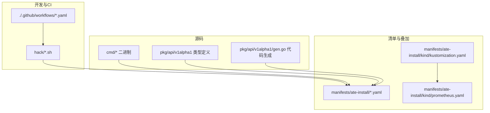
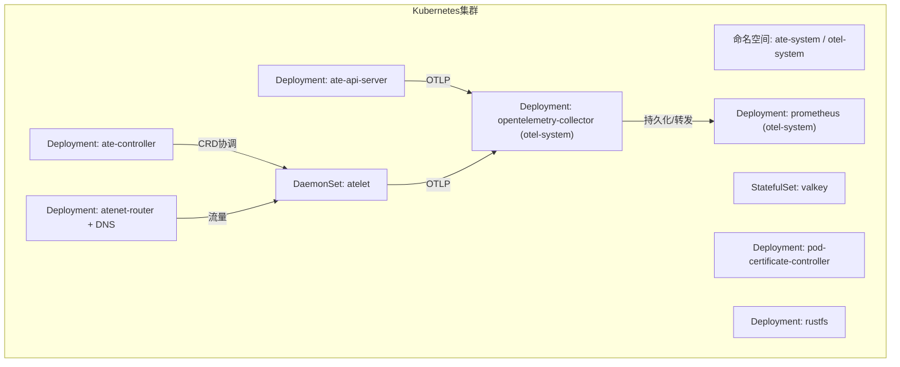
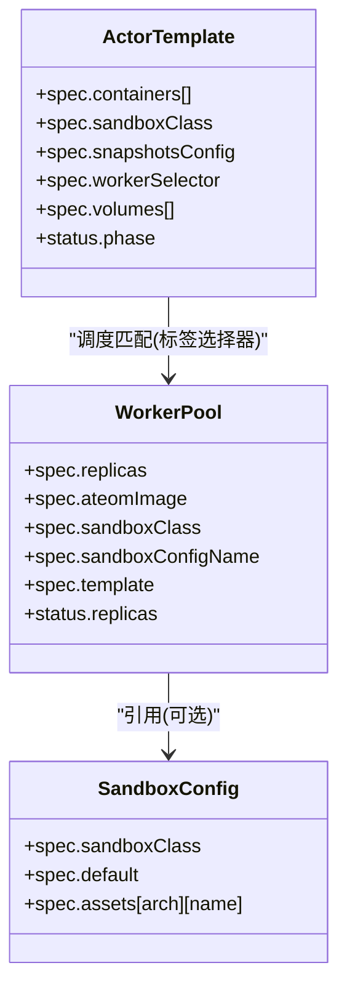
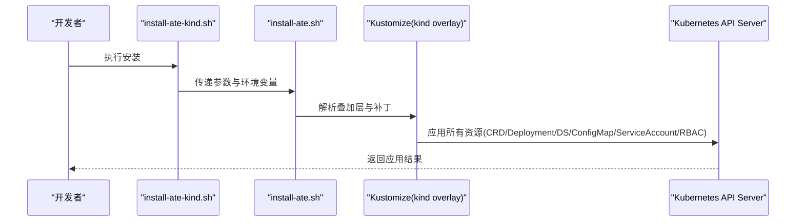
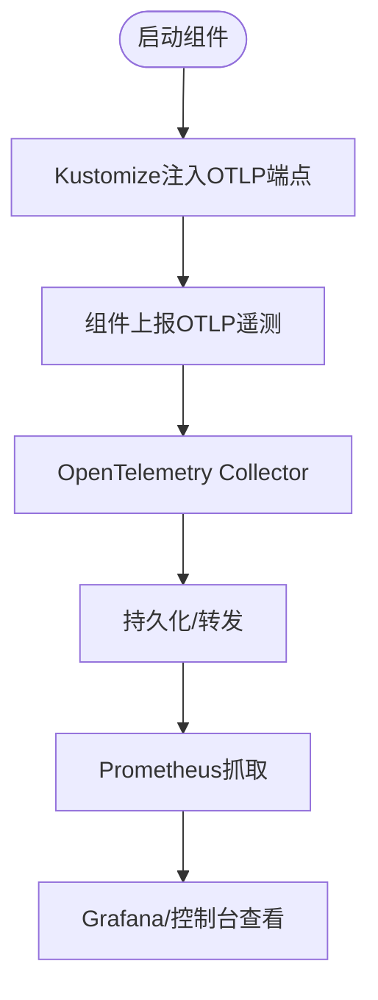
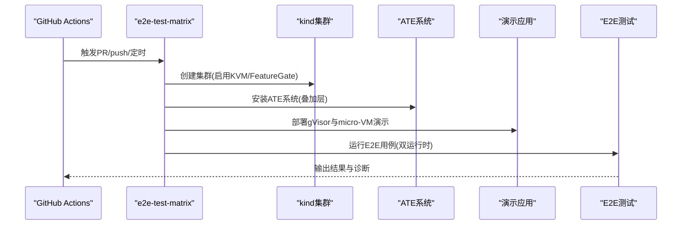
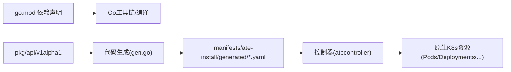

# Kubernetes生态系统集成

<cite>
**本文引用的文件**   
- [README.md](file://README.md)
- [go.mod](file://go.mod)
- [AGENTS.md](file://AGENTS.md)
- [pr-workflow.yaml](file://.github/workflows/pr-workflow.yaml)
- [create-kind-cluster.sh](file://hack/create-kind-cluster.sh)
- [install-ate-kind.sh](file://hack/install-ate-kind.sh)
- [kustomization.yaml](file://manifests/ate-install/kind/kustomization.yaml)
- [prometheus.yaml](file://manifests/ate-install/kind/prometheus.yaml)
- [actortemplates CRD](file://manifests/ate-install/generated/ate.dev_actortemplates.yaml)
- [workerpools CRD](file://manifests/ate-install/generated/ate.dev_workerpools.yaml)
- [sandboxconfigs CRD](file://manifests/ate-install/generated/ate.dev_sandboxconfigs.yaml)
- [actortemplate_types.go](file://pkg/api/v1alpha1/actortemplate_types.go)
- [workerpool_types.go](file://pkg/api/v1alpha1/workerpool_types.go)
- [sandboxconfig_types.go](file://pkg/api/v1alpha1/sandboxconfig_types.go)
- [gen.go](file://pkg/api/v1alpha1/gen.go)
</cite>

## 目录
1. [简介](#简介)
2. [项目结构](#项目结构)
3. [核心组件](#核心组件)
4. [架构总览](#架构总览)
5. [详细组件分析](#详细组件分析)
6. [依赖关系分析](#依赖关系分析)
7. [性能与可扩展性](#性能与可扩展性)
8. [故障排查指南](#故障排查指南)
9. [结论](#结论)
10. [附录](#附录)

## 简介
本文件面向希望在现有Kubernetes生态中集成Agent Substrate的工程师，系统性说明以下方面：
- 与Kubernetes生态的无缝集成方式（CRD、控制器、网络与可观测性）
- 部署方式（Kustomize叠加、脚本化安装；Helm适配建议）
- Operator模式实现（基于controller-runtime的自定义资源控制循环）
- CI/CD流水线集成（自动化测试、构建与部署）
- 监控集成（Prometheus抓取配置、OpenTelemetry导出）
- 与现有Kubernetes工具链的兼容性与迁移建议

## 项目结构
仓库采用“多二进制+分层包”的组织方式：
- cmd：各独立二进制入口（如 ateapi、atelet、atenet、atecontroller等）
- pkg：对外暴露的API类型定义与客户端生成代码
- manifests：Kubernetes清单与Kustomize叠加层
- hack：开发/CI脚本（创建kind集群、安装系统、运行E2E等）
- .github/workflows：GitHub Actions工作流

图表来源
- [gen.go:15-20](file://pkg/api/v1alpha1/gen.go#L15-L20)
- [kustomization.yaml:15-29](file://manifests/ate-install/kind/kustomization.yaml#L15-L29)
- [prometheus.yaml:15-29](file://manifests/ate-install/kind/prometheus.yaml#L15-L29)

章节来源
- [AGENTS.md:12-24](file://AGENTS.md#L12-L24)
- [README.md:211-225](file://README.md#L211-L225)

## 核心组件
- 自定义资源定义（CRD）
  - ActorTemplate：描述要运行的容器镜像、沙箱类、快照策略、卷挂载与调度选择器
  - WorkerPool：声明Worker Pod副本数、运行时类、SandboxConfig引用与Pod模板
  - SandboxConfig：按沙箱族（gvisor/microvm）声明下载资产（二进制/内核/固件）及默认配置
- 控制器与API服务
  - atecontroller：基于controller-runtime监听并协调上述CRD，驱动实际Pod等资源
  - ateapi：提供gRPC API管理Actor生命周期
  - atenet：DNS与路由（含Envoy侧车），负责流量接入与转发
  - atelet：节点级守护进程，负责快照、状态转移与沙箱资产拉取
- 可观测性
  - OpenTelemetry Collector：接收OTLP遥测数据
  - Prometheus：通过ServiceMonitor或注解发现目标，采集指标

章节来源
- [actortemplate_types.go:278-340](file://pkg/api/v1alpha1/actortemplate_types.go#L278-L340)
- [workerpool_types.go:54-89](file://pkg/api/v1alpha1/workerpool_types.go#L54-L89)
- [sandboxconfig_types.go:52-79](file://pkg/api/v1alpha1/sandboxconfig_types.go#L52-L79)
- [README.md:211-225](file://README.md#L211-L225)

## 架构总览
下图展示了在Kind环境中，使用Kustomize叠加部署的系统组件与监控栈。

图表来源
- [kustomization.yaml:18-28](file://manifests/ate-install/kind/kustomization.yaml#L18-L28)
- [prometheus.yaml:111-205](file://manifests/ate-install/kind/prometheus.yaml#L111-L205)

## 详细组件分析

### 自定义资源定义（CRD）与Operator模式
- 生成机制
  - 通过go generate调用controller-gen生成CRD YAML到manifests/ate-install/generated/
  - 同时生成clientset/lister/informer供控制器使用
- 关键CRD
  - actortemplates.ate.dev：命名空间作用域，包含容器定义、沙箱类、快照策略、卷与调度选择器等
  - workerpools.ate.dev：命名空间作用域，声明副本、AteomImage、SandboxClass、SandboxConfigName与Pod模板
  - sandboxconfigs.ate.dev：集群作用域，按沙箱族声明assets与默认标记
- Operator行为
  - 控制器监听CRD变更，将期望状态收敛为实际的Pod/Deployment/DaemonSet等原生资源
  - 支持scale子资源（WorkerPool）以动态扩缩容

图表来源
- [actortemplate_types.go:278-340](file://pkg/api/v1alpha1/actortemplate_types.go#L278-L340)
- [workerpool_types.go:54-89](file://pkg/api/v1alpha1/workerpool_types.go#L54-L89)
- [sandboxconfig_types.go:52-79](file://pkg/api/v1alpha1/sandboxconfig_types.go#L52-L79)
- [gen.go:17-20](file://pkg/api/v1alpha1/gen.go#L17-L20)

章节来源
- [actortemplate_types.go:278-340](file://pkg/api/v1alpha1/actortemplate_types.go#L278-L340)
- [workerpool_types.go:54-89](file://pkg/api/v1alpha1/workerpool_types.go#L54-L89)
- [sandboxconfig_types.go:52-79](file://pkg/api/v1alpha1/sandboxconfig_types.go#L52-L79)
- [gen.go:17-20](file://pkg/api/v1alpha1/gen.go#L17-L20)

### 部署与安装（Kustomize与脚本）
- Kind环境一键安装
  - create-kind-cluster.sh：创建本地registry、启用必要FeatureGate、按需挂载/dev/kvm并打标签
  - install-ate-kind.sh：设置KO_DOCKER_REPO、平台、叠加层开关等环境变量后调用主安装脚本
- Kustomize叠加
  - kind/kustomization.yaml聚合核心组件与监控（OpenTelemetry、Prometheus），并通过patches注入OTLP端点
- 生产环境建议
  - 可将Kustomize叠加层转换为Helm Chart（values覆盖镜像、资源、探针、存储后端等）
  - 推荐将CRD与应用资源拆分为Chart子模块，便于版本管理与回滚

图表来源
- [install-ate-kind.sh:17-39](file://hack/install-ate-kind.sh#L17-L39)
- [create-kind-cluster.sh:60-92](file://hack/create-kind-cluster.sh#L60-L92)
- [kustomization.yaml:18-28](file://manifests/ate-install/kind/kustomization.yaml#L18-L28)

章节来源
- [install-ate-kind.sh:17-39](file://hack/install-ate-kind.sh#L17-L39)
- [create-kind-cluster.sh:60-92](file://hack/create-kind-cluster.sh#L60-L92)
- [kustomization.yaml:18-28](file://manifests/ate-install/kind/kustomization.yaml#L18-L28)

### 监控与可观测性（Prometheus与OpenTelemetry）
- OpenTelemetry
  - 通过Kustomize patches向ate-api-server与atelet注入OTLP端点环境变量
  - 由opentelemetry-collector收集并转发
- Prometheus
  - 使用ServiceAccount/ClusterRole/RoleBinding授权访问Pod元数据
  - ConfigMap定义scrape_configs，基于Pod注解自动发现ate-system与otel-system中的指标端点
  - 提供Deployment与Service暴露Web UI

图表来源
- [kustomization.yaml:31-59](file://manifests/ate-install/kind/kustomization.yaml#L31-L59)
- [prometheus.yaml:59-110](file://manifests/ate-install/kind/prometheus.yaml#L59-L110)
- [prometheus.yaml:111-205](file://manifests/ate-install/kind/prometheus.yaml#L111-L205)

章节来源
- [kustomization.yaml:31-59](file://manifests/ate-install/kind/kustomization.yaml#L31-L59)
- [prometheus.yaml:59-110](file://manifests/ate-install/kind/prometheus.yaml#L59-L110)
- [prometheus.yaml:111-205](file://manifests/ate-install/kind/prometheus.yaml#L111-L205)

### CI/CD流水线集成（GitHub Actions）
- 触发条件
  - PR、main分支push、定时任务（保持微虚拟机资产缓存预热）
- 主要作业
  - run-tests：单元测试与verify-all校验
  - e2e-test-matrix：并行矩阵（mtls/jwt认证模式），创建kind集群、安装ATE、部署gVisor与micro-VM演示、运行E2E套件
  - e2e-test：汇总矩阵结果
- 关键能力
  - 缓存micro-VM资产（virtiofsd等）加速构建
  - 启用/dev/kvm以支持micro-VM运行时
  - 失败时自动dump诊断信息（资源列表与日志）

图表来源
- [pr-workflow.yaml:25-133](file://.github/workflows/pr-workflow.yaml#L25-L133)

章节来源
- [pr-workflow.yaml:25-133](file://.github/workflows/pr-workflow.yaml#L25-L133)

### 与Kubernetes工具链的兼容性
- 版本策略
  - 官方目标：支持最新稳定版与前一个次要版本
- FeatureGate与API
  - Kind脚本显式开启ClusterTrustBundle、ClusterTrustBundleProjection、PodCertificateRequest等特性
  - 启用certificates.k8s.io/v1beta1以兼容pod证书控制器
- 运行时与设备
  - 检测/dev/kvm可用性，按需启用micro-VM（kata + cloud-hypervisor）
  - 为node打标ate.dev/sandboxClass=microvm，配合NodeSelector进行调度
- 网络与存储
  - 启用Proxy ARP以支持gVisor loopback pod-to-pod通信
  - 内置valkey与rustfs作为示例依赖

章节来源
- [README.md:69-72](file://README.md#L69-L72)
- [create-kind-cluster.sh:76-86](file://hack/create-kind-cluster.sh#L76-L86)
- [create-kind-cluster.sh:94-108](file://hack/create-kind-cluster.sh#L94-L108)
- [create-kind-cluster.sh:110-124](file://hack/create-kind-cluster.sh#L110-L124)

## 依赖关系分析
- 外部依赖概览
  - Go标准库与第三方库（见go.mod）
  - Kubernetes生态：client-go、controller-runtime、envtest等
  - 云厂商SDK（GCP/AWS）用于对象存储与IAM等
  - 可观测性：OpenTelemetry、Prometheus客户端
- 内部耦合
  - pkg/api/v1alpha1为所有控制器与CLI共享的类型源
  - manifests/ate-install/generated由类型定义自动生成，避免手工维护不一致
  - hack与.github/workflows强依赖脚本与清单路径约定

图表来源
- [go.mod:1-36](file://go.mod#L1-L36)
- [gen.go:17-20](file://pkg/api/v1alpha1/gen.go#L17-L20)

章节来源
- [go.mod:1-36](file://go.mod#L1-L36)
- [gen.go:17-20](file://pkg/api/v1alpha1/gen.go#L17-L20)

## 性能与可扩展性
- 高并发与低延迟
  - 通过“演员-工作者”复用模型与沙箱快速恢复，降低控制面参与频率
- 弹性伸缩
  - WorkerPool支持scale子资源，结合KEDA/HPA可实现基于指标的自动扩缩容
- 资源隔离
  - gVisor与micro-VM两类沙箱族，满足不同安全与性能需求
- 存储与快照
  - Snapshot策略（Full/Data）与DurableDir卷，平衡恢复速度与一致性

[本节为通用指导，不直接分析具体文件]

## 故障排查指南
- 常见检查点
  - CRD是否成功注册：查看generated目录对应CRD是否已apply
  - 控制器日志：确认Reconcile循环是否正常收敛
  - 节点能力：micro-VM需/dev/kvm且node标签正确
  - 监控可达性：Prometheus是否能抓取Pod指标（检查注解与RBAC）
- 定位手段
  - GitHub Actions失败时自动dump资源与日志
  - 使用kubectl describe查看CRD状态与事件
  - 检查OpenTelemetry Collector与Prometheus健康端点

章节来源
- [pr-workflow.yaml:112-121](file://.github/workflows/pr-workflow.yaml#L112-L121)
- [prometheus.yaml:145-160](file://manifests/ate-install/kind/prometheus.yaml#L145-L160)

## 结论
Agent Substrate通过CRD与控制器实现了与Kubernetes生态的深度集成，借助Kustomize叠加与脚本化安装简化了部署流程，并在CI/CD中提供了端到端的验证闭环。配合OpenTelemetry与Prometheus，形成了完整的可观测体系。对于生产落地，建议将Kustomize叠加层封装为Helm Chart，完善权限最小化、资源配额与滚动升级策略，并结合企业现有的GitOps与发布平台完成持续交付。

[本节为总结性内容，不直接分析具体文件]

## 附录
- 快速开始参考
  - README中的Quickstart与GKE Quickstart步骤
  - demos下的示例应用（counter、sandbox、agent-secret等）
- 术语与概念
  - Actor、WorkerPool、SandboxClass、Snapshot等详见文档区

章节来源
- [README.md:97-158](file://README.md#L97-L158)
- [README.md:195-209](file://README.md#L195-L209)
