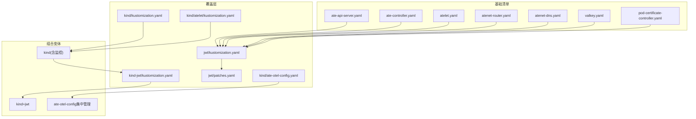
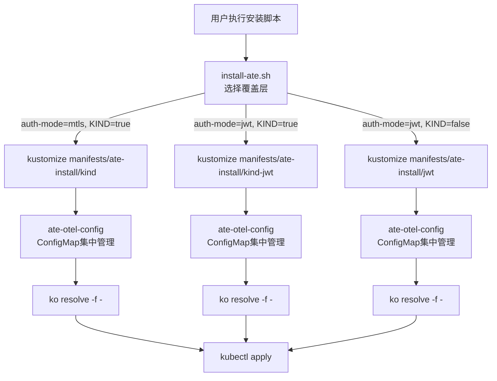
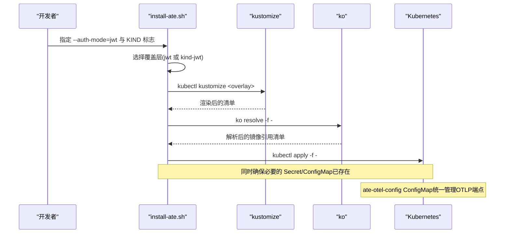
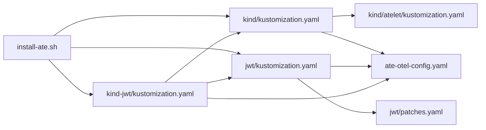

# Kustomize部署配置

<cite>
**本文引用的文件**   
- [README.md](file://README.md)
- [install-ate.sh](file://hack/install-ate.sh)
- [kustomization.yaml（kind）](file://manifests/ate-install/kind/kustomization.yaml)
- [kustomization.yaml（jwt）](file://manifests/ate-install/jwt/kustomization.yaml)
- [kustomization.yaml（kind-jwt）](file://manifests/ate-install/kind-jwt/kustomization.yaml)
- [patches.yaml（jwt覆盖层）](file://manifests/ate-install/jwt/patches.yaml)
- [kustomization.yaml（kind/atelet）](file://manifests/ate-install/kind/atelet/kustomization.yaml)
- [ate-otel-config.yaml](file://manifests/ate-install/kind/ate-otel-config.yaml)
- [main.go（ateapi入口）](file://cmd/ateapi/main.go)
</cite>

## 更新摘要
**所做更改**   
- 更新了OTLP端点配置管理部分，反映通过ate-otel-config ConfigMap集中管理的改进
- 增强了不同环境配置维护的说明
- 更新了架构图以显示新的配置管理流程
- 添加了关于ConfigMap集中管理的故障排查指南

## 目录
1. [简介](#简介)
2. [项目结构](#项目结构)
3. [核心组件](#核心组件)
4. [架构总览](#架构总览)
5. [详细组件分析](#详细组件分析)
6. [依赖关系分析](#依赖关系分析)
7. [性能与可观测性](#性能与可观测性)
8. [故障排查指南](#故障排查指南)
9. [结论](#结论)
10. [附录：常用命令与环境变量](#附录常用命令与环境变量)

## 简介
本文件面向使用 Kustomize 对 Agent Substrate 进行环境化部署的读者，聚焦以下目标：
- 基础配置、覆盖层与变体的组织方式
- kind 集群特定配置要点
- JWT 认证的配置选项与启用流程
- **新增** OTLP端点通过ate-otel-config ConfigMap集中管理的配置改进
- 不同环境的部署策略与最佳实践

## 项目结构
Kustomize 相关资源位于 manifests/ate-install 下，采用"基础清单 + 覆盖层"的组织方式：
- 基础清单：各组件的原始 Deployment/DaemonSet/Service 等定义
- 覆盖层：针对 kind、JWT、监控等场景的 patches 与资源追加
- 组合变体：通过引用其他 kustomization 实现叠加式构建
- **新增** ate-otel-config ConfigMap用于集中管理OTLP端点配置

**图示来源**
- [kustomization.yaml（kind）:1-59](file://manifests/ate-install/kind/kustomization.yaml#L1-L59)
- [kustomization.yaml（jwt）:1-65](file://manifests/ate-install/jwt/kustomization.yaml#L1-L65)
- [patches.yaml（jwt覆盖层）:1-84](file://manifests/ate-install/jwt/patches.yaml#L1-L84)
- [kustomization.yaml（kind/atelet）:1-52](file://manifests/ate-install/kind/atelet/kustomization.yaml#L1-L52)
- [kustomization.yaml（kind-jwt）:1-59](file://manifests/ate-install/kind-jwt/kustomization.yaml#L1-L59)
- [ate-otel-config.yaml](file://manifests/ate-install/kind/ate-otel-config.yaml)

章节来源
- [README.md:97-123](file://README.md#L97-L123)
- [install-ate.sh:147-167](file://hack/install-ate.sh#L147-L167)

## 核心组件
- ate-api-server：控制面 gRPC API 服务，支持 mTLS 与 JWT 两种认证模式
- ate-controller：控制器，协调 WorkerPool/ActorTemplate/SandboxConfig
- atenet-router/dns：网络路由与 DNS 解析
- atelet：节点侧守护进程，负责工作 Pod 生命周期与状态迁移
- valkey：缓存与持久化后端
- pod-certificate-controller：签发 ClusterTrustBundle 等证书能力
- **新增** ate-otel-config ConfigMap：集中管理OTLP端点配置，简化多环境维护

章节来源
- [README.md:215-225](file://README.md#L215-L225)

## 架构总览
下图展示了 Kustomize 在 kind 与 JWT 场景下的渲染与注入路径，以及新增的ate-otel-config集中管理模式。

**图示来源**
- [install-ate.sh:147-167](file://hack/install-ate.sh#L147-L167)
- [kustomization.yaml（kind）:1-59](file://manifests/ate-install/kind/kustomization.yaml#L1-L59)
- [kustomization.yaml（jwt）:1-65](file://manifests/ate-install/jwt/kustomization.yaml#L1-L65)
- [kustomization.yaml（kind-jwt）:1-59](file://manifests/ate-install/kind-jwt/kustomization.yaml#L1-L59)
- [ate-otel-config.yaml](file://manifests/ate-install/kind/ate-otel-config.yaml)

## 详细组件分析

### 基础清单与覆盖层组织
- 基础清单位于 manifests/ate-install 根目录，包含各组件的原始资源定义
- jwt 覆盖层通过 kustomization.yaml 引用基础清单，并以 patches.yaml 和 inline patch 的方式注入 JWT 相关参数与卷挂载
- kind 覆盖层在基础清单之上追加本地存储、监控与 atelet 的本地注册表替换等补丁
- kind-jwt 组合变体以 kind 为基础，再叠加 jwt 的 patches 与参数
- **新增** ate-otel-config ConfigMap提供统一的OTLP端点配置管理

章节来源
- [kustomization.yaml（jwt）:1-65](file://manifests/ate-install/jwt/kustomization.yaml#L1-L65)
- [patches.yaml（jwt覆盖层）:1-84](file://manifests/ate-install/jwt/patches.yaml#L1-L84)
- [kustomization.yaml（kind）:1-59](file://manifests/ate-install/kind/kustomization.yaml#L1-L59)
- [kustomization.yaml（kind-jwt）:1-59](file://manifests/ate-install/kind-jwt/kustomization.yaml#L1-L59)

### kind 集群特定配置
- 为 atelet 设置本地镜像仓库替换与对象存储后端（S3 兼容），并开启 OpenTelemetry 导出端点
- 为 ate-api-server 与 atelet 注入 OTLP 收集器地址
- 引入 rustfs、Prometheus、OpenTelemetry Collector 等资源用于开发与演示
- **新增** 通过ate-otel-config ConfigMap集中管理OTLP端点配置，简化环境差异处理

章节来源
- [kustomization.yaml（kind/atelet）:1-52](file://manifests/ate-install/kind/atelet/kustomization.yaml#L1-L52)
- [kustomization.yaml（kind）:1-59](file://manifests/ate-install/kind/kustomization.yaml#L1-L59)
- [ate-otel-config.yaml](file://manifests/ate-install/kind/ate-otel-config.yaml)

### JWT 认证配置与启用流程
- 通过 --auth-mode=jwt 启用 JWT 认证模式；该模式下每个 RPC 需携带 Kubernetes ServiceAccount Bearer Token
- 安装脚本会根据运行环境自动创建或更新 ate-api-server-envvars ConfigMap，注入 ATE_API_K8SJWT_ISSUER 等环境变量
- JWT 覆盖层会为 ate-controller 与 atenet-router 注入 --ateapi-auth=jwt 与 token 文件路径，并通过 projected volume 挂载 ServiceAccount Token 与 ClusterTrustBundle

**图示来源**
- [install-ate.sh:147-167](file://hack/install-ate.sh#L147-L167)
- [kustomization.yaml（jwt）:1-65](file://manifests/ate-install/jwt/kustomization.yaml#L1-L65)
- [kustomization.yaml（kind-jwt）:1-59](file://manifests/ate-install/kind-jwt/kustomization.yaml#L1-L59)
- [patches.yaml（jwt覆盖层）:1-84](file://manifests/ate-install/jwt/patches.yaml#L1-L84)
- [ate-otel-config.yaml](file://manifests/ate-install/kind/ate-otel-config.yaml)

章节来源
- [main.go（ateapi入口）:70-80](file://cmd/ateapi/main.go#L70-L80)
- [install-ate.sh:230-251](file://hack/install-ate.sh#L230-L251)
- [kustomization.yaml（jwt）:27-65](file://manifests/ate-install/jwt/kustomization.yaml#L27-L65)
- [patches.yaml（jwt覆盖层）:1-84](file://manifests/ate-install/jwt/patches.yaml#L1-L84)

### 不同环境的部署策略
- 本地开发（kind）：使用 manifests/ate-install/kind 覆盖层，启用本地注册表替换、S3 兼容后端与监控栈
- 云原生（GKE）：直接使用基础清单或通过 install-ate.sh 的默认逻辑，结合 IAM 与 OIDC 发现文档
- JWT 模式：在 kind 上可通过 kind-jwt 组合变体一键启用；在非 kind 环境下使用 jwt 覆盖层
- **新增** 所有环境统一通过ate-otel-config ConfigMap管理OTLP端点配置，减少环境差异

章节来源
- [install-ate.sh:147-167](file://hack/install-ate.sh#L147-L167)
- [kustomization.yaml（kind）:1-59](file://manifests/ate-install/kind/kustomization.yaml#L1-L59)
- [kustomization.yaml（jwt）:1-65](file://manifests/ate-install/jwt/kustomization.yaml#L1-L65)
- [kustomization.yaml（kind-jwt）:1-59](file://manifests/ate-install/kind-jwt/kustomization.yaml#L1-L59)

## 依赖关系分析
- 安装脚本根据 auth-mode 与 KIND 标志决定使用的 Kustomize 覆盖层
- kind 覆盖层依赖 atelet 子覆盖层与监控/存储资源
- JWT 覆盖层依赖 patches.yaml 完成卷挂载与参数注入
- kind-jwt 组合变体复用 kind 与 jwt 的能力
- **新增** 所有覆盖层都依赖ate-otel-config ConfigMap进行OTLP端点配置管理

**图示来源**
- [install-ate.sh:147-167](file://hack/install-ate.sh#L147-L167)
- [kustomization.yaml（kind）:1-59](file://manifests/ate-install/kind/kustomization.yaml#L1-L59)
- [kustomization.yaml（jwt）:1-65](file://manifests/ate-install/jwt/kustomization.yaml#L1-L65)
- [kustomization.yaml（kind-jwt）:1-59](file://manifests/ate-install/kind-jwt/kustomization.yaml#L1-L59)
- [kustomization.yaml（kind/atelet）:1-52](file://manifests/ate-install/kind/atelet/kustomization.yaml#L1-L52)
- [patches.yaml（jwt覆盖层）:1-84](file://manifests/ate-install/jwt/patches.yaml#L1-L84)
- [ate-otel-config.yaml](file://manifests/ate-install/kind/ate-otel-config.yaml)

章节来源
- [install-ate.sh:147-167](file://hack/install-ate.sh#L147-L167)

## 性能与可观测性
- kind 覆盖层为 ate-api-server 与 atelet 注入 OpenTelemetry 导出端点，便于采集指标与链路追踪
- Prometheus 与 OpenTelemetry Collector 作为配套资源提供可视化与聚合能力
- **新增** 通过ate-otel-config ConfigMap集中管理OTLP端点配置，提升配置一致性和维护效率

章节来源
- [kustomization.yaml（kind）:1-59](file://manifests/ate-install/kind/kustomization.yaml#L1-L59)
- [ate-otel-config.yaml](file://manifests/ate-install/kind/ate-otel-config.yaml)

## 故障排查指南
- 若启用 JWT 模式后连接失败，检查是否已正确创建 ate-api-server-envvars 并注入 ATE_API_K8SJWT_ISSUER
- 确认 ate-controller 与 atenet-router 的 projected volume 中 ServiceAccount Token 与 ClusterTrustBundle 已就绪
- 在 kind 环境中，确认 atelet 的本地镜像仓库替换与 S3 兼容后端配置正确
- **新增** 检查ate-otel-config ConfigMap是否正确创建且包含有效的OTLP端点配置
- **新增** 验证各组件是否正确引用ate-otel-config ConfigMap中的OTLP端点配置
- **新增** 确认OTLP端点配置在不同环境间保持一致性

章节来源
- [install-ate.sh:230-251](file://hack/install-ate.sh#L230-L251)
- [patches.yaml（jwt覆盖层）:1-84](file://manifests/ate-install/jwt/patches.yaml#L1-L84)
- [kustomization.yaml（kind/atelet）:1-52](file://manifests/ate-install/kind/atelet/kustomization.yaml#L1-L52)
- [ate-otel-config.yaml](file://manifests/ate-install/kind/ate-otel-config.yaml)

## 结论
通过"基础清单 + 覆盖层 + 组合变体"的 Kustomize 组织方式，Agent Substrate 能够以最小成本适配 kind 与云原生环境，并在需要时快速启用 JWT 认证。**新增的ate-otel-config ConfigMap集中管理模式进一步简化了OTLP端点的配置维护，提升了多环境部署的一致性和可维护性**。安装脚本将覆盖层选择与资源渲染自动化，降低运维复杂度。

## 附录：常用命令与环境变量
- 安装系统（默认 mtls）
  - ./hack/install-ate.sh --deploy-ate-system
- 安装系统（JWT 模式）
  - ./hack/install-ate.sh --deploy-ate-system --auth-mode=jwt
- 在 kind 中安装系统（默认 mtls）
  - export ATE_INSTALL_KIND=true && ./hack/install-ate.sh --deploy-ate-system
- 在 kind 中安装系统（JWT 模式）
  - export ATE_INSTALL_KIND=true && ./hack/install-ate.sh --deploy-ate-system --auth-mode=jwt

关键环境变量（由安装脚本写入 ConfigMap 并被 ate-api-server 读取）
- ATE_API_REDIS_ADDRESS
- ATE_API_REDIS_USE_IAM_AUTH
- ATE_API_REDIS_TLS_SERVER_NAME
- ATE_API_REDIS_CLIENT_CERT
- ATE_API_K8SJWT_ISSUER

**新增** OTLP端点配置（通过ate-otel-config ConfigMap管理）
- OTEL_EXPORTER_OTLP_ENDPOINT
- OTEL_SERVICE_NAME
- OTEL_RESOURCE_ATTRIBUTES

章节来源
- [install-ate.sh:230-251](file://hack/install-ate.sh#L230-L251)
- [main.go（ateapi入口）:212-228](file://cmd/ateapi/main.go#L212-L228)
- [ate-otel-config.yaml](file://manifests/ate-install/kind/ate-otel-config.yaml)
