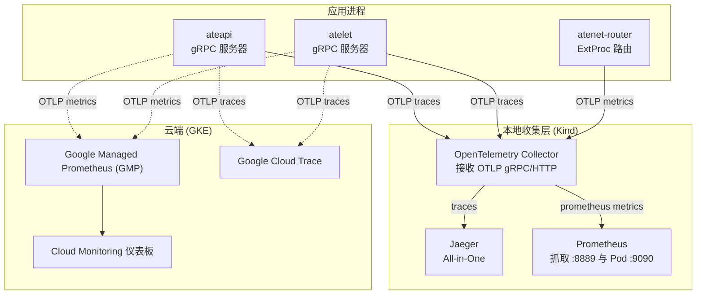
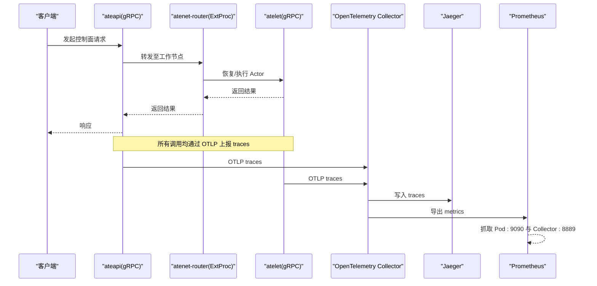
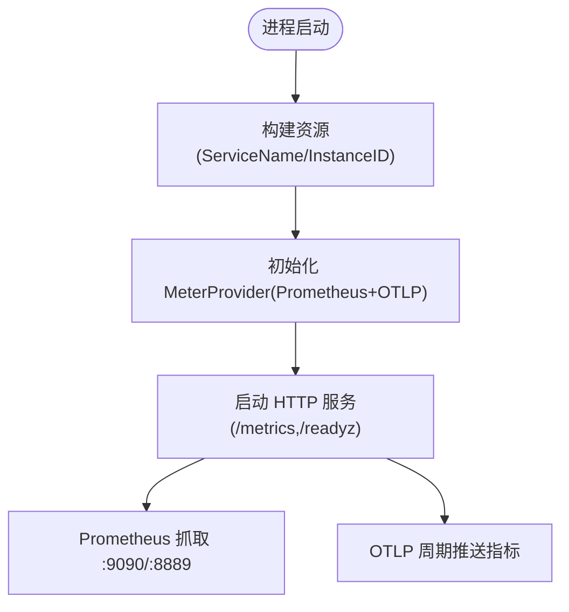
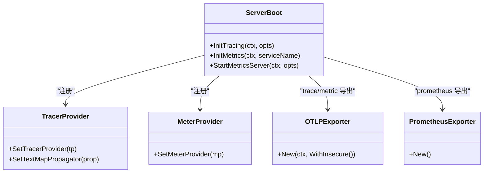
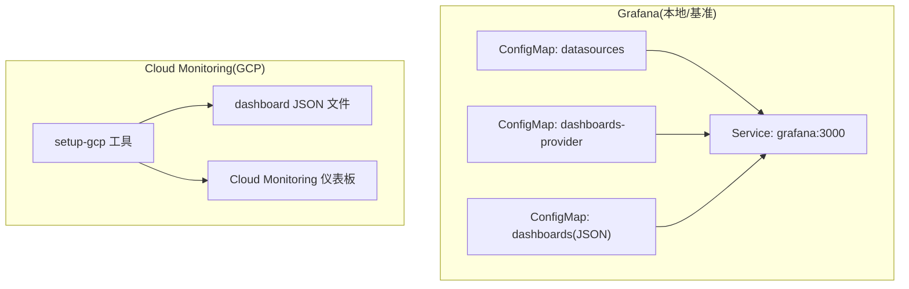
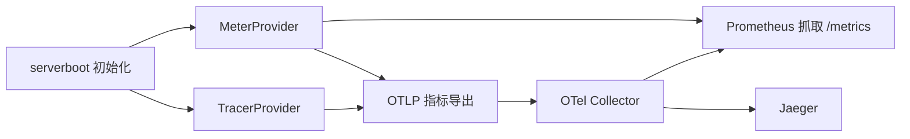

# 监控系统集成

<cite>
**本文引用的文件**   
- [internal/serverboot/serverboot.go](file://internal/serverboot/serverboot.go)
- [cmd/atenet/internal/router/metrics.go](file://cmd/atenet/internal/router/metrics.go)
- [docs/observability.md](file://docs/observability.md)
- [manifests/ate-install/kind/prometheus.yaml](file://manifests/ate-install/kind/prometheus.yaml)
- [manifests/ate-install/kind/otel-collector.yaml](file://manifests/ate-install/kind/otel-collector.yaml)
- [tools/setup-gcp/dashboards/ate-grpc-dashboard.json](file://tools/setup-gcp/dashboards/ate-grpc-dashboard.json)
- [tools/setup-gcp/dashboards/ate-e2e-latency-dashboard.json](file://tools/setup-gcp/dashboards/ate-e2e-latency-dashboard.json)
- [tools/setup-gcp/dashboards/ate-snapshot-dashboard.json](file://tools/setup-gcp/dashboards/ate-snapshot-dashboard.json)
- [tools/setup-gcp/cmd/dashboards.go](file://tools/setup-gcp/cmd/dashboards.go)
- [benchmarking/monitoring.yaml](file://benchmarking/monitoring.yaml)
- [docs/dev/best-practices/tracing.md](file://docs/dev/best-practices/tracing.md)
</cite>

## 目录
1. [简介](#简介)
2. [项目结构](#项目结构)
3. [核心组件](#核心组件)
4. [架构总览](#架构总览)
5. [详细组件分析](#详细组件分析)
6. [依赖关系分析](#依赖关系分析)
7. [性能考虑](#性能考虑)
8. [故障诊断指南](#故障诊断指南)
9. [结论](#结论)
10. [附录](#附录)

## 简介
本文件面向 Agent Substrate 与监控系统的集成，覆盖以下方面：
- Prometheus 指标采集与本地开发环境配置
- OpenTelemetry 分布式追踪（OTLP）端到端链路
- Grafana 仪表板与 Google Cloud Monitoring 仪表板的配置与使用
- 系统暴露的关键指标、告警规则设置建议与性能监控最佳实践
- 监控数据查询示例与常见故障诊断方法

## 项目结构
本项目在 Kind 环境中提供本地可观测性栈（OpenTelemetry Collector + Jaeger + Prometheus），并在 GKE 环境中将遥测数据导出到 Google Managed Prometheus 和 Google Cloud Trace。关键路径包括：
- 服务启动时初始化 TracerProvider 与 MeterProvider，并暴露 /metrics 供 Prometheus 抓取
- atenet-router 自定义指标用于路由延迟
- 本地通过 OTel Collector 转发 traces 到 Jaeger，metrics 以 Prometheus exporter 形式暴露
- GCP 侧通过 setup-gcp 工具创建 Cloud Monitoring 仪表板

图表来源
- [internal/serverboot/serverboot.go:121-147](file://internal/serverboot/serverboot.go#L121-L147)
- [manifests/ate-install/kind/otel-collector.yaml:26-54](file://manifests/ate-install/kind/otel-collector.yaml#L26-L54)
- [manifests/ate-install/kind/prometheus.yaml:64-110](file://manifests/ate-install/kind/prometheus.yaml#L64-L110)
- [docs/observability.md:170-182](file://docs/observability.md#L170-L182)

章节来源
- [docs/observability.md:103-182](file://docs/observability.md#L103-L182)
- [manifests/ate-install/kind/otel-collector.yaml:1-163](file://manifests/ate-install/kind/otel-collector.yaml#L1-L163)
- [manifests/ate-install/kind/prometheus.yaml:1-205](file://manifests/ate-install/kind/prometheus.yaml#L1-L205)

## 核心组件
- 统一的可观测性初始化
  - 通过统一的 serverboot 包初始化日志、TracerProvider、MeterProvider，并暴露 /metrics 与可选 /readyz
  - 支持同时向 Prometheus 与 OTLP 后端导出指标；Trace 通过 OTLP gRPC 导出
- 自定义指标
  - atenet-router 定义并记录路由阶段延迟直方图指标
- 本地与云端后端差异
  - Kind：本地 OTel Collector + Jaeger + Prometheus
  - GKE：Google Managed Prometheus + Google Cloud Trace + Cloud Monitoring 仪表板

章节来源
- [internal/serverboot/serverboot.go:121-147](file://internal/serverboot/serverboot.go#L121-L147)
- [internal/serverboot/serverboot.go:176-192](file://internal/serverboot/serverboot.go#L176-L192)
- [cmd/atenet/internal/router/metrics.go:24-51](file://cmd/atenet/internal/router/metrics.go#L24-L51)
- [docs/observability.md:103-182](file://docs/observability.md#L103-L182)

## 架构总览
下图展示了从服务到收集器再到可视化的完整链路，以及本地与云端的差异。

图表来源
- [internal/serverboot/serverboot.go:91-119](file://internal/serverboot/serverboot.go#L91-L119)
- [manifests/ate-install/kind/otel-collector.yaml:26-54](file://manifests/ate-install/kind/otel-collector.yaml#L26-L54)
- [manifests/ate-install/kind/prometheus.yaml:64-110](file://manifests/ate-install/kind/prometheus.yaml#L64-L110)

## 详细组件分析

### 指标采集与导出（Prometheus + OTLP）
- 指标提供者
  - 通过 InitMetrics 注册全局 MeterProvider，包含：
    - Prometheus reader（由 StartMetricsServer 的 /metrics 暴露）
    - OTLP periodic reader（周期性推送至 OTLP 后端）
- 指标服务端点
  - 默认监听地址可通过参数配置，对外暴露 /metrics 供 Prometheus 抓取
- 关键指标
  - rpc.server.call.duration（gRPC 服务器延迟直方图，按方法与状态码维度）
  - atenet.router.route.duration（路由器阶段延迟直方图）
  - atelet.snapshot.size（快照大小直方图）

图表来源
- [internal/serverboot/serverboot.go:121-147](file://internal/serverboot/serverboot.go#L121-L147)
- [internal/serverboot/serverboot.go:176-192](file://internal/serverboot/serverboot.go#L176-L192)

章节来源
- [internal/serverboot/serverboot.go:121-147](file://internal/serverboot/serverboot.go#L121-L147)
- [internal/serverboot/serverboot.go:176-192](file://internal/serverboot/serverboot.go#L176-L192)
- [cmd/atenet/internal/router/metrics.go:24-51](file://cmd/atenet/internal/router/metrics.go#L24-L51)
- [docs/observability.md:103-134](file://docs/observability.md#L103-L134)

### 分布式追踪（OpenTelemetry + OTLP）
- 追踪提供者
  - 通过 InitTracing 注册全局 TracerProvider，使用 OTLP gRPC 导出，默认不校验 TLS（适配 GKE managed traces）
- 上下文传播
  - 设置 TraceContext 文本映射传播器，gRPC/HTTP 中间件自动注入/提取
- 采样策略
  - 可按服务选择 AlwaysSample 或 NeverSample，配合客户端触发按需追踪
- 本地可视化
  - Kind：OTel Collector -> Jaeger All-in-One
  - GKE：OTel Collector -> Google Cloud Trace

图表来源
- [internal/serverboot/serverboot.go:91-119](file://internal/serverboot/serverboot.go#L91-L119)
- [internal/serverboot/serverboot.go:121-147](file://internal/serverboot/serverboot.go#L121-L147)

章节来源
- [internal/serverboot/serverboot.go:91-119](file://internal/serverboot/serverboot.go#L91-L119)
- [docs/dev/best-practices/tracing.md:28-95](file://docs/dev/best-practices/tracing.md#L28-L95)
- [docs/observability.md:137-166](file://docs/observability.md#L137-L166)

### Grafana 仪表板与 Cloud Monitoring 仪表板
- Grafana（本地/基准测试）
  - 通过 ConfigMap 挂载数据源与仪表板 JSON，部署 Service 暴露 3000 端口
- Cloud Monitoring 仪表板（GKE/GCP）
  - 通过 tools/setup-gcp 工具读取 dashboards JSON 并创建/更新（幂等）
  - 内置仪表板：
    - gRPC 服务器延迟/QPS/错误率
    - 路由与端到端延迟
    - 快照大小与 QPS

图表来源
- [benchmarking/monitoring.yaml:539-573](file://benchmarking/monitoring.yaml#L539-L573)
- [tools/setup-gcp/cmd/dashboards.go:32-102](file://tools/setup-gcp/cmd/dashboards.go#L32-L102)
- [tools/setup-gcp/dashboards/ate-grpc-dashboard.json:1-159](file://tools/setup-gcp/dashboards/ate-grpc-dashboard.json#L1-L159)
- [tools/setup-gcp/dashboards/ate-e2e-latency-dashboard.json:1-217](file://tools/setup-gcp/dashboards/ate-e2e-latency-dashboard.json#L1-L217)
- [tools/setup-gcp/dashboards/ate-snapshot-dashboard.json:1-137](file://tools/setup-gcp/dashboards/ate-snapshot-dashboard.json#L1-L137)

章节来源
- [benchmarking/monitoring.yaml:539-573](file://benchmarking/monitoring.yaml#L539-L573)
- [tools/setup-gcp/cmd/dashboards.go:32-118](file://tools/setup-gcp/cmd/dashboards.go#L32-L118)
- [tools/setup-gcp/dashboards/ate-grpc-dashboard.json:1-159](file://tools/setup-gcp/dashboards/ate-grpc-dashboard.json#L1-L159)
- [tools/setup-gcp/dashboards/ate-e2e-latency-dashboard.json:1-217](file://tools/setup-gcp/dashboards/ate-e2e-latency-dashboard.json#L1-L217)
- [tools/setup-gcp/dashboards/ate-snapshot-dashboard.json:1-137](file://tools/setup-gcp/dashboards/ate-snapshot-dashboard.json#L1-L137)

## 依赖关系分析
- 组件耦合
  - serverboot 为各服务提供统一的 Tracer/Meter 初始化与 /metrics 服务
  - atenet-router 基于全局 MeterProvider 创建自定义直方图指标
  - Prometheus 通过 Kubernetes SD 发现 Pod 并抓取注解指定的 /metrics 与端口
  - OTel Collector 负责汇聚 OTLP 数据并分发至 Jaeger/Prometheus
- 外部依赖
  - Prometheus、Jaeger、OTel Collector 在 Kind 中作为独立 Deployment/Service 运行
  - GKE 环境下对接 Google Managed Prometheus 与 Google Cloud Trace

图表来源
- [internal/serverboot/serverboot.go:91-147](file://internal/serverboot/serverboot.go#L91-L147)
- [manifests/ate-install/kind/otel-collector.yaml:26-54](file://manifests/ate-install/kind/otel-collector.yaml#L26-L54)
- [manifests/ate-install/kind/prometheus.yaml:64-110](file://manifests/ate-install/kind/prometheus.yaml#L64-L110)

章节来源
- [internal/serverboot/serverboot.go:91-147](file://internal/serverboot/serverboot.go#L91-L147)
- [manifests/ate-install/kind/otel-collector.yaml:1-163](file://manifests/ate-install/kind/otel-collector.yaml#L1-L163)
- [manifests/ate-install/kind/prometheus.yaml:1-205](file://manifests/ate-install/kind/prometheus.yaml#L1-L205)

## 性能考虑
- 指标粒度与桶边界
  - 路由延迟直方图已配置细粒度桶边界，便于观察低延迟分布
- 采样策略
  - 生产环境建议按需开启追踪（NeverSample + 客户端触发），避免额外开销
- 存储与保留
  - Kind 下 Prometheus 使用 emptyDir，重启后丢失；生产应使用持久化存储
- 资源限制
  - Prometheus 容器设置了 CPU/内存请求与限制，需根据规模调整

[本节为通用指导，无需代码引用]

## 故障诊断指南
- 指标不可用
  - 确认服务是否启动 /metrics 并监听正确端口
  - 检查 Prometheus 抓取目标状态与 relabel 规则
- 追踪缺失
  - 确认服务已初始化 TracerProvider 并设置 TraceContext 传播器
  - 检查 OTel Collector 是否可达且管道配置正确
- 本地 vs 云端差异
  - Kind 仅 ateapi/atelet 指向本地 collector；atenet-router 仍指向 GKE collector，导致本地无法采集其指标

章节来源
- [internal/serverboot/serverboot.go:176-192](file://internal/serverboot/serverboot.go#L176-L192)
- [manifests/ate-install/kind/prometheus.yaml:64-110](file://manifests/ate-install/kind/prometheus.yaml#L64-L110)
- [manifests/ate-install/kind/otel-collector.yaml:26-54](file://manifests/ate-install/kind/otel-collector.yaml#L26-L54)
- [docs/observability.md:170-182](file://docs/observability.md#L170-L182)

## 结论
Agent Substrate 通过统一的 serverboot 初始化与 OTLP 标准协议，实现了跨环境的可观测性一致性。本地开发可使用 Prometheus/Jaeger 快速验证，生产环境则无缝对接 Google Managed Prometheus 与 Cloud Trace，并通过 setup-gcp 工具管理 Cloud Monitoring 仪表板。结合自定义指标与最佳实践，可有效支撑性能分析与问题定位。

[本节为总结，无需代码引用]

## 附录

### 关键指标清单与说明
- rpc.server.call.duration
  - 类型：直方图
  - 维度：rpc.method、rpc.response.status_code
  - 用途：gRPC 服务器延迟、QPS、错误率
- atenet.router.route.duration
  - 类型：直方图
  - 维度：outcome、actor_template_name 等
  - 用途：路由阶段延迟（不含 Actor 计算与响应）
- atelet.snapshot.size
  - 类型：直方图
  - 维度：kind、actor_template_namespace、actor_template_name
  - 用途：快照镜像大小分布与 QPS

章节来源
- [docs/observability.md:103-134](file://docs/observability.md#L103-L134)
- [cmd/atenet/internal/router/metrics.go:24-51](file://cmd/atenet/internal/router/metrics.go#L24-L51)

### Prometheus 查询示例（本地）
- 查看抓取目标状态
  - up
- 查看 gRPC 延迟分位数（按方法）
  - histogram_quantile(0.99, sum by (le, "rpc.method") (rate({rpc.server.call.duration_bucket}[5m])))
- 查看路由延迟 P99
  - histogram_quantile(0.99, sum by (le) (rate({atenet.router.route.duration_bucket}[5m])))
- 查看快照大小 P99（按模板）
  - histogram_quantile(0.99, sum by (le, actor_template_name) (rate({atelet.snapshot.size_bucket}[1h])))

章节来源
- [docs/observability.md:115-134](file://docs/observability.md#L115-L134)
- [tools/setup-gcp/dashboards/ate-grpc-dashboard.json:1-159](file://tools/setup-gcp/dashboards/ate-grpc-dashboard.json#L1-L159)
- [tools/setup-gcp/dashboards/ate-e2e-latency-dashboard.json:1-217](file://tools/setup-gcp/dashboards/ate-e2e-latency-dashboard.json#L1-L217)
- [tools/setup-gcp/dashboards/ate-snapshot-dashboard.json:1-137](file://tools/setup-gcp/dashboards/ate-snapshot-dashboard.json#L1-L137)

### 告警规则设置建议
- gRPC 错误率上升
  - 条件：非 OK 状态的 rate(rpc.server.call.duration_count) 超过阈值
- 路由延迟升高
  - 条件：atenet.router.route.duration 的 P95/P99 超过阈值
- 快照大小异常增长
  - 条件：atelet.snapshot.size 的 P99 超过阈值
- 注意
  - 当前仓库未包含 Prometheus Alertmanager 规则文件；建议在部署层添加相应 rules 并接入告警通道

[本节为通用建议，无需代码引用]

### 追踪最佳实践要点
- 服务端
  - 初始化 TracerProvider 与 TextMapPropagator
  - gRPC 使用 StatsHandler，HTTP 使用 otelhttp 包装
  - 按需采样（NeverSample + 客户端触发）
- 客户端
  - 初始化 TracerProvider（无导出器）
  - gRPC/HTTP 客户端启用 stats handler/transport wrapper
  - 通过 metadata/headers 注入追踪上下文

章节来源
- [docs/dev/best-practices/tracing.md:28-200](file://docs/dev/best-practices/tracing.md#L28-L200)
