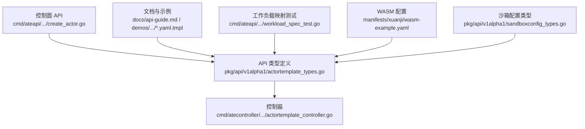
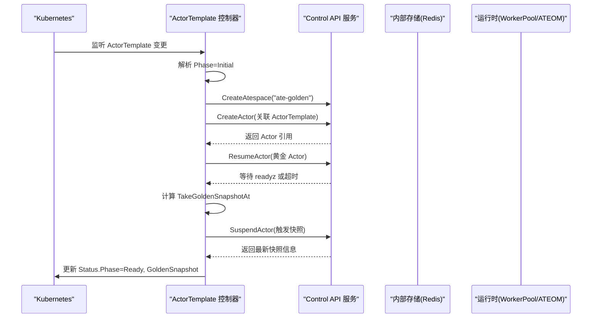
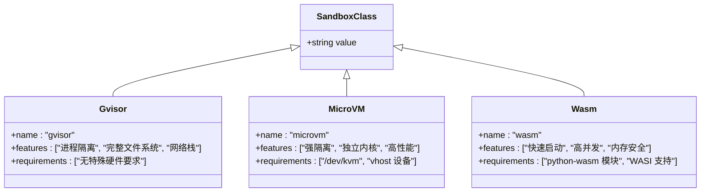
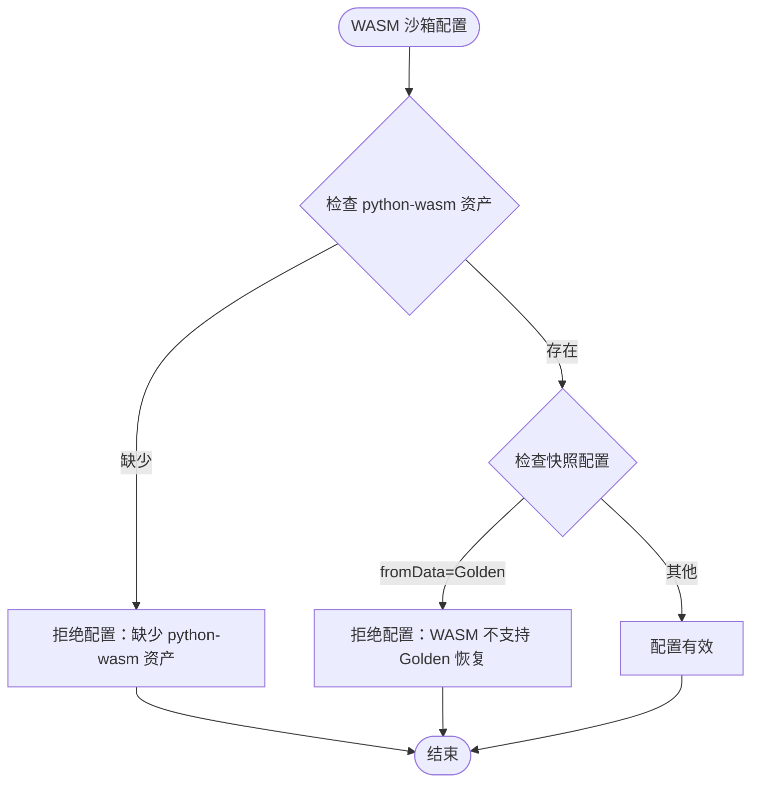
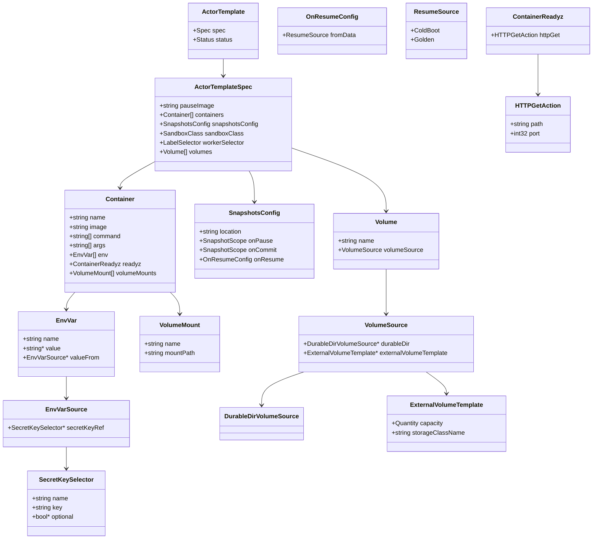
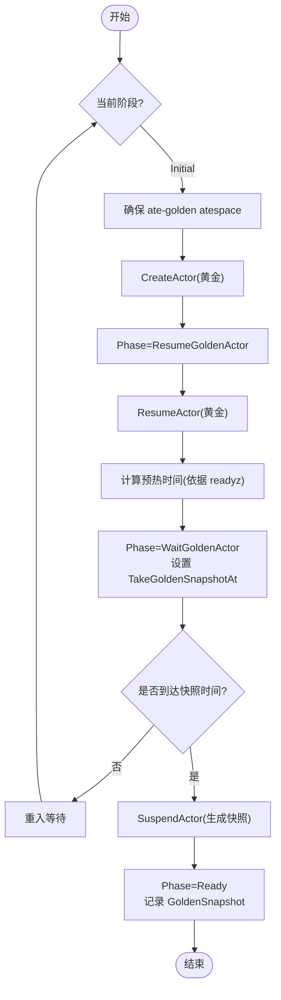
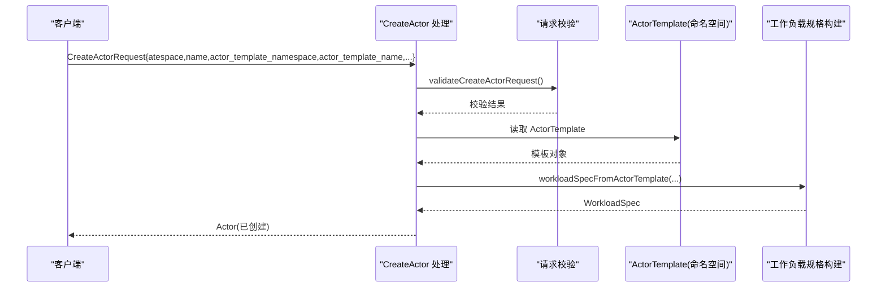
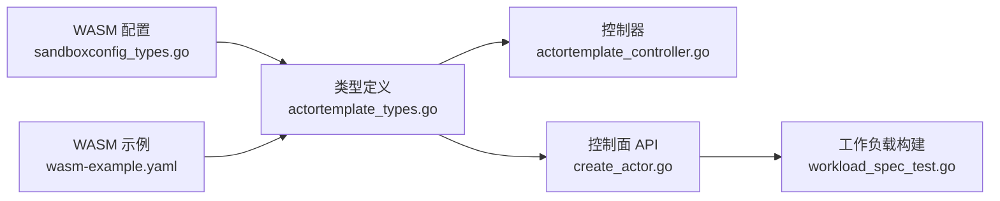

# ActorTemplate资源定义

<cite>
**本文引用的文件**   
- [actortemplate_types.go](file://pkg/api/v1alpha1/actortemplate_types.go)
- [sandboxconfig_types.go](file://pkg/api/v1alpha1/sandboxconfig_types.go)
- [workerpool_types.go](file://pkg/api/v1alpha1/workerpool_types.go)
- [actortemplate_controller.go](file://cmd/atecontroller/internal/controllers/actortemplate_controller.go)
- [create_actor.go](file://cmd/ateapi/internal/controlapi/create_actor.go)
- [workload_spec_test.go](file://cmd/ateapi/internal/controlapi/workload_spec_test.go)
- [wasm-example.yaml](file://manifests/xuanji/wasm-example.yaml)
- [sandboxconfig-validation.yaml](file://manifests/ate-install/sandboxconfig-validation.yaml)
- [api-guide.md](file://docs/api-guide.md)
- [multi-template.yaml.tmpl](file://demos/multi-template/multi-template.yaml.tmpl)
</cite>

## 更新摘要
**变更内容**   
- 新增 WebAssembly (wasm) 沙箱类型支持
- 扩展 SandboxClass 枚举以包含 wasm 选项
- 添加 wasm 特定的验证规则和约束
- 提供 wasm 沙箱的完整示例配置
- 更新相关验证逻辑和测试用例

## 目录
1. [简介](#简介)
2. [项目结构](#项目结构)
3. [核心组件](#核心组件)
4. [架构总览](#架构总览)
5. [详细组件分析](#详细组件分析)
6. [依赖关系分析](#依赖关系分析)
7. [性能与快照特性](#性能与快照特性)
8. [故障排查指南](#故障排查指南)
9. [结论](#结论)
10. [附录：YAML示例与最佳实践](#附录yaml示例与最佳实践)

## 简介
本文件为 ActorTemplate 自定义资源的权威文档，聚焦其结构定义、字段语义、校验规则、控制器生命周期以及使用模式。ActorTemplate 用于描述可复用的工作负载模板，包含容器镜像、环境变量、存储卷挂载、就绪探针、快照策略、沙箱类别与工作池选择等关键配置。**最新扩展**：现在支持三种沙箱类型 - gvisor（默认）、microvm 和 **wasm（WebAssembly）**，其中 wasm 沙箱类型为轻量级替代方案，适用于兼容的工作负载，提供比容器或 microVM 更快的冷启动速度和更高的密度。通过该模板，系统可在 WorkerPool 上创建并运行 Actor（实例），并提供快照与恢复能力。

## 项目结构
围绕 ActorTemplate 的关键代码与文档分布如下：
- 类型定义与校验注解位于 API 包中
- 控制器负责"黄金快照"准备流程
- API 服务在创建 Actor 时引用 ActorTemplate
- 文档与演示提供 YAML 示例与多模板共享 WorkerPool 的用法
- **新增**：WASM 沙箱配置文件和示例



**图表来源**
- [actortemplate_types.go:1-468](file://pkg/api/v1alpha1/actortemplate_types.go#L1-L468)
- [actortemplate_controller.go:1-211](file://cmd/atecontroller/internal/controllers/actortemplate_controller.go#L1-L211)
- [create_actor.go:1-120](file://cmd/ateapi/internal/controlapi/create_actor.go#L1-L120)
- [wasm-example.yaml:1-84](file://manifests/xuanji/wasm-example.yaml#L1-L84)
- [sandboxconfig_types.go:1-124](file://pkg/api/v1alpha1/sandboxconfig_types.go#L1-L124)

章节来源
- [actortemplate_types.go:1-468](file://pkg/api/v1alpha1/actortemplate_types.go#L1-L468)
- [actortemplate_controller.go:1-211](file://cmd/atecontroller/internal/controllers/actortemplate_controller.go#L1-L211)
- [create_actor.go:1-120](file://cmd/ateapi/internal/controlapi/create_actor.go#L1-L120)
- [wasm-example.yaml:1-84](file://manifests/xuanji/wasm-example.yaml#L1-L84)
- [sandboxconfig_types.go:1-124](file://pkg/api/v1alpha1/sandboxconfig_types.go#L1-L124)

## 核心组件
本节从类型角度梳理 ActorTemplate 的核心结构与约束。

- 顶层对象
  - ActorTemplate：命名空间作用域，短名 actortemplate，支持 status 子资源与打印列
  - Spec 不可变（通过 XValidation 强制）
  - Status 包含 Phase、GoldenActorID、TakeGoldenSnapshotAt、GoldenSnapshot 及 Conditions

- 规格 Spec
  - pauseImage：根沙箱容器镜像，必须使用固定摘要（含 @sha256:...）
  - containers[]：工作负载容器列表，最多 10 个
  - snapshotsConfig：快照位置与范围（onPause/onCommit）
  - sandboxClass：**gvisor、microvm 或 wasm**，默认 gvisor
  - workerSelector：标签选择器，限制可选的 WorkerPool
  - volumes[]：卷定义，最多 32 个；当前仅支持 durableDir 类型

- 容器 Container
  - name：DNS 标签格式，长度限制
  - image：必须固定摘要（含 @sha256:...）
  - command/args：覆盖镜像入口与参数，不支持变量展开
  - env[]：环境变量，最多 32 项，支持 value 或 valueFrom.secretKeyRef
  - readyz：HTTP 就绪探针，未设置时沿用"启动即就绪"行为
  - volumeMounts[]：最多 32 项，路径需满足严格校验

- 卷 Volume 与挂载 VolumeMount
  - Volume.name：DNS 标签格式
  - VolumeSource：当前仅支持 durableDir（持久化目录，参与快照）
  - VolumeMount.mountPath：绝对路径，禁止尾随斜杠、相对路径片段与控制字符

- 环境变量 EnvVar 与来源
  - name：非空且符合 ASCII 可打印字符集（不含 =）
  - value：字面值，不进行 $(VAR) 插值
  - valueFrom.secretKeyRef：引用同命名空间的 Secret 键，支持 optional

- 快照 SnapshotsConfig
  - location：外部存储位置（如 gs://...）
  - onPause：Full 或 Data，默认 Full
  - onCommit：Full 或 Data，默认 Full；必须为 onPause 的子集

- 状态 Status
  - Phase：Initial → ResumeGoldenActor → WaitGoldenActor → Ready
  - GoldenActorID：黄金 Actor 标识
  - TakeGoldenSnapshotAt：计划快照时间
  - GoldenSnapshot：黄金快照前缀
  - Conditions：Ready 条件

**更新**：SandboxClass 枚举现已支持三种沙箱类型，其中 wasm 类型专为 WebAssembly 工作负载设计，提供更快的启动速度和更高的密度。

章节来源
- [actortemplate_types.go:21-468](file://pkg/api/v1alpha1/actortemplate_types.go#L21-L468)
- [sandboxconfig_types.go:21-35](file://pkg/api/v1alpha1/sandboxconfig_types.go#L21-L35)

## 架构总览
ActorTemplate 的生命周期由控制器驱动，核心目标是生成"黄金快照"，以便后续基于模板快速恢复 Actor。



**图表来源**
- [actortemplate_controller.go:66-187](file://cmd/atecontroller/internal/controllers/actortemplate_controller.go#L66-L187)
- [create_actor.go:32-82](file://cmd/ateapi/internal/controlapi/create_actor.go#L32-L82)

章节来源
- [actortemplate_controller.go:66-187](file://cmd/atecontroller/internal/controllers/actortemplate_controller.go#L66-L187)
- [create_actor.go:32-82](file://cmd/ateapi/internal/controlapi/create_actor.go#L32-L82)

## 详细组件分析

### 沙箱类型扩展
**新增功能**：ActorTemplate 现在支持三种沙箱类型：

- **gvisor**（默认）：基于 gVisor/runsc 的容器沙箱，提供完整的进程隔离
- **microvm**：基于微虚拟机技术，需要 KVM 和 vhost 设备支持
- **wasm**（新增）：基于 WebAssembly 的沙箱，使用 wasmtime 作为运行时，无需 KVM 或内核沙箱功能



**图表来源**
- [sandboxconfig_types.go:25-35](file://pkg/api/v1alpha1/sandboxconfig_types.go#L25-L35)
- [actortemplate_types.go:384-402](file://pkg/api/v1alpha1/actortemplate_types.go#L384-L402)

章节来源
- [sandboxconfig_types.go:25-35](file://pkg/api/v1alpha1/sandboxconfig_types.go#L25-L35)
- [actortemplate_types.go:384-402](file://pkg/api/v1alpha1/actortemplate_types.go#L384-L402)

### WASM 沙箱特定约束
WASM 沙箱类型具有以下特定约束和要求：

1. **资产要求**：必须为每个架构提供 `python-wasm` 资产（CPython 解释器的 WebAssembly 模块）
2. **快照限制**：不支持 `onResume.fromData=Golden` 配置
3. **卷限制**：与 gvisor 类似，不支持 externalVolumeTemplate
4. **运行时特性**：使用 ateom-wasmd 作为运行时，基于 wasmtime 实例



**图表来源**
- [sandboxconfig-validation.yaml:51-60](file://manifests/ate-install/sandboxconfig-validation.yaml#L51-L60)
- [actortemplate_types.go:356-360](file://pkg/api/v1alpha1/actortemplate_types.go#L356-L360)

章节来源
- [sandboxconfig-validation.yaml:51-60](file://manifests/ate-install/sandboxconfig-validation.yaml#L51-L60)
- [actortemplate_types.go:356-360](file://pkg/api/v1alpha1/actortemplate_types.go#L356-L360)

### 类型与校验模型
ActorTemplate 的类型与校验通过 kubebuilder 标记与 CEL 表达式实现，确保：
- 镜像必须固定摘要
- 名称遵循 DNS 规范
- 路径与列表长度受控
- 快照范围一致性（onCommit ⊆ onPause）
- 单模板最多一个 durableDir 卷，且每个容器最多挂载一个 durableDir
- 当 sandboxClass=microvm 或 wasm 时不支持 externalVolumeTemplate
- 当 sandboxClass 不是 microvm 时不支持 onResume.fromData=Golden



**图表来源**
- [actortemplate_types.go:43-418](file://pkg/api/v1alpha1/actortemplate_types.go#L43-L418)

章节来源
- [actortemplate_types.go:43-418](file://pkg/api/v1alpha1/actortemplate_types.go#L43-L418)

### 控制器与"黄金快照"流程
控制器根据 ActorTemplate 的状态机推进：
- Initial：创建 ate-golden atespace 与黄金 Actor，进入 ResumeGoldenActor
- ResumeGoldenActor：ResumeActor 启动黄金实例；若容器定义了 readyz，则等待就绪；否则等待固定预热时间
- WaitGoldenActor：到达 TakeGoldenSnapshotAt 后调用 SuspendActor 生成快照
- Ready：记录 GoldenSnapshot 前缀，设置 Ready 条件



**图表来源**
- [actortemplate_controller.go:66-187](file://cmd/atecontroller/internal/controllers/actortemplate_controller.go#L66-L187)

章节来源
- [actortemplate_controller.go:66-187](file://cmd/atecontroller/internal/controllers/actortemplate_controller.go#L66-L187)

### 创建 Actor 时的模板引用与校验
当通过 Control API 创建 Actor 时，会校验请求中的模板命名空间与名称，并在存在时读取模板以构建工作负载规格。



**图表来源**
- [create_actor.go:32-82](file://cmd/ateapi/internal/controlapi/create_actor.go#L32-L82)
- [workload_spec_test.go:159-205](file://cmd/ateapi/internal/controlapi/workload_spec_test.go#L159-L205)

章节来源
- [create_actor.go:32-82](file://cmd/ateapi/internal/controlapi/create_actor.go#L32-L82)
- [workload_spec_test.go:159-205](file://cmd/ateapi/internal/controlapi/workload_spec_test.go#L159-L205)

## 依赖关系分析
- 控制器依赖 Control API 进行 atespace/actor 的创建与挂起
- API 层在创建 Actor 时依赖 ActorTemplate 的 CRD 定义与校验
- 工作负载规格构建将模板中的容器、命令、参数与环境变量映射到内部 Protobuf 结构
- **新增**：WASM 沙箱依赖 SandboxConfig 提供的 python-wasm 资产



**图表来源**
- [actortemplate_types.go:1-468](file://pkg/api/v1alpha1/actortemplate_types.go#L1-L468)
- [actortemplate_controller.go:1-211](file://cmd/atecontroller/internal/controllers/actortemplate_controller.go#L1-L211)
- [create_actor.go:1-120](file://cmd/ateapi/internal/controlapi/create_actor.go#L1-L120)
- [workload_spec_test.go:159-205](file://cmd/ateapi/internal/controlapi/workload_spec_test.go#L159-L205)
- [sandboxconfig_types.go:1-124](file://pkg/api/v1alpha1/sandboxconfig_types.go#L1-L124)
- [wasm-example.yaml:1-84](file://manifests/xuanji/wasm-example.yaml#L1-L84)

章节来源
- [actortemplate_types.go:1-468](file://pkg/api/v1alpha1/actortemplate_types.go#L1-L468)
- [actortemplate_controller.go:1-211](file://cmd/atecontroller/internal/controllers/actortemplate_controller.go#L1-L211)
- [create_actor.go:1-120](file://cmd/ateapi/internal/controlapi/create_actor.go#L1-L120)
- [workload_spec_test.go:159-205](file://cmd/ateapi/internal/controlapi/workload_spec_test.go#L159-L205)
- [sandboxconfig_types.go:1-124](file://pkg/api/v1alpha1/sandboxconfig_types.go#L1-L124)
- [wasm-example.yaml:1-84](file://manifests/xuanji/wasm-example.yaml#L1-L84)

## 性能与快照特性
- 镜像固定摘要：避免镜像漂移导致快照失效
- 就绪探针：有 readyz 时跳过固定预热，减少冷启动延迟
- 快照范围：
  - Full：进程内存 + rootfs 差异（含 durableDir）
  - Data：仅持久卷内容
  - onCommit 必须是 onPause 的子集
- durableDir：跨恢复持久化，参与快照；microvm 和 wasm 沙箱类不支持 externalVolumeTemplate
- **WASM 特性**：
  - 更快的冷启动速度（相比容器和 microVM）
  - 更高的并发密度
  - 内存安全的执行环境
  - 不需要 KVM 或内核沙箱功能

**更新**：WASM 沙箱提供了新的性能权衡选择，特别适合需要快速启动和高并发的工作负载。

章节来源
- [actortemplate_types.go:273-352](file://pkg/api/v1alpha1/actortemplate_types.go#L273-L352)
- [actortemplate_controller.go:195-211](file://cmd/atecontroller/internal/controllers/actortemplate_controller.go#L195-L211)
- [sandboxconfig_types.go:31-34](file://pkg/api/v1alpha1/sandboxconfig_types.go#L31-L34)

## 故障排查指南
- 模板不存在：创建 Actor 时报 FailedPrecondition，提示模板未找到
- 镜像未固定：提交模板时报错，要求镜像必须包含 sha256 摘要
- 名称不合法：容器名、卷名、路径等不符合 DNS/路径校验
- 快照冲突：SuspendActor 可能返回冲突错误，需重试或拉取最新快照信息
- 沙箱类不兼容：microvm 和 wasm 下使用 externalVolumeTemplate 会被拒绝
- **WASM 特定问题**：
  - 缺少 python-wasm 资产：配置被拒绝，需要提供 CPython 解释器的 WebAssembly 模块
  - 不支持 Golden 恢复：尝试使用 onResume.fromData=Golden 会导致配置失败
  - 架构不匹配：需要为所有支持的架构提供 python-wasm 资产

**更新**：新增了 WASM 沙箱特有的故障排查场景和解决方案。

章节来源
- [create_actor.go:84-120](file://cmd/ateapi/internal/controlapi/create_actor.go#L84-L120)
- [actortemplate_controller.go:157-187](file://cmd/atecontroller/internal/controllers/actortemplate_controller.go#L157-L187)
- [actortemplate_types.go:356-360](file://pkg/api/v1alpha1/actortemplate_types.go#L356-L360)
- [sandboxconfig-validation.yaml:51-60](file://manifests/ate-install/sandboxconfig-validation.yaml#L51-L60)

## 结论
ActorTemplate 提供了声明式、可复用的工作负载模板能力，结合 WorkerPool 与快照机制，实现了快速、一致的 Actor 启动与恢复。**最新的 WebAssembly 沙箱类型扩展**进一步增强了系统的灵活性，为用户提供了第三种沙箱选择，特别适合需要快速启动和高并发的工作负载。通过严格的校验与"黄金快照"流程，平台在保证一致性的同时兼顾了性能与可观测性。

**更新**：现在用户可以根据工作负载需求选择合适的沙箱类型：gvisor 用于通用容器化应用，microvm 用于需要强隔离的场景，wasm 用于需要快速启动和高密度的 WebAssembly 工作负载。

## 附录：YAML示例与最佳实践

### 基础模板示例
参考文档中的最小可用示例，展示 pauseImage、containers、readyz、sandboxClass、workerSelector 与 snapshotsConfig 的组合。

章节来源
- [api-guide.md:146-182](file://docs/api-guide.md#L146-L182)

### 多模板共享 WorkerPool 示例
演示两个不同二进制的工作负载模板如何共享同一个 WorkerPool，并通过 workerSelector 匹配池标签。

章节来源
- [multi-template.yaml.tmpl:1-84](file://demos/multi-template/multi-template.yaml.tmpl#L1-L84)

### WASM 沙箱示例
**新增**：完整的 WASM 沙箱配置示例，包括 Namespace、SandboxConfig、WorkerPool 和 ActorTemplate。

```yaml
# WASM 沙箱命名空间
apiVersion: v1
kind: Namespace
metadata:
  name: ate-wasm

# WASM 沙箱配置（集群级别默认）
apiVersion: ate.dev/v1alpha1
kind: SandboxConfig
metadata:
  name: wasm-default
spec:
  sandboxClass: wasm
  default: true
  assets:
    amd64:
      python-wasm:
        url: "s3://ate-assets/wasm/python-3.12.0.wasm"
        sha256: "0000000000000000000000000000000000000000000000000000000000000000"
    arm64:
      python-wasm:
        url: "s3://ate-assets/wasm/python-3.12.0.wasm"
        sha256: "0000000000000000000000000000000000000000000000000000000000000000"

# WASM WorkerPool
apiVersion: ate.dev/v1alpha1
kind: WorkerPool
metadata:
  name: wasm-pool
  namespace: ate-wasm
  labels:
    workload: wasm-python
spec:
  replicas: 3
  sandboxClass: wasm
  ateomImage: "<ATEOM_WASMD_IMAGE>"

# Python 解释器模板
apiVersion: ate.dev/v1alpha1
kind: ActorTemplate
metadata:
  name: python-interpreter
  namespace: ate-wasm
spec:
  sandboxClass: wasm
  pauseImage: "registry.k8s.io/pause:3.10.2@sha256:f548e0e8e3dc1896ca956272154dde3314e8cc4fde0a57577ee9fa1c63f5baf4"
  containers:
  - name: kernel
    image: "registry.k8s.io/pause:3.10.2@sha256:f548e0e8e3dc1896ca956272154dde3314e8cc4fde0a57577ee9fa1c63f5baf4"
    command: ["python-kernel"]
    readyz:
      httpGet:
        path: /readyz
        port: 49983
  workerSelector:
    matchLabels:
      workload: wasm-python
  snapshotsConfig:
    onPause: Full
    onCommit: Full
    location: s3://ate-assets/snapshots/ate-wasm/
```

**图表来源**
- [wasm-example.yaml:1-84](file://manifests/xuanji/wasm-example.yaml#L1-L84)

章节来源
- [wasm-example.yaml:1-84](file://manifests/xuanji/wasm-example.yaml#L1-L84)

### 模板继承与组合
- 当前仓库未实现模板间的直接继承或组合语法
- 建议通过外部工具链（如 kustomize/helm）对公共片段进行组合与渲染，再提交至集群

[本节为概念性说明，不涉及具体源码]

### 变量替换语法
- 模板文件中可使用 ${VAR_NAME} 占位符（例如在多模板示例中用于 bucket 名称）
- 该替换通常由部署脚本或模板引擎在执行时完成，而非由控制器在运行时解析

章节来源
- [multi-template.yaml.tmpl:65-84](file://demos/multi-template/multi-template.yaml.tmpl#L65-L84)

### 条件配置功能
- 当前仓库未提供模板内条件分支语法
- 可通过外部工具按环境输出不同的模板集合，或使用多个命名空间隔离不同环境的模板

[本节为概念性说明，不涉及具体源码]

### 版本管理与依赖管理
- 模板本身不可变（spec 不可变），推荐通过命名约定或元数据标注版本号
- 镜像采用固定摘要，天然具备版本锁定能力
- 依赖管理建议：
  - 将公共配置抽象为独立模板，通过外部工具组合
  - 使用 Git 标签与 CI/CD 流水线管理模板发布与回滚

[本节为通用实践建议，不涉及具体源码]

### 最佳实践清单
- 始终为镜像指定 sha256 摘要
- 为长启动应用配置 readyz，缩短预热时间
- 合理选择快照范围：常规暂停用 Full，频繁提交可用 Data
- 仅在必要时启用 durableDir，并注意 microvm 和 wasm 的限制
- 使用 workerSelector 精确限定 WorkerPool，避免资源争用
- 通过外部工具链实现模板复用与多环境差异化
- **WASM 特定实践**：
  - 为所有支持的架构提供 python-wasm 资产
  - 避免使用 onResume.fromData=Golden 配置
  - 考虑使用 WASM 沙箱以获得更快的启动速度和更高的并发密度

**更新**：新增了 WASM 沙箱的最佳实践建议和注意事项。

[本节为通用实践建议，不涉及具体源码]