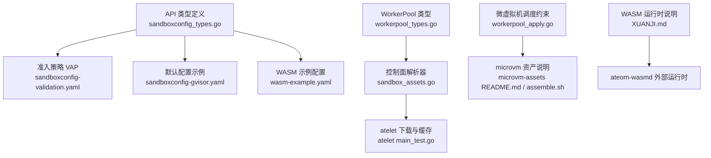
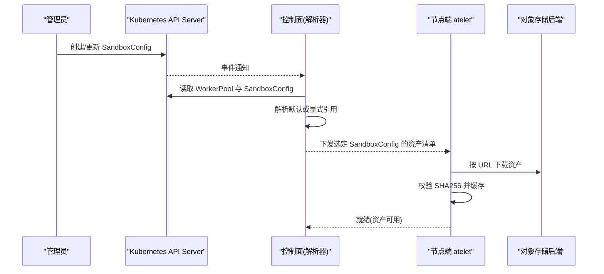
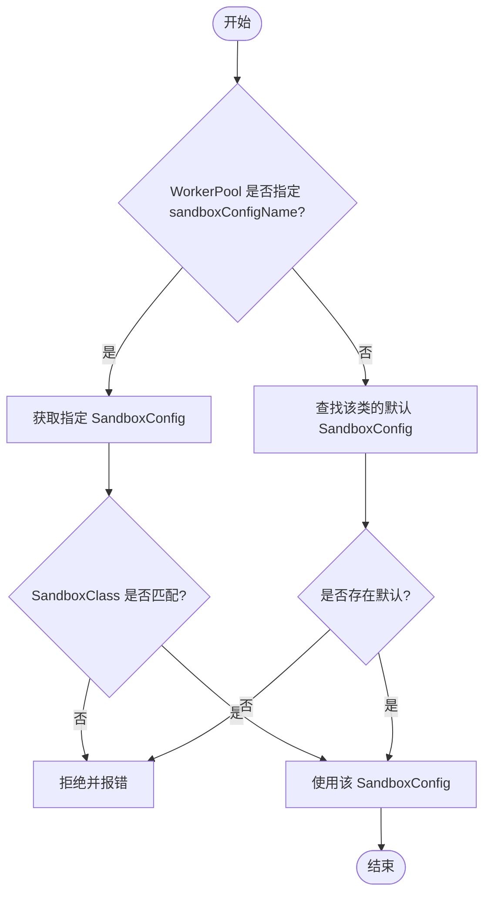
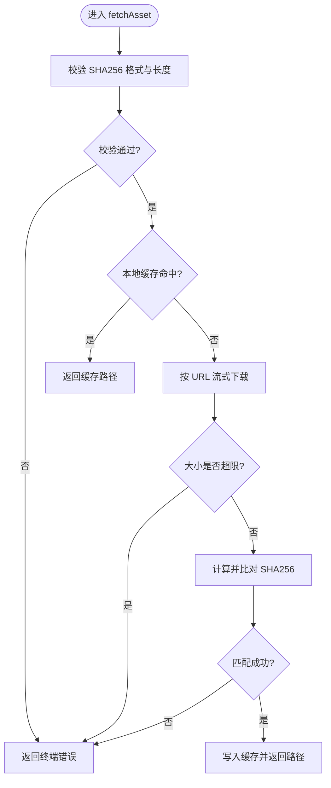
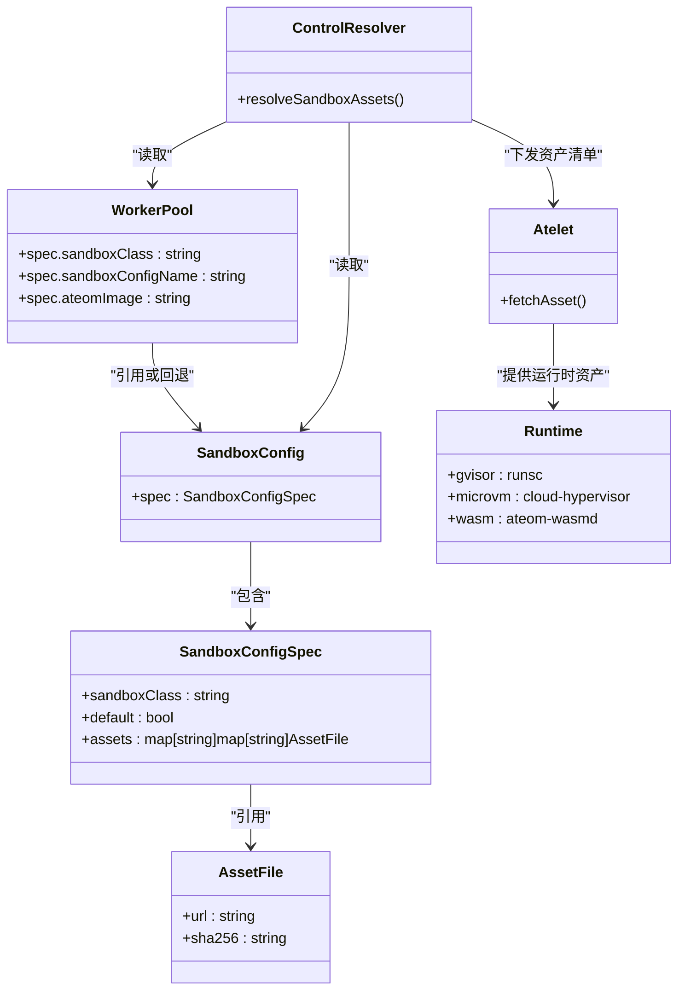

# SandboxConfig资源定义

<cite>
**本文引用的文件列表**
- [sandboxconfig_types.go](file://pkg/api/v1alpha1/sandboxconfig_types.go)
- [sandboxconfig_validation_test.go](file://pkg/api/v1alpha1/sandboxconfig_validation_test.go)
- [sandboxconfig-gvisor.yaml](file://manifests/ate-install/sandboxconfig-gvisor.yaml)
- [sandboxconfig-validation.yaml](file://manifests/ate-install/sandboxconfig-validation.yaml)
- [workerpool_apply.go](file://cmd/atecontroller/internal/controllers/workerpool_apply.go)
- [sandbox_assets.go](file://cmd/ateapi/internal/controlapi/sandbox_assets.go)
- [workerpool_types.go](file://pkg/api/v1alpha1/workerpool_types.go)
- [microvm-assets README.md](file://hack/microvm-assets/README.md)
- [microvm-assets assemble.sh](file://hack/microvm-assets/assemble.sh)
- [atelet main_test.go](file://cmd/atelet/main_test.go)
- [wasm-example.yaml](file://manifests/xuanji/wasm-example.yaml)
- [XUANJI.md](file://XUANJI.md)
</cite>

## 更新摘要
**变更内容**
- 新增 WebAssembly (WASM) 沙箱类支持
- 更新 SandboxClass 枚举以包含 'wasm' 值
- 添加 WASM 特定的资产要求和验证规则
- 提供 WASM 示例配置和最佳实践

## 目录
1. [简介](#简介)
2. [项目结构](#项目结构)
3. [核心组件](#核心组件)
4. [架构总览](#架构总览)
5. [详细组件分析](#详细组件分析)
6. [依赖关系分析](#依赖关系分析)
7. [性能与可靠性考虑](#性能与可靠性考虑)
8. [故障排查指南](#故障排查指南)
9. [结论](#结论)
10. [附录：YAML配置示例与最佳实践](#附录yaml配置示例与最佳实践)

## 简介
SandboxConfig 是一个集群级自定义资源，用于集中声明沙箱运行时所需的二进制与镜像等"资产"，并按沙箱类（gvisor、microvm、wasm）进行区分。它解耦了 WorkerPool 对具体沙箱二进制版本的依赖，使集群管理员可以统一管控不同架构的运行时版本、来源与校验值，并通过默认策略为未显式指定配置的池提供兜底。

本文件面向使用者与维护者，系统阐述 SandboxConfig 的结构定义、字段语义、不同沙箱类的特定要求、验证规则、默认与覆盖机制，以及典型使用场景和排障要点。

## 项目结构
与 SandboxConfig 直接相关的代码与清单主要分布在以下位置：
- API 类型定义与注册：pkg/api/v1alpha1/sandboxconfig_types.go
- 准入策略（ValidatingAdmissionPolicy）：manifests/ate-install/sandboxconfig-validation.yaml
- gVisor 默认配置示例：manifests/ate-install/sandboxconfig-gvisor.yaml
- WASM 示例配置：manifests/xuanji/wasm-example.yaml
- 控制器侧解析与选择逻辑：cmd/ateapi/internal/controlapi/sandbox_assets.go
- WorkerPool 关联字段与微虚拟机调度约束：pkg/api/v1alpha1/workerpool_types.go、cmd/atecontroller/internal/controllers/workerpool_apply.go
- microvm 资产说明与构建脚本：hack/microvm-assets/README.md、assemble.sh
- atelet 下载与缓存行为测试用例：cmd/atelet/main_test.go

图表来源
- [sandboxconfig_types.go:1-124](file://pkg/api/v1alpha1/sandboxconfig_types.go#L1-L124)
- [sandboxconfig-validation.yaml:1-69](file://manifests/ate-install/sandboxconfig-validation.yaml#L1-L69)
- [sandboxconfig-gvisor.yaml:1-36](file://manifests/ate-install/sandboxconfig-gvisor.yaml#L1-L36)
- [wasm-example.yaml:1-84](file://manifests/xuanji/wasm-example.yaml#L1-L84)
- [workerpool_types.go:1-140](file://pkg/api/v1alpha1/workerpool_types.go#L1-L140)
- [sandbox_assets.go:1-103](file://cmd/ateapi/internal/controlapi/sandbox_assets.go#L1-L103)
- [workerpool_apply.go:103-130](file://cmd/atecontroller/internal/controllers/workerpool_apply.go#L103-L130)
- [microvm-assets README.md:1-25](file://hack/microvm-assets/README.md#L1-L25)
- [microvm-assets assemble.sh:17-41](file://hack/microvm-assets/assemble.sh#L17-L41)
- [atelet main_test.go:258-361](file://cmd/atelet/main_test.go#L258-L361)
- [XUANJI.md:22-40](file://XUANJI.md#L22-L40)

章节来源
- [sandboxconfig_types.go:1-124](file://pkg/api/v1alpha1/sandboxconfig_types.go#L1-L124)
- [sandboxconfig-validation.yaml:1-69](file://manifests/ate-install/sandboxconfig-validation.yaml#L1-L69)
- [sandboxconfig-gvisor.yaml:1-36](file://manifests/ate-install/sandboxconfig-gvisor.yaml#L1-L36)
- [wasm-example.yaml:1-84](file://manifests/xuanji/wasm-example.yaml#L1-L84)
- [workerpool_types.go:1-140](file://pkg/api/v1alpha1/workerpool_types.go#L1-L140)
- [sandbox_assets.go:1-103](file://cmd/ateapi/internal/controlapi/sandbox_assets.go#L1-L103)
- [workerpool_apply.go:103-130](file://cmd/atecontroller/internal/controllers/workerpool_apply.go#L103-L130)
- [microvm-assets README.md:1-25](file://hack/microvm-assets/README.md#L1-L25)
- [microvm-assets assemble.sh:17-41](file://hack/microvm-assets/assemble.sh#L17-L41)
- [atelet main_test.go:258-361](file://cmd/atelet/main_test.go#L258-L361)
- [XUANJI.md:22-40](file://XUANJI.md#L22-L40)

## 核心组件
- SandboxClass：枚举型字段，表示沙箱运行时家族，当前支持 gvisor、microvm 与 wasm。
- AssetFile：描述单个可下载资产的元数据，包含下载地址与 SHA256 校验值。
- SandboxConfigSpec：SandboxConfig 的核心规格，包括：
  - sandboxClass：所属沙箱类。
  - default：是否作为该类的集群默认配置。
  - assets：按架构到资产名的映射，每个资产由 URL 与 SHA256 组成。
- SandboxConfig：集群级对象，被 WorkerPool 引用或回退到默认配置。

关键设计点
- 通过 ValidatingAdmissionPolicy 在创建/更新时强制校验每类沙箱所需的最小资产集合。
- WorkerPool 若未显式指定 SandboxConfigName，则自动解析对应类的默认 SandboxConfig。
- 资产下载由 atelet 执行，基于 SHA256 命名并缓存本地，确保幂等与完整性。

章节来源
- [sandboxconfig_types.go:21-86](file://pkg/api/v1alpha1/sandboxconfig_types.go#L21-L86)
- [sandboxconfig_types.go:88-110](file://pkg/api/v1alpha1/sandboxconfig_types.go#L88-L110)
- [sandboxconfig-validation.yaml:15-60](file://manifests/ate-install/sandboxconfig-validation.yaml#L15-L60)
- [sandbox_assets.go:26-63](file://cmd/ateapi/internal/controlapi/sandbox_assets.go#L26-L63)
- [workerpool_types.go:70-89](file://pkg/api/v1alpha1/workerpool_types.go#L70-L89)

## 架构总览
SandboxConfig 的生命周期与使用路径如下：
- 管理员创建 SandboxConfig（可选标记为某类的默认）。
- 控制器在编排 WorkerPool 时，根据池的沙箱类与显式引用或默认策略解析出 SandboxConfig。
- 将选定的 SandboxConfig 中的资产信息下发给 atelet。
- atelet 依据 URL 下载资产，以 SHA256 命名并缓存，供后续启动沙箱使用。

图表来源
- [sandboxconfig_types.go:57-86](file://pkg/api/v1alpha1/sandboxconfig_types.go#L57-L86)
- [sandbox_assets.go:26-63](file://cmd/ateapi/internal/controlapi/sandbox_assets.go#L26-L63)
- [sandboxconfig-validation.yaml:15-60](file://manifests/ate-install/sandboxconfig-validation.yaml#L15-L60)
- [atelet main_test.go:258-361](file://cmd/atelet/main_test.go#L258-L361)

## 详细组件分析

## 数据结构与字段语义
- SandboxClass
  - 取值：gvisor、microvm、wasm。
  - 作用：决定 SandboxConfig 的适用范围与资产需求。
- AssetFile
  - url：资产下载地址，支持 gs://、s3:// 等协议；认证方式由 atelet 配置决定。
  - sha256：小写十六进制 64 位哈希，既作为缓存键也用于完整性校验。
- SandboxConfigSpec
  - sandboxClass：必填，受 CRD 枚举限制，默认值为 gvisor。
  - default：可选布尔，标记是否为该类默认配置。
  - assets：可选映射，键为架构名（如 amd64、arm64），值为资产名到 AssetFile 的映射。
- SandboxConfig
  - 集群级对象，被 WorkerPool 引用或作为默认回退。

复杂度与约束
- assets 的键空间为"架构 -> 资产名"，CRD 层仅做最小校验（非空、sha256 格式），更严格的"每类必须包含哪些资产"由 VAP 在准入阶段强制执行。

章节来源
- [sandboxconfig_types.go:21-86](file://pkg/api/v1alpha1/sandboxconfig_types.go#L21-L86)
- [sandboxconfig_types.go:88-110](file://pkg/api/v1alpha1/sandboxconfig_types.go#L88-L110)
- [sandboxconfig-validation.yaml:15-60](file://manifests/ate-install/sandboxconfig-validation.yaml#L15-L60)

## 沙箱类特定要求与兼容性

## gvisor 类
- 必需资产：每个声明的架构下都必须包含名为 runsc 的资产。
- 兼容性与部署：
  - WorkerPool 默认使用 gvisor 类。
  - 若未显式指定 SandboxConfigName，则回退到该类的默认 SandboxConfig。
- 参考示例：
  - 集群默认 gvisor 配置样例位于安装清单中，包含 amd64 与 arm64 两个架构的 runsc 资产。

章节来源
- [sandboxconfig-validation.yaml:32-41](file://manifests/ate-install/sandboxconfig-validation.yaml#L32-L41)
- [sandboxconfig-gvisor.yaml:15-36](file://manifests/ate-install/sandboxconfig-gvisor.yaml#L15-L36)
- [sandbox_assets.go:40-60](file://cmd/ateapi/internal/controlapi/sandbox_assets.go#L40-L60)

## microvm 类
- 必需资产：每个声明的架构下必须包含 cloud-hypervisor、virtiofsd、kata-kernel、kata-image、kata-config 五个资产。
- 运行期要求：
  - 宿主机需提供 /dev/kvm 与 vhost 设备。
  - 控制器会为 microvm 类 WorkerPod 注入 /dev/kvm 挂载，并设置节点选择器与容忍，将其调度至具备嵌套虚拟化的节点。
- 资产来源与构建：
  - 官方文档说明了五类资产的角色与来源，virtiofsd 需从源码构建以获得必要的修复。
  - 构建脚本会产出上述五类资产，便于上传到对象存储并由 SandboxConfig 引用。

章节来源
- [sandboxconfig-validation.yaml:44-50](file://manifests/ate-install/sandboxconfig-validation.yaml#L44-L50)
- [workerpool_apply.go:103-130](file://cmd/atecontroller/internal/controllers/workerpool_apply.go#L103-L130)
- [microvm-assets README.md:1-25](file://hack/microvm-assets/README.md#L1-L25)
- [microvm-assets assemble.sh:17-41](file://hack/microvm-assets/assemble.sh#L17-L41)

## wasm 类
- 必需资产：每个声明的架构下必须包含 python-wasm 资产（CPython 解释器的 WebAssembly 模块）。
- 特性与优势：
  - WebAssembly 字节码是架构无关的，但资产仍按架构键登记以便统一管理。
  - 更快的冷启动速度和更高的密度，适合兼容的工作负载。
  - 无需 KVM 或内核沙箱功能，降低硬件要求。
- 运行时架构：
  - 使用 ateom-wasmd（Rust 实现的 Ateom 运行时）作为工作进程。
  - 通过 wasmtime 实例运行 WebAssembly 工作负载。
  - 复用 gvisor 分支的安全上下文，保持非特权运行。
- 资产约定：
  - python-wasm 资产是 CPython 解释器的 WebAssembly 模块。
  - 虽然字节码架构无关，但仍需在每个架构下重复登记相同的资产。

章节来源
- [sandboxconfig-validation.yaml:51-60](file://manifests/ate-install/sandboxconfig-validation.yaml#L51-L60)
- [wasm-example.yaml:20-38](file://manifests/xuanji/wasm-example.yaml#L20-L38)
- [XUANJI.md:31-39](file://XUANJI.md#L31-L39)

## 默认配置、命名空间覆盖与优先级
- 默认配置：
  - 当 WorkerPool 未设置 sandboxConfigName 时，控制面会查找其 sandboxClass 对应的默认 SandboxConfig。
- 显式覆盖：
  - WorkerPool 可通过 sandboxConfigName 指向任意同类的 SandboxConfig，实现命名空间级或池级覆盖。
- 一致性校验：
  - 若显式指定的 SandboxConfig 与其 WorkerPool 的 sandboxClass 不一致，控制面会拒绝并返回错误。

图表来源
- [sandbox_assets.go:26-63](file://cmd/ateapi/internal/controlapi/sandbox_assets.go#L26-L63)
- [workerpool_types.go:70-89](file://pkg/api/v1alpha1/workerpool_types.go#L70-L89)

章节来源
- [sandbox_assets.go:26-63](file://cmd/ateapi/internal/controlapi/sandbox_assets.go#L26-L63)
- [workerpool_types.go:70-89](file://pkg/api/v1alpha1/workerpool_types.go#L70-L89)

## 资产下载与缓存流程
- 入口：控制面将选定的 SandboxConfig 资产清单下发给 atelet。
- 下载策略：
  - 先校验 SHA256 格式与长度，再尝试命中本地缓存。
  - 若未命中，则按 URL 流式下载，计算并比对 SHA256，成功后写入缓存。
- 失败处理：
  - 大小超限或哈希不匹配均视为终端错误，不会留下部分缓存文件。

图表来源
- [atelet main_test.go:258-361](file://cmd/atelet/main_test.go#L258-L361)

章节来源
- [atelet main_test.go:258-361](file://cmd/atelet/main_test.go#L258-L361)

## 依赖关系分析
- API 层：SandboxConfig 类型定义与注册。
- 准入层：ValidatingAdmissionPolicy 对每类沙箱的资产集进行强校验。
- 控制面：解析 WorkerPool 与 SandboxConfig 的关系，确定最终使用的资产清单。
- 节点端：atelet 负责下载、校验与缓存资产。
- 运行时：gvisor 使用 runsc；microvm 使用 cloud-hypervisor + kata 栈，需要 KVM 与 virtio-fs；wasm 使用 ateom-wasmd + wasmtime。

图表来源
- [sandboxconfig_types.go:57-110](file://pkg/api/v1alpha1/sandboxconfig_types.go#L57-L110)
- [workerpool_types.go:54-89](file://pkg/api/v1alpha1/workerpool_types.go#L54-L89)
- [sandbox_assets.go:26-63](file://cmd/ateapi/internal/controlapi/sandbox_assets.go#L26-L63)
- [atelet main_test.go:258-361](file://cmd/atelet/main_test.go#L258-L361)

章节来源
- [sandboxconfig_types.go:57-110](file://pkg/api/v1alpha1/sandboxconfig_types.go#L57-L110)
- [workerpool_types.go:54-89](file://pkg/api/v1alpha1/workerpool_types.go#L54-L89)
- [sandbox_assets.go:26-63](file://cmd/ateapi/internal/controlapi/sandbox_assets.go#L26-L63)
- [atelet main_test.go:258-361](file://cmd/atelet/main_test.go#L258-L361)

## 性能与可靠性考虑
- 下载与缓存
  - 以 SHA256 命名的本地缓存避免重复下载，提升冷启动速度。
  - 流式下载与大小上限保护防止内存与磁盘压力。
- 完整性保障
  - 严格校验 SHA256，失败即终止且不落盘，保证不可信内容不会被使用。
- 准入校验
  - 在 API 层提前拦截不完整或不合规的 SandboxConfig，减少运行时失败概率。
- 调度与隔离
  - microvm 类通过节点选择器与容忍将工作负载调度到具备 KVM 能力的节点，避免资源争用与启动失败。
  - wasm 类无需特殊硬件要求，可在普通节点上运行，提高资源利用率。
- WASM 特定优化
  - WebAssembly 字节码体积小，下载速度快。
  - 无内核态开销，启动延迟更低。
  - 支持快照恢复（通过 ateom-wasmd 实现）。

[本节为通用指导，无需列出具体文件来源]

## 故障排查指南
- 创建 SandboxConfig 被拒绝
  - 检查是否满足对应沙箱类的资产要求（gvisor 需 runsc；microvm 需完整五件套；wasm 需 python-wasm）。
  - 确认 url 与 sha256 字段齐全且 sha256 为 64 位小写十六进制。
- WorkerPool 无法解析 SandboxConfig
  - 确认显式引用的 SandboxConfig 名称存在且与 WorkerPool 的 sandboxClass 一致。
  - 若未显式引用，确认该类的默认 SandboxConfig 已正确创建。
- 节点端下载失败或缓存异常
  - 检查对象存储可达性与鉴权配置（由 atelet 配置决定）。
  - 核对 sha256 是否与远端一致；若不一致，重新生成并更新 SandboxConfig。
- microvm 启动失败
  - 确认节点具备 /dev/kvm 与 vhost 设备，且已被正确挂载。
  - 确认节点标签与容忍符合 microvm 调度约定。
- wasm 启动失败
  - 确认 ateom-wasmd 镜像配置正确且可访问。
  - 检查 python-wasm 资产是否正确下载并可用。
  - 验证 WASI 能力配置是否符合工作负载需求。

章节来源
- [sandboxconfig-validation.yaml:15-60](file://manifests/ate-install/sandboxconfig-validation.yaml#L15-L60)
- [sandboxconfig_types.go:35-50](file://pkg/api/v1alpha1/sandboxconfig_types.go#L35-L50)
- [sandbox_assets.go:40-60](file://cmd/ateapi/internal/controlapi/sandbox_assets.go#L40-L60)
- [workerpool_apply.go:103-130](file://cmd/atecontroller/internal/controllers/workerpool_apply.go#L103-L130)
- [atelet main_test.go:258-361](file://cmd/atelet/main_test.go#L258-L361)
- [XUANJI.md:31-39](file://XUANJI.md#L31-L39)

## 结论
SandboxConfig 提供了统一的沙箱资产管理能力，结合准入策略与控制面解析逻辑，实现了跨架构、跨沙箱类的灵活版本管理与安全下载。配合 WorkerPool 的显式引用与默认回退机制，可在集群与命名空间层面实现精细化的策略覆盖。对于 microvm 类，还需关注宿主机的虚拟化能力与设备挂载；对于 wasm 类，可利用其轻量级特性和快速启动优势，同时注意 ateom-wasmd 的运行环境配置。

[本节为总结性内容，无需列出具体文件来源]

## 附录：YAML配置示例与最佳实践

## 基本结构与字段说明
- apiVersion、kind、metadata：标准 Kubernetes 对象头。
- spec.sandboxClass：选择 gvisor、microvm 或 wasm。
- spec.default：设为 true 表示该类默认配置。
- spec.assets：按架构与资产名组织，每项包含 url 与 sha256。

章节来源
- [sandboxconfig_types.go:57-86](file://pkg/api/v1alpha1/sandboxconfig_types.go#L57-L86)

## gvisor 默认配置示例
- 参见安装清单中的 gvisor 默认配置，包含 amd64 与 arm64 的 runsc 资产。

章节来源
- [sandboxconfig-gvisor.yaml:15-36](file://manifests/ate-install/sandboxconfig-gvisor.yaml#L15-L36)

## microvm 资产清单与构建
- 必需资产：cloud-hypervisor、virtiofsd、kata-kernel、kata-image、kata-config。
- 构建与打包：参考 microvm-assets 的 README 与 assemble 脚本，产出五类资产后上传至对象存储，并在 SandboxConfig 中引用。

章节来源
- [microvm-assets README.md:1-25](file://hack/microvm-assets/README.md#L1-L25)
- [microvm-assets assemble.sh:17-41](file://hack/microvm-assets/assemble.sh#L17-L41)

## wasm 配置示例
- 必需资产：python-wasm（CPython 解释器的 WebAssembly 模块）。
- 示例配置：
  - 集群级默认配置：wasm-default，包含 amd64 和 arm64 架构的 python-wasm 资产。
  - WorkerPool 配置：指定 sandboxClass 为 wasm，并配置 ateomImage。
  - ActorTemplate：定义 Python 解释器模板，使用 pause 容器作为内核。
- 注意事项：
  - WebAssembly 字节码架构无关，但仍需为每个架构重复登记相同资产。
  - ateom-wasmd 是外部运行时，需单独维护并发布镜像。
  - 快照功能通过 ateom-wasmd 实现，支持 Full 模式。

章节来源
- [wasm-example.yaml:20-84](file://manifests/xuanji/wasm-example.yaml#L20-L84)
- [XUANJI.md:31-39](file://XUANJI.md#L31-L39)

## 对象存储后端与认证凭据
- 资产地址支持 gs://、s3:// 等协议，认证方式由 atelet 的配置决定。
- 建议：
  - 使用只读访问令牌或角色，限制最小权限。
  - 开启服务端加密与访问审计，便于溯源。
  - 为不同环境（开发/预发/生产）准备独立的桶与版本化策略。

[本节为通用指导，无需列出具体文件来源]

## 网络访问策略
- 节点需能访问对象存储域名与端口。
- 建议：
  - 通过出站白名单或代理出口管理访问。
  - 在微服务网格或防火墙层记录访问日志，便于问题定位。

[本节为通用指导，无需列出具体文件来源]

## 集群级默认配置与命名空间级覆盖
- 集群级默认：为每个沙箱类创建一个 default=true 的 SandboxConfig。
- 命名空间级覆盖：在 WorkerPool 中通过 sandboxConfigName 指向同名空间内的自定义 SandboxConfig，实现差异化版本或来源。
- 优先级：显式引用优先于默认配置；若引用不存在或与 sandboxClass 不一致，控制面会拒绝。

章节来源
- [sandbox_assets.go:26-63](file://cmd/ateapi/internal/controlapi/sandbox_assets.go#L26-L63)
- [workerpool_types.go:70-89](file://pkg/api/v1alpha1/workerpool_types.go#L70-L89)