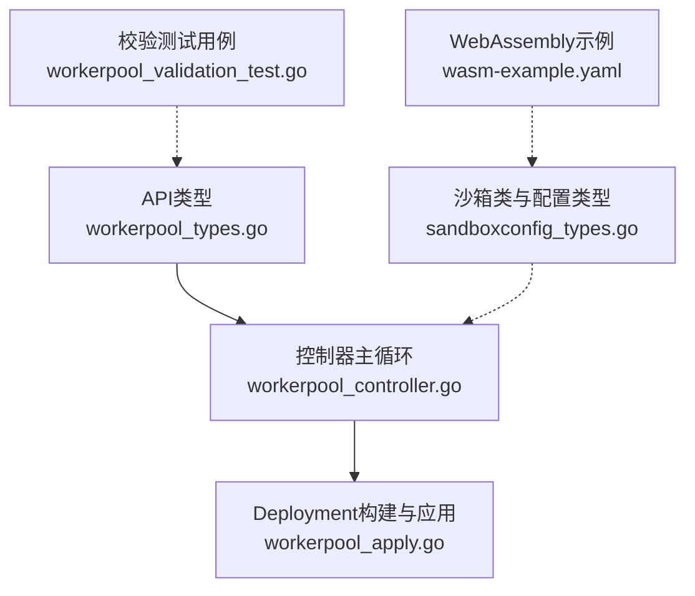
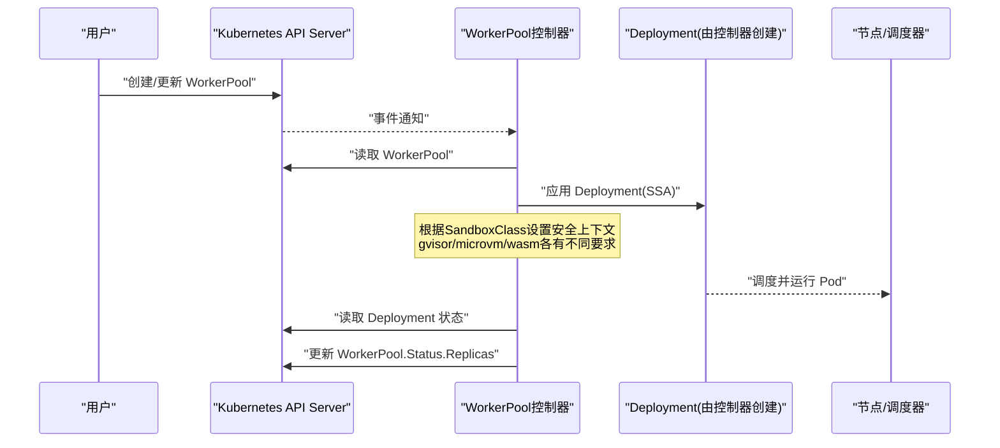
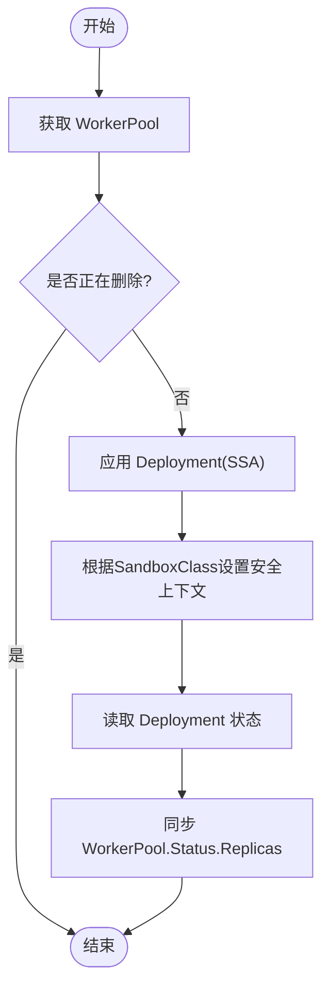
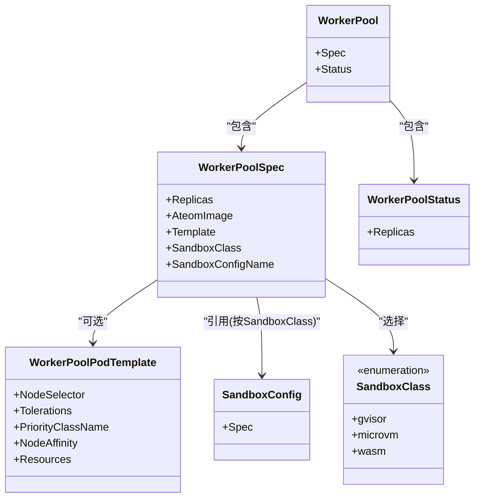

# WorkerPool资源定义

<cite>
**本文引用的文件**
- [workerpool_types.go](file://pkg/api/v1alpha1/workerpool_types.go)
- [workerpool_validation_test.go](file://pkg/api/v1alpha1/workerpool_validation_test.go)
- [workerpool_controller.go](file://cmd/atecontroller/internal/controllers/workerpool_controller.go)
- [workerpool_apply.go](file://cmd/atecontroller/internal/controllers/workerpool_apply.go)
- [sandboxconfig_types.go](file://pkg/api/v1alpha1/sandboxconfig_types.go)
- [wasm-example.yaml](file://manifests/xuanji/wasm-example.yaml)
</cite>

## 更新摘要
**所做更改**
- 更新了sandboxClass枚举说明，新增WebAssembly (wasm) 沙箱类型支持
- 添加了WebAssembly沙箱类型的详细特性说明
- 更新了安全上下文和行为差异的对比
- 新增了WebAssembly WorkerPool配置示例
- 更新了故障排除指南以包含WebAssembly相关场景

## 目录
1. [简介](#简介)
2. [项目结构](#项目结构)
3. [核心组件](#核心组件)
4. [架构总览](#架构总览)
5. [详细组件分析](#详细组件分析)
6. [依赖关系分析](#依赖关系分析)
7. [性能与调度考量](#性能与调度考量)
8. [故障排除指南](#故障排除指南)
9. [结论](#结论)
10. [附录：YAML配置示例与最佳实践](#附录yaml配置示例与最佳实践)

## 简介
本文件面向使用WorkerPool自定义资源的用户与维护者，系统性说明其数据结构、验证规则、控制器行为以及与SandboxClass/SandboxConfig的关联方式。文档同时提供调度相关字段（NodeSelector、Tolerations、PriorityClassName、NodeAffinity、Resources）的使用说明，并给出完整的YAML配置示例、部署最佳实践与常见问题排查方法。

**更新** 现已支持三种沙箱运行时类型：gVisor、微虚拟机(microvm)和WebAssembly(wasm)，每种类型都有特定的资源需求和调度策略。

## 项目结构
与WorkerPool相关的代码主要分布在以下位置：
- API类型定义与CRD注解：pkg/api/v1alpha1/workerpool_types.go
- 控制器实现（Reconcile循环与应用逻辑）：cmd/atecontroller/internal/controllers/workerpool_controller.go、workerpool_apply.go
- 校验测试用例（覆盖必填项、枚举、长度等约束）：pkg/api/v1alpha1/workerpool_validation_test.go
- 沙箱类与沙箱配置类型（与WorkerPool的SandboxClass/SandboxConfigName联动）：pkg/api/v1alpha1/sandboxconfig_types.go
- WebAssembly示例配置：manifests/xuanji/wasm-example.yaml



**图表来源**
- [workerpool_types.go:1-140](file://pkg/api/v1alpha1/workerpool_types.go#L1-L140)
- [workerpool_controller.go:1-149](file://cmd/atecontroller/internal/controllers/workerpool_controller.go#L1-L149)
- [workerpool_apply.go:1-417](file://cmd/atecontroller/internal/controllers/workerpool_apply.go#L1-L417)
- [sandboxconfig_types.go:1-124](file://pkg/api/v1alpha1/sandboxconfig_types.go#L1-L124)
- [wasm-example.yaml:1-84](file://manifests/xuanji/wasm-example.yaml#L1-L84)

**章节来源**
- [workerpool_types.go:1-140](file://pkg/api/v1alpha1/workerpool_types.go#L1-L140)
- [workerpool_controller.go:1-149](file://cmd/atecontroller/internal/controllers/workerpool_controller.go#L1-L149)
- [workerpool_apply.go:1-417](file://cmd/atecontroller/internal/controllers/workerpool_apply.go#L1-L417)
- [sandboxconfig_types.go:1-124](file://pkg/api/v1alpha1/sandboxconfig_types.go#L1-L124)
- [workerpool_validation_test.go:1-126](file://pkg/api/v1alpha1/workerpool_validation_test.go#L1-L126)
- [wasm-example.yaml:1-84](file://manifests/xuanji/wasm-example.yaml#L1-L84)

## 核心组件
- WorkerPool：命名空间级自定义资源，用于声明一组工作进程Pod的期望状态。
- WorkerPoolSpec：描述期望状态，包括副本数、镜像、模板、沙箱类与沙箱配置引用。
- WorkerPoolStatus：观测状态，当前由控制器同步为对应Deployment的副本数。
- WorkerPoolPodTemplate：可选的调度与资源设置，映射到Pod的调度与资源字段。

**更新** SandboxClass现在支持三种类型：
- **gvisor**：默认值，使用gVisor/runsc运行时，需要特定Linux内核功能
- **microvm**：微虚拟机运行时，需要/dev/kvm和vhost设备，节点需具备嵌套虚拟化能力
- **wasm**：WebAssembly运行时，轻量级沙箱，无需KVM或内核沙箱功能，适合快速启动和高密度部署

关键要点
- Replicas：控制副本数量，支持通过scale子资源进行水平扩展。
- AteomImage：工作容器镜像名称，必填且长度至少为1。
- Template：可选，包含NodeSelector、Tolerations、PriorityClassName、NodeAffinity、Resources等调度与资源设置。
- SandboxClass：选择沙箱运行时家族（gvisor、microvm或wasm），影响节点放置与设备挂载策略；默认值为gvisor。
- SandboxConfigName：可选，指定集群范围的SandboxConfig以获取沙箱二进制；若为空则使用该SandboxClass对应的默认配置。

**章节来源**
- [workerpool_types.go:22-89](file://pkg/api/v1alpha1/workerpool_types.go#L22-L89)
- [workerpool_types.go:91-122](file://pkg/api/v1alpha1/workerpool_types.go#L91-L122)
- [workerpool_types.go:104-107](file://pkg/api/v1alpha1/workerpool_types.go#L104-L107)
- [sandboxconfig_types.go:21-35](file://pkg/api/v1alpha1/sandboxconfig_types.go#L21-L35)

## 架构总览
WorkerPool控制器监听WorkerPool对象变化，将其转换为Deployment并通过SSA Apply策略管理。控制器还会将Deployment的副本数同步回WorkerPool.Status.Replicas。不同沙箱类型有不同的安全上下文和资源需求。



**图表来源**
- [workerpool_controller.go:47-112](file://cmd/atecontroller/internal/controllers/workerpool_controller.go#L47-L112)
- [workerpool_apply.go:30-83](file://cmd/atecontroller/internal/controllers/workerpool_apply.go#L30-L83)
- [workerpool_apply.go:231-255](file://cmd/atecontroller/internal/controllers/workerpool_apply.go#L231-L255)

**章节来源**
- [workerpool_controller.go:47-112](file://cmd/atecontroller/internal/controllers/workerpool_controller.go#L47-L112)
- [workerpool_apply.go:30-83](file://cmd/atecontroller/internal/controllers/workerpool_apply.go#L30-L83)

## 详细组件分析

### WorkerPool 结构与字段语义
- Spec.Replicas：期望副本数，最小值为0。
- Spec.AteomImage：工作容器镜像，必填且非空。
- Spec.Template：可选调度与资源模板。
- Spec.SandboxClass：gvisor、microvm或wasm，默认gvisor。
- Spec.SandboxConfigName：可选，指向同类的SandboxConfig；未指定时使用该类默认配置。
- Status.Replicas：观测到的副本数，由控制器从Deployment同步。

**更新** SandboxClass枚举现在包含三个有效值：
- `gvisor`：gVisor/runsc运行时
- `microvm`：微虚拟机运行时  
- `wasm`：WebAssembly运行时

**章节来源**
- [workerpool_types.go:54-89](file://pkg/api/v1alpha1/workerpool_types.go#L54-L89)
- [workerpool_types.go:91-96](file://pkg/api/v1alpha1/workerpool_types.go#L91-L96)
- [workerpool_types.go:70-80](file://pkg/api/v1alpha1/workerpool_types.go#L70-L80)

### WorkerPoolPodTemplate 调度与资源选项
- NodeSelector：键值对标签选择器，直接映射到Pod.spec.nodeSelector。
- Tolerations：容忍列表，最多16项；映射到Pod.spec.tolerations。
- PriorityClassName：优先级类名，映射到Pod.spec.priorityClassName。
- NodeAffinity：节点亲和性，映射到Pod.spec.affinity.nodeAffinity。
- Resources：计算资源请求与限制，映射到容器资源要求。

**更新** 不同沙箱类型的特殊处理：
- **microvm**：控制器会额外注入/dev/kvm设备挂载以及针对"ate.dev/sandboxClass=microvm"的节点选择与污点容忍
- **gvisor**：使用非特权容器，带有特定的Linux能力集
- **wasm**：使用与gVisor相同的安全上下文（非特权模式），无需特殊设备挂载

注意：当SandboxClass为microvm时，控制器会额外注入/dev/kvm设备挂载以及针对"ate.dev/sandboxClass=microvm"的节点选择与污点容忍，这些是叠加在模板之上的。

**章节来源**
- [workerpool_types.go:22-52](file://pkg/api/v1alpha1/workerpool_types.go#L22-L52)
- [workerpool_apply.go:132-166](file://cmd/atecontroller/internal/controllers/workerpool_apply.go#L132-L166)
- [workerpool_apply.go:94-130](file://cmd/atecontroller/internal/controllers/workerpool_apply.go#L94-L130)
- [workerpool_apply.go:257-302](file://cmd/atecontroller/internal/controllers/workerpool_apply.go#L257-L302)

### 验证规则与约束条件
- Replicas >= 0（最小值约束）。
- AteomImage 非空且长度>=1。
- Tolerations 最大长度为16。
- SandboxClass 仅允许 gvisor、microvm 或 wasm，默认 gvisor。
- 其他字段遵循Kubernetes标准类型的约束。

**更新** SandboxClass验证现在接受三个枚举值：gvisor、microvm、wasm。

**章节来源**
- [workerpool_types.go:54-89](file://pkg/api/v1alpha1/workerpool_types.go#L54-L89)
- [workerpool_validation_test.go:46-102](file://pkg/api/v1alpha1/workerpool_validation_test.go#L46-L102)

### 控制器处理流程与状态同步
- Reconcile入口：获取WorkerPool，处理删除场景，调用reconcileWorkerPool。
- reconcileWorkerPool：先应用Deployment，再读取Deployment状态，最后同步WorkerPool.Status.Replicas。
- applyDeployment：基于WorkerPool构建DeploymentApplyConfiguration并通过SSA Apply。
- syncStatus：比较当前Status与期望，不一致则更新。



**图表来源**
- [workerpool_controller.go:47-112](file://cmd/atecontroller/internal/controllers/workerpool_controller.go#L47-L112)
- [workerpool_apply.go:30-83](file://cmd/atecontroller/internal/controllers/workerpool_apply.go#L30-L83)
- [workerpool_apply.go:231-255](file://cmd/atecontroller/internal/controllers/workerpool_apply.go#L231-L255)

**章节来源**
- [workerpool_controller.go:47-112](file://cmd/atecontroller/internal/controllers/workerpool_controller.go#L47-L112)
- [workerpool_apply.go:30-83](file://cmd/atecontroller/internal/controllers/workerpool_apply.go#L30-L83)

### 与SandboxClass和SandboxConfig的关联
- SandboxClass决定运行时家族与Pod形状（例如microvm需要/dev/kvm与vhost设备，wasm无需特殊设备）。
- SandboxConfigName可覆盖集群默认SandboxConfig；两者必须匹配同一SandboxClass。
- 若未指定SandboxConfigName，则使用对应SandboxClass的默认配置。

**更新** WebAssembly沙箱类型的特性：
- 使用外部镜像ateom-wasmd作为运行时
- 无需KVM或内核沙箱功能
- 支持更快的冷启动时间和更高密度部署
- 需要python-wasm资产文件（CPython解释器的WebAssembly模块）

**章节来源**
- [workerpool_types.go:70-89](file://pkg/api/v1alpha1/workerpool_types.go#L70-L89)
- [sandboxconfig_types.go:52-79](file://pkg/api/v1alpha1/sandboxconfig_types.go#L52-L79)
- [sandboxconfig_types.go:21-35](file://pkg/api/v1alpha1/sandboxconfig_types.go#L21-L35)

## 依赖关系分析
- WorkerPool控制器依赖Kubernetes Apps v1 Deployment资源进行实际编排。
- WorkerPoolPodTemplate中的调度字段最终映射到Pod的调度属性。
- SandboxClass影响控制器对Pod形状的附加逻辑（如microvm的设备挂载与节点选择，wasm的特殊运行时要求）。



**图表来源**
- [workerpool_types.go:22-122](file://pkg/api/v1alpha1/workerpool_types.go#L22-L122)
- [sandboxconfig_types.go:52-103](file://pkg/api/v1alpha1/sandboxconfig_types.go#L52-L103)
- [sandboxconfig_types.go:21-35](file://pkg/api/v1alpha1/sandboxconfig_types.go#L21-L35)

**章节来源**
- [workerpool_types.go:22-122](file://pkg/api/v1alpha1/workerpool_types.go#L22-L122)
- [sandboxconfig_types.go:52-103](file://pkg/api/v1alpha1/sandboxconfig_types.go#L52-L103)

## 性能与调度考量
- 合理设置Resources.Requests/Limits以避免过度分配或资源争用。
- 使用NodeSelector与NodeAffinity将工作负载定向到具备特定能力的节点（例如GPU、KVM能力）。
- 使用Tolerations配合节点污点，确保微虚拟机类工作负载能调度到合适的节点池。
- PriorityClassName可用于提升或降低工作负载优先级，避免与系统关键任务冲突。
- 对于microvm类，确保节点满足KVM与vhost设备需求，并正确标注与污点。
- **WebAssembly类优势**：更快的冷启动时间、更高的部署密度、无需特殊硬件支持。

**更新** 不同沙箱类型的性能特征：
- **gVisor**：中等启动速度，良好的隔离性，需要Linux内核支持
- **microvm**：较慢启动但强隔离，需要硬件虚拟化支持
- **wasm**：最快启动速度，高并发密度，适合短生命周期任务

[本节为通用指导，不直接分析具体文件]

## 故障排除指南
- 创建失败提示replicas小于0：检查spec.replicas是否满足最小值约束。
- 创建失败提示ateomImage为空：确认已填写有效的镜像地址。
- 创建失败提示tolerations过多：确认不超过16条容忍规则。
- 创建失败提示sandboxClass无效：确认使用gvisor、microvm或wasm之一。
- 工作Pod无法调度：
  - 检查NodeSelector与节点标签是否匹配。
  - 检查Tolerations与节点污点是否一致。
  - 对于microvm类，确认节点存在/dev/kvm且被正确选择。
  - 对于wasm类，确认SandboxConfig中包含正确的python-wasm资产。
- 状态不同步：查看控制器日志，确认Deployment是否存在及副本数是否正确。

**更新** WebAssembly相关故障排除：
- 确认ateomImage指向有效的ateom-wasmd镜像
- 验证SandboxConfig中的python-wasm资产URL和SHA256哈希
- 检查网络存储（如S3）是否可访问
- 确认WASM字节码文件的架构兼容性

**章节来源**
- [workerpool_validation_test.go:46-102](file://pkg/api/v1alpha1/workerpool_validation_test.go#L46-L102)
- [workerpool_controller.go:73-112](file://cmd/atecontroller/internal/controllers/workerpool_controller.go#L73-L112)

## 结论
WorkerPool通过简洁的Spec与Status设计，结合灵活的PodTemplate调度选项与SandboxClass/SandboxConfig机制，提供了对多运行时家族的统一编排能力。现已支持三种沙箱类型：gVisor、微虚拟机和WebAssembly，每种都有其特定的适用场景和部署要求。控制器采用SSA策略管理Deployment，保证声明式一致性。建议在生产环境中结合节点能力与资源配额，合理配置调度与资源参数，并建立完善的监控与排障流程。

**更新** WebAssembly沙箱类型为轻量级工作负载提供了新的选择，特别适合需要快速启动和高密度的场景。

[本节为总结性内容，不直接分析具体文件]

## 附录：YAML配置示例与最佳实践

### 基础示例（gvisor）
- 指定副本数与工作镜像。
- 使用默认SandboxClass（gvisor）。
- 可选设置Template中的调度与资源。

参考路径
- [workerpool_types.go:54-89](file://pkg/api/v1alpha1/workerpool_types.go#L54-L89)
- [workerpool_types.go:22-52](file://pkg/api/v1alpha1/workerpool_types.go#L22-L52)

### 高级示例（microvm）
- 设置SandboxClass为microvm。
- 可选设置SandboxConfigName指向匹配的SandboxConfig。
- 配置NodeSelector/Tolerations以匹配具备KVM能力的节点。
- 配置Resources以满足微虚拟机运行需求。

参考路径
- [workerpool_types.go:70-89](file://pkg/api/v1alpha1/workerpool_types.go#L70-L89)
- [workerpool_apply.go:94-130](file://cmd/atecontroller/internal/controllers/workerpool_apply.go#L94-L130)
- [sandboxconfig_types.go:52-79](file://pkg/api/v1alpha1/sandboxconfig_types.go#L52-L79)

### WebAssembly示例
- 设置SandboxClass为wasm。
- 配置SandboxConfig包含python-wasm资产。
- 使用ateom-wasmd镜像作为工作容器。
- 无需特殊节点要求，可在普通节点上运行。

**更新** 新增WebAssembly完整配置示例：

```yaml
# WebAssembly WorkerPool示例
apiVersion: ate.dev/v1alpha1
kind: WorkerPool
metadata:
  name: wasm-pool
  namespace: ate-wasm
  labels:
    workload: wasm-python
spec:
  replicas: 3
  sandboxClass: wasm
  ateomImage: <ATEOM_WASMD_IMAGE>
---
# WebAssembly SandboxConfig示例
apiVersion: ate.dev/v1alpha1
kind: SandboxConfig
metadata:
  name: wasm-default
spec:
  sandboxClass: wasm
  default: true
  assets:
    amd64:
      python-wasm:
        url: "s3://ate-assets/wasm/python-3.12.0.wasm"
        sha256: "0000000000000000000000000000000000000000000000000000000000000000"
    arm64:
      python-wasm:
        url: "s3://ate-assets/wasm/python-3.12.0.wasm"
        sha256: "0000000000000000000000000000000000000000000000000000000000000000"
```

参考路径
- [wasm-example.yaml:1-84](file://manifests/xuanji/wasm-example.yaml#L1-L84)
- [workerpool_types.go:70-89](file://pkg/api/v1alpha1/workerpool_types.go#L70-L89)

### 字段对照与映射
- spec.template.nodeSelector -> pod.spec.nodeSelector
- spec.template.tolerations -> pod.spec.tolerations（最多16条）
- spec.template.priorityClassName -> pod.spec.priorityClassName
- spec.template.nodeAffinity -> pod.spec.affinity.nodeAffinity
- spec.template.resources -> container resources requests/limits

**更新** 不同沙箱类型的安全上下文映射：
- **gvisor**：非特权容器 + 特定Linux能力集 + AppArmor Unconfined
- **microvm**：特权容器 + /dev/kvm设备挂载 + 节点选择器
- **wasm**：非特权容器 + 与gVisor相同的能力集

参考路径
- [workerpool_types.go:22-52](file://pkg/api/v1alpha1/workerpool_types.go#L22-L52)
- [workerpool_apply.go:132-166](file://cmd/atecontroller/internal/controllers/workerpool_apply.go#L132-L166)
- [workerpool_apply.go:231-255](file://cmd/atecontroller/internal/controllers/workerpool_apply.go#L231-L255)

### 最佳实践清单
- 明确资源请求与限制，避免超分导致抖动。
- 使用标签与污点隔离不同工作负载类别。
- 为microvm类准备专用节点池，并确保KVM设备可用。
- 使用SandboxConfig统一管理运行时二进制版本与完整性校验。
- 定期观察WorkerPool.Status.Replicas与实际Deployment副本数的一致性。
- **WebAssembly最佳实践**：
  - 选择合适的WASM运行时镜像（ateom-wasmd）
  - 配置正确的python-wasm资产URL和SHA256哈希
  - 利用WebAssembly的快速启动特性优化响应延迟
  - 考虑在高密度场景中优先选择WebAssembly类型

[本节为通用指导，不直接分析具体文件]