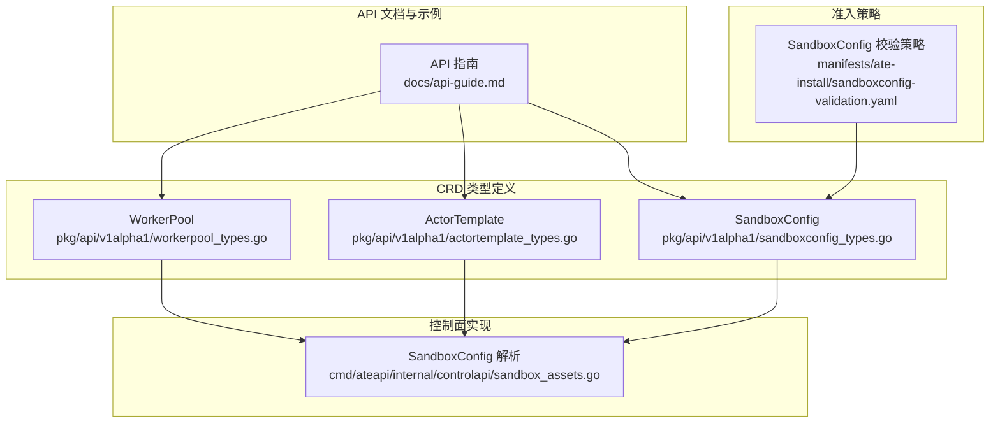
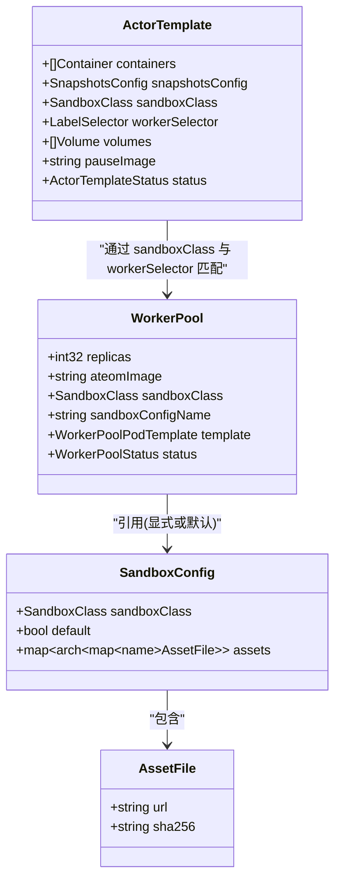
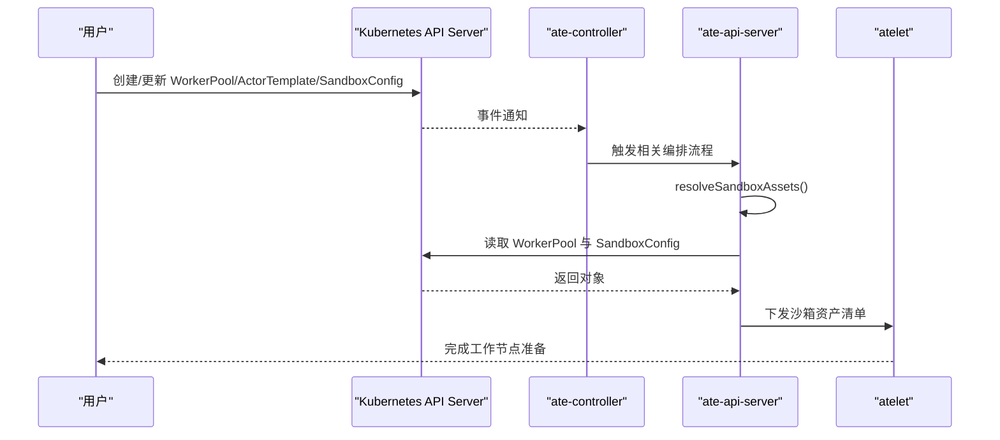

# 自定义资源定义(CRD)

<cite>
**本文引用的文件**   
- [workerpool_types.go](file://pkg/api/v1alpha1/workerpool_types.go)
- [actortemplate_types.go](file://pkg/api/v1alpha1/actortemplate_types.go)
- [sandboxconfig_types.go](file://pkg/api/v1alpha1/sandboxconfig_types.go)
- [api-guide.md](file://docs/api-guide.md)
- [sandboxconfig-validation.yaml](file://manifests/ate-install/sandboxconfig-validation.yaml)
- [sandbox_assets.go](file://cmd/ateapi/internal/controlapi/sandbox_assets.go)
</cite>

## 目录
1. [简介](#简介)
2. [项目结构](#项目结构)
3. [核心组件](#核心组件)
4. [架构总览](#架构总览)
5. [详细组件分析](#详细组件分析)
6. [依赖关系分析](#依赖关系分析)
7. [性能与可用性考量](#性能与可用性考量)
8. [故障排查指南](#故障排查指南)
9. [结论](#结论)
10. [附录：字段校验、默认值与约束速查](#附录字段校验默认值与约束速查)

## 简介
本文件面向使用 Agent Substrate 的开发者与运维人员，系统性梳理并解释以下三个核心 CRD 的结构、字段含义、验证规则、默认值与约束条件，并提供完整 YAML 配置示例与最佳实践：
- WorkerPool：物理“热”工作节点池，承载实际运行 Actor 的 Pod 集合。
- ActorTemplate：Actor 的工作负载蓝图（容器镜像、环境变量、快照策略等），用于生成“黄金快照”。
- SandboxConfig：集群级沙箱二进制资产配置，解耦运行时版本与模板，确保快照可恢复性。

此外，文档包含资源之间的关系图、典型使用场景与排障建议，帮助读者快速上手并安全地规模化部署。

## 项目结构
与 CRD 相关的代码与清单主要位于如下位置：
- 类型定义与校验注解：pkg/api/v1alpha1/*_types.go
- API 使用指南与示例：docs/api-guide.md
- 沙箱资产校验策略：manifests/ate-install/sandboxconfig-validation.yaml
- 控制面解析逻辑（SandboxConfig 选择）：cmd/ateapi/internal/controlapi/sandbox_assets.go

图表来源
- [workerpool_types.go:1-136](file://pkg/api/v1alpha1/workerpool_types.go#L1-L136)
- [actortemplate_types.go:1-390](file://pkg/api/v1alpha1/actortemplate_types.go#L1-L390)
- [sandboxconfig_types.go:1-117](file://pkg/api/v1alpha1/sandboxconfig_types.go#L1-L117)
- [api-guide.md:1-311](file://docs/api-guide.md#L1-L311)
- [sandboxconfig-validation.yaml:1-55](file://manifests/ate-install/sandboxconfig-validation.yaml#L1-L55)
- [sandbox_assets.go:26-63](file://cmd/ateapi/internal/controlapi/sandbox_assets.go#L26-L63)

章节来源
- [workerpool_types.go:1-136](file://pkg/api/v1alpha1/workerpool_types.go#L1-L136)
- [actortemplate_types.go:1-390](file://pkg/api/v1alpha1/actortemplate_types.go#L1-L390)
- [sandboxconfig_types.go:1-117](file://pkg/api/v1alpha1/sandboxconfig_types.go#L1-L117)
- [api-guide.md:1-311](file://docs/api-guide.md#L1-L311)
- [sandboxconfig-validation.yaml:1-55](file://manifests/ate-install/sandboxconfig-validation.yaml#L1-L55)
- [sandbox_assets.go:26-63](file://cmd/ateapi/internal/controlapi/sandbox_assets.go#L26-L63)

## 核心组件
本节对三大 CRD 进行概览式说明，后续章节将深入每个组件的字段、校验与用法。

- WorkerPool
  - 作用：声明一组“热”工作 Pod，作为 Actor 的实际执行载体。
  - 关键能力：副本数、ateom 镜像、调度与资源模板、沙箱类别与二进制来源。
- ActorTemplate
  - 作用：定义 Actor 的工作负载形态与环境，以及快照策略；用于生成“黄金快照”。
  - 关键能力：容器定义、就绪探针、持久卷、快照范围、沙箱类别与 Worker 选择器。
- SandboxConfig
  - 作用：集中管理沙箱运行时二进制资产（如 gVisor runsc 或 microvm 工具链）。
  - 关键能力：按架构与资产名映射到内容寻址的 URL+SHA256，支持设置集群默认。

章节来源
- [workerpool_types.go:54-89](file://pkg/api/v1alpha1/workerpool_types.go#L54-L89)
- [actortemplate_types.go:278-340](file://pkg/api/v1alpha1/actortemplate_types.go#L278-L340)
- [sandboxconfig_types.go:52-79](file://pkg/api/v1alpha1/sandboxconfig_types.go#L52-L79)

## 架构总览
下图展示了三类 CRD 在系统中的作用与交互关系，以及控制面对 SandboxConfig 的选择逻辑。

图表来源
- [workerpool_types.go:54-89](file://pkg/api/v1alpha1/workerpool_types.go#L54-L89)
- [actortemplate_types.go:278-340](file://pkg/api/v1alpha1/actortemplate_types.go#L278-L340)
- [sandboxconfig_types.go:52-79](file://pkg/api/v1alpha1/sandboxconfig_types.go#L52-L79)
- [sandboxconfig_types.go:33-50](file://pkg/api/v1alpha1/sandboxconfig_types.go#L33-L50)

## 详细组件分析

### WorkerPool
- 定位与用途
  - 描述一组“热”工作 Pod，负责承载 Actor 的运行与状态迁移。
- 关键字段与行为
  - replicas：期望运行的工作 Pod 数量，最小为 0。
  - ateomImage：工作进程镜像，必须非空。
  - sandboxClass：沙箱类别，枚举 gvisor/microvm，默认 gvisor。
  - sandboxConfigName：可选，指定集群级 SandboxConfig 名称；为空则回退到该类别的默认配置。
  - template：可选，透传到 Pod 的调度与资源设置（NodeSelector/Tolerations/PriorityClassName/NodeAffinity/Resources）。
- 状态
  - status.replicas：当前已创建的工作 Pod 总数。
- 约束与校验
  - replicas ≥ 0。
  - ateomImage 长度 ≥ 1。
  - sandboxClass 仅允许枚举值，默认 gvisor。
- 使用要点
  - 若需特定沙箱二进制版本，请显式设置 sandboxConfigName，并确保其 sandboxClass 与 WorkerPool 一致。
  - 结合 template 可实现 GPU 节点亲和、容忍与资源限制。

YAML 示例（路径）
- [api-guide.md:31-44](file://docs/api-guide.md#L31-L44)
- [api-guide.md:49-79](file://docs/api-guide.md#L49-L79)

章节来源
- [workerpool_types.go:54-89](file://pkg/api/v1alpha1/workerpool_types.go#L54-L89)
- [workerpool_types.go:91-96](file://pkg/api/v1alpha1/workerpool_types.go#L91-L96)
- [api-guide.md:9-28](file://docs/api-guide.md#L9-L28)

### ActorTemplate
- 定位与用途
  - 定义 Actor 的工作负载蓝图，包括容器、环境变量、就绪探针、持久卷与快照策略；用于生成“黄金快照”，从而加速启动与跨节点迁移。
- 关键字段与行为
  - containers：工作负载容器列表，最多 10 个。
  - snapshotsConfig：快照存储位置与范围（onPause/onCommit），必填。
  - sandboxClass：沙箱类别，gvisor/microvm，默认 gvisor；与 WorkerPool 严格匹配。
  - workerSelector：限制可用的 WorkerPool 集合，只能缩小不能扩大。
  - volumes：定义卷，其中 durableDir 类型的卷参与快照；同一模板最多一个 durableDir，且单个容器最多挂载一个 durableDir。
  - pauseImage：沙箱根容器镜像，必须使用固定摘要（含 @sha256:...）。
- 校验与约束
  - spec 不可变（创建后不允许修改）。
  - 所有镜像必须固定摘要（含 @sha256:...）。
  - 最多一个 durableDir 卷；单容器最多挂载一个 durableDir。
  - 当 sandboxClass=microvm 时不支持 durableDir。
  - readyz.httpGet.path 有默认值 /readyz，并对路径字符集做正则校验。
- 就绪探针 readyz
  - 未提供时沿用“启动即就绪”的旧语义；提供后 Run/Restore 会阻塞直到 HTTP 200。
  - 若模板中所有容器都声明了 readyz，取黄金快照前可跳过约 20s 预热等待。
- 使用要点
  - 将耗时初始化放入应用入口，以便被黄金快照捕获，减少冷启动开销。
  - 通过 workerSelector 限定可用池，配合 pool 标签实现多租户隔离。

YAML 示例（路径）
- [api-guide.md:150-176](file://docs/api-guide.md#L150-L176)

章节来源
- [actortemplate_types.go:278-340](file://pkg/api/v1alpha1/actortemplate_types.go#L278-L340)
- [actortemplate_types.go:80-136](file://pkg/api/v1alpha1/actortemplate_types.go#L80-L136)
- [actortemplate_types.go:138-167](file://pkg/api/v1alpha1/actortemplate_types.go#L138-L167)
- [actortemplate_types.go:250-276](file://pkg/api/v1alpha1/actortemplate_types.go#L250-L276)
- [api-guide.md:129-147](file://docs/api-guide.md#L129-L147)

### SandboxConfig
- 定位与用途
  - 集群级资源，集中声明沙箱运行时二进制资产（如 gVisor runsc 或 microvm 工具链），由 WorkerPool 引用（显式或默认）。
- 关键字段与行为
  - sandboxClass：所属沙箱类别，gvisor/microvm，默认 gvisor。
  - default：标记是否为该类别的集群默认配置。
  - assets：按架构与资产名映射到内容寻址的 {url, sha256}。
- 准入校验
  - gvisor：每个架构必须包含名为 runsc 的资产。
  - microvm：每个架构必须包含 cloud-hypervisor、virtiofsd、kata-kernel、kata-image、kata-config 五个资产。
- 控制面解析
  - 若 WorkerPool 显式指定 sandboxConfigName，则使用该配置；否则选择对应 sandboxClass 的默认 SandboxConfig。
  - 若显式指定的 SandboxConfig 的 sandboxClass 与 WorkerPool 不一致，将拒绝。

YAML 示例（路径）
- [api-guide.md:198-215](file://docs/api-guide.md#L198-L215)

章节来源
- [sandboxconfig_types.go:52-79](file://pkg/api/v1alpha1/sandboxconfig_types.go#L52-L79)
- [sandboxconfig-types.go:33-50](file://pkg/api/v1alpha1/sandboxconfig_types.go#L33-L50)
- [sandboxconfig-validation.yaml:15-46](file://manifests/ate-install/sandboxconfig-validation.yaml#L15-L46)
- [sandbox_assets.go:26-63](file://cmd/ateapi/internal/controlapi/sandbox_assets.go#L26-L63)

## 依赖关系分析
- 选择与匹配
  - ActorTemplate.sandboxClass 与 WorkerPool.sandboxClass 必须一致，否则无法调度。
  - ActorTemplate.workerSelector 进一步缩小可用 WorkerPool 集合。
  - WorkerPool.sandboxConfigName 指向 SandboxConfig；为空时使用该 sandboxClass 的默认 SandboxConfig。
- 二进制来源
  - 控制面根据 WorkerPool 的 sandboxClass 与 sandboxConfigName 解析出具体 SandboxConfig，再将其转换为 atelet 可拉取的资产清单。
- 校验与一致性
  - SandboxConfig 的 assets 受 ValidatingAdmissionPolicy 约束，确保每类运行时具备所需资产。
  - WorkerPool 与 SandboxConfig 的 sandboxClass 必须一致，否则拒绝。

图表来源
- [sandbox_assets.go:26-63](file://cmd/ateapi/internal/controlapi/sandbox_assets.go#L26-L63)
- [workerpool_types.go:54-89](file://pkg/api/v1alpha1/workerpool_types.go#L54-L89)
- [sandboxconfig_types.go:52-79](file://pkg/api/v1alpha1/sandboxconfig_types.go#L52-L79)

章节来源
- [sandbox_assets.go:26-63](file://cmd/ateapi/internal/controlapi/sandbox_assets.go#L26-L63)
- [sandboxconfig-validation.yaml:15-46](file://manifests/ate-install/sandboxconfig-validation.yaml#L15-L46)

## 性能与可用性考量
- 快照与就绪探针
  - 若模板中所有容器均声明 readyz，取黄金快照时可跳过约 20s 预热等待，缩短首次激活延迟。
- 镜像固定
  - 所有镜像必须使用固定摘要，避免镜像变更导致快照失效，提升可预测性与可恢复性。
- 资源与亲和
  - 通过 WorkerPool.template 精细控制工作 Pod 的资源与亲和，有助于在高密度复用下保持稳定与低抖动。

[本节为通用指导，不直接分析具体文件]

## 故障排查指南
- 常见错误与定位
  - 镜像未固定摘要：检查 Container.image 与 PauseImage 是否包含 @sha256:...。
  - durableDir 使用不当：确认模板内最多一个 durableDir，且单容器最多挂载一个；microvm 类别不支持 durableDir。
  - SandboxConfig 缺失必要资产：gvisor 缺少 runsc，或 microvm 缺少必需资产集合。
  - WorkerPool 与 SandboxConfig 类别不一致：显式指定 sandboxConfigName 时，其 sandboxClass 必须与 WorkerPool 一致。
- 建议步骤
  - 查看 CRD 校验错误信息，优先修正 schema 与 VAP 报错。
  - 核对 WorkerPool 的 sandboxClass 与 SandboxConfig 的 sandboxClass 是否一致。
  - 若启用 readyz，确认端口可达且路径符合 RFC 3986 要求。

章节来源
- [actortemplate_types.go:278-340](file://pkg/api/v1alpha1/actortemplate_types.go#L278-L340)
- [actortemplate_types.go:138-167](file://pkg/api/v1alpha1/actortemplate_types.go#L138-L167)
- [sandboxconfig-validation.yaml:15-46](file://manifests/ate-install/sandboxconfig-validation.yaml#L15-L46)
- [sandbox_assets.go:26-63](file://cmd/ateapi/internal/controlapi/sandbox_assets.go#L26-L63)

## 结论
通过 WorkerPool、ActorTemplate 与 SandboxConfig 的组合，Agent Substrate 实现了“高复用、低延迟、强一致”的 Agent 运行时：
- 以 WorkerPool 抽象物理容量，结合模板化调度与资源策略，灵活适配不同硬件与多租户需求。
- 以 ActorTemplate 固化工作负载与快照策略，借助“黄金快照”实现秒级唤醒与跨节点迁移。
- 以 SandboxConfig 统一管理沙箱二进制资产，确保版本一致与快照可恢复。

遵循本文的字段规范、校验规则与最佳实践，可在保证稳定性的前提下最大化集群利用率与响应速度。

[本节为总结性内容，不直接分析具体文件]

## 附录：字段校验、默认值与约束速查

- WorkerPool
  - replicas：必填，≥ 0。
  - ateomImage：必填，长度 ≥ 1。
  - sandboxClass：可选，枚举 gvisor/microvm，默认 gvisor。
  - sandboxConfigName：可选；若指定，其 sandboxClass 必须与 WorkerPool 一致。
  - template：透传至 Pod 的调度与资源设置。
  - status.replicas：只读，当前工作 Pod 总数。

- ActorTemplate
  - spec 不可变。
  - containers：最多 10 个；image 必须固定摘要（含 @sha256:...）。
  - snapshotsConfig：必填；onPause/onCommit 默认 Full；onCommit 必须是 onPause 的子集。
  - sandboxClass：可选，枚举 gvisor/microvm，默认 gvisor。
  - workerSelector：可选，仅能缩小可用池。
  - volumes：最多 32 个；durableDir 最多 1 个；单容器最多挂载 1 个 durableDir；microvm 不支持 durableDir。
  - pauseImage：必填，必须固定摘要。
  - readyz.httpGet.path：默认 /readyz，路径字符集受正则约束。

- SandboxConfig
  - sandboxClass：必填，枚举 gvisor/microvm，默认 gvisor。
  - default：可选，标记集群默认。
  - assets：按架构与资产名映射到 {url, sha256}；VAP 强制 gvisor 必须有 runsc，microvm 必须包含五件套。

章节来源
- [workerpool_types.go:54-89](file://pkg/api/v1alpha1/workerpool_types.go#L54-L89)
- [actortemplate_types.go:278-340](file://pkg/api/v1alpha1/actortemplate_types.go#L278-L340)
- [actortemplate_types.go:138-167](file://pkg/api/v1alpha1/actortemplate_types.go#L138-L167)
- [actortemplate_types.go:250-276](file://pkg/api/v1alpha1/actortemplate_types.go#L250-L276)
- [sandboxconfig_types.go:52-79](file://pkg/api/v1alpha1/sandboxconfig_types.go#L52-L79)
- [sandboxconfig-validation.yaml:15-46](file://manifests/ate-install/sandboxconfig-validation.yaml#L15-L46)
