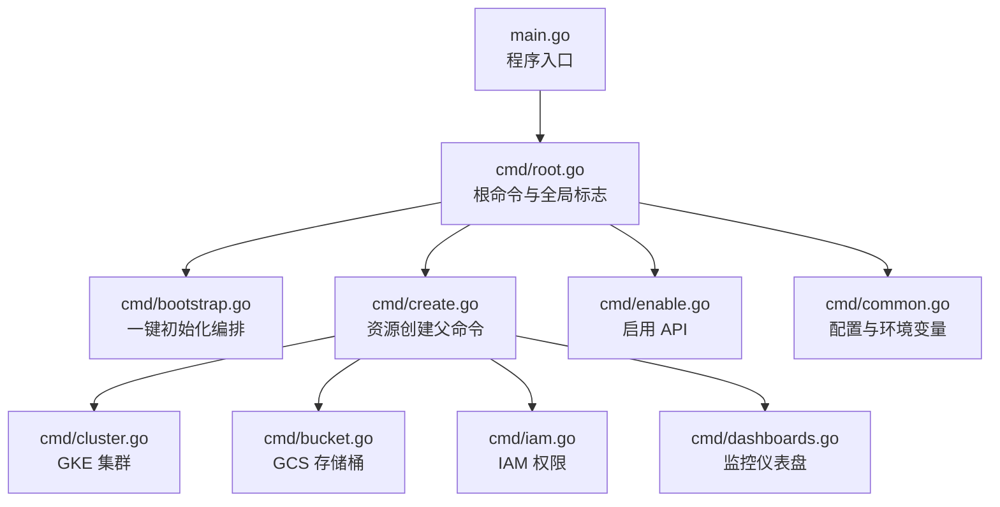
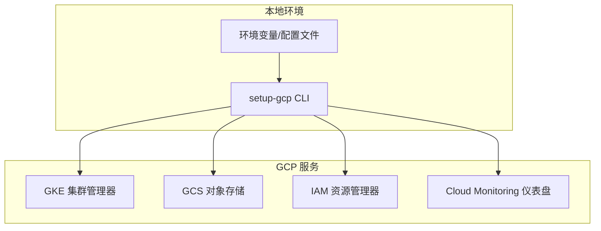
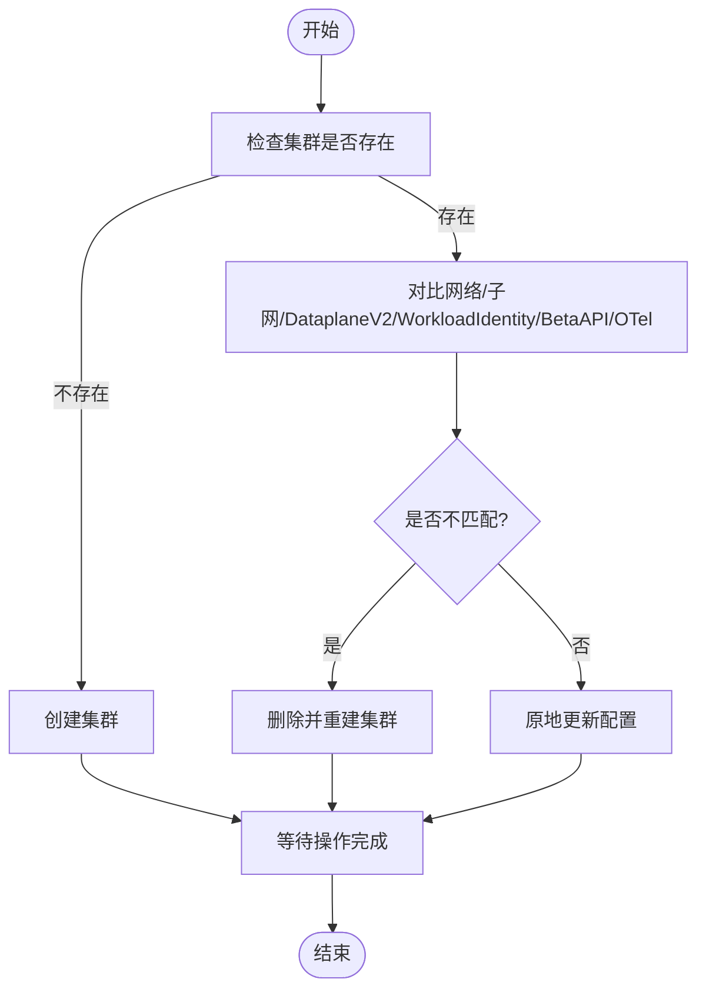
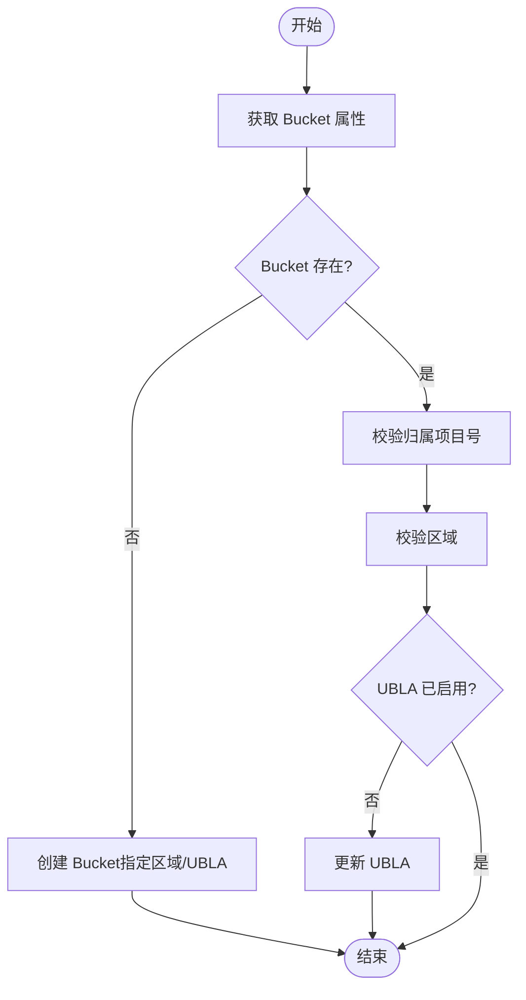
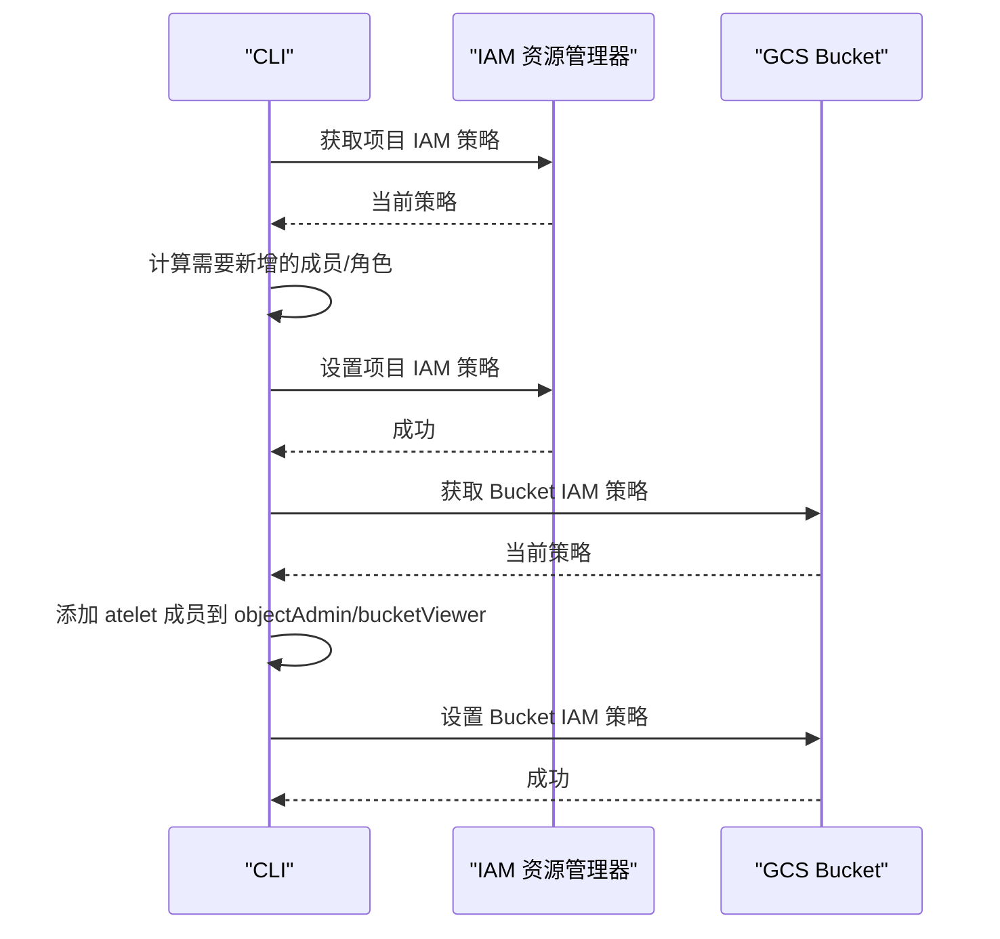
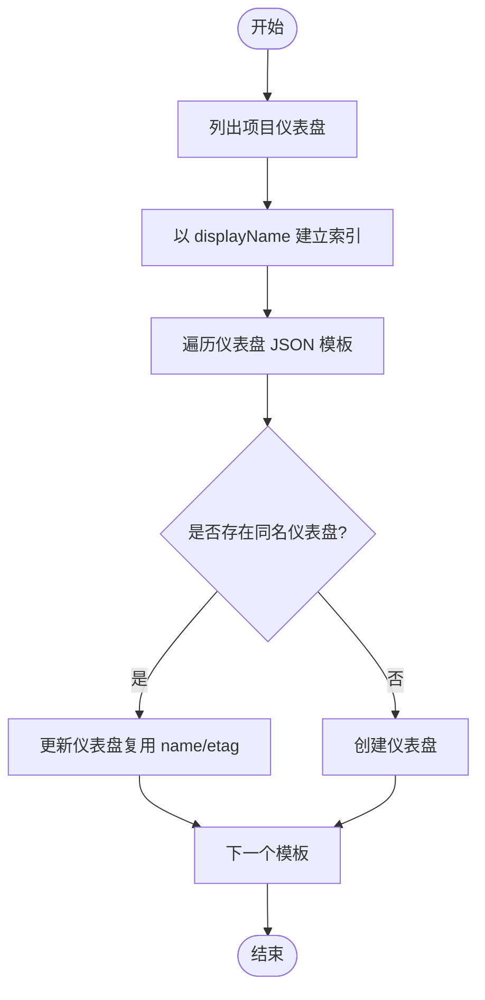
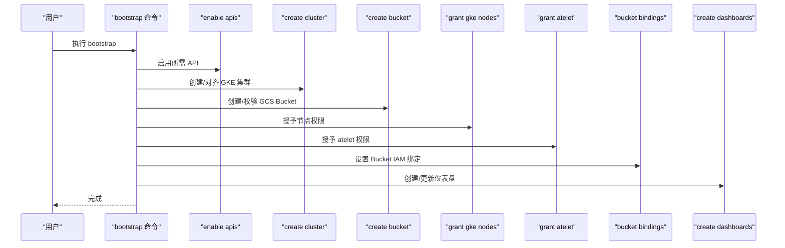
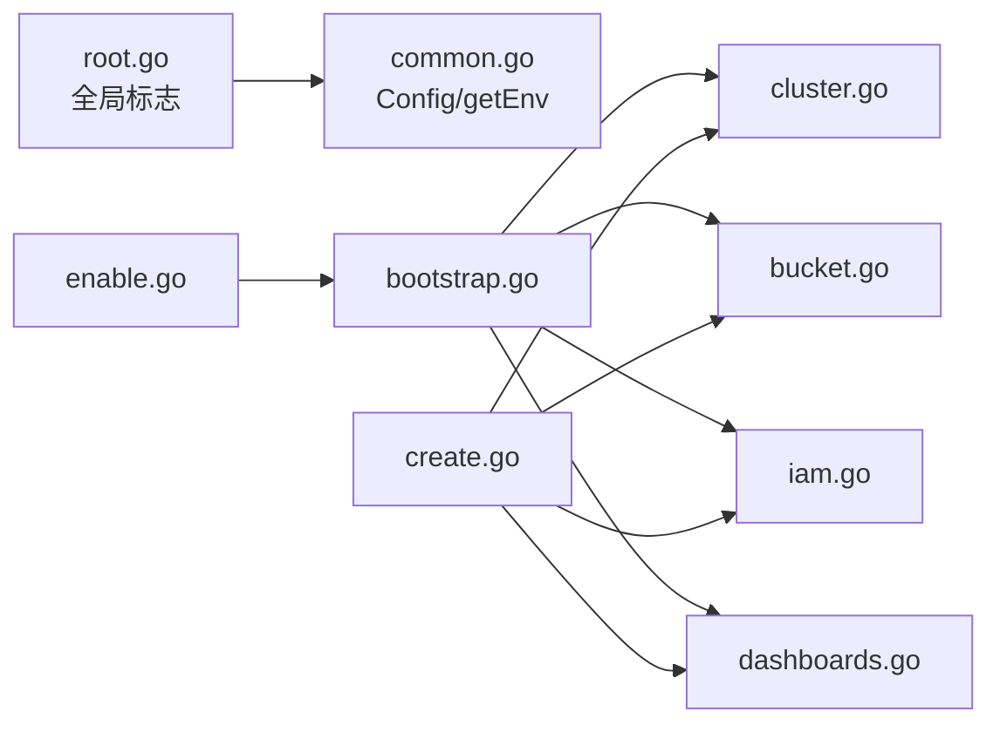

# 云平台集成

<cite>
**本文引用的文件**   
- [tools/setup-gcp/README.md](file://tools/setup-gcp/README.md)
- [tools/setup-gcp/main.go](file://tools/setup-gcp/main.go)
- [tools/setup-gcp/cmd/root.go](file://tools/setup-gcp/cmd/root.go)
- [tools/setup-gcp/cmd/bootstrap.go](file://tools/setup-gcp/cmd/bootstrap.go)
- [tools/setup-gcp/cmd/create.go](file://tools/setup-gcp/cmd/create.go)
- [tools/setup-gcp/cmd/cluster.go](file://tools/setup-gcp/cmd/cluster.go)
- [tools/setup-gcp/cmd/bucket.go](file://tools/setup-gcp/cmd/bucket.go)
- [tools/setup-gcp/cmd/iam.go](file://tools/setup-gcp/cmd/iam.go)
- [tools/setup-gcp/cmd/dashboards.go](file://tools/setup-gcp/cmd/dashboards.go)
- [tools/setup-gcp/cmd/common.go](file://tools/setup-gcp/cmd/common.go)
- [tools/setup-gcp/cmd/enable.go](file://tools/setup-gcp/cmd/enable.go)
</cite>

## 目录
1. [简介](#简介)
2. [项目结构](#项目结构)
3. [核心组件](#核心组件)
4. [架构总览](#架构总览)
5. [详细组件分析](#详细组件分析)
6. [依赖分析](#依赖分析)
7. [性能考虑](#性能考虑)
8. [故障排查指南](#故障排查指南)
9. [结论](#结论)
10. [附录](#附录)

## 简介
本文件面向在云平台上部署与运行 Agent Substrate 的工程师，重点介绍与 Google Cloud Platform（GCP）的深度集成方案，包括：
- GKE 集群的自动化创建与一致性保障
- GCS 对象存储的创建、校验与 IAM 绑定
- IAM 权限管理（节点服务账号、Workload Identity、Bucket 级策略）
- setup-gcp 工具的完整使用方式（bootstrap、create cluster、create bucket、create iam、create dashboards、enable apis）
- 其他云平台（AWS EKS、Azure AKS）的集成思路与最佳实践建议
- 云平台特定性能优化建议

## 项目结构
setup-gcp 工具采用 Cobra CLI 分层命令组织，根命令提供全局参数，子命令按功能拆分。关键入口与职责如下：
- main.go：程序入口，调用 cmd.Execute()
- cmd/root.go：定义根命令与全局标志（project-id、project-number、region）
- cmd/bootstrap.go：一键初始化流程编排（顺序执行 enable APIs、创建集群、创建 Bucket、授予 IAM、创建仪表盘）
- cmd/create.go：资源创建的父命令容器
- cmd/cluster.go：GKE 集群的幂等创建与属性对齐（网络、子网、Dataplane V2、Workload Identity、Beta API、Managed OpenTelemetry）
- cmd/bucket.go：GCS Bucket 的幂等创建与属性校验（区域、统一桶级别访问控制），以及 Bucket 级 IAM 绑定
- cmd/iam.go：项目级 IAM 绑定（GKE 节点、atelet 工作负载）
- cmd/dashboards.go：Cloud Monitoring 仪表盘的幂等创建/更新
- cmd/enable.go：启用所需 GCP API 的命令骨架
- cmd/common.go：配置结构与通用环境变量解析工具

图表来源
- [tools/setup-gcp/main.go:1-30](file://tools/setup-gcp/main.go#L1-L30)
- [tools/setup-gcp/cmd/root.go:1-41](file://tools/setup-gcp/cmd/root.go#L1-L41)
- [tools/setup-gcp/cmd/bootstrap.go:1-97](file://tools/setup-gcp/cmd/bootstrap.go#L1-L97)
- [tools/setup-gcp/cmd/create.go:1-32](file://tools/setup-gcp/cmd/create.go#L1-L32)
- [tools/setup-gcp/cmd/cluster.go:1-298](file://tools/setup-gcp/cmd/cluster.go#L1-L298)
- [tools/setup-gcp/cmd/bucket.go:1-160](file://tools/setup-gcp/cmd/bucket.go#L1-L160)
- [tools/setup-gcp/cmd/iam.go:1-179](file://tools/setup-gcp/cmd/iam.go#L1-L179)
- [tools/setup-gcp/cmd/dashboards.go:1-119](file://tools/setup-gcp/cmd/dashboards.go#L1-L119)
- [tools/setup-gcp/cmd/enable.go:1-46](file://tools/setup-gcp/cmd/enable.go#L1-L46)
- [tools/setup-gcp/cmd/common.go:1-72](file://tools/setup-gcp/cmd/common.go#L1-L72)

章节来源
- [tools/setup-gcp/main.go:1-30](file://tools/setup-gcp/main.go#L1-L30)
- [tools/setup-gcp/cmd/root.go:1-41](file://tools/setup-gcp/cmd/root.go#L1-L41)
- [tools/setup-gcp/cmd/bootstrap.go:1-97](file://tools/setup-gcp/cmd/bootstrap.go#L1-L97)
- [tools/setup-gcp/cmd/create.go:1-32](file://tools/setup-gcp/cmd/create.go#L1-L32)
- [tools/setup-gcp/cmd/cluster.go:1-298](file://tools/setup-gcp/cmd/cluster.go#L1-L298)
- [tools/setup-gcp/cmd/bucket.go:1-160](file://tools/setup-gcp/cmd/bucket.go#L1-L160)
- [tools/setup-gcp/cmd/iam.go:1-179](file://tools/setup-gcp/cmd/iam.go#L1-L179)
- [tools/setup-gcp/cmd/dashboards.go:1-119](file://tools/setup-gcp/cmd/dashboards.go#L1-L119)
- [tools/setup-gcp/cmd/enable.go:1-46](file://tools/setup-gcp/cmd/enable.go#L1-L46)
- [tools/setup-gcp/cmd/common.go:1-72](file://tools/setup-gcp/cmd/common.go#L1-L72)

## 核心组件
- 全局配置与标志
  - 支持通过环境变量或命令行覆盖，优先级：命令行 > 环境变量 > 默认值
  - 全局标志包含项目 ID、项目编号、区域
- 启动器 bootstrap
  - 按固定顺序执行：启用 API → 创建集群 → 创建 Bucket → 授予节点权限 → 授予 atelet 权限 → 设置 Bucket IAM 绑定 → 创建仪表盘
- 资源创建 create
  - cluster：幂等创建 GKE 集群，自动对齐网络、子网、Dataplane V2、Workload Identity、K8s Beta API、Managed OpenTelemetry
  - bucket：幂等创建 GCS Bucket，校验归属项目与区域，确保统一桶级别访问控制
  - iam：为 GKE 节点和 atelet 工作负载授予必要权限；按需设置 Bucket 级 IAM 绑定
  - dashboards：根据 JSON 模板创建或更新 Cloud Monitoring 仪表盘
- 启用 API enable
  - 提供启用所需 GCP API 的命令入口（具体实现由 enableRequiredAPIs 驱动）

章节来源
- [tools/setup-gcp/cmd/common.go:22-42](file://tools/setup-gcp/cmd/common.go#L22-L42)
- [tools/setup-gcp/cmd/root.go:36-41](file://tools/setup-gcp/cmd/root.go#L36-L41)
- [tools/setup-gcp/cmd/bootstrap.go:24-81](file://tools/setup-gcp/cmd/bootstrap.go#L24-L81)
- [tools/setup-gcp/cmd/cluster.go:95-231](file://tools/setup-gcp/cmd/cluster.go#L95-L231)
- [tools/setup-gcp/cmd/bucket.go:31-89](file://tools/setup-gcp/cmd/bucket.go#L31-L89)
- [tools/setup-gcp/cmd/iam.go:51-133](file://tools/setup-gcp/cmd/iam.go#L51-L133)
- [tools/setup-gcp/cmd/dashboards.go:42-102](file://tools/setup-gcp/cmd/dashboards.go#L42-L102)
- [tools/setup-gcp/cmd/enable.go:31-40](file://tools/setup-gcp/cmd/enable.go#L31-L40)

## 架构总览
下图展示了 setup-gcp 工具与 GCP 服务的交互关系及数据流。

图表来源
- [tools/setup-gcp/cmd/cluster.go:95-231](file://tools/setup-gcp/cmd/cluster.go#L95-L231)
- [tools/setup-gcp/cmd/bucket.go:31-89](file://tools/setup-gcp/cmd/bucket.go#L31-L89)
- [tools/setup-gcp/cmd/iam.go:51-133](file://tools/setup-gcp/cmd/iam.go#L51-L133)
- [tools/setup-gcp/cmd/dashboards.go:42-102](file://tools/setup-gcp/cmd/dashboards.go#L42-L102)

## 详细组件分析

### 组件：GKE 集群（幂等创建与对齐）
- 能力
  - 若集群不存在则创建；存在则逐项比对并修复差异（网络、子网、Dataplane V2、Workload Identity、K8s Beta API、Managed OpenTelemetry）
  - 对异步操作进行轮询等待直至完成
- 关键流程
  - 获取集群状态 → 判断缺失/不匹配 → 删除重建或原地更新 → 等待操作完成
- 适用场景
  - 多环境一致化交付、CI/CD 中可重复执行的集群初始化

图表来源
- [tools/setup-gcp/cmd/cluster.go:95-231](file://tools/setup-gcp/cmd/cluster.go#L95-L231)
- [tools/setup-gcp/cmd/cluster.go:233-266](file://tools/setup-gcp/cmd/cluster.go#L233-L266)

章节来源
- [tools/setup-gcp/cmd/cluster.go:39-93](file://tools/setup-gcp/cmd/cluster.go#L39-L93)
- [tools/setup-gcp/cmd/cluster.go:95-231](file://tools/setup-gcp/cmd/cluster.go#L95-L231)
- [tools/setup-gcp/cmd/cluster.go:233-266](file://tools/setup-gcp/cmd/cluster.go#L233-L266)

### 组件：GCS 存储桶（幂等创建与属性校验）
- 能力
  - 若 Bucket 不存在则创建，指定区域并开启统一桶级别访问控制
  - 若存在则校验归属项目与区域，必要时更新访问控制策略
- 关键流程
  - 获取 Bucket 属性 → 校验项目号与区域 → 按需更新 UBLC → 返回
- 适用场景
  - 快照/镜像等对象存储资源的标准化初始化

图表来源
- [tools/setup-gcp/cmd/bucket.go:31-89](file://tools/setup-gcp/cmd/bucket.go#L31-L89)

章节来源
- [tools/setup-gcp/cmd/bucket.go:31-89](file://tools/setup-gcp/cmd/bucket.go#L31-L89)

### 组件：IAM 权限（项目级与工作负载）
- 能力
  - 为 GKE 节点服务账号授予读取制品仓库与对象存储的权限
  - 为 atelet 工作负载（基于 Workload Identity）授予项目级对象存储与制品仓库权限
  - 为 atelet 工作负载授予目标 Bucket 的 objectAdmin 与 bucketViewer 角色
- 关键流程
  - 获取项目 IAM 策略 → 计算变更 → 设置新策略
  - 获取 Bucket IAM 策略 → 添加成员与角色 → 设置新策略
- 适用场景
  - 最小权限原则下的跨服务访问授权

图表来源
- [tools/setup-gcp/cmd/iam.go:51-133](file://tools/setup-gcp/cmd/iam.go#L51-L133)
- [tools/setup-gcp/cmd/bucket.go:91-140](file://tools/setup-gcp/cmd/bucket.go#L91-L140)

章节来源
- [tools/setup-gcp/cmd/iam.go:51-133](file://tools/setup-gcp/cmd/iam.go#L51-L133)
- [tools/setup-gcp/cmd/bucket.go:91-140](file://tools/setup-gcp/cmd/bucket.go#L91-L140)

### 组件：Cloud Monitoring 仪表盘（幂等创建/更新）
- 能力
  - 从 JSON 模板加载仪表盘定义
  - 按 displayName 匹配现有仪表盘：存在则更新，不存在则创建
- 关键流程
  - 列出项目下所有仪表盘 → 构建索引 → 遍历模板 → 创建或更新
- 适用场景
  - 将观测性配置纳入代码库，保证多环境一致

图表来源
- [tools/setup-gcp/cmd/dashboards.go:42-102](file://tools/setup-gcp/cmd/dashboards.go#L42-L102)

章节来源
- [tools/setup-gcp/cmd/dashboards.go:42-102](file://tools/setup-gcp/cmd/dashboards.go#L42-L102)

### 组件：Bootstrap 编排（一键初始化）
- 能力
  - 校验必要参数（项目 ID、项目编号、Bucket 名称）
  - 顺序执行：启用 API → 创建集群 → 创建 Bucket → 授予节点权限 → 授予 atelet 权限 → 设置 Bucket IAM 绑定 → 创建仪表盘
- 适用场景
  - 首次环境搭建或 CI/CD 流水线中的端到端初始化

图表来源
- [tools/setup-gcp/cmd/bootstrap.go:24-81](file://tools/setup-gcp/cmd/bootstrap.go#L24-L81)

章节来源
- [tools/setup-gcp/cmd/bootstrap.go:24-81](file://tools/setup-gcp/cmd/bootstrap.go#L24-L81)

### 组件：启用 API（命令入口）
- 能力
  - 提供 enable apis 子命令入口，要求传入项目 ID
- 说明
  - 实际启用逻辑由 enableRequiredAPIs 函数驱动（此处展示命令层）

章节来源
- [tools/setup-gcp/cmd/enable.go:31-40](file://tools/setup-gcp/cmd/enable.go#L31-L40)

## 依赖分析
- 外部依赖
  - GKE 集群管理：container 客户端
  - GCS 对象存储：storage 客户端
  - IAM 资源管理：resourcemanager 与 iam 客户端
  - Cloud Monitoring：dashboard 客户端
- 内部耦合
  - 各子命令共享 Config 结构体与 getEnv 工具
  - bootstrap 编排组合多个子命令的实现函数

图表来源
- [tools/setup-gcp/cmd/root.go:1-41](file://tools/setup-gcp/cmd/root.go#L1-L41)
- [tools/setup-gcp/cmd/common.go:1-72](file://tools/setup-gcp/cmd/common.go#L1-L72)
- [tools/setup-gcp/cmd/bootstrap.go:1-97](file://tools/setup-gcp/cmd/bootstrap.go#L1-L97)
- [tools/setup-gcp/cmd/create.go:1-32](file://tools/setup-gcp/cmd/create.go#L1-L32)
- [tools/setup-gcp/cmd/cluster.go:1-298](file://tools/setup-gcp/cmd/cluster.go#L1-L298)
- [tools/setup-gcp/cmd/bucket.go:1-160](file://tools/setup-gcp/cmd/bucket.go#L1-L160)
- [tools/setup-gcp/cmd/iam.go:1-179](file://tools/setup-gcp/cmd/iam.go#L1-L179)
- [tools/setup-gcp/cmd/dashboards.go:1-119](file://tools/setup-gcp/cmd/dashboards.go#L1-L119)
- [tools/setup-gcp/cmd/enable.go:1-46](file://tools/setup-gcp/cmd/enable.go#L1-L46)

章节来源
- [tools/setup-gcp/cmd/common.go:1-72](file://tools/setup-gcp/cmd/common.go#L1-L72)
- [tools/setup-gcp/cmd/bootstrap.go:1-97](file://tools/setup-gcp/cmd/bootstrap.go#L1-L97)
- [tools/setup-gcp/cmd/cluster.go:1-298](file://tools/setup-gcp/cmd/cluster.go#L1-L298)
- [tools/setup-gcp/cmd/bucket.go:1-160](file://tools/setup-gcp/cmd/bucket.go#L1-L160)
- [tools/setup-gcp/cmd/iam.go:1-179](file://tools/setup-gcp/cmd/iam.go#L1-L179)
- [tools/setup-gcp/cmd/dashboards.go:1-119](file://tools/setup-gcp/cmd/dashboards.go#L1-L119)
- [tools/setup-gcp/cmd/enable.go:1-46](file://tools/setup-gcp/cmd/enable.go#L1-L46)

## 性能考虑
- GKE 集群
  - 合理选择节点池机器类型与初始节点数，避免冷启动延迟
  - 启用 Dataplane V2 以获得更高吞吐与更低延迟的数据面路径
  - 使用 Managed OpenTelemetry 采集指标与遥测，减少自建开销
- GCS 对象存储
  - 选择靠近集群的区域以降低跨区延迟
  - 开启统一桶级别访问控制（UBLA）简化权限模型
  - 针对大对象与频繁写入场景，结合压缩与分片策略
- IAM 与鉴权
  - 优先使用 Workload Identity 而非长期密钥，降低轮换成本与泄露风险
  - 遵循最小权限原则，仅授予必要角色与作用域
- 监控与可观测性
  - 利用预置仪表盘快速定位瓶颈，结合日志与链路追踪进行根因分析

[本节为通用指导，无需源码引用]

## 故障排查指南
- 常见错误与处理
  - 缺少必要参数：如未提供 project-id、project-number、bucket-name 等，需按提示补充
  - 集群网络/子网不匹配：工具会尝试删除并重建，确认 VPC 与子网配置正确
  - Bucket 归属项目不一致：当 Bucket 属于其他项目时会报错，请更换 Bucket 名称或切换项目
  - 操作超时或失败：关注异步操作的错误信息，必要时重试或检查配额限制
- 诊断建议
  - 查看工具输出日志，定位具体步骤与错误码
  - 在 GCP 控制台核对资源状态与权限绑定
  - 验证 ADC 认证与 gcloud 登录状态

章节来源
- [tools/setup-gcp/cmd/bootstrap.go:28-37](file://tools/setup-gcp/cmd/bootstrap.go#L28-L37)
- [tools/setup-gcp/cmd/cluster.go:117-145](file://tools/setup-gcp/cmd/cluster.go#L117-L145)
- [tools/setup-gcp/cmd/bucket.go:61-71](file://tools/setup-gcp/cmd/bucket.go#L61-L71)
- [tools/setup-gcp/cmd/cluster.go:233-266](file://tools/setup-gcp/cmd/cluster.go#L233-L266)

## 结论
setup-gcp 工具为 Agent Substrate 在 GCP 上的基础设施提供了幂等、可重复的一键初始化能力，涵盖 GKE、GCS、IAM 与监控仪表盘的关键环节。通过合理的参数与环境变量管理，可在多环境中保持一致的交付质量。对于非 GCP 平台，可参考本文提供的集成思路与最佳实践进行适配。

[本节为总结性内容，无需源码引用]

## 附录

### setup-gcp 使用速查
- 前置条件
  - 安装 Go 与 gcloud，并完成应用默认凭据（ADC）登录
  - 准备具备足够权限的目标 GCP 项目
- 常用命令
  - 启用 API：setup-gcp enable apis
  - 创建集群：setup-gcp create cluster
  - 创建 Bucket：setup-gcp create bucket
  - 配置 IAM：setup-gcp create iam
  - 创建仪表盘：setup-gcp create dashboards
  - 一键初始化：setup-gcp bootstrap
- 全局标志与环境变量
  - --project-id / PROJECT_ID
  - --project-number / PROJECT_NUMBER
  - --region / GCE_REGION
  - 其他子命令标志详见 README

章节来源
- [tools/setup-gcp/README.md:1-175](file://tools/setup-gcp/README.md#L1-L175)
- [tools/setup-gcp/cmd/root.go:36-41](file://tools/setup-gcp/cmd/root.go#L36-L41)

### 其他云平台集成指南（概念性）
- AWS EKS
  - 使用 eksctl 或 Terraform 创建 EKS 集群，启用 IRSA（IAM Roles for Service Accounts）替代长期密钥
  - 使用 S3 作为对象存储，按命名空间或服务粒度授予最小权限
  - 使用 CloudWatch/OpenTelemetry 收集指标与日志
- Azure AKS
  - 使用 az aks 或 Terraform 创建 AKS 集群，启用 Workload Identity（Azure AD Workload Identity）
  - 使用 Azure Blob Storage 作为对象存储，按作用域授予最小权限
  - 使用 Azure Monitor/OpenTelemetry 收集指标与日志
- 通用建议
  - 使用基础设施即代码（IaC）管理资源，保持幂等与可回滚
  - 遵循最小权限原则，定期审计与回收权限
  - 将监控与告警纳入发布流水线，确保问题早发现早处置

[本节为概念性内容，无需源码引用]
