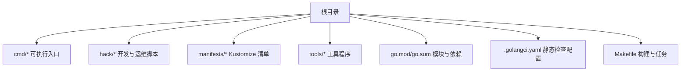
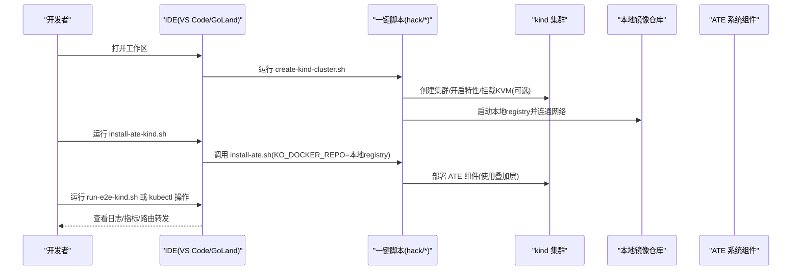
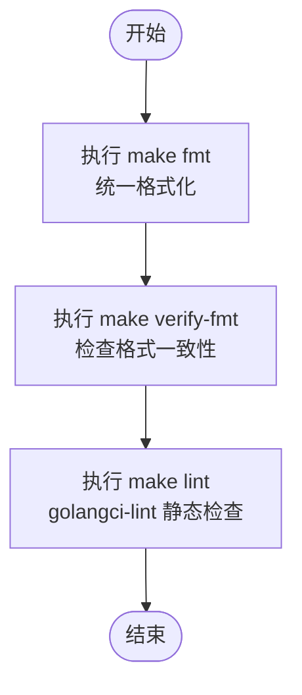
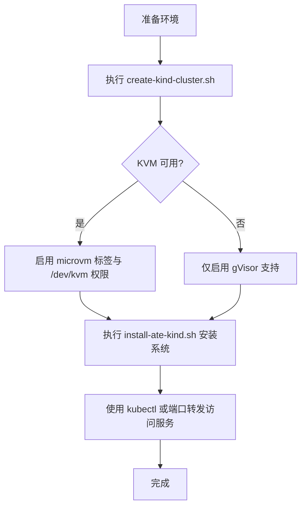
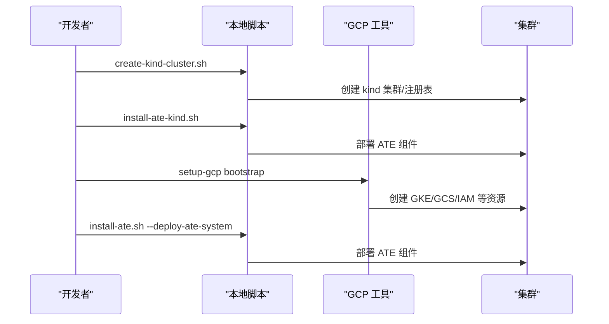
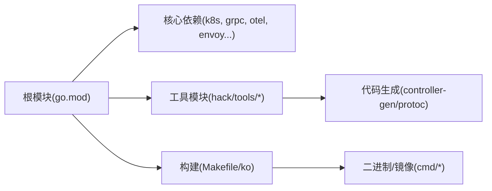

# IDE集成配置

<cite>
**本文引用的文件**   
- [README.md](file://README.md)
- [Makefile](file://Makefile)
- [go.mod](file://go.mod)
- [.golangci.yaml](file://.golangci.yaml)
- [create-kind-cluster.sh](file://hack/create-kind-cluster.sh)
- [install-ate-kind.sh](file://hack/install-ate-kind.sh)
- [install-ate.sh](file://hack/install-ate.sh)
- [run-e2e-kind.sh](file://hack/run-e2e-kind.sh)
- [teardown.sh](file://hack/teardown.sh)
- [delete-kind-cluster.sh](file://hack/delete-kind-cluster.sh)
- [kind.sh](file://hack/kind.sh)
- [protoc.sh](file://hack/protoc.sh)
- [update-all.sh](file://hack/update-all.sh)
- [verify-all.sh](file://hack/verify-all.sh)
- [tools/setup-gcp/main.go](file://tools/setup-gcp/main.go)
- [tools/setup-gcp/README.md](file://tools/setup-gcp/README.md)
</cite>

## 目录
1. [简介](#简介)
2. [项目结构](#项目结构)
3. [核心组件](#核心组件)
4. [架构总览](#架构总览)
5. [详细组件分析](#详细组件分析)
6. [依赖分析](#依赖分析)
7. [性能考虑](#性能考虑)
8. [故障排查指南](#故障排查指南)
9. [结论](#结论)
10. [附录](#附录)

## 简介
本文件面向在本地开发 Agent Substrate 的工程师，提供 VS Code 与 GoLand 的一体化 IDE 配置方案，覆盖代码格式化、静态分析、调试、Go 模块管理、依赖检查与补全最佳实践，并给出与 Kubernetes 本地集群（kind）集成的快速启动与连接设置。文档同时说明一键脚本的使用方式，帮助你在最短时间内搭建可运行的开发环境。

## 项目结构
仓库采用多命令二进制 + 控制器 + 工具脚本的组织方式：
- cmd 下包含多个独立的可执行程序入口（如 ateapi、atenet、atecontroller、kubectl-ate 等）
- hack 下集中了构建、验证、安装、E2E 与 kind 相关的脚本
- manifests 提供 Kustomize 清单与 Kind 叠加层
- tools 提供 GCP 资源编排工具
- go.mod 定义根模块与依赖版本

**章节来源**
- [README.md:89-125](file://README.md#L89-L125)
- [Makefile:38-99](file://Makefile#L38-L99)
- [go.mod:1-60](file://go.mod#L1-L60)

## 核心组件
- 构建与任务
  - Makefile 封装了镜像构建、CLI 构建、测试、格式化、校验与 E2E 流程
- 静态分析与格式化
  - .golangci.yaml 统一启用标准 linters 与拼写检查，并对生成代码与测试路径做排除
  - hack/update/gofmt.sh 与 hack/verify/gofmt.sh 驱动 gofmt 格式化与校验
- 本地集群与安装
  - hack/create-kind-cluster.sh 创建 kind 集群、本地 registry、特性开关与微 VM 支持
  - hack/install-ate-kind.sh 基于 Kustomize 叠加层安装到 kind
  - hack/install-ate.sh 通用安装入口（被 install-ate-kind.sh 调用）
- 工具链
  - tools/setup-gcp 用于 GKE/GCS/IAM 等资源的一键初始化
  - hack/protoc.sh 用于 proto 生成
  - hack/run-e2e-kind.sh 运行端到端测试

**章节来源**
- [Makefile:38-99](file://Makefile#L38-L99)
- [.golangci.yaml:1-110](file://.golangci.yaml#L1-L110)
- [create-kind-cluster.sh:1-139](file://hack/create-kind-cluster.sh#L1-L139)
- [install-ate-kind.sh:1-39](file://hack/install-ate-kind.sh#L1-L39)
- [install-ate.sh](file://hack/install-ate.sh)
- [tools/setup-gcp/main.go:1-29](file://tools/setup-gcp/main.go#L1-L29)
- [tools/setup-gcp/README.md:1-88](file://tools/setup-gcp/README.md#L1-L88)
- [protoc.sh](file://hack/protoc.sh)
- [run-e2e-kind.sh](file://hack/run-e2e-kind.sh)

## 架构总览
下图展示 IDE 与本地 kind 集群之间的交互关系，以及常用脚本的调用顺序。

**图表来源**
- [create-kind-cluster.sh:1-139](file://hack/create-kind-cluster.sh#L1-L139)
- [install-ate-kind.sh:1-39](file://hack/install-ate-kind.sh#L1-L39)
- [install-ate.sh](file://hack/install-ate.sh)
- [run-e2e-kind.sh](file://hack/run-e2e-kind.sh)

## 详细组件分析

### VS Code 配置建议
- 工作区与插件
  - 使用“打开文件夹”方式打开仓库根目录
  - 推荐安装 Go 扩展、YAML、JSON、Markdown 等基础语言包
- 代码格式化
  - 将默认格式化工具设置为 gofmt；保存时自动格式化
  - 通过 Makefile 的 fmt 目标统一格式化：make fmt
- 静态分析
  - 在终端中运行 make lint 以 golangci-lint 进行校验
  - 也可在编辑器中集成 golangci-lint 输出面板
- 调试配置
  - 为每个 cmd 下的主程序添加 launch.json 配置，指定工作目录与参数
  - 示例入口：cmd/ateapi、cmd/atenet、cmd/atecontroller、cmd/kubectl-ate
- Go 模块与补全
  - 确保 GOPROXY 可用；必要时设置 GOFLAGS=-mod=mod
  - 使用 go mod tidy 同步依赖
- 与 kind 集成
  - 先运行 hack/create-kind-cluster.sh 再运行 hack/install-ate-kind.sh
  - 如需端口转发，参考 README 中的示例

**章节来源**
- [Makefile:78-94](file://Makefile#L78-L94)
- [.golangci.yaml:1-110](file://.golangci.yaml#L1-L110)
- [README.md:97-125](file://README.md#L97-L125)

### GoLand 配置建议
- 工程与 SDK
  - 选择仓库根目录作为项目根；SDK 版本与 go.mod 一致
- 代码风格与检查
  - 启用 gofmt 作为默认格式化器
  - 在 Settings 中启用 golangci-lint 集成，或直接使用外部工具调用 make lint
- 调试配置
  - 为各 cmd 入口创建 Run/Debug Configuration，设置 Working directory 为仓库根
- 模块与依赖
  - 启用 Go Modules 支持；必要时设置 GOPROXY
  - 使用内置工具执行 go mod tidy / go mod verify
- 与 kind 集成
  - 在 Terminal 中依次执行 create-kind-cluster.sh 与 install-ate-kind.sh
  - 使用内置终端运行 kubectl 命令

**章节来源**
- [go.mod:1-10](file://go.mod#L1-L10)
- [Makefile:78-94](file://Makefile#L78-L94)
- [README.md:97-125](file://README.md#L97-L125)

### 代码格式化与静态分析
- 格式化
  - 使用 make fmt 对全项目进行 gofmt 格式化
  - 使用 make verify-fmt 检查是否已正确格式化
- 静态分析
  - 使用 make lint 运行 golangci-lint
  - .golangci.yaml 启用了 errcheck、govet、ineffassign、staticcheck、unused 与 misspell，并对生成代码与测试路径做了合理排除

**图表来源**
- [Makefile:78-94](file://Makefile#L78-L94)
- [.golangci.yaml:1-110](file://.golangci.yaml#L1-L110)

**章节来源**
- [Makefile:78-94](file://Makefile#L78-L94)
- [.golangci.yaml:1-110](file://.golangci.yaml#L1-L110)

### Go 模块管理与依赖检查最佳实践
- 版本对齐
  - 保持本地 Go 版本与 go.mod 声明一致
- 依赖更新
  - 使用 make update-all 或 hack/update-all.sh 更新工具链与依赖
  - 使用 go mod tidy 清理未使用的依赖
- 校验
  - 使用 go mod verify 校验依赖完整性
  - 使用 make verify 触发完整验证流程（含测试与校验脚本）

**章节来源**
- [go.mod:1-10](file://go.mod#L1-L10)
- [Makefile:92-94](file://Makefile#L92-L94)
- [update-all.sh](file://hack/update-all.sh)

### 调试配置要点
- 本地运行入口
  - 常见入口：cmd/ateapi、cmd/atenet、cmd/atecontroller、cmd/kubectl-ate
- 环境变量
  - 若需连接本地 kind，请确保 kubeconfig 指向当前 kind 集群
  - 某些组件需要 KO_DOCKER_REPO 指向本地 registry（安装阶段由脚本设置）
- 断点与日志
  - 建议在关键控制面入口与控制器 Reconcile 处设置断点
  - 结合 kubectl logs 与 Prometheus/Grafana（如有）定位问题

**章节来源**
- [README.md:211-225](file://README.md#L211-L225)
- [install-ate-kind.sh:22-36](file://hack/install-ate-kind.sh#L22-L36)

### 与 Kubernetes 本地集群（kind）集成
- 快速启动
  - 运行 hack/create-kind-cluster.sh 创建集群、本地 registry、特性开关与 KVM 支持（若可用）
  - 运行 hack/install-ate-kind.sh 安装 ATE 系统（使用 Kustomize 叠加层）
- 连接与访问
  - 使用 kubectl 直接访问集群
  - 如需对外暴露服务，参考 README 中的端口转发示例
- 清理
  - 运行 hack/delete-kind-cluster.sh 删除集群与本地 registry

**图表来源**
- [create-kind-cluster.sh:45-108](file://hack/create-kind-cluster.sh#L45-L108)
- [install-ate-kind.sh:22-36](file://hack/install-ate-kind.sh#L22-L36)

**章节来源**
- [create-kind-cluster.sh:1-139](file://hack/create-kind-cluster.sh#L1-L139)
- [install-ate-kind.sh:1-39](file://hack/install-ate-kind.sh#L1-L39)
- [delete-kind-cluster.sh](file://hack/delete-kind-cluster.sh)
- [README.md:97-125](file://README.md#L97-L125)

### 一键脚本使用方法
- 本地 kind 环境
  - 创建集群与本地 registry：hack/create-kind-cluster.sh
  - 安装 ATE 系统：hack/install-ate-kind.sh
  - 运行 E2E：hack/run-e2e-kind.sh
  - 清理：hack/teardown.sh 或 hack/delete-kind-cluster.sh
- GKE 环境（GCP）
  - 初始化 GCP 资源：go run ./tools/setup-gcp bootstrap
  - 部署系统：./hack/install-ate.sh --deploy-ate-system
  - 清理：./hack/teardown.sh --all

**图表来源**
- [create-kind-cluster.sh:1-139](file://hack/create-kind-cluster.sh#L1-L139)
- [install-ate-kind.sh:1-39](file://hack/install-ate-kind.sh#L1-L39)
- [tools/setup-gcp/main.go:1-29](file://tools/setup-gcp/main.go#L1-L29)
- [tools/setup-gcp/README.md:1-88](file://tools/setup-gcp/README.md#L1-L88)
- [install-ate.sh](file://hack/install-ate.sh)
- [teardown.sh](file://hack/teardown.sh)

**章节来源**
- [README.md:97-186](file://README.md#L97-L186)
- [tools/setup-gcp/README.md:1-88](file://tools/setup-gcp/README.md#L1-L88)

## 依赖分析
- 根模块与版本
  - go.mod 定义了模块名与 Go 版本，以及核心依赖（Kubernetes、gRPC、OpenTelemetry、Envoy 控制面等）
- 工具链
  - hack/tools 下包含 controller-gen、golangci-lint、kind、ko、setup-envtest 等工具的独立 go.mod
- 构建产物
  - Makefile 通过 ko 构建镜像，并通过 go build 生成 CLI 二进制

**图表来源**
- [go.mod:1-60](file://go.mod#L1-L60)
- [Makefile:38-61](file://Makefile#L38-L61)

**章节来源**
- [go.mod:1-60](file://go.mod#L1-L60)
- [Makefile:38-61](file://Makefile#L38-L61)

## 性能考虑
- 本地开发优先使用 kind 与本地 registry，减少镜像拉取时间
- 合理使用断点与日志级别，避免在热路径打印过多信息
- 在控制器与 API 服务器中关注 goroutine 与内存占用，必要时使用 pprof

[本节为通用指导，不直接分析具体文件]

## 故障排查指南
- 无法连接到 kind 集群
  - 确认 kubeconfig 指向正确的集群上下文
  - 重新运行 create-kind-cluster.sh 重建集群与本地 registry
- 镜像推送失败
  - 检查本地 registry 是否运行且端口映射正常
  - 确认 KO_DOCKER_REPO 指向 localhost:5001（install-ate-kind.sh 已设置）
- 静态分析报错
  - 使用 make fmt 修复格式问题
  - 使用 make lint 查看具体规则与位置，按 .golangci.yaml 的排除策略理解误报
- 清理残留
  - 使用 hack/teardown.sh 或 hack/delete-kind-cluster.sh 清理资源

**章节来源**
- [create-kind-cluster.sh:26-43](file://hack/create-kind-cluster.sh#L26-L43)
- [install-ate-kind.sh:22-36](file://hack/install-ate-kind.sh#L22-L36)
- [Makefile:78-94](file://Makefile#L78-L94)
- [teardown.sh](file://hack/teardown.sh)
- [delete-kind-cluster.sh](file://hack/delete-kind-cluster.sh)

## 结论
通过统一的 Makefile 任务、golangci-lint 规范与一键脚本，开发者可以在 VS Code 或 GoLand 中获得一致的格式化、静态分析与调试体验。配合 kind 与本地 registry，能够快速搭建可运行的本地集群并完成端到端验证。遵循本文档的最佳实践，有助于提升本地开发效率与代码质量。

[本节为总结性内容，不直接分析具体文件]

## 附录
- 常用命令速查
  - 格式化：make fmt
  - 校验格式：make verify-fmt
  - 静态分析：make lint
  - 构建镜像：make build-images
  - 构建 CLI：make build-atectl
  - 运行测试：make test
  - 运行 E2E：make e2e
  - 更新工具链：bash hack/update-all.sh
  - 完整验证：make verify

**章节来源**
- [Makefile:38-99](file://Makefile#L38-L99)
- [update-all.sh](file://hack/update-all.sh)
