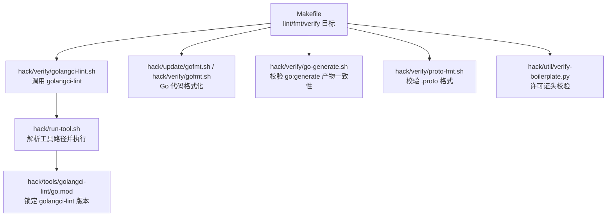
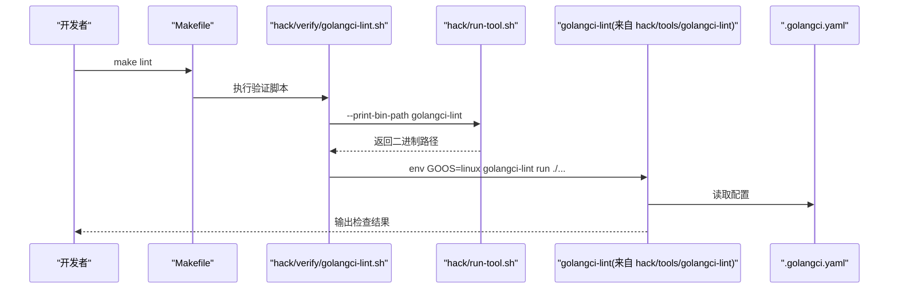
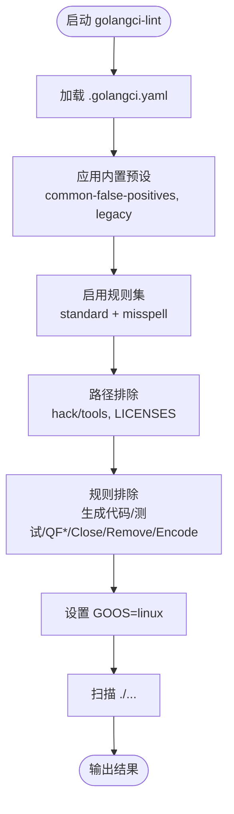
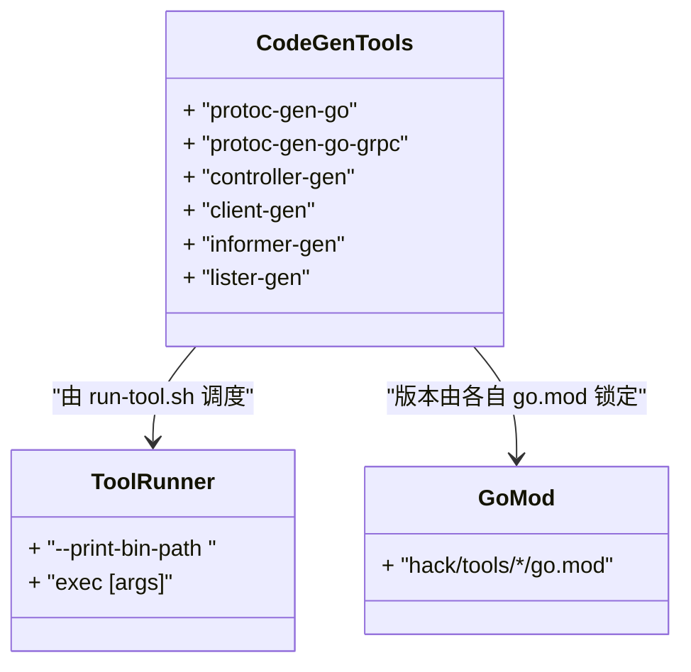
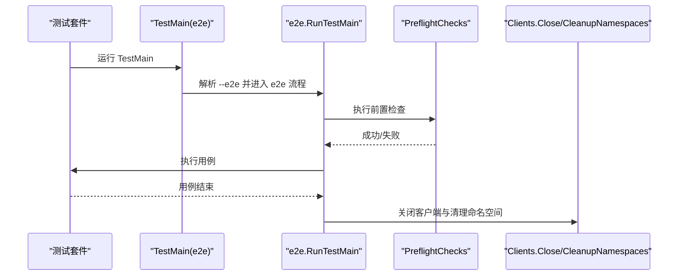
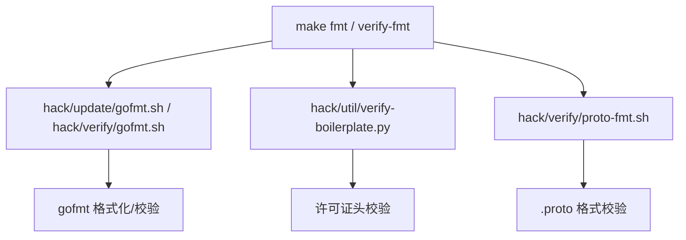
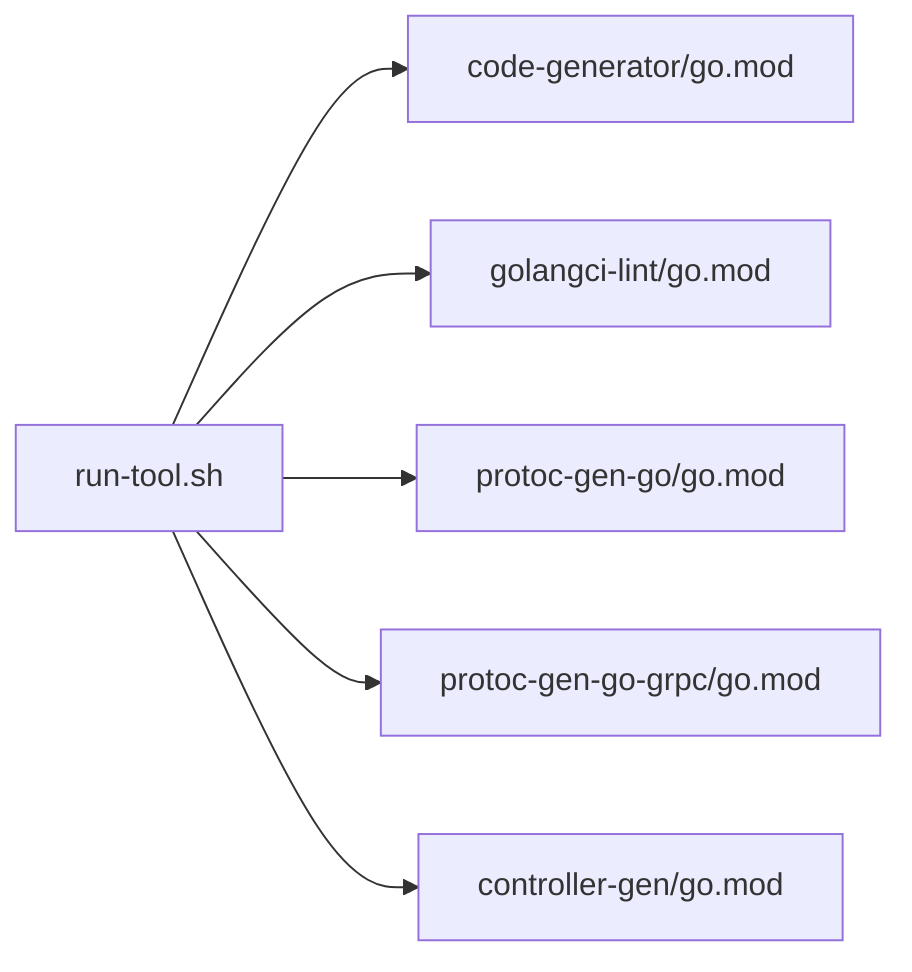

# 代码质量工具

<cite>
**本文引用的文件**   
- [.golangci.yaml](file://.golangci.yaml)
- [Makefile](file://Makefile)
- [hack/verify/golangci-lint.sh](file://hack/verify/golangci-lint.sh)
- [hack/run-tool.sh](file://hack/run-tool.sh)
- [hack/tools/golangci-lint/go.mod](file://hack/tools/golangci-lint/go.mod)
- [hack/tools/code-generator/go.mod](file://hack/tools/code-generator/go.mod)
- [hack/tools/controller-gen/go.mod](file://hack/tools/controller-gen/go.mod)
- [hack/tools/protoc-gen-go/go.mod](file://hack/tools/protoc-gen-go/go.mod)
- [hack/tools/protoc-gen-go-grpc/go.mod](file://hack/tools/protoc-gen-go-grpc/go.mod)
- [hack/update/gofmt.sh](file://hack/update/gofmt.sh)
- [hack/verify/go-generate.sh](file://hack/verify/go-generate.sh)
- [hack/verify/proto-fmt.sh](file://hack/verify/proto-fmt.sh)
- [hack/util/verify-boilerplate.py](file://hack/util/verify-boilerplate.py)
- [internal/e2e/README.md](file://internal/e2e/README.md)
- [internal/e2e/testmain.go](file://internal/e2e/testmain.go)
- [cmd/ateapi/internal/store/storetest/storetest.go](file://cmd/ateapi/internal/store/storetest/storetest.go)
</cite>

## 目录
1. [简介](#简介)
2. [项目结构](#项目结构)
3. [核心组件](#核心组件)
4. [架构总览](#架构总览)
5. [详细组件分析](#详细组件分析)
6. [依赖分析](#依赖分析)
7. [性能考虑](#性能考虑)
8. [故障排查指南](#故障排查指南)
9. [结论](#结论)
10. [附录](#附录)

## 简介
本文件面向 Agent Substrate 的代码质量工具链，系统性说明以下能力：
- golangci-lint 的配置与使用：包括默认规则集、自定义规则、排除策略、跨平台类型检查优化与并行执行建议。
- 代码生成工具的集成：Protocol Buffers（protoc-gen-go、protoc-gen-go-grpc）、CRD 定义与客户端代码生成（controller-gen、client-gen/informer-gen/lister-gen）。
- 单元测试与集成测试框架配置：测试入口、E2E 开关、测试数据管理与 Mock 策略。
- 代码格式化与许可证检查的自动化流程：gofmt、boilerplate 校验、proto 格式校验等。

## 项目结构
本项目将“工具”与“被检代码”解耦：
- 根模块包含业务代码与测试；
- hack/tools 下每个工具拥有独立 go.mod，通过统一脚本 run-tool.sh 解析并执行对应二进制；
- Makefile 暴露 lint、fmt、verify 等常用目标；
- hack/verify 与 hack/update 提供验证与更新脚本；
- internal/e2e 提供端到端测试框架与约定。

图表来源
- [Makefile:86-94](file://Makefile#L86-L94)
- [hack/verify/golangci-lint.sh:17-31](file://hack/verify/golangci-lint.sh#L17-L31)
- [hack/run-tool.sh:33-51](file://hack/run-tool.sh#L33-L51)
- [hack/tools/golangci-lint/go.mod:1-10](file://hack/tools/golangci-lint/go.mod#L1-L10)
- [hack/update/gofmt.sh:17-48](file://hack/update/gofmt.sh#L17-L48)
- [hack/verify/go-generate.sh:17-22](file://hack/verify/go-generate.sh#L17-L22)
- [hack/verify/proto-fmt.sh:17-22](file://hack/verify/proto-fmt.sh#L17-L22)
- [hack/util/verify-boilerplate.py:88-139](file://hack/util/verify-boilerplate.py#L88-L139)

章节来源
- [Makefile:86-94](file://Makefile#L86-L94)

## 核心组件
- golangci-lint 配置与运行
  - 配置文件位于根目录，启用标准规则集并扩展拼写检查；对生成的代码、Kubernetes 客户端生成物、测试文件等进行针对性排除；针对常见模式（如 Close、Remove、json.Encoder.Encode）放宽错误检查。
  - 运行脚本在 CI 与本地均强制 GOOS=linux，避免 macOS 上平台相关包导致 typecheck 失败而抑制其他问题。
- 代码生成工具
  - Protocol Buffers：protoc-gen-go 与 protoc-gen-go-grpc 分别以独立工具模块管理；
  - CRD 与客户端：controller-gen 用于 CRD/OpenAPI 生成，code-generator 下的 client-gen/informer-gen/lister-gen 用于 Kubernetes 客户端生成。
- 测试框架
  - 单元/集成测试遵循 go test；E2E 测试通过 --e2e 开关控制，TestMain 中完成前置检查与资源清理。
  - 存储层测试采用 miniredis 作为内存 Redis 实现，配合 go-redis 客户端进行真实协议交互的轻量级集成测试。
- 格式化与许可证
  - gofmt 统一格式化；boilerplate 脚本校验源文件头部许可证声明；proto-fmt 校验 proto 格式。

章节来源
- [.golangci.yaml:15-110](file://.golangci.yaml#L15-L110)
- [hack/verify/golangci-lint.sh:17-31](file://hack/verify/golangci-lint.sh#L17-L31)
- [hack/tools/protoc-gen-go/go.mod:1-8](file://hack/tools/protoc-gen-go/go.mod#L1-L8)
- [hack/tools/protoc-gen-go-grpc/go.mod:1-11](file://hack/tools/protoc-gen-go-grpc/go.mod#L1-L11)
- [hack/tools/controller-gen/go.mod:1-53](file://hack/tools/controller-gen/go.mod#L1-L53)
- [hack/tools/code-generator/go.mod:1-22](file://hack/tools/code-generator/go.mod#L1-L22)
- [internal/e2e/README.md:1-42](file://internal/e2e/README.md#L1-L42)
- [internal/e2e/testmain.go:50-82](file://internal/e2e/testmain.go#L50-L82)
- [cmd/ateapi/internal/store/storetest/storetest.go:1-47](file://cmd/ateapi/internal/store/storetest/storetest.go#L1-L47)
- [hack/update/gofmt.sh:17-48](file://hack/update/gofmt.sh#L17-L48)
- [hack/util/verify-boilerplate.py:88-139](file://hack/util/verify-boilerplate.py#L88-L139)

## 架构总览
下图展示了从 Makefile 到具体工具的执行链路，以及关键配置与工具模块的关系。

图表来源
- [Makefile:86-94](file://Makefile#L86-L94)
- [hack/verify/golangci-lint.sh:17-31](file://hack/verify/golangci-lint.sh#L17-L31)
- [hack/run-tool.sh:33-51](file://hack/run-tool.sh#L33-L51)
- [hack/tools/golangci-lint/go.mod:1-10](file://hack/tools/golangci-lint/go.mod#L1-L10)
- [.golangci.yaml:15-110](file://.golangci.yaml#L15-L110)

## 详细组件分析

### golangci-lint 配置与使用
- 规则集与扩展
  - 默认启用 standard 预设（errcheck、govet、ineffassign、staticcheck、unused），并额外启用 misspell 拼写检查。
  - misspell 设置为仅检查注释（restricted），忽略特定词（如 cancelled）。
- 排除策略
  - 内置预设 common-false-positives、legacy 减少误报。
  - 路径排除：hack/tools、LICENSES。
  - 规则排除：
    - 生成的代码（*.pb.go、*.pb.gw.go、zz_generated.*.go）与 pkg/client/* 完全跳过 errcheck/govet/ineffassign/staticcheck/unused。
    - _test.go 放宽 errcheck。
    - staticcheck 的 QF* 快速修复类提示被屏蔽。
    - 针对 Close()/os.Remove()/json.Encoder.Encode 的错误忽略采用文本模式匹配，覆盖常见 defer 清理与 HTTP 写入场景。
- 运行与跨平台
  - 通过 GOOS=linux 强制 Linux 环境类型检查，避免 macOS 上 netlink 等平台相关包导致的 typecheck 失败影响整体结果。
- 并行执行与性能
  - 当前配置未显式设置并行度；golangci-lint v2 支持并发扫描与缓存。建议在大型仓库或 CI 中结合缓存与合理并行度以提升速度。
  - 超时时间设为 5 分钟，可根据仓库规模调整。

图表来源
- [.golangci.yaml:15-110](file://.golangci.yaml#L15-L110)
- [hack/verify/golangci-lint.sh:17-31](file://hack/verify/golangci-lint.sh#L17-L31)

章节来源
- [.golangci.yaml:15-110](file://.golangci.yaml#L15-L110)
- [hack/verify/golangci-lint.sh:17-31](file://hack/verify/golangci-lint.sh#L17-L31)

### 代码生成工具集成
- Protocol Buffers
  - protoc-gen-go 与 protoc-gen-go-grpc 各自维护独立工具模块，确保版本可控且与主工程解耦。
- CRD 与客户端
  - controller-gen 负责 CRD 与 OpenAPI 相关生成；
  - code-generator 模块声明了 client-gen、informer-gen、lister-gen 三个工具，用于生成 typed client、informers 与 listers。
- 统一入口
  - 所有工具通过 hack/run-tool.sh 解析并执行，避免全局安装与版本漂移。

图表来源
- [hack/tools/protoc-gen-go/go.mod:1-8](file://hack/tools/protoc-gen-go/go.mod#L1-L8)
- [hack/tools/protoc-gen-go-grpc/go.mod:1-11](file://hack/tools/protoc-gen-go-grpc/go.mod#L1-L11)
- [hack/tools/controller-gen/go.mod:1-53](file://hack/tools/controller-gen/go.mod#L1-L53)
- [hack/tools/code-generator/go.mod:1-22](file://hack/tools/code-generator/go.mod#L1-L22)
- [hack/run-tool.sh:33-51](file://hack/run-tool.sh#L33-L51)

章节来源
- [hack/tools/protoc-gen-go/go.mod:1-8](file://hack/tools/protoc-gen-go/go.mod#L1-L8)
- [hack/tools/protoc-gen-go-grpc/go.mod:1-11](file://hack/tools/protoc-gen-go-grpc/go.mod#L1-L11)
- [hack/tools/controller-gen/go.mod:1-53](file://hack/tools/controller-gen/go.mod#L1-L53)
- [hack/tools/code-generator/go.mod:1-22](file://hack/tools/code-generator/go.mod#L1-L22)
- [hack/run-tool.sh:33-51](file://hack/run-tool.sh#L33-L51)

### 单元测试与集成测试框架
- 测试组织与入口
  - 普通测试：go test ./...；
  - E2E 测试：需显式传入 --e2e 参数，TestMain 中通过 e2e.RunTestMain() 处理标志与生命周期。
- 前置检查与清理
  - TestMain 初始化共享客户端、执行预检、注册命名空间清理回调，确保测试结束后环境整洁。
- 测试数据与 Mock
  - 存储层测试使用 miniredis 模拟 Redis，结合 go-redis 客户端进行真实协议交互的轻量级集成测试；
  - 通过封装 SetupTestStore 返回持久化接口与清理函数，便于在各测试中复用。

图表来源
- [internal/e2e/README.md:1-42](file://internal/e2e/README.md#L1-L42)
- [internal/e2e/testmain.go:50-82](file://internal/e2e/testmain.go#L50-L82)
- [cmd/ateapi/internal/store/storetest/storetest.go:1-47](file://cmd/ateapi/internal/store/storetest/storetest.go#L1-L47)

章节来源
- [internal/e2e/README.md:1-42](file://internal/e2e/README.md#L1-L42)
- [internal/e2e/testmain.go:50-82](file://internal/e2e/testmain.go#L50-L82)
- [cmd/ateapi/internal/store/storetest/storetest.go:1-47](file://cmd/ateapi/internal/store/storetest/storetest.go#L1-L47)

### 代码格式化与许可证检查
- 代码格式化
  - 使用 gofmt 对含 Go 文件的顶层目录批量格式化；
  - Makefile 提供 fmt 与 verify-fmt 目标，分别用于自动修复与一致性校验。
- 许可证头校验
  - boilerplate 脚本遍历受跟踪文件，跳过非源码与第三方目录，校验文件头部是否包含许可证声明。
- Proto 格式校验
  - proto-fmt 脚本基于通用验证器对 .proto 文件进行格式检查。

图表来源
- [Makefile:78-84](file://Makefile#L78-L84)
- [hack/update/gofmt.sh:17-48](file://hack/update/gofmt.sh#L17-L48)
- [hack/util/verify-boilerplate.py:88-139](file://hack/util/verify-boilerplate.py#L88-L139)
- [hack/verify/proto-fmt.sh:17-22](file://hack/verify/proto-fmt.sh#L17-L22)

章节来源
- [Makefile:78-84](file://Makefile#L78-L84)
- [hack/update/gofmt.sh:17-48](file://hack/update/gofmt.sh#L17-L48)
- [hack/util/verify-boilerplate.py:88-139](file://hack/util/verify-boilerplate.py#L88-L139)
- [hack/verify/proto-fmt.sh:17-22](file://hack/verify/proto-fmt.sh#L17-L22)

## 依赖分析
- 工具版本隔离
  - 各工具在 hack/tools/<tool>/go.mod 中声明 tool 指令与依赖，确保可复现构建与执行；
  - run-tool.sh 根据工具名映射到对应目录，并通过 go tool -n 解析实际二进制路径后执行。
- 耦合与内聚
  - 工具与业务代码低耦合，通过脚本与 go.mod 约束边界；
  - 验证脚本集中编排，Makefile 提供统一入口，提升内聚性。

图表来源
- [hack/run-tool.sh:33-51](file://hack/run-tool.sh#L33-L51)
- [hack/tools/code-generator/go.mod:1-22](file://hack/tools/code-generator/go.mod#L1-L22)
- [hack/tools/golangci-lint/go.mod:1-10](file://hack/tools/golangci-lint/go.mod#L1-L10)
- [hack/tools/protoc-gen-go/go.mod:1-8](file://hack/tools/protoc-gen-go/go.mod#L1-L8)
- [hack/tools/protoc-gen-go-grpc/go.mod:1-11](file://hack/tools/protoc-gen-go-grpc/go.mod#L1-L11)
- [hack/tools/controller-gen/go.mod:1-53](file://hack/tools/controller-gen/go.mod#L1-L53)

章节来源
- [hack/run-tool.sh:33-51](file://hack/run-tool.sh#L33-L51)

## 性能考虑
- golangci-lint
  - 当前未显式开启并行与缓存；建议在 CI 中启用缓存目录与合理并行度，缩短全量扫描耗时。
  - 对于大型仓库，可按模块或子目录分批运行，降低单次扫描压力。
- 代码生成
  - 将生成步骤纳入增量构建，仅在 .proto 或类型定义变更时触发，减少不必要的重新生成。
- 测试
  - E2E 测试开销较大，应通过 --e2e 开关与并行测试粒度控制，避免在常规开发中频繁执行。

[本节为通用指导，不直接分析具体文件]

## 故障排查指南
- golangci-lint 在 macOS 上报错或无输出
  - 现象：macOS 上因平台相关包导致 typecheck 失败，进而抑制其他问题。
  - 原因：未设置 GOOS=linux。
  - 解决：确保通过 hack/verify/golangci-lint.sh 执行，该脚本已强制 GOOS=linux。
- 工具找不到或版本不一致
  - 现象：直接调用工具时报命令不存在或行为异常。
  - 原因：未通过 run-tool.sh 解析二进制路径。
  - 解决：统一使用 run-tool.sh 调用，或在 Makefile 目标中引用相应脚本。
- 许可证头缺失
  - 现象：boilerplate 校验失败。
  - 原因：文件缺少许可证头或被误加入校验范围。
  - 解决：按脚本逻辑添加许可证头，或确认文件不应被校验。
- E2E 测试未执行
  - 现象：运行测试无输出或未进入 e2e 流程。
  - 原因：未传入 --e2e 参数。
  - 解决：按 README 示例传入 --e2e 参数，并确保集群已就绪。

章节来源
- [hack/verify/golangci-lint.sh:17-31](file://hack/verify/golangci-lint.sh#L17-L31)
- [hack/run-tool.sh:33-51](file://hack/run-tool.sh#L33-L51)
- [hack/util/verify-boilerplate.py:88-139](file://hack/util/verify-boilerplate.py#L88-L139)
- [internal/e2e/README.md:1-42](file://internal/e2e/README.md#L1-L42)

## 结论
本项目通过“工具模块化 + 统一脚本调度 + Makefile 聚合”的方式，构建了稳定、可复现的代码质量工具链。golangci-lint 的规则与排除策略兼顾严格性与实用性；代码生成工具与测试框架清晰分离、易于维护；格式化与许可证检查形成闭环。建议在 CI 中进一步引入缓存与并行策略，持续提升反馈速度与稳定性。

[本节为总结性内容，不直接分析具体文件]

## 附录
- 常用命令参考
  - 运行 linter：make lint
  - 格式化代码：make fmt
  - 校验格式：make verify-fmt
  - 运行全部验证：make verify
  - 运行 E2E 测试：source .ate-dev-env.sh && go test -v ./internal/e2e/suites/... -args --e2e

[本节为补充信息，不直接分析具体文件]
