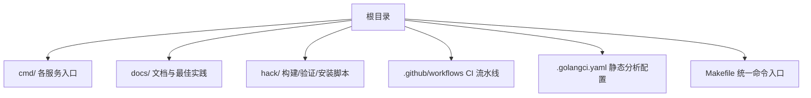
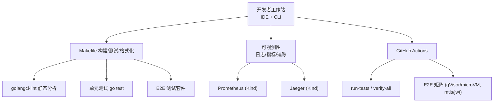
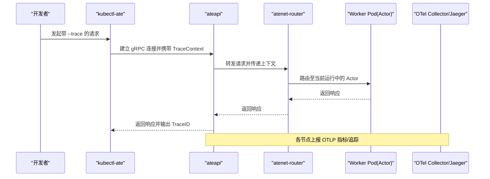
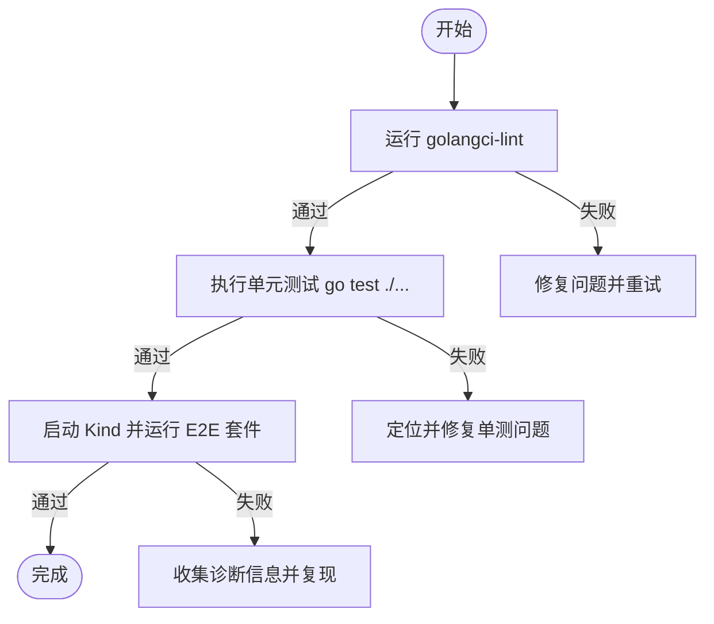
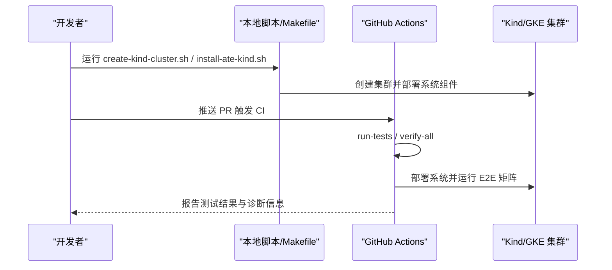
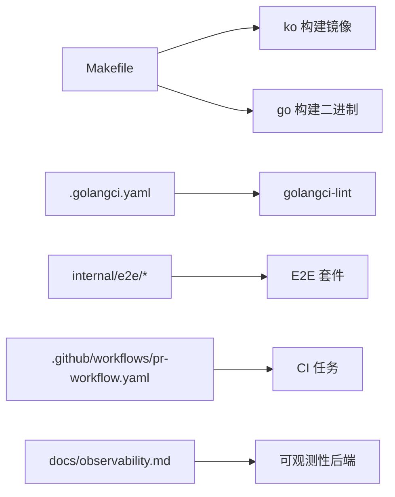

# 开发工具链集成

<cite>
**本文引用的文件**   
- [README.md](file://README.md)
- [CONTRIBUTING.md](file://CONTRIBUTING.md)
- [Makefile](file://Makefile)
- [.golangci.yaml](file://.golangci.yaml)
- [.github/workflows/pr-workflow.yaml](file://.github/workflows/pr-workflow.yaml)
- [observability.md](file://docs/observability.md)
- [internal/e2e/README.md](file://internal/e2e/README.md)
- [hack/update-tool.sh](file://hack/update-tool.sh)
- [tools/setup-gcp/main.go](file://tools/setup-gcp/main.go)
- [tools/setup-gcp/README.md](file://tools/setup-gcp/README.md)
- [hack/util/verify-boilerplate.py](file://hack/util/verify-boilerplate.py)
- [COLLABORATING.md](file://COLLABORATING.md)
- [GOVERNANCE.md](file://GOVERNANCE.md)
</cite>

## 目录
1. [简介](#简介)
2. [项目结构](#项目结构)
3. [核心组件](#核心组件)
4. [架构总览](#架构总览)
5. [详细组件分析](#详细组件分析)
6. [依赖分析](#依赖分析)
7. [性能考虑](#性能考虑)
8. [故障排查指南](#故障排查指南)
9. [结论](#结论)
10. [附录](#附录)

## 简介
本文件面向 Agent Substrate 的开发与交付团队，系统化梳理开发工具链的集成方案，覆盖以下方面：
- 调试工具集成：日志收集、性能分析、内存泄漏检测等
- IDE 集成配置：VS Code、GoLand 等开发环境设置建议
- 代码质量工具：静态分析、单元测试、集成测试的配置与执行
- 版本控制与协作：Git 工作流、代码审查流程
- 自动化与持续集成：本地一键构建、CI 流水线、GCP 资源与看板初始化

## 项目结构
仓库采用 Go 多模块组织，核心二进制位于 cmd/ 下；可观测性文档集中于 docs/observability.md；构建与验证脚本集中在 hack/；CI 在 .github/workflows/；静态分析配置为 .golangci.yaml。

章节来源
- [README.md:89-125](file://README.md#L89-L125)
- [Makefile:38-94](file://Makefile#L38-L94)
- [.golangci.yaml:15-31](file://.golangci.yaml#L15-L31)
- [.github/workflows/pr-workflow.yaml:15-37](file://.github/workflows/pr-workflow.yaml#L15-L37)

## 核心组件
- 构建与打包
  - Makefile 提供 build、test、lint、verify、e2e 等统一入口，内部调用 ko 与 go 工具链完成镜像构建与二进制编译。
- 静态分析与格式校验
  - golangci-lint 通过 .golangci.yaml 启用标准规则集并扩展拼写检查，同时针对生成代码与测试路径做排除。
- 测试体系
  - 单元测试：go test ./...
  - 端到端测试：基于 internal/e2e 套件，支持 --e2e 开关与 TestMain 编排。
- 可观测性（日志/指标/追踪）
  - 文档化 Actor 元数据注入、结构化日志、OpenTelemetry 指标与请求级追踪，Kind 环境内置 Prometheus/Jaeger。
- 持续集成
  - GitHub Actions 在 PR 与 main 分支触发，包含单元测试、verify-all、E2E 矩阵（含微虚拟机与 gVisor）。

章节来源
- [Makefile:38-94](file://Makefile#L38-L94)
- [.golangci.yaml:15-31](file://.golangci.yaml#L15-L31)
- [internal/e2e/README.md:1-42](file://internal/e2e/README.md#L1-L42)
- [observability.md:1-194](file://docs/observability.md#L1-L194)
- [.github/workflows/pr-workflow.yaml:26-133](file://.github/workflows/pr-workflow.yaml#L26-L133)

## 架构总览
下图展示“本地开发到 CI”的工具链链路：开发者使用 IDE 与 CLI 进行开发与调试，Makefile 与 golangci-lint 保障代码质量，GitHub Actions 驱动测试与验证，可观测性栈用于问题定位与性能分析。

图表来源
- [Makefile:38-94](file://Makefile#L38-L94)
- [.golangci.yaml:15-31](file://.golangci.yaml#L15-L31)
- [observability.md:115-166](file://docs/observability.md#L115-L166)
- [.github/workflows/pr-workflow.yaml:26-133](file://.github/workflows/pr-workflow.yaml#L26-L133)

## 详细组件分析

### 调试工具集成（日志、指标、追踪）
- 日志
  - 容器 stdout/stderr 被包装为结构化 JSON，自动注入 Actor 维度标签（名称、atespace、UID、模板名等），便于跨迁移与挂起/恢复周期进行聚合查询。
  - 本地快速查看活跃 Actor 日志可通过 kubectl-ate logs actors，支持跟随模式并在迁移时自动重连。
- 指标
  - 系统级 OpenTelemetry 指标由 ateapi、atelet、atenet-router 等组件发出，Kind 环境默认部署 Prometheus 采集。
- 追踪
  - 支持按需开启请求级追踪（如 CLI 带 --trace），通过 OTel 上下文传播，Kind 环境内置 Jaeger UI 可视化。

图表来源
- [observability.md:137-166](file://docs/observability.md#L137-L166)

章节来源
- [observability.md:1-194](file://docs/observability.md#L1-L194)

### 性能分析与内存泄漏检测
- CPU/内存剖析
  - 建议在本地 Kind 环境中对关键服务（如 ateapi、atenet-router）开启 pprof 端口，结合浏览器或命令行工具进行分析。
  - 对于 Actor 侧，优先利用结构化日志与指标定位热点路径，必要时在受控环境下抓取堆快照。
- 内存泄漏检测
  - 结合长期运行的压测场景（Locust 基准框架）观察 RSS/分配趋势，配合 pprof 的 heap profile 对比差异。
- 参考
  - 可观测性文档提供了指标与追踪的接入方式与后端差异说明，可作为性能分析的基线。

章节来源
- [observability.md:103-166](file://docs/observability.md#L103-L166)

### IDE 集成配置（VS Code、GoLand）
- VS Code
  - 推荐安装 Go 扩展，启用 go mod tidy、go build、go test 快捷命令；将 golangci-lint 集成到保存时或提交前钩子。
  - 调试配置：为 ateapi、atenet 等主程序添加 launch.json 配置，支持断点调试与参数传入（例如 --trace）。
- GoLand
  - 使用内置 Go 插件，配置 go.mod 工作区；在 Run/Debug Configurations 中为各服务创建独立配置，复用 Makefile 的 ldflags 以注入版本信息。
- 通用建议
  - 使用 Makefile 提供的 fmt、lint、test 目标作为统一入口，确保 IDE 行为与 CI 一致。

章节来源
- [Makefile:38-94](file://Makefile#L38-L94)
- [.golangci.yaml:15-31](file://.golangci.yaml#L15-L31)

### 代码质量工具集成（静态分析、单测、集成测试）
- 静态分析
  - 使用 golangci-lint，默认启用 standard 预设，额外开启 misspell；对生成代码、测试路径、第三方 LICENSES 目录做了针对性排除。
- 单元测试
  - 通过 make test 或 go test ./... 执行；遵循 internal/e2e 的约定，E2E 需显式启用 --e2e。
- 集成/E2E 测试
  - 在 Kind 集群上安装系统后，运行 e2e 套件；CI 中包含按认证模式与运行时（gVisor/microVM）的矩阵测试。

图表来源
- [.golangci.yaml:15-31](file://.golangci.yaml#L15-L31)
- [internal/e2e/README.md:1-42](file://internal/e2e/README.md#L1-L42)
- [.github/workflows/pr-workflow.yaml:26-133](file://.github/workflows/pr-workflow.yaml#L26-L133)

章节来源
- [.golangci.yaml:15-31](file://.golangci.yaml#L15-L31)
- [internal/e2e/README.md:1-42](file://internal/e2e/README.md#L1-L42)
- [.github/workflows/pr-workflow.yaml:26-133](file://.github/workflows/pr-workflow.yaml#L26-L133)

### 版本控制系统集成（Git 工作流与代码审查）
- 工作流
  - 所有变更通过 Pull Request 提交，合并前需至少一名 Maintainer 批准且 CI 全绿。
  - 小步快跑、聚焦单一问题的 PR 更易评审与更新。
- 审查规范
  - 所有提交必须附带测试；无测试或导致测试失败的变更不会被合并。
  - 贡献者需签署 CLA，遵守社区行为准则。
- 角色与治理
  - 明确 Reviewer/Maintainer 权限与职责，重大设计变更需提前讨论并获得支持。

章节来源
- [CONTRIBUTING.md:28-68](file://CONTRIBUTING.md#L28-L68)
- [COLLABORATING.md:76-106](file://COLLABORATING.md#L76-L106)
- [GOVERNANCE.md:35-74](file://GOVERNANCE.md#L35-L74)

### 开发环境自动化与持续集成
- 本地一键环境
  - 通过 hack/create-kind-cluster.sh 与 hack/install-ate-kind.sh 快速搭建 Kind 集群与系统组件。
  - 使用 Makefile 的 build、build-images、build-atectl 等目标统一构建产物。
- 工具链管理
  - hack/tools 下的工具各自维护 go.mod，通过 hack/update-tool.sh 集中升级与 tidy。
- CI 流水线
  - pr-workflow.yaml 在 PR 与 main 分支触发，包含 run-tests、verify-all、E2E 矩阵（mtls/jwt、gVisor/microVM），失败时自动收集诊断信息。
- GCP 资源与看板
  - tools/setup-gcp 提供 bootstrap、create bucket/iam/dashboards 等子命令，用于在 GKE 环境初始化监控看板与必要资源。

图表来源
- [README.md:99-125](file://README.md#L99-L125)
- [Makefile:38-94](file://Makefile#L38-L94)
- [hack/update-tool.sh:44-75](file://hack/update-tool.sh#L44-L75)
- [.github/workflows/pr-workflow.yaml:26-133](file://.github/workflows/pr-workflow.yaml#L26-L133)
- [tools/setup-gcp/main.go:24-29](file://tools/setup-gcp/main.go#L24-L29)
- [tools/setup-gcp/README.md:90-134](file://tools/setup-gcp/README.md#L90-L134)

章节来源
- [README.md:99-125](file://README.md#L99-L125)
- [Makefile:38-94](file://Makefile#L38-L94)
- [hack/update-tool.sh:44-75](file://hack/update-tool.sh#L44-L75)
- [.github/workflows/pr-workflow.yaml:26-133](file://.github/workflows/pr-workflow.yaml#L26-L133)
- [tools/setup-gcp/main.go:24-29](file://tools/setup-gcp/main.go#L24-L29)
- [tools/setup-gcp/README.md:90-134](file://tools/setup-gcp/README.md#L90-L134)

## 依赖分析
- 构建与镜像
  - Makefile 通过 ko 构建多个服务的镜像，统一注入版本号（ldflags）。
- 静态分析
  - golangci-lint 在 CI 与本地均可用，配置文件定义了规则集与排除策略。
- 测试与 E2E
  - 单元测试与 E2E 分别由 go test 与 hack/run-e2e*.sh 驱动，CI 矩阵覆盖不同认证模式与运行时。
- 可观测性
  - Kind 环境内置 Prometheus/Jaeger，生产环境对接 Google Cloud Monitoring/Trace。

图表来源
- [Makefile:38-94](file://Makefile#L38-L94)
- [.golangci.yaml:15-31](file://.golangci.yaml#L15-L31)
- [.github/workflows/pr-workflow.yaml:26-133](file://.github/workflows/pr-workflow.yaml#L26-L133)
- [observability.md:115-166](file://docs/observability.md#L115-L166)

章节来源
- [Makefile:38-94](file://Makefile#L38-L94)
- [.golangci.yaml:15-31](file://.golangci.yaml#L15-L31)
- [.github/workflows/pr-workflow.yaml:26-133](file://.github/workflows/pr-workflow.yaml#L26-L133)
- [observability.md:115-166](file://docs/observability.md#L115-L166)

## 性能考虑
- 在 Kind 中使用 Prometheus/Jaeger 进行本地性能与延迟分析，关注 rpc.server.call.duration、atenet.router.route.duration 等关键指标。
- 对 Actor 生命周期相关操作（挂起/恢复、快照大小）进行专项观测，结合 trace 定位瓶颈。
- 压测建议使用 benchmarking/locust 框架，结合指标与追踪评估吞吐与时延。

章节来源
- [observability.md:103-166](file://docs/observability.md#L103-L166)

## 故障排查指南
- 常见步骤
  - 确认组件健康：在 Kind 中检查 Prometheus Targets 是否全部 up。
  - 获取实时日志：使用 kubectl-ate logs actors <name> -f，注意 Actor 迁移时的自动重连提示。
  - 追踪请求：使用 --trace 标志发起请求，复制 TraceID 到 Jaeger 界面分析调用链。
  - 收集诊断：CI 失败时会输出关键资源状态与最近日志，便于复现。
- 许可证头校验
  - 若本地或 CI 报许可证头缺失，可使用 verify-boilerplate 脚本定位未合规文件。

章节来源
- [observability.md:21-66](file://docs/observability.md#L21-L66)
- [.github/workflows/pr-workflow.yaml:112-121](file://.github/workflows/pr-workflow.yaml#L112-L121)
- [hack/util/verify-boilerplate.py:88-139](file://hack/util/verify-boilerplate.py#L88-L139)

## 结论
通过将构建、静态分析、测试、可观测性与 CI 串联成统一的工具链，Agent Substrate 能够在本地与云端保持一致的开发体验与质量门禁。建议团队在日常开发中严格遵循 Makefile 与 golangci-lint 的规则，充分利用日志/指标/追踪进行问题定位，并通过 E2E 矩阵保障不同运行时与认证模式的稳定性。

## 附录
- 快速上手
  - 参考 README 的 Quickstart 部分，使用 hack 脚本在 Kind 中快速部署系统与示例应用。
- 文档与指南
  - 可观测性、API 风格、架构概览等详见 docs/ 目录。
- 贡献与协作
  - 贡献流程、代码审查与治理规范见 CONTRIBUTING.md、COLLABORATING.md、GOVERNANCE.md。

章节来源
- [README.md:99-125](file://README.md#L99-L125)
- [CONTRIBUTING.md:28-68](file://CONTRIBUTING.md#L28-L68)
- [COLLABORATING.md:76-106](file://COLLABORATING.md#L76-L106)
- [GOVERNANCE.md:35-74](file://GOVERNANCE.md#L35-L74)
