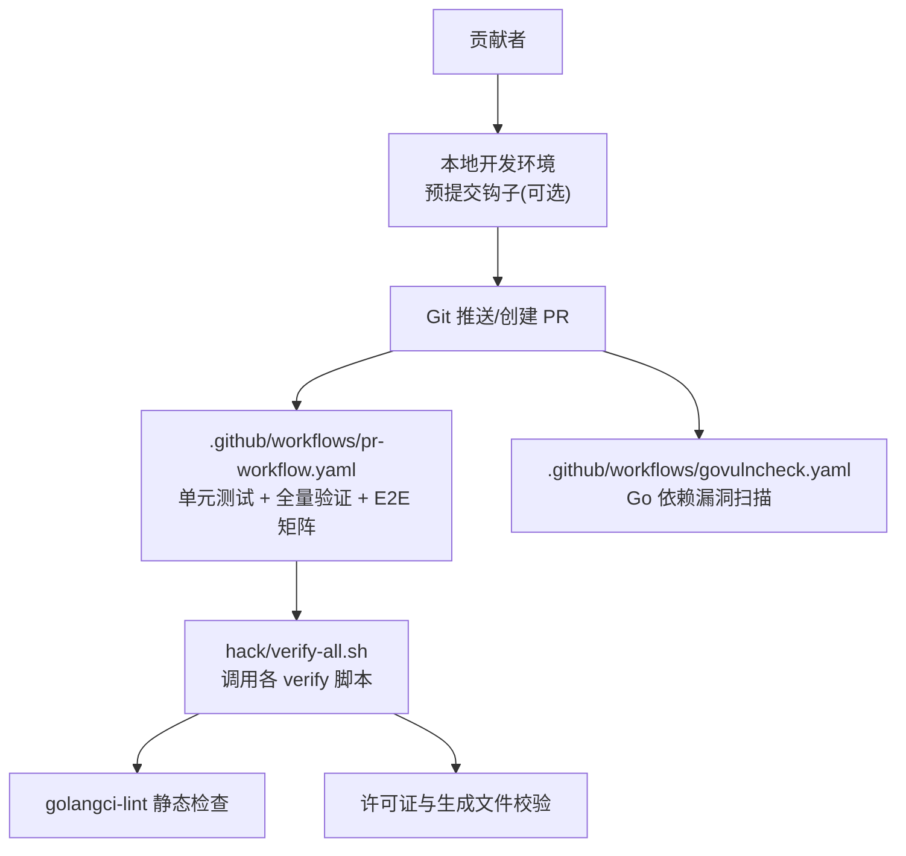
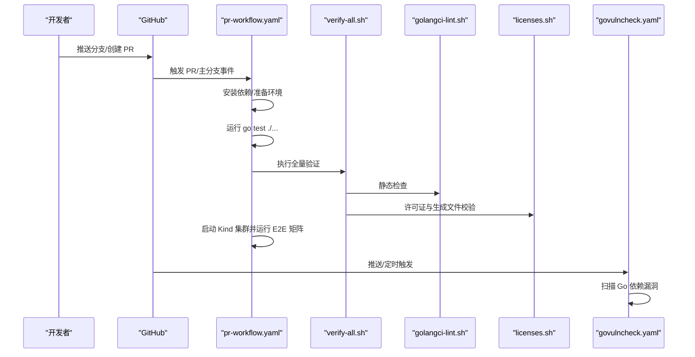
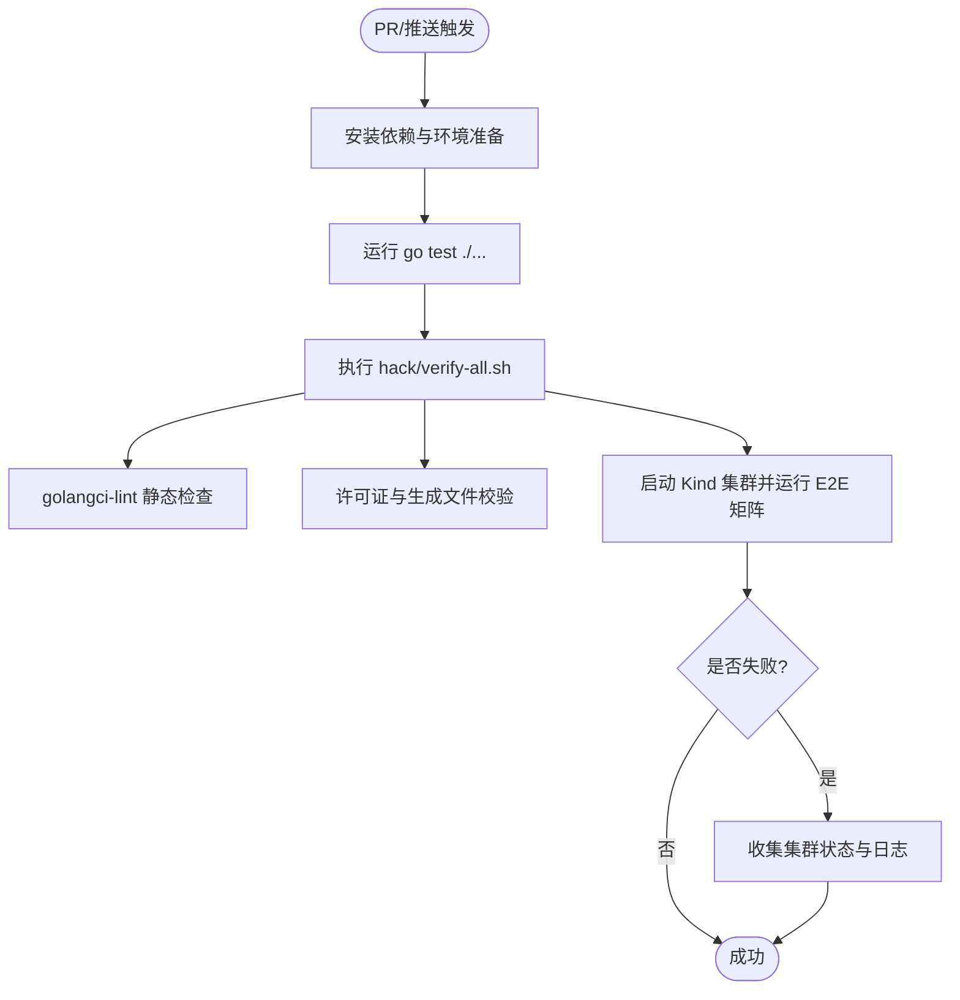
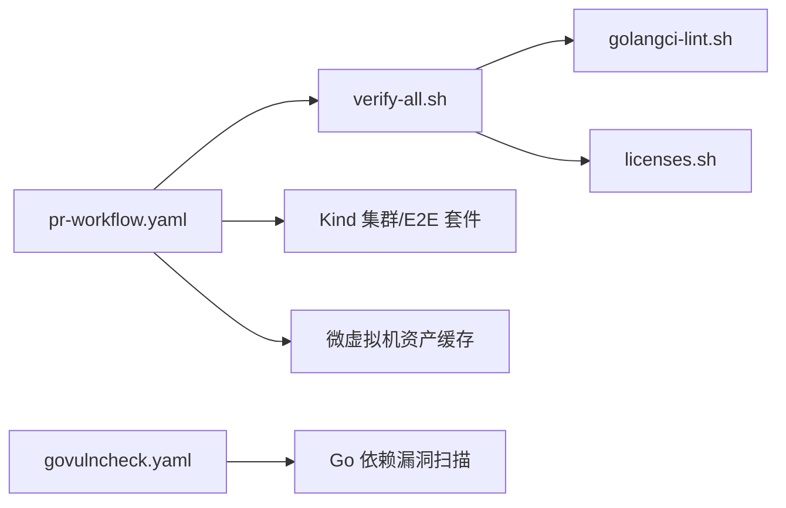

# 版本控制集成

<cite>
**本文引用的文件**   
- [CONTRIBUTING.md](file://CONTRIBUTING.md)
- [COLLABORATING.md](file://COLLABORATING.md)
- [GOVERNANCE.md](file://GOVERNANCE.md)
- [.github/workflows/pr-workflow.yaml](file://.github/workflows/pr-workflow.yaml)
- [.github/workflows/govulncheck.yaml](file://.github/workflows/govulncheck.yaml)
- [hack/verify-all.sh](file://hack/verify-all.sh)
- [hack/verify/golangci-lint.sh](file://hack/verify/golangci-lint.sh)
- [hack/verify/licenses.sh](file://hack/verify/licenses.sh)
</cite>

## 目录
1. [简介](#简介)
2. [项目结构](#项目结构)
3. [核心组件](#核心组件)
4. [架构总览](#架构总览)
5. [详细组件分析](#详细组件分析)
6. [依赖关系分析](#依赖关系分析)
7. [性能与效率建议](#性能与效率建议)
8. [故障排查指南](#故障排查指南)
9. [结论](#结论)
10. [附录](#附录)

## 简介
本指导文档面向 Agent Substrate 的版本控制集成，聚焦于 Git 工作流最佳实践、预提交钩子配置与使用、以及 GitHub Actions CI/CD 的自动化构建、测试与部署流程。同时提供第三方代码管理与许可证合规性检查的方法，帮助团队在保持高质量的同时提升协作效率。

## 项目结构
仓库中与版本控制和持续集成相关的关键位置如下：
- 贡献与协作规范：根目录 CONTRIBUTING.md、COLLABORATING.md、GOVERNANCE.md
- CI/CD 流水线：.github/workflows 下的 pr-workflow.yaml（PR 与主分支触发）、govulncheck.yaml（安全扫描）
- 本地验证脚本：hack/verify-all.sh 统一编排各 verify 步骤；具体校验逻辑位于 hack/verify/*.sh（如 golangci-lint、licenses 等）

图表来源
- [.github/workflows/pr-workflow.yaml:1-133](file://.github/workflows/pr-workflow.yaml#L1-L133)
- [.github/workflows/govulncheck.yaml:1-35](file://.github/workflows/govulncheck.yaml#L1-L35)
- [hack/verify-all.sh:1-29](file://hack/verify-all.sh#L1-L29)
- [hack/verify/golangci-lint.sh:1-31](file://hack/verify/golangci-lint.sh#L1-L31)
- [hack/verify/licenses.sh:1-23](file://hack/verify/licenses.sh#L1-L23)

章节来源
- [CONTRIBUTING.md:1-68](file://CONTRIBUTING.md#L1-L68)
- [COLLABORATING.md:1-106](file://COLLABORATING.md#L1-L106)
- [GOVERNANCE.md:1-33](file://GOVERNANCE.md#L1-L33)
- [.github/workflows/pr-workflow.yaml:1-133](file://.github/workflows/pr-workflow.yaml#L1-L133)
- [.github/workflows/govulncheck.yaml:1-35](file://.github/workflows/govulncheck.yaml#L1-L35)
- [hack/verify-all.sh:1-29](file://hack/verify-all.sh#L1-L29)
- [hack/verify/golangci-lint.sh:1-31](file://hack/verify/golangci-lint.sh#L1-L31)
- [hack/verify/licenses.sh:1-23](file://hack/verify/licenses.sh#L1-L23)

## 核心组件
- 贡献与协作规范
  - 强制通过 Pull Request 进行变更，禁止直接推送到 main 分支；合并由审阅者执行。
  - 所有变更需附带测试；未包含测试或导致测试失败的变更不会被合并。
  - 源码文件必须包含版权与许可证头信息，模板位于 hack/boilerplate。
  - AI 辅助贡献需遵循 Kubernetes 项目的披露与审查要求。
- 持续集成流水线
  - PR 与主分支推送均触发 pr-workflow：运行 go test、全量验证脚本、端到端测试矩阵（含微虚拟机与 gVisor）。
  - govulncheck 定时与主分支推送时运行，扫描 Go 依赖漏洞。
- 本地验证工具链
  - hack/verify-all.sh 统一调度各 verify 脚本，包括静态检查、格式化、许可证与模块一致性校验等。

章节来源
- [CONTRIBUTING.md:50-68](file://CONTRIBUTING.md#L50-L68)
- [COLLABORATING.md:38-75](file://COLLABORATING.md#L38-L75)
- [.github/workflows/pr-workflow.yaml:26-133](file://.github/workflows/pr-workflow.yaml#L26-L133)
- [.github/workflows/govulncheck.yaml:15-35](file://.github/workflows/govulncheck.yaml#L15-L35)
- [hack/verify-all.sh:17-29](file://hack/verify-all.sh#L17-L29)

## 架构总览
下图展示了从开发者到 CI 的整体数据与控制流，涵盖本地验证、GitHub Actions 任务编排与关键校验环节。

图表来源
- [.github/workflows/pr-workflow.yaml:1-133](file://.github/workflows/pr-workflow.yaml#L1-L133)
- [.github/workflows/govulncheck.yaml:1-35](file://.github/workflows/govulncheck.yaml#L1-L35)
- [hack/verify-all.sh:17-29](file://hack/verify-all.sh#L17-L29)
- [hack/verify/golangci-lint.sh:17-31](file://hack/verify/golangci-lint.sh#L17-L31)
- [hack/verify/licenses.sh:17-23](file://hack/verify/licenses.sh#L17-L23)

## 详细组件分析

### Git 工作流与分支策略
- 分支模型
  - 推荐基于功能/修复的短生命周期分支，避免长期大分支。
  - 主分支受保护，仅允许通过 PR 合并；合并前需通过全部 CI 检查。
- 提交规范
  - 提交信息应清晰描述“做了什么”和“为什么”，便于回溯与发布说明生成。
  - 大型变更拆分为多个小 PR，提高可评审性与可回滚性。
- 代码审查流程
  - 所有变更必须经过至少一次审阅；合并由审阅者执行，而非作者本人。
  - 鼓励跨公司审阅，促进知识共享与质量保障。
  - AI 辅助贡献需披露并在提交前自行验证，审阅者可就改动细节提问。

章节来源
- [COLLABORATING.md:38-97](file://COLLABORATING.md#L38-L97)
- [CONTRIBUTING.md:28-58](file://CONTRIBUTING.md#L28-L58)

### 预提交钩子配置与使用
为在本地尽早发现问题，建议在 .git/hooks/pre-commit 中串联以下检查：
- 代码格式与静态检查
  - 调用 golangci-lint 对当前变更范围进行检查，确保与 CI 一致。
- 许可证与生成文件校验
  - 运行许可证与生成文件校验脚本，避免遗漏版权头或生成不一致。
- 单元测试快速集
  - 针对受影响包运行轻量级单测，缩短反馈周期。
- 文档与样板头检查
  - 校验 README、API 文档与样板头是否符合规范。

示例命令路径（以仓库现有脚本为准）：
- 静态检查：[hack/verify/golangci-lint.sh](file://hack/verify/golangci-lint.sh)
- 许可证校验：[hack/verify/licenses.sh](file://hack/verify/licenses.sh)
- 全量验证入口：[hack/verify-all.sh](file://hack/verify-all.sh)

注意：
- 若本地环境与 CI 存在差异（例如平台相关包），请确保预提交钩子与 CI 保持一致的 GOOS/GOARCH 设置。
- 对于耗时较长的 E2E 测试，可在预提交阶段跳过，仅在 PR 或主分支上运行。

章节来源
- [hack/verify/golangci-lint.sh:17-31](file://hack/verify/golangci-lint.sh#L17-L31)
- [hack/verify/licenses.sh:17-23](file://hack/verify/licenses.sh#L17-L23)
- [hack/verify-all.sh:17-29](file://hack/verify-all.sh#L17-L29)

### GitHub Actions CI/CD 集成
- 触发条件
  - pr-workflow：PR 事件与主分支推送；另设定时任务用于缓存预热。
  - govulncheck：主分支推送与每周定时任务，扫描 Go 依赖漏洞。
- 主要任务
  - 单元测试：go test ./...
  - 全量验证：hack/verify-all.sh（包含静态检查、许可证、格式化等）
  - 端到端测试矩阵：Kind 集群 + 两种认证模式 + 微虚拟机与 gVisor 双运行时
  - 失败诊断：自动收集 Pod 清单与日志，便于定位问题
- 缓存与资源优化
  - 微虚拟机资产缓存键基于 assemble.sh 哈希，减少重复构建时间。
  - 定时任务刷新缓存，保证 PR 能命中缓存。

图表来源
- [.github/workflows/pr-workflow.yaml:26-133](file://.github/workflows/pr-workflow.yaml#L26-L133)
- [hack/verify-all.sh:17-29](file://hack/verify-all.sh#L17-L29)
- [hack/verify/golangci-lint.sh:17-31](file://hack/verify/golangci-lint.sh#L17-L31)
- [hack/verify/licenses.sh:17-23](file://hack/verify/licenses.sh#L17-L23)

章节来源
- [.github/workflows/pr-workflow.yaml:1-133](file://.github/workflows/pr-workflow.yaml#L1-L133)
- [.github/workflows/govulncheck.yaml:15-35](file://.github/workflows/govulncheck.yaml#L15-L35)

### 第三方代码管理与许可证合规性
- 许可证头要求
  - 所有源码文件需包含版权与许可证头，模板位于 hack/boilerplate。
- 许可证校验
  - 通过许可证校验脚本检查依赖与生成文件的许可证合规性。
- 依赖治理
  - 定期更新依赖并运行漏洞扫描（govulncheck），及时修复已知安全问题。
  - 在 PR 中引入新依赖时，需评估许可证兼容性与安全风险。

章节来源
- [CONTRIBUTING.md:59-68](file://CONTRIBUTING.md#L59-L68)
- [hack/verify/licenses.sh:17-23](file://hack/verify/licenses.sh#L17-L23)
- [.github/workflows/govulncheck.yaml:15-35](file://.github/workflows/govulncheck.yaml#L15-L35)

## 依赖关系分析
- 组件耦合
  - pr-workflow 依赖 verify-all.sh 与各 verify 脚本；verify-all.sh 通过 find 遍历 hack/verify 下脚本并顺序执行。
  - golangci-lint 校验通过 run-tool.sh 解析二进制路径，并以 GOOS=linux 执行，确保与 CI 行为一致。
  - licenses.sh 调用 kubernetes 第三方验证脚本完成许可证与生成文件检查。
- 外部依赖
  - GitHub Actions 官方 action（checkout、setup-go、cache、govulncheck-action）。
  - Kind 集群与镜像、微虚拟机资产（kata-static、cloud-hypervisor、virtiofsd）。

图表来源
- [.github/workflows/pr-workflow.yaml:26-133](file://.github/workflows/pr-workflow.yaml#L26-L133)
- [hack/verify-all.sh:17-29](file://hack/verify-all.sh#L17-L29)
- [hack/verify/golangci-lint.sh:17-31](file://hack/verify/golangci-lint.sh#L17-L31)
- [hack/verify/licenses.sh:17-23](file://hack/verify/licenses.sh#L17-L23)
- [.github/workflows/govulncheck.yaml:15-35](file://.github/workflows/govulncheck.yaml#L15-L35)

章节来源
- [.github/workflows/pr-workflow.yaml:26-133](file://.github/workflows/pr-workflow.yaml#L26-L133)
- [hack/verify-all.sh:17-29](file://hack/verify-all.sh#L17-L29)
- [hack/verify/golangci-lint.sh:17-31](file://hack/verify/golangci-lint.sh#L17-L31)
- [hack/verify/licenses.sh:17-23](file://hack/verify/licenses.sh#L17-L23)
- [.github/workflows/govulncheck.yaml:15-35](file://.github/workflows/govulncheck.yaml#L15-L35)

## 性能与效率建议
- 缓存利用
  - 复用微虚拟机资产缓存键，避免重复下载与编译；必要时调整缓存键粒度以平衡命中率与准确性。
- 并行化
  - 将无关任务拆分至独立 job，减少整体流水线时长。
- 增量检查
  - 在预提交阶段仅运行受影响包的单测与 lint，降低本地反馈延迟。
- 资源清理
  - 在 CI 中按需释放宿主空间，避免磁盘不足导致构建失败。

## 故障排查指南
- 常见失败点
  - 静态检查失败：查看 golangci-lint 输出，确认是否为平台相关包导致的类型检查失败。
  - 许可证校验失败：核对新增依赖的许可证与生成文件是否包含必要头信息。
  - E2E 失败：根据失败诊断步骤收集的 Pod 清单与日志定位问题。
- 定位方法
  - 在本地复现：先运行 go test ./...，再执行 hack/verify-all.sh，逐步缩小范围。
  - 关注缓存命中：若缓存未命中，检查 assemble.sh 哈希变化与依赖更新。
  - 权限与设备：确保 /dev/kvm 可用（CI 已启用 udev 规则），本地调试需具备相应权限。

章节来源
- [.github/workflows/pr-workflow.yaml:112-121](file://.github/workflows/pr-workflow.yaml#L112-L121)
- [hack/verify/golangci-lint.sh:22-31](file://hack/verify/golangci-lint.sh#L22-L31)
- [hack/verify/licenses.sh:17-23](file://hack/verify/licenses.sh#L17-L23)

## 结论
通过统一的贡献规范、严格的本地与 CI 验证、完善的许可证与漏洞扫描机制，Agent Substrate 能够在保持高质量的同时实现高效协作。建议团队在日常开发中严格执行预提交检查，并在 PR 中保持小而精的变更，以提升审阅效率与交付稳定性。

## 附录
- 术语
  - PR：Pull Request，拉取请求
  - E2E：End-to-End，端到端测试
  - Kind：Kubernetes in Docker，本地集群工具
- 参考
  - 贡献流程与代码审查：CONTRIBUTING.md、COLLABORATING.md
  - 治理与角色：GOVERNANCE.md
  - CI 配置：.github/workflows/pr-workflow.yaml、.github/workflows/govulncheck.yaml
  - 本地验证：hack/verify-all.sh、hack/verify/*.sh
