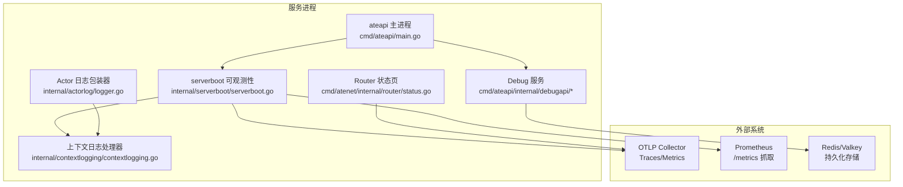
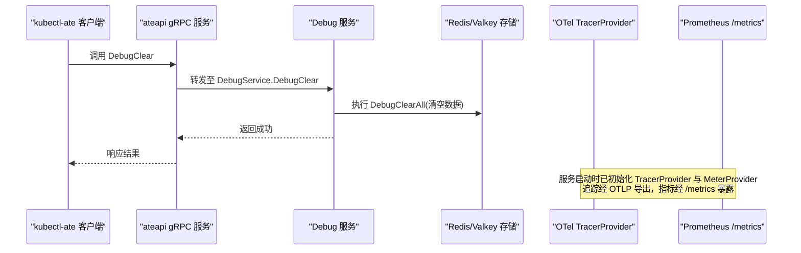
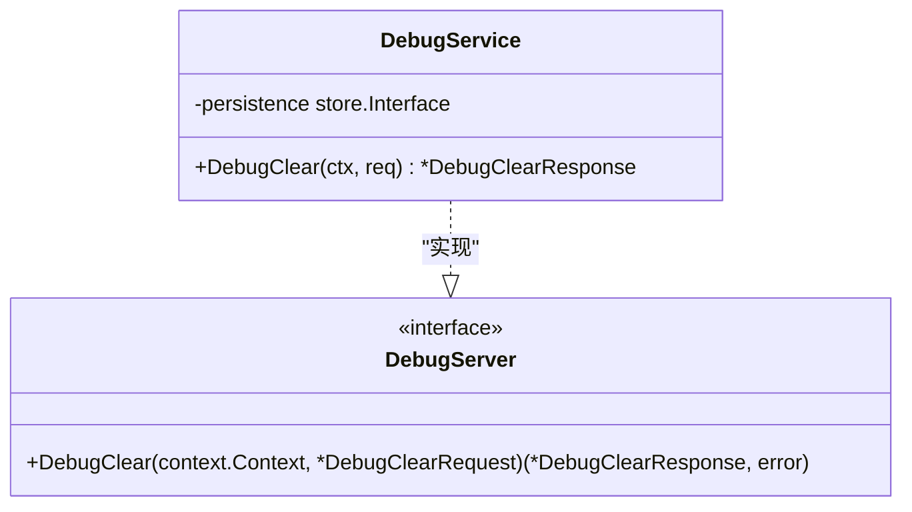
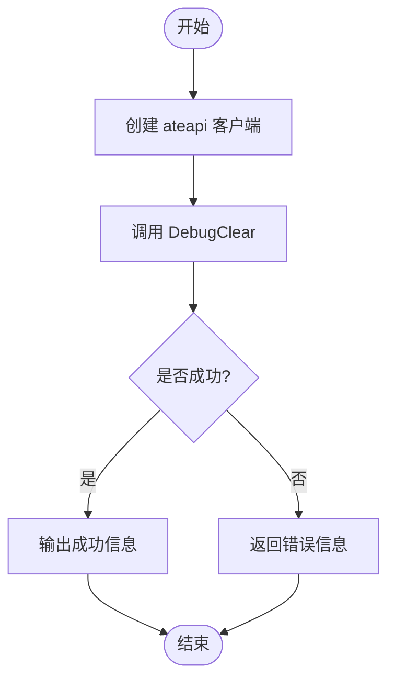
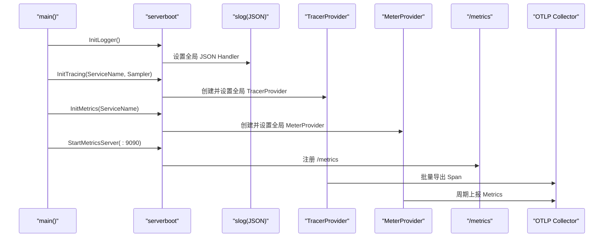
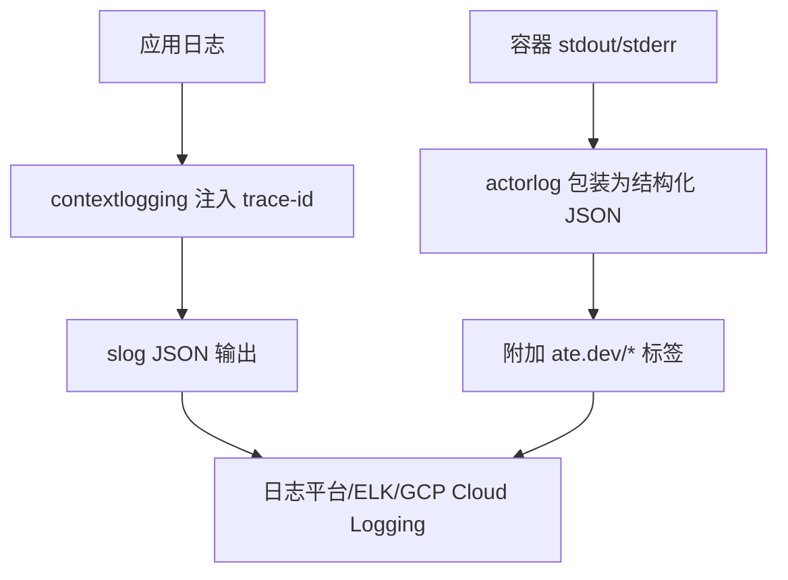
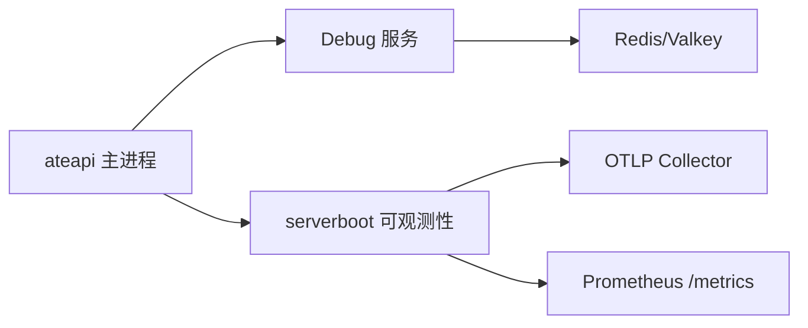

# 调试工具集成

<cite>
**本文引用的文件**   
- [cmd/ateapi/main.go](file://cmd/ateapi/main.go)
- [cmd/ateapi/internal/debugapi/service.go](file://cmd/ateapi/internal/debugapi/service.go)
- [cmd/ateapi/internal/debugapi/debug_clear.go](file://cmd/ateapi/internal/debugapi/debug_clear.go)
- [pkg/proto/ateapipb/ateapi_grpc.pb.go](file://pkg/proto/ateapipb/ateapi_grpc.pb.go)
- [internal/serverboot/serverboot.go](file://internal/serverboot/serverboot.go)
- [internal/contextlogging/contextlogging.go](file://internal/contextlogging/contextlogging.go)
- [internal/actorlog/logger.go](file://internal/actorlog/logger.go)
- [cmd/kubectl-ate/internal/cmd/admin_debug_redis_flush.go](file://cmd/kubectl-ate/internal/cmd/admin_debug_redis_flush.go)
- [cmd/atenet/internal/router/status.go](file://cmd/atenet/internal/router/status.go)
- [docs/dev/best-practices/tracing.md](file://docs/dev/best-practices/tracing.md)
</cite>

## 目录
1. [简介](#简介)
2. [项目结构](#项目结构)
3. [核心组件](#核心组件)
4. [架构总览](#架构总览)
5. [详细组件分析](#详细组件分析)
6. [依赖分析](#依赖分析)
7. [性能考虑](#性能考虑)
8. [故障排查指南](#故障排查指南)
9. [结论](#结论)
10. [附录](#附录)

## 简介
本文件面向 Agent Substrate 的调试与可观测性集成，覆盖以下主题：
- 内置调试 API 的使用（如数据清理）
- OpenTelemetry 分布式追踪的配置与采样策略
- 指标收集与可视化（Prometheus + OTLP）
- 结构化日志配置、跨组件关联分析（trace-id、actor 标签）
- 内存泄漏检测与 CPU 性能分析的实用建议

## 项目结构
与调试能力相关的代码主要分布在以下位置：
- 服务启动与可观测性初始化：internal/serverboot
- 结构化日志上下文注入：internal/contextlogging
- 沙箱容器日志包装与标准化：internal/actorlog
- 调试服务实现与 gRPC 接口：cmd/ateapi/internal/debugapi 与 pkg/proto/ateapipb
- 客户端调试命令：cmd/kubectl-ate/internal/cmd
- 路由状态页与构建信息：cmd/atenet/internal/router/status.go
- 最佳实践文档：docs/dev/best-practices/tracing.md

图表来源
- [cmd/ateapi/main.go:86-101](file://cmd/ateapi/main.go#L86-L101)
- [cmd/ateapi/internal/debugapi/service.go:22-35](file://cmd/ateapi/internal/debugapi/service.go#L22-L35)
- [internal/serverboot/serverboot.go:44-147](file://internal/serverboot/serverboot.go#L44-L147)
- [internal/contextlogging/contextlogging.go:24-54](file://internal/contextlogging/contextlogging.go#L24-L54)
- [internal/actorlog/logger.go:50-173](file://internal/actorlog/logger.go#L50-L173)
- [cmd/atenet/internal/router/status.go:180-229](file://cmd/atenet/internal/router/status.go#L180-L229)

章节来源
- [cmd/ateapi/main.go:79-206](file://cmd/ateapi/main.go#L79-L206)
- [internal/serverboot/serverboot.go:44-147](file://internal/serverboot/serverboot.go#L44-L147)

## 核心组件
- 可观测性初始化（日志、追踪、指标）
  - 统一通过 serverboot 提供 InitLogger、InitTracing、InitMetrics、StartMetricsServer。
  - 日志使用 slog JSON 输出，并通过 contextlogging 自动注入 trace-id。
  - 追踪使用 OTLP gRPC 导出，支持采样器配置；指标同时暴露 Prometheus /metrics 并周期性上报 OTLP。
- 调试服务（Debug Server）
  - 暴露 DebugClear RPC，用于清空持久化数据（例如 Redis）。
  - 由 ateapi 主进程注册到 gRPC 服务器。
- 客户端调试命令
  - kubectl-ate admin debug-flush-redis 调用 DebugClear 以清空 Redis。
- Router 状态页
  - 提供 /statusz 页面，包含构建信息与运行参数等，便于快速定位问题。

章节来源
- [internal/serverboot/serverboot.go:44-147](file://internal/serverboot/serverboot.go#L44-L147)
- [cmd/ateapi/internal/debugapi/service.go:22-35](file://cmd/ateapi/internal/debugapi/service.go#L22-L35)
- [cmd/ateapi/internal/debugapi/debug_clear.go:24-36](file://cmd/ateapi/internal/debugapi/debug_clear.go#L24-L36)
- [cmd/kubectl-ate/internal/cmd/admin_debug_redis_flush.go:25-44](file://cmd/kubectl-ate/internal/cmd/admin_debug_redis_flush.go#L25-L44)
- [cmd/atenet/internal/router/status.go:180-229](file://cmd/atenet/internal/router/status.go#L180-L229)

## 架构总览
下图展示了从客户端到服务端的关键调试与可观测性路径：

图表来源
- [cmd/kubectl-ate/internal/cmd/admin_debug_redis_flush.go:25-44](file://cmd/kubectl-ate/internal/cmd/admin_debug_redis_flush.go#L25-L44)
- [cmd/ateapi/main.go:182-196](file://cmd/ateapi/main.go#L182-L196)
- [cmd/ateapi/internal/debugapi/debug_clear.go:24-36](file://cmd/ateapi/internal/debugapi/debug_clear.go#L24-L36)
- [internal/serverboot/serverboot.go:91-147](file://internal/serverboot/serverboot.go#L91-L147)

## 详细组件分析

### 调试服务（Debug Service）
- 职责
  - 实现 ateapipb.DebugServer，提供 DebugClear 方法，用于开发/测试环境清理数据。
- 关键流程
  - 接收请求 -> 校验 -> 调用持久层接口清空数据 -> 返回响应。
- 安全提示
  - 该操作会删除所有数据，仅建议在受控环境下使用。

图表来源
- [cmd/ateapi/internal/debugapi/service.go:22-35](file://cmd/ateapi/internal/debugapi/service.go#L22-L35)
- [pkg/proto/ateapipb/ateapi_grpc.pb.go:658-688](file://pkg/proto/ateapipb/ateapi_grpc.pb.go#L658-L688)

章节来源
- [cmd/ateapi/internal/debugapi/service.go:22-35](file://cmd/ateapi/internal/debugapi/service.go#L22-L35)
- [cmd/ateapi/internal/debugapi/debug_clear.go:24-36](file://cmd/ateapi/internal/debugapi/debug_clear.go#L24-L36)
- [pkg/proto/ateapipb/ateapi_grpc.pb.go:658-688](file://pkg/proto/ateapipb/ateapi_grpc.pb.go#L658-L688)

### 客户端调试命令（kubectl-ate admin debug-flush-redis）
- 功能
  - 通过 ateclient 连接 ateapi，调用 DebugClear 清空 Redis。
- 使用方式
  - 在具备访问权限的集群中执行对应子命令即可触发清理。

图表来源
- [cmd/kubectl-ate/internal/cmd/admin_debug_redis_flush.go:25-44](file://cmd/kubectl-ate/internal/cmd/admin_debug_redis_flush.go#L25-L44)

章节来源
- [cmd/kubectl-ate/internal/cmd/admin_debug_redis_flush.go:25-44](file://cmd/kubectl-ate/internal/cmd/admin_debug_redis_flush.go#L25-L44)

### 可观测性初始化（日志、追踪、指标）
- 日志
  - 使用 slog JSON 输出，并通过 contextlogging 自动注入 trace-id，便于跨组件关联。
- 追踪
  - 通过 InitTracing 设置全局 TracerProvider，使用 TraceContext 传播，默认使用 OTLP gRPC 批量导出。
  - 不同服务采用不同采样策略：
    - ateapi：ParentBased(AlwaysSample)，适合生产全量采集。
    - atelet：ParentBased(NeverSample)，按需开启。
- 指标
  - 通过 InitMetrics 设置全局 MeterProvider，同时暴露 Prometheus /metrics 与 OTLP 周期上报。
  - 通过 StartMetricsServer 启动 HTTP 服务，默认监听 :9090，可选启用 /readyz。

图表来源
- [internal/serverboot/serverboot.go:44-147](file://internal/serverboot/serverboot.go#L44-L147)
- [cmd/ateapi/main.go:86-101](file://cmd/ateapi/main.go#L86-L101)
- [cmd/ateapi/main.go:198-201](file://cmd/ateapi/main.go#L198-L201)

章节来源
- [internal/serverboot/serverboot.go:44-147](file://internal/serverboot/serverboot.go#L44-L147)
- [cmd/ateapi/main.go:86-101](file://cmd/ateapi/main.go#L86-L101)

### 结构化日志与跨组件关联
- 上下文注入
  - contextlogging.NewHandler 从当前 span 提取 trace-id，写入日志字段 ate.dev/trace-id。
- Actor 日志包装
  - actorlog.WrapContainerLogs 将容器 stdout/stderr 转换为结构化 JSON，附加 ate.dev/* 标签（atespace、actor_name、container_name 等），便于过滤与聚合。
- 使用建议
  - 在业务日志中携带必要上下文键值对，配合 trace-id 进行端到端关联。
  - 在 Kubernetes 环境中，确保日志平台能解析 labels 字段并按 ate.dev/* 索引。

图表来源
- [internal/contextlogging/contextlogging.go:38-46](file://internal/contextlogging/contextlogging.go#L38-L46)
- [internal/actorlog/logger.go:106-173](file://internal/actorlog/logger.go#L106-L173)

章节来源
- [internal/contextlogging/contextlogging.go:24-54](file://internal/contextlogging/contextlogging.go#L24-L54)
- [internal/actorlog/logger.go:50-173](file://internal/actorlog/logger.go#L50-L173)

### Router 状态页（/statusz）
- 功能
  - 展示构建信息、命令行参数、最近查询记录与健康报告等，辅助定位运行时问题。
- 追踪集成
  - 处理函数内创建 span，便于在链路中观察状态页访问耗时。

章节来源
- [cmd/atenet/internal/router/status.go:180-229](file://cmd/atenet/internal/router/status.go#L180-L229)

### 追踪最佳实践（OpenTelemetry）
- 服务端
  - 初始化 TracerProvider 与 exporter，设置 service name，按需采样。
  - 使用 TraceContext 文本映射传播，gRPC/HTTP 中间件自动注入/提取。
- 客户端
  - 初始化 TracerProvider（无需 exporter），根据场景选择 AlwaysSample/NeverSample。
  - gRPC 客户端添加 stats handler；HTTP 客户端使用 otelhttp 传输包装。
- 采样策略
  - 生产常用 ParentBased(AlwaysSample)；内部节点或高吞吐场景可用 NeverSample 并在需要时开启。

章节来源
- [docs/dev/best-practices/tracing.md:28-80](file://docs/dev/best-practices/tracing.md#L28-L80)
- [docs/dev/best-practices/tracing.md:140-200](file://docs/dev/best-practices/tracing.md#L140-L200)

## 依赖分析
- 组件耦合
  - ateapi 主进程依赖 serverboot 完成可观测性初始化，并注册 Debug 服务。
  - Debug 服务依赖持久层接口（Redis/Valkey）执行数据清理。
  - 日志与追踪通过全局 provider 在各组件间共享。
- 外部依赖
  - OTLP Collector（追踪与指标导出）
  - Prometheus（指标抓取）
  - Redis/Valkey（调试清理目标）

图表来源
- [cmd/ateapi/main.go:86-101](file://cmd/ateapi/main.go#L86-L101)
- [cmd/ateapi/internal/debugapi/service.go:22-35](file://cmd/ateapi/internal/debugapi/service.go#L22-L35)
- [internal/serverboot/serverboot.go:91-147](file://internal/serverboot/serverboot.go#L91-L147)

章节来源
- [cmd/ateapi/main.go:182-206](file://cmd/ateapi/main.go#L182-L206)
- [internal/serverboot/serverboot.go:91-147](file://internal/serverboot/serverboot.go#L91-L147)

## 性能考虑
- 追踪采样
  - 在高吞吐服务中建议使用 ParentBased(NeverSample) 或概率采样，避免额外开销。
  - 仅在需要时开启 AlwaysSample，并结合下游链路分析。
- 指标导出
  - 合理设置 Prometheus 抓取间隔与 OTLP 周期上报频率，避免资源争用。
- 日志体积
  - 控制结构化日志字段数量与级别，避免过大 payload 影响网络与存储。
- 快照与 IO
  - 在 atelet 的 Checkpoint/Restore 流程中，注意并发下载与解压的性能权衡。

[本节为通用指导，不直接分析具体文件]

## 故障排查指南
- 无法连接到 Redis/Valkey
  - 检查 TLS 配置、IAM 认证与重试逻辑，关注日志中的重试与错误信息。
- 追踪未上报
  - 确认 InitTracing 已调用且 Sampler 非 NeverSample；检查 OTLP 导出器与网络连通性。
- 指标不可见
  - 确认 StartMetricsServer 已启动且端口可达；检查 Prometheus 抓取配置。
- 日志无 trace-id
  - 确认使用 serverboot.InitLogger 与 contextlogging 包装；确保请求上下文携带 span。
- 清理数据失败
  - 检查 DebugClear 调用链路与持久层错误码；确认权限与网络可达。

章节来源
- [cmd/ateapi/main.go:248-331](file://cmd/ateapi/main.go#L248-L331)
- [internal/serverboot/serverboot.go:91-147](file://internal/serverboot/serverboot.go#L91-L147)
- [cmd/ateapi/internal/debugapi/debug_clear.go:24-36](file://cmd/ateapi/internal/debugapi/debug_clear.go#L24-L36)

## 结论
Agent Substrate 提供了完善的调试与可观测性基础设施：
- 统一的日志、追踪、指标初始化与导出
- 基于 trace-id 的结构化日志与跨组件关联
- 针对沙箱容器的标准化日志包装
- 简洁的调试 API 与客户端命令
结合合理的采样与指标策略，可在保证性能的同时获得高质量的排障能力。

[本节为总结，不直接分析具体文件]

## 附录
- 常用命令
  - kubectl-ate admin debug-flush-redis：清空 Redis 数据（谨慎使用）
- 参考文档
  - 追踪最佳实践：docs/dev/best-practices/tracing.md

章节来源
- [cmd/kubectl-ate/internal/cmd/admin_debug_redis_flush.go:25-44](file://cmd/kubectl-ate/internal/cmd/admin_debug_redis_flush.go#L25-L44)
- [docs/dev/best-practices/tracing.md:28-80](file://docs/dev/best-practices/tracing.md#L28-L80)
