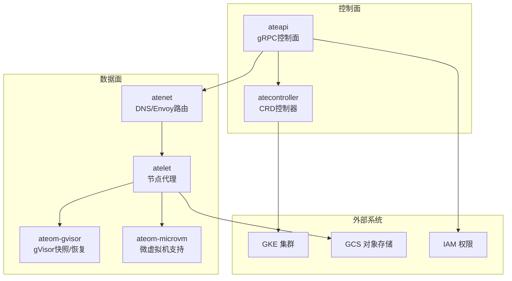
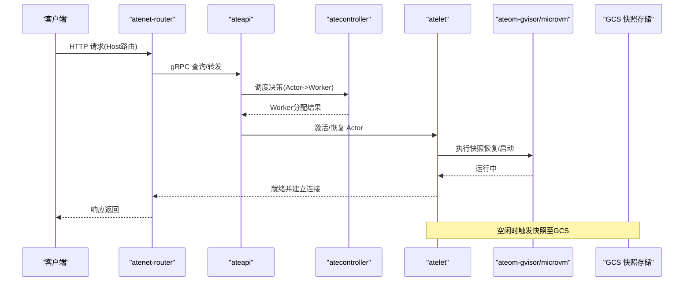
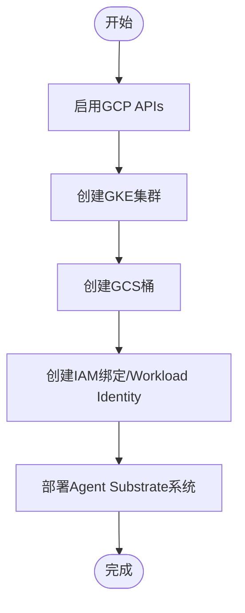
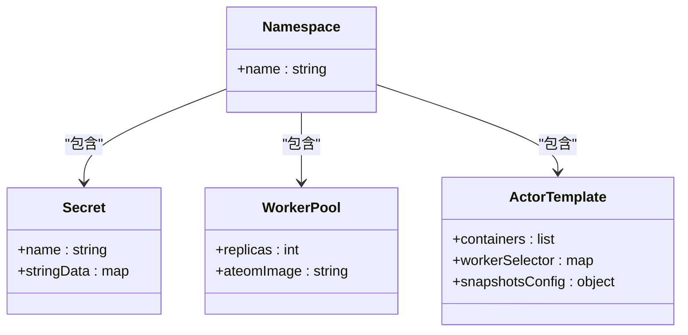
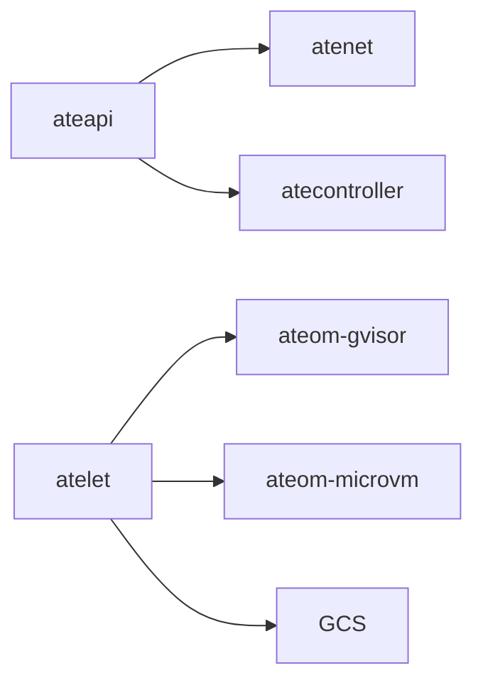

# 生态系统集成

<cite>
**本文引用的文件**   
- [README.md](file://README.md)
- [docs/api-guide.md](file://docs/api-guide.md)
- [docs/roadmap.md](file://docs/roadmap.md)
- [tools/setup-gcp/main.go](file://tools/setup-gcp/main.go)
- [tools/setup-gcp/README.md](file://tools/setup-gcp/README.md)
- [hack/teardown.sh](file://hack/teardown.sh)
- [demos/claude-code-multiplex/README.md](file://demos/claude-code-multiplex/README.md)
- [demos/claude-code-multiplex/claude-code-multiplex.yaml.tmpl](file://demos/claude-code-multiplex/claude-code-multiplex.yaml.tmpl)
- [hack/install-demo-claude-code-multiplex.sh](file://hack/install-demo-claude-code-multiplex.sh)
- [manifests/ate-install/atenet-router-monitoring.yaml](file://manifests/ate-install/atenet-router-monitoring.yaml)
- [docs/observability.md](file://docs/observability.md)
- [go.mod](file://go.mod)
</cite>

## 目录
1. [简介](#简介)
2. [项目结构](#项目结构)
3. [核心组件](#核心组件)
4. [架构总览](#架构总览)
5. [详细组件分析](#详细组件分析)
6. [依赖分析](#依赖分析)
7. [性能考虑](#性能考虑)
8. [故障排查指南](#故障排查指南)
9. [结论](#结论)
10. [附录](#附录)

## 简介
本文件面向“Agent Substrate”的生态集成，聚焦以下目标：
- 与主流AI框架和工具的兼容性说明（LangChain、Claude Code、CodeX等）
- 与Google Cloud Platform的深度集成（GKE集群部署、GCS对象存储、IAM权限管理）
- Model Context Protocol（MCP）支持与沙箱化部署建议
- 与Kubernetes生态无缝集成（Helm Charts、Operator模式、CI/CD流水线）
- 开发工具链集成（调试、监控、日志聚合）
- 提供实际集成示例与最佳实践

## 项目结构
仓库采用按二进制与功能域组织的结构：控制面、节点代理、网络控制器、CLI与管理工具、示例与基准测试、安装清单与脚本等。关键入口包括：
- 控制面API服务（ateapi）
- 节点级守护进程（atelet）
- Kubernetes控制器（atecontroller）
- 网络控制器与路由（atenet）
- 沙箱执行助手（ateom-gvisor / ateom-microvm）
- 安装与GCP资源编排工具（install-ate.sh、setup-gcp）

图表来源
- [README.md:215-225](file://README.md#L215-L225)
- [tools/setup-gcp/main.go:17-29](file://tools/setup-gcp/main.go#L17-L29)

章节来源
- [README.md:215-225](file://README.md#L215-L225)

## 核心组件
- ateapi：暴露gRPC接口，负责Actor/Worker生命周期管理与工作流编排
- atenet：提供DNS解析、Envoy边车与外部流量路由
- atelet：节点级守护进程，协调快照、状态迁移与OCI镜像拉取
- atecontroller：基于Kubernetes CRD（WorkerPool、ActorTemplate等）实现声明式调度
- ateom-gvisor/ateom-microvm：在Pod内执行快照/恢复或微虚拟机隔离
- setup-gcp：自动化创建GKE、GCS、IAM绑定与Cloud Monitoring仪表板
- install-ate.sh：一键安装/卸载系统与演示应用

章节来源
- [README.md:215-225](file://README.md#L215-L225)

## 架构总览
下图展示从用户请求到Actor执行的端到端路径，以及快照持久化与网络路由的关键交互。

图表来源
- [README.md:215-225](file://README.md#L215-L225)
- [demos/claude-code-multiplex/claude-code-multiplex.yaml.tmpl:87-88](file://demos/claude-code-multiplex/claude-code-multiplex.yaml.tmpl#L87-L88)

## 详细组件分析

### AI框架与工具集成
- LangChain
  - 作为长驻、有状态的Agent运行时非常契合；通过ActorTemplate将Agent内部“思维过程”与对话历史保存在内存快照中，并在沙箱中安全地调用工具。
  - 参考：[docs/api-guide.md:306-307](file://docs/api-guide.md#L306-L307)
- Claude Code & CodeX
  - 支持高密度、有状态的编码环境，每个开发者拥有独立的终端会话（Actor），文件系统增量随会话持久化；通过多路复用将少量物理Pod承载大量活跃会话。
  - 参考：[docs/api-guide.md:309-310](file://docs/api-guide.md#L309-L310)
  - 示例：三Agent共享两Pod的多路复用演示，见[demos/claude-code-multiplex/README.md:1-117](file://demos/claude-code-multiplex/README.md#L1-L117)
- Model Context Protocol（MCP）
  - 路线图明确计划原生托管MCP Server为受管Actor，构建安全的工具生态。
  - 参考：[docs/roadmap.md:97-99](file://docs/roadmap.md#L97-L99)

章节来源
- [docs/api-guide.md:306-310](file://docs/api-guide.md#L306-L310)
- [docs/roadmap.md:97-99](file://docs/roadmap.md#L97-L99)
- [demos/claude-code-multiplex/README.md:1-117](file://demos/claude-code-multiplex/README.md#L1-L117)

### Google Cloud Platform深度集成
- GKE集群部署
  - 使用setup-gcp工具创建GKE集群、启用必要API、配置节点池与网络参数。
  - 参考：[tools/setup-gcp/README.md:64-81](file://tools/setup-gcp/README.md#L64-L81)
- GCS对象存储
  - 用于Actor快照持久化；在ActorTemplate中通过snapshotsConfig.location指定GCS路径。
  - 参考：[demos/claude-code-multiplex/claude-code-multiplex.yaml.tmpl:87-88](file://demos/claude-code-multiplex/claude-code-multiplex.yaml.tmpl#L87-L88)
- IAM权限管理
  - 通过setup-gcp create iam子命令创建策略绑定与工作负载身份；清理时使用teardown.sh反向操作。
  - 参考：[tools/setup-gcp/README.md:97-113](file://tools/setup-gcp/README.md#L97-L113)、[hack/teardown.sh:48-60](file://hack/teardown.sh#L48-L60)

图表来源
- [tools/setup-gcp/README.md:10-17](file://tools/setup-gcp/README.md#L10-L17)
- [tools/setup-gcp/main.go:17-29](file://tools/setup-gcp/main.go#L17-L29)

章节来源
- [tools/setup-gcp/README.md:64-113](file://tools/setup-gcp/README.md#L64-L113)
- [hack/teardown.sh:48-100](file://hack/teardown.sh#L48-L100)
- [demos/claude-code-multiplex/claude-code-multiplex.yaml.tmpl:87-88](file://demos/claude-code-multiplex/claude-code-multiplex.yaml.tmpl#L87-L88)

### MCP安全沙箱化部署建议
- 将MCP Server作为ActorTemplate定义，利用gVisor或microvm进行强隔离执行
- 通过Secret注入凭据，限制网络出站访问，结合atenet路由仅开放必要端口
- 使用GCS持久化工具状态，配合空闲自动挂起与按需恢复，降低资源占用
- 参考：[docs/roadmap.md:97-99](file://docs/roadmap.md#L97-L99)、[demos/claude-code-multiplex/claude-code-multiplex.yaml.tmpl:62-88](file://demos/claude-code-multiplex/claude-code-multiplex.yaml.tmpl#L62-L88)

章节来源
- [docs/roadmap.md:97-99](file://docs/roadmap.md#L97-L99)
- [demos/claude-code-multiplex/claude-code-multiplex.yaml.tmpl:62-88](file://demos/claude-code-multiplex/claude-code-multiplex.yaml.tmpl#L62-L88)

### Kubernetes生态集成（Helm/Operator/CI-CD）
- Operator模式
  - 通过自定义CRD（WorkerPool、ActorTemplate等）由atecontroller持续 reconcile，符合Kubernetes声明式范式
  - 参考：[README.md:215-225](file://README.md#L215-L225)
- Helm Charts
  - 仓库未包含Helm Chart；可通过kustomize或kubectl apply现有清单进行部署
  - 参考：[manifests/ate-install/*.yaml](file://manifests/ate-install/atenet-router-monitoring.yaml)
- CI/CD流水线
  - GitHub Actions包含govulncheck与PR工作流；基准自动化容器镜像中包含gcloud/kubectl以驱动多集群测试
  - 参考：[.github/workflows/govulncheck.yaml:15-34](file://.github/workflows/govulncheck.yaml#L15-L34)、[benchmarking/automation/Dockerfile:43-66](file://benchmarking/automation/Dockerfile#L43-L66)

章节来源
- [README.md:215-225](file://README.md#L215-L225)
- [manifests/ate-install/atenet-router-monitoring.yaml:1-35](file://manifests/ate-install/atenet-router-monitoring.yaml#L1-L35)
- [.github/workflows/govulncheck.yaml:15-34](file://.github/workflows/govulncheck.yaml#L15-L34)
- [benchmarking/automation/Dockerfile:43-66](file://benchmarking/automation/Dockerfile#L43-L66)

### 开发与调试工具链集成
- 调试API
  - ateapi提供DebugClear等调试接口，便于清空状态与排障
  - 参考：[cmd/ateapi/internal/debugapi/debug_clear.go:24-32](file://cmd/ateapi/internal/debugapi/debug_clear.go#L24-L32)
- 监控与指标
  - 通过OpenTelemetry导出指标，Prometheus抓取Envoy侧车统计，GCP Managed Prometheus收集
  - 参考：[manifests/ate-install/atenet-router-monitoring.yaml:15-35](file://manifests/ate-install/atenet-router-monitoring.yaml#L15-L35)、[docs/observability.md:180-194](file://docs/observability.md#L180-L194)
- 日志聚合
  - 结合Kubernetes标准日志与Sidecar采集器，统一汇聚至云厂商或自建平台

章节来源
- [cmd/ateapi/internal/debugapi/debug_clear.go:24-32](file://cmd/ateapi/internal/debugapi/debug_clear.go#L24-L32)
- [manifests/ate-install/atenet-router-monitoring.yaml:15-35](file://manifests/ate-install/atenet-router-monitoring.yaml#L15-L35)
- [docs/observability.md:180-194](file://docs/observability.md#L180-L194)

### 实战示例：Claude Code多路复用
- 目标：三个Claude Code Agent共享两个Worker Pod，验证挂起/恢复与调度
- 关键资源：Namespace、Secret、WorkerPool、ActorTemplate（含GCS快照路径）
- 部署流程：通过install-ate.sh注册demo脚本，构建并推送工作负载镜像，模板替换后apply
- 参考：
  - [demos/claude-code-multiplex/README.md:46-58](file://demos/claude-code-multiplex/README.md#L46-L58)
  - [hack/install-demo-claude-code-multiplex.sh:19-30](file://hack/install-demo-claude-code-multiplex.sh#L19-L30)
  - [demos/claude-code-multiplex/claude-code-multiplex.yaml.tmpl:44-88](file://demos/claude-code-multiplex/claude-code-multiplex.yaml.tmpl#L44-L88)

图表来源
- [demos/claude-code-multiplex/claude-code-multiplex.yaml.tmpl:24-88](file://demos/claude-code-multiplex/claude-code-multiplex.yaml.tmpl#L24-L88)

章节来源
- [demos/claude-code-multiplex/README.md:46-58](file://demos/claude-code-multiplex/README.md#L46-L58)
- [hack/install-demo-claude-code-multiplex.sh:19-30](file://hack/install-demo-claude-code-multiplex.sh#L19-L30)
- [demos/claude-code-multiplex/claude-code-multiplex.yaml.tmpl:44-88](file://demos/claude-code-multiplex/claude-code-multiplex.yaml.tmpl#L44-L88)

## 依赖分析
- Go模块与第三方库
  - 包含GCP SDK（container、storage、iam、monitoring）、Envoy控制面、OTel、Prometheus、Redis等
  - 参考：[go.mod:1-36](file://go.mod#L1-L36)
- 组件耦合关系
  - ateapi与atenet通过gRPC通信；atelet与ateom组件协作完成快照/恢复；控制器与Kubernetes API交互
  - 参考：[README.md:215-225](file://README.md#L215-L225)

图表来源
- [README.md:215-225](file://README.md#L215-L225)

章节来源
- [go.mod:1-36](file://go.mod#L1-L36)
- [README.md:215-225](file://README.md#L215-L225)

## 性能考虑
- 高并发与低延迟
  - 通过“Actor多路复用+快照恢复”减少冷启动开销，提升吞吐
- 资源超分
  - 将大量无状态/空闲期长的Agent映射到少量Worker，提高利用率
- 网络优化
  - Envoy边车与atenet路由降低跨Pod通信延迟
- 观测性
  - OTLP指标与Prometheus抓取结合，定位瓶颈

[本节为通用指导，不直接分析具体文件]

## 故障排查指南
- 调试API
  - 使用DebugClear清理状态，辅助复现问题
  - 参考：[cmd/ateapi/internal/debugapi/debug_clear.go:24-32](file://cmd/ateapi/internal/debugapi/debug_clear.go#L24-L32)
- 监控与告警
  - 检查atenet-router的Envoy统计抓取是否生效
  - 参考：[manifests/ate-install/atenet-router-monitoring.yaml:15-35](file://manifests/ate-install/atenet-router-monitoring.yaml#L15-L35)
- GCP资源清理
  - 使用teardown.sh按逆序删除IAM绑定、GCS桶、节点池与集群
  - 参考：[hack/teardown.sh:48-100](file://hack/teardown.sh#L48-L100)

章节来源
- [cmd/ateapi/internal/debugapi/debug_clear.go:24-32](file://cmd/ateapi/internal/debugapi/debug_clear.go#L24-L32)
- [manifests/ate-install/atenet-router-monitoring.yaml:15-35](file://manifests/ate-install/atenet-router-monitoring.yaml#L15-L35)
- [hack/teardown.sh:48-100](file://hack/teardown.sh#L48-L100)

## 结论
Agent Substrate以Kubernetes为底座，通过Actor模型与快照恢复实现高并发、低延迟的Agent运行时。其生态集成能力覆盖主流AI框架（LangChain、Claude Code、CodeX）、MCP工具生态、GCP全栈（GKE/GCS/IAM/监控）与Kubernetes原生生态（CRD/Operator/CI-CD）。结合完善的可观测性与调试工具，可在生产环境中安全、高效地规模化运行复杂Agent工作负载。

[本节为总结性内容，不直接分析具体文件]

## 附录
- 快速开始与Demo
  - 本地Kind与GKE快速入门、Counter与Claude Code Multiplex Demo
  - 参考：[README.md:97-158](file://README.md#L97-L158)、[demos/claude-code-multiplex/README.md:1-117](file://demos/claude-code-multiplex/README.md#L1-L117)
- 安装与卸载
  - 使用install-ate.sh与setup-gcp进行系统部署与资源编排
  - 参考：[tools/setup-gcp/README.md:10-17](file://tools/setup-gcp/README.md#L10-L17)、[hack/teardown.sh:102-124](file://hack/teardown.sh#L102-L124)

章节来源
- [README.md:97-158](file://README.md#L97-L158)
- [demos/claude-code-multiplex/README.md:1-117](file://demos/claude-code-multiplex/README.md#L1-L117)
- [tools/setup-gcp/README.md:10-17](file://tools/setup-gcp/README.md#L10-L17)
- [hack/teardown.sh:102-124](file://hack/teardown.sh#L102-L124)
