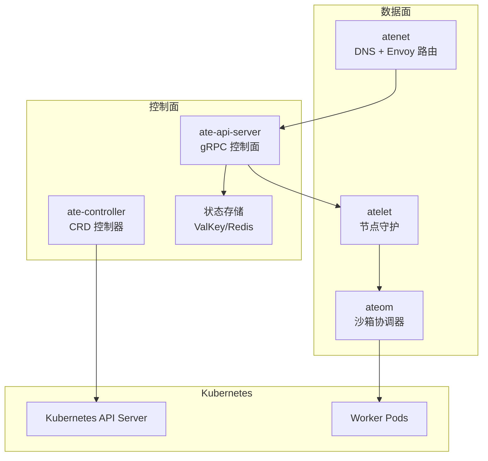
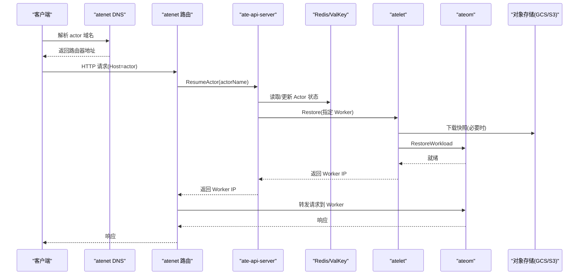
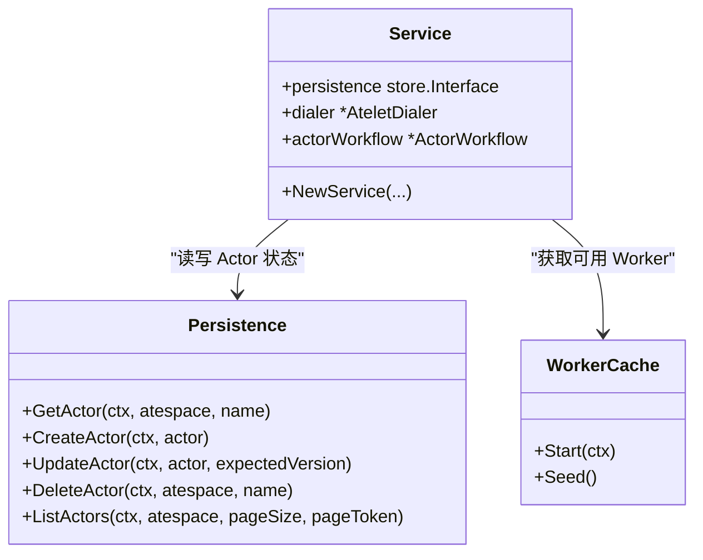
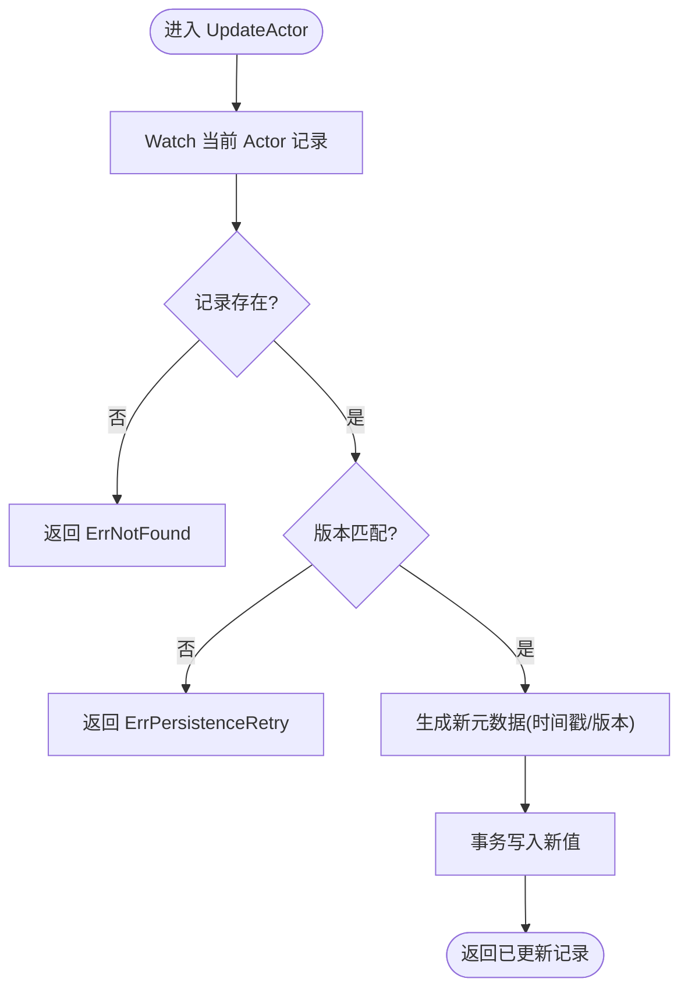
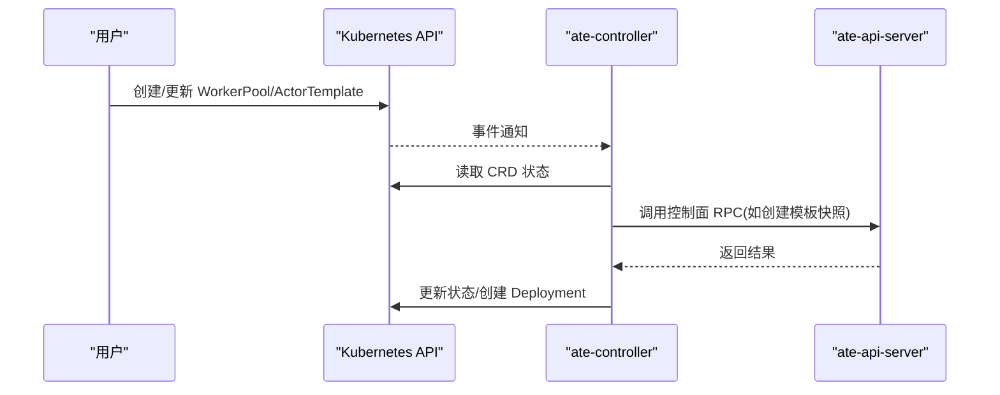
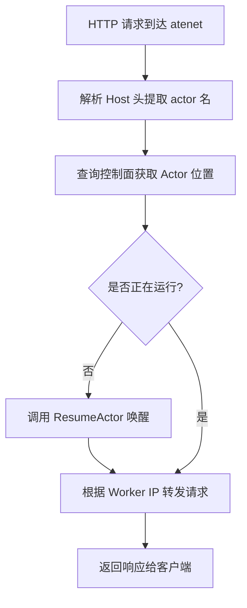
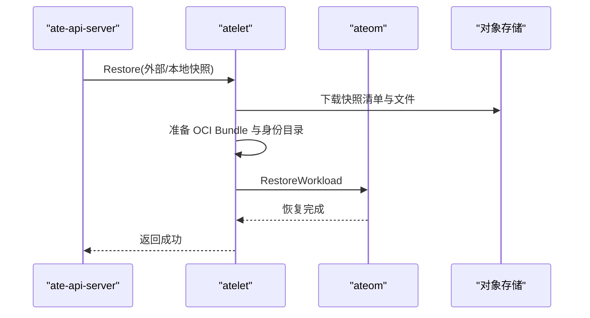
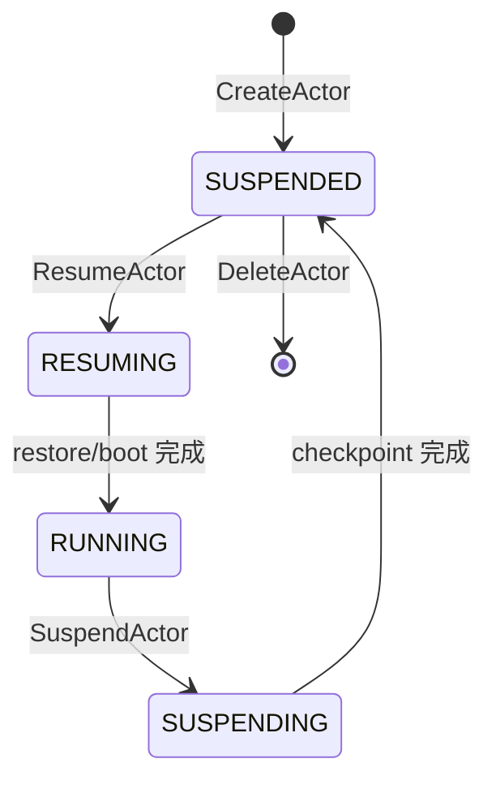
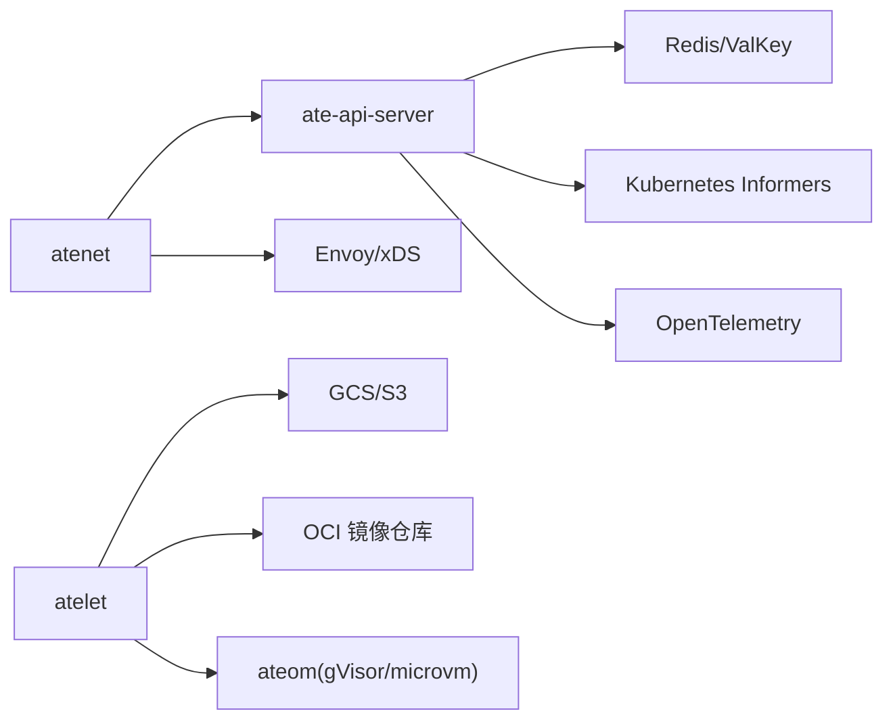

# 项目概述

<cite>
**本文引用的文件列表**   
- [README.md](file://README.md)
- [architecture.md](file://docs/architecture.md)
- [glossary.md](file://docs/glossary.md)
- [main.go（ateapi）](file://cmd/ateapi/main.go)
- [service.go（控制面服务）](file://cmd/ateapi/internal/controlapi/service.go)
- [store.go（持久化接口）](file://cmd/ateapi/internal/store/store.go)
- [ateredis.go（Redis实现）](file://cmd/ateapi/internal/store/ateredis/ateredis.go)
- [main.go（atecontroller）](file://cmd/atecontroller/main.go)
- [actortemplate_types.go](file://pkg/api/v1alpha1/actortemplate_types.go)
- [workerpool_types.go](file://pkg/api/v1alpha1/workerpool_types.go)
- [main.go（atenet）](file://cmd/atenet/main.go)
- [controller.go（atenet路由控制器）](file://cmd/atenet/internal/router/controller.go)
- [main.go（atelet）](file://cmd/atelet/main.go)
</cite>

## 目录
1. [简介](#简介)
2. [项目结构](#项目结构)
3. [核心组件](#核心组件)
4. [架构总览](#架构总览)
5. [详细组件分析](#详细组件分析)
6. [依赖关系分析](#依赖关系分析)
7. [性能与可扩展性](#性能与可扩展性)
8. [故障排查指南](#故障排查指南)
9. [快速开始](#快速开始)
10. [结论](#结论)

## 简介
Agent Substrate 是一个构建在 Kubernetes 之上的“智能体基础设施”平台，面向大量无状态或短时活跃的“Actor”工作负载，通过高并发多路复用、低延迟激活、以及进程级状态快照与恢复，显著降低资源占用并提升吞吐。其关键理念包括：
- 将 Actor 生命周期与 Pod 生命周期解耦，避免空闲 Pod 的资源浪费
- 预启动少量“Worker”Pod，按需将 Actor 热恢复至 Worker，实现超分复用
- 控制平面聚焦于高性能调度与状态管理，数据平面由网络代理触发自动唤醒
- 基于 gVisor 或微虚拟机进行强隔离执行，结合对象存储持久化内存与文件系统快照

与传统容器编排相比，Substrate 将“百万级 Actor 实例”的管理从 etcd/Kubernetes API 路径中移出，采用专用的高 QPS 状态存储与本地节点协调器，从而达成亚百毫秒级别的激活延迟目标。

**章节来源**
- [README.md:8-31](file://README.md#L8-L31)
- [architecture.md:1-13](file://docs/architecture.md#L1-L13)

## 项目结构
仓库采用按功能域划分的模块组织方式，核心二进制位于 cmd 目录，API 类型定义位于 pkg，文档与示例分别位于 docs 与 demos。主要入口如下：
- 控制面：cmd/ateapi（gRPC 控制面服务）
- 控制器：cmd/atecontroller（CRD 控制器）
- 数据面：cmd/atenet（DNS + Envoy 路由与外部处理）
- 节点侧：cmd/atelet（节点守护，驱动 ateom 与快照传输）
- 沙箱协调器：cmd/ateom-gvisor / cmd/ateom-microvm（运行于 Worker Pod 内）

**图表来源**
- [main.go（ateapi）:1-206](file://cmd/ateapi/main.go#L1-L206)
- [main.go（atecontroller）:1-124](file://cmd/atecontroller/main.go#L1-L124)
- [main.go（atenet）:1-22](file://cmd/atenet/main.go#L1-L22)
- [main.go（atelet）:1-183](file://cmd/atelet/main.go#L1-L183)

**章节来源**
- [README.md:215-225](file://README.md#L215-L225)
- [glossary.md:34-60](file://docs/glossary.md#L34-L60)

## 核心组件
- 控制面（ate-api-server）
  - 暴露 gRPC 控制接口，负责 Actor 生命周期编排、Worker 分配、快照流程协调
  - 使用 Redis/ValKey 作为高性能状态存储，缓存 Worker 信息以加速调度
- 控制器（ate-controller）
  - 基于 controller-runtime 监听 CRD（WorkerPool、ActorTemplate），将其收敛为实际集群资源
- 数据面（atenet）
  - 提供统一 DNS 解析与基于 Host 的 Actor 发现；拦截请求并在需要时触发 ResumeActor
- 节点守护（atelet）
  - 拉取镜像、准备 OCI Bundle、驱动 ateom 执行 Run/Checkpoint/Restore，并与对象存储交互
- 沙箱协调器（ateom）
  - 在 Worker Pod 内部调用底层运行时（runsc 或 Kata+CH）完成进程级 Checkpoint/Restore

**章节来源**
- [glossary.md:34-60](file://docs/glossary.md#L34-L60)
- [architecture.md:310-352](file://docs/architecture.md#L310-L352)

## 架构总览
系统采用控制平面与数据平面分离设计：
- 控制平面专注高并发、低延迟的状态管理与调度，绕过 Kubernetes API 的关键路径
- 数据平面通过 atenet 捕获流量，查询控制面决定是否需要唤醒 Actor，并直连 Worker 转发请求
- 节点侧 atelet 与 ateom 协作，完成镜像拉取、Bundle 准备、快照上传/下载与运行时恢复

**图表来源**
- [architecture.md:359-384](file://docs/architecture.md#L359-L384)
- [main.go（ateapi）:155-206](file://cmd/ateapi/main.go#L155-L206)
- [main.go（atelet）:454-583](file://cmd/atelet/main.go#L454-L583)

## 详细组件分析

### 控制面（ate-api-server）
职责与特性：
- 初始化 gRPC 服务、认证拦截器、OpenTelemetry 指标与追踪
- 连接 Redis/ValKey 作为状态存储，维护 Actor 记录与 Worker 缓存
- 同步 Kubernetes 中的 WorkerPod 与 atelet Pod 信息，供调度使用
- 注册 Control、SessionIdentity、Debug 等 gRPC 服务

关键实现要点：
- 支持 mTLS 与可选 JWT 认证模式，兼容 Ingress/网关集成
- 通过 Informer 机制监听 CRD 与 Pod 变更，保持 Worker 缓存一致性
- 提供调试接口用于清空状态（开发/测试场景）

**图表来源**
- [service.go（控制面服务）:1-57](file://cmd/ateapi/internal/controlapi/service.go#L1-L57)
- [store.go（持久化接口）:40-61](file://cmd/ateapi/internal/store/store.go#L40-L61)
- [main.go（ateapi）:126-155](file://cmd/ateapi/main.go#L126-L155)

**章节来源**
- [main.go（ateapi）:79-206](file://cmd/ateapi/main.go#L79-L206)
- [service.go（控制面服务）:25-57](file://cmd/ateapi/internal/controlapi/service.go#L25-L57)
- [store.go（持久化接口）:40-61](file://cmd/ateapi/internal/store/store.go#L40-L61)

### 状态存储（Redis/ValKey）
- 使用乐观锁与事务保证 Actor 状态更新的原子性与版本一致性
- 提供分页扫描能力，便于批量操作与清理
- 支持按 atespace 维度键空间隔离，提高安全性与可观测性

**图表来源**
- [ateredis.go（Redis实现）:523-584](file://cmd/ateapi/internal/store/ateredis/ateredis.go#L523-L584)

**章节来源**
- [ateredis.go（Redis实现）:299-311](file://cmd/ateapi/internal/store/ateredis/ateredis.go#L299-L311)
- [ateredis.go（Redis实现）:313-334](file://cmd/ateapi/internal/store/ateredis/ateredis.go#L313-L334)
- [ateredis.go（Redis实现）:523-584](file://cmd/ateapi/internal/store/ateredis/ateredis.go#L523-L584)

### 控制器（ate-controller）
- 基于 controller-runtime 管理 WorkerPool 与 ActorTemplate 的声明式配置
- 将 WorkerPool 收敛为 Deployment，确保 Worker 副本数与期望一致
- 与 ate-api-server 通信，触发 Golden Snapshot 创建等控制面动作

**图表来源**
- [main.go（atecontroller）:82-124](file://cmd/atecontroller/main.go#L82-L124)

**章节来源**
- [main.go（atecontroller）:1-124](file://cmd/atecontroller/main.go#L1-L124)

### 数据面（atenet）
- 提供全局 DNS 后缀，使每个 Actor 可通过统一域名访问
- 基于 Host 头提取 Actor 名称，查询控制面决定是否唤醒
- 通过 xDS 动态下发 Envoy 配置，并协调外部处理服务器

**图表来源**
- [controller.go（atenet路由控制器）:67-111](file://cmd/atenet/internal/router/controller.go#L67-L111)

**章节来源**
- [main.go（atenet）:1-22](file://cmd/atenet/main.go#L1-L22)
- [controller.go（atenet路由控制器）:26-65](file://cmd/atenet/internal/router/controller.go#L26-L65)

### 节点守护（atelet）
- 负责镜像拉取、OCI Bundle 准备、身份注入与卷挂载点创建
- 与 ateom 通信执行 Run/Checkpoint/Restore，并将快照上传/下载到对象存储
- 对恢复过程进行细粒度计时，便于定位瓶颈（下载、解压、restore）

**图表来源**
- [main.go（atelet）:454-583](file://cmd/atelet/main.go#L454-L583)

**章节来源**
- [main.go（atelet）:1-183](file://cmd/atelet/main.go#L1-L183)
- [main.go（atelet）:645-753](file://cmd/atelet/main.go#L645-L753)

### 沙箱类与快照策略
- 支持 gVisor 与 micro-VM 两类沙箱类，选择不同运行时与快照机制
- 快照范围分为 Full（内存+根文件系统增量）与 Data（仅持久卷内容）
- Golden Snapshot 在模板创建时生成，首次恢复共享该快照，后续恢复使用最新快照

**图表来源**
- [architecture.md:386-396](file://docs/architecture.md#L386-L396)

**章节来源**
- [actortemplate_types.go:236-276](file://pkg/api/v1alpha1/actortemplate_types.go#L236-L276)
- [workerpool_types.go:70-89](file://pkg/api/v1alpha1/workerpool_types.go#L70-L89)

## 依赖关系分析
- 控制面依赖：
  - Redis/ValKey：高性能状态存储
  - Kubernetes Informers：WorkerPod 与 atelet Pod 的实时视图
  - OpenTelemetry：指标与分布式追踪
- 数据面依赖：
  - Envoy/xDS：动态路由配置
  - External Processing：与 ate-api-server 交互
- 节点侧依赖：
  - GCS/S3：快照持久化
  - OCI 镜像仓库：镜像拉取与缓存
  - 沙箱运行时：runsc（gVisor）或 Kata+Cloud Hypervisor（micro-VM）

**图表来源**
- [main.go（ateapi）:111-155](file://cmd/ateapi/main.go#L111-L155)
- [main.go（atelet）:121-170](file://cmd/atelet/main.go#L121-L170)
- [controller.go（atenet路由控制器）:39-65](file://cmd/atenet/internal/router/controller.go#L39-L65)

**章节来源**
- [main.go（ateapi）:111-155](file://cmd/ateapi/main.go#L111-L155)
- [main.go（atelet）:121-170](file://cmd/atelet/main.go#L121-L170)
- [controller.go（atenet路由控制器）:67-111](file://cmd/atenet/internal/router/controller.go#L67-L111)

## 性能与可扩展性
- 激活延迟目标：95 百分位约 100ms，通过绕过 Kubernetes 调度关键路径与原子物理分配实现
- 规模目标：单集群支持十亿级 Actor（活跃+休眠）
- 吞吐目标：单集群每秒处理千级唤醒事件
- 优化手段：
  - 控制面使用 Redis 做高频状态读写，避免 etcd 成为瓶颈
  - 节点侧并行下载快照与准备 OCI Bundle，隐藏 I/O 与解压开销
  - 本地内存拉取缓存减少重复镜像拉取

[本节为通用性能讨论，不直接分析具体文件]

## 故障排查指南
- 控制面常见问题：
  - Redis 连接失败：检查 TLS 配置、IAM 认证与重试逻辑
  - 认证模式错误：确认 mTLS/JWT 配置与服务端证书链
- 数据面问题：
  - DNS 解析失败：确认 atenet 部署与 DNS 后缀配置
  - 路由未触发唤醒：检查 Host 头与外部处理服务器配置
- 节点侧问题：
  - 快照上传/下载失败：核对对象存储权限与路径前缀
  - 恢复耗时过长：查看 atelet 日志中的阶段计时（download、oci_unpack、ateom_restore）

**章节来源**
- [main.go（ateapi）:248-331](file://cmd/ateapi/main.go#L248-L331)
- [main.go（atelet）:570-583](file://cmd/atelet/main.go#L570-L583)

## 快速开始
以下命令帮助新用户快速体验 Agent Substrate 的核心价值与使用方式：
- 本地环境（kind）
  - 创建集群与本地镜像仓库
  - 安装 ate 系统与依赖（valkey、rustfs）
  - 部署计数器 Demo
  - 安装 kubectl-ate 插件
  - 创建 atespace 与 Actor
  - 端口转发 atenet-router 并通过 curl 发送请求

- GKE 环境
  - 准备环境变量与应用默认凭据
  - 引导所需 GCP 资源（GKE、GCS、IAM）
  - 部署 Substrate 系统
  - 部署示例应用

参考路径：
- [README.md:97-186](file://README.md#L97-L186)
- [README.md:195-209](file://README.md#L195-L209)

**章节来源**
- [README.md:97-186](file://README.md#L97-L186)
- [README.md:195-209](file://README.md#L195-L209)

## 结论
Agent Substrate 通过将 Actor 生命周期与 Pod 解耦、引入专用控制面与数据面、并结合进程级快照与沙箱隔离，实现了在高并发、低延迟场景下的高效资源利用。其云原生架构既充分利用了 Kubernetes 的编排能力，又避免了传统控制平面的性能瓶颈，适合大规模、短时活跃的智能体与工作负载。对于初学者，建议从 Demo 入手理解概念；对于有经验的开发者，可深入控制面与节点侧的实现细节，进一步优化与扩展。

[本节为总结性内容，不直接分析具体文件]
