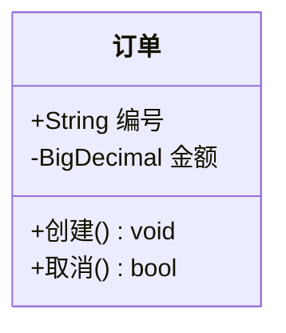
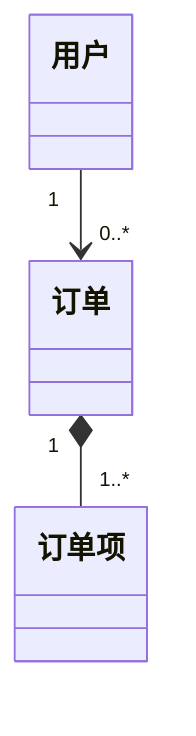

# 类图理论（02）

## 1. 类的结构

- **属性**：可见性 + 类型 + 名称（+ 公开 / - 私有 / # 保护 / ~ 包内）；
- **方法**：可见性 + 名称 + 参数 + 返回类型；
- **静态成员**：`$` 前缀（`+$实例数 int`）。

## 2. 关系类型（UML 语义核心）

| 关系 | Mermaid | 语义 | 示例 |
|------|---------|------|------|
| 泛化（继承） | `A <|-- B` | B 是 A 的子类 | 猫 <|-- 动物 |
| 实现 | `A ..|> B` | A 实现接口 B | 订单服务 ..|> 订单接口 |
| 组合 | `A *-- B` | B 是 A 的组成部分，同生命周期 | 订单 *-- 订单项 |
| 聚合 | `A o-- B` | B 是 A 的成员，可独立 | 团队 o-- 成员 |
| 关联 | `A --> B` | A 与 B 有结构性关联 | 用户 --> 订单 |
| 依赖 | `A ..> B` | A 临时/弱依赖 B | 服务 ..> 配置 |

**区分要点**：
- 组合 vs 聚合：同生命周期（订单删除则订单项删）vs 独立生命周期；
- 关联 vs 依赖：结构性/长期 vs 临时性/使用即可。

## 3. 多重性

- 常见值：`1`、`*`、`0..1`、`1..*`、`0..*`；
- 多重性缺失 = 语义丢失（必填）。

## 4. 构造型

- `<<interface>>` 接口、`<<abstract>>` 抽象类、`<<enumeration>>` 枚举；
- 自定义构造型（`<<service>>` `<<entity>>`）按项目约定。

## 5. Mermaid 表达要点

- namespace 表达包组织（howto/06）；
- classDef 表达分层配色（howto/02 §5）；
- 类图是领域模型的可视化：GRASP/SOLID 检验工具（document/08、09）。
