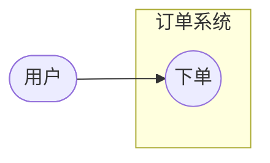

# 用例图理论（04）

> Mermaid 无原生用例图——本文件给出 UML 用例图理论，并说明 Mermaid 近似方案（见 §6 与 howto/07）。

## 1. 角色（Actor）

- 与系统交互的外部实体：人、外部系统、设备；
- 角色是**角色**不是用户个体（「管理员」是角色，「张三」不是）。

## 2. 用例（Use Case）

- 系统对外提供的一项**可观察价值**（动词短语：「下单」「查询订单」）；
- 用例描述「做什么」，不描述「怎么做」（内部步骤属活动图）。

## 3. 系统边界（System Boundary）

- 框住系统内用例；角色在边界外；
- 边界即需求范围（什么在系统内、什么在系统外）。

## 4. 关系

| 关系 | 语义 | 方向 |
|------|------|------|
| 关联 | 角色参与用例 | 角色 → 用例 |
| include | 主用例必含子用例 | 主 → 子（虚线箭头） |
| extend | 扩展用例可选附加 | 扩展 → 主（虚线箭头，方向易混） |
| generalization | 角色/用例泛化 | 子 → 父 |

## 5. 用例数量与粒度

- 用例 ≤12/图；每个用例是**完整价值**（不是步骤）；
- 粒度一致（同一图内不混粗细）。

## 6. Mermaid 近似方案

- 角色 = `([ ])` 双圆；用例 = `(( ))` 椭圆；边界 = subgraph；
- include/extend 用虚线边 + 标签（`-.->|include|`）；
- **交付说明注明「用例图（flowchart 近似）」，并保留 UML 语义命名**；
- 详见 howto/07-usecase-diagram.md。
