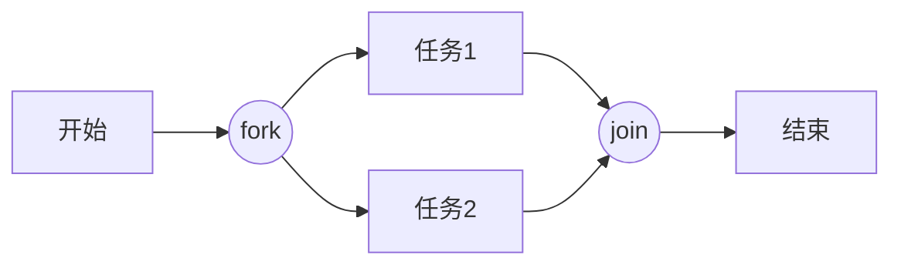

# 活动图理论（05）

## 1. 活动图本质

- 表达**业务流程/工作流**：步骤顺序、分支、并发、同步；
- 与状态图的区别：活动图表达「流程」，状态图表达「对象状态」；
- 与流程图的区别：UML 活动图有 fork/join 并发与泳道语义——Mermaid flowchart 覆盖大部分，fork/join 用 `((fork))`/`((join))` 圆形节点近似。

## 2. 元素

| 元素 | 语义 | Mermaid |
|------|------|---------|
| 初始节点 | 流程开始 | `([开始])` |
| 活动 | 一个动作 | `[动作]` |
| 决策 | 条件分支 | `{条件}` + 边标签 |
| 合并 | 分支汇合 | 菱形或普通节点 |
| fork/join | 并发分叉/汇合 | `((fork))` / `((join))` |
| 结束节点 | 流程结束 | `([结束])` |
| 泳道 | 角色/系统分区 | `subgraph` |

## 3. 转换与守卫

- 转换 = 边；守卫 = 边标签（`-- 是 -->` / `-- 金额>=10000 -->`）；
- 决策出口**必须**有守卫标签（否则读者不知道条件）；
- 循环：回边 + 守卫（`-- 重试 -->`）。

## 4. 泳道（分区）

- 泳道表达「谁做」：按角色/系统/部门分区；
- Mermaid subgraph 近似：`subgraph 支付网关 ... end`；
- 跨泳道边 = 协作/消息。

## 5. 并发（fork/join）

- fork 后必须 join（或明确终态）；遗漏 join 是语义错误；
- 并发分支 ≤3，更多用 `×N` 或拆分。

## 6. 建模要点

- 活动 = 动词短语；决策条件 = 完整判断式；
- 每张活动图一条主路径 + 有限异常分支；
- 步骤 >12 拆图（按阶段/角色拆）。
