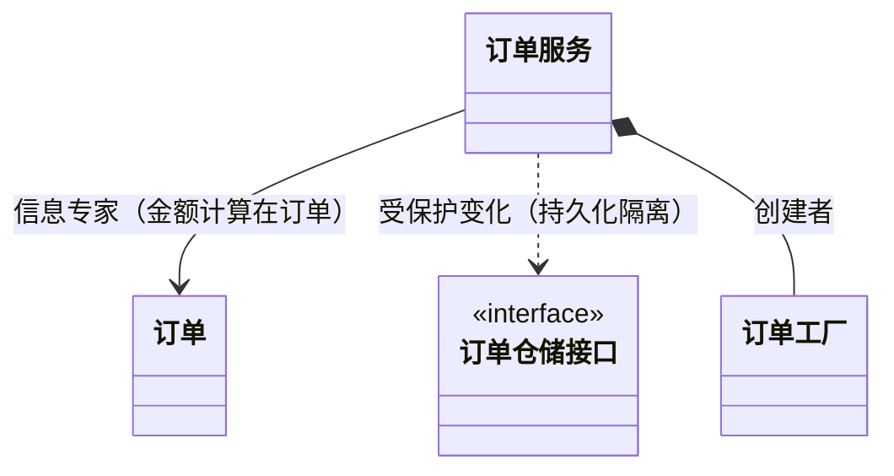

# GRASP 设计模式（09）

> GRASP（General Responsibility Assignment Software Patterns）是职责分配的核心方法论——「谁该负责什么」。

## 1. 九大模式速览

| 模式 | 含义 | 类图体现 |
|------|------|---------|
| 信息专家 Information Expert | 职责给拥有信息的类 | 聚合/关联关系指向数据持有者 |
| 创建者 Creator | 谁创建谁（聚合方创建成员） | 组合 `*--` |
| 控制器 Controller | 系统操作统一入口 | 应用层服务类 |
| 低耦合 Low Coupling | 减少类间依赖 | 依赖箭头少而明确 |
| 高内聚 High Cohesion | 职责相关聚集 | 类内聚、类图聚类 |
| 多态 Polymorphism | 用接口抽象变化 | 接口 + 实现 |
| 纯虚构 Pure Fabrication | 无领域归属的职责放虚构类 | 服务/工具类 |
| 间接 Indirection | 中介解耦 | 门面/代理类 |
| 受保护变化 Protected Variations | 变化点用接口隔离 | 接口层 |

## 2. 图上的职责检查

## 3. 与 Mermaid 绘图的结合

- 类图是 GRASP 讨论的载体：先画职责分配，再讨论对错；
- DIP/受保护变化：依赖箭头指向接口（`..>` 指向 `<<interface>>`）；
- 高内聚/低耦合：类图聚类 + 跨聚类连线计数（连线多 = 耦合高，需要重构信号）。

## 4. 常见 GRASP 错误（图可暴露）

- 万能类（God Class）：一个类连线/属性爆炸；
- 贫血模型：数据类无行为（所有逻辑在服务层）；
- 依赖环：类图出现环（A→B→C→A）——设计缺陷。
