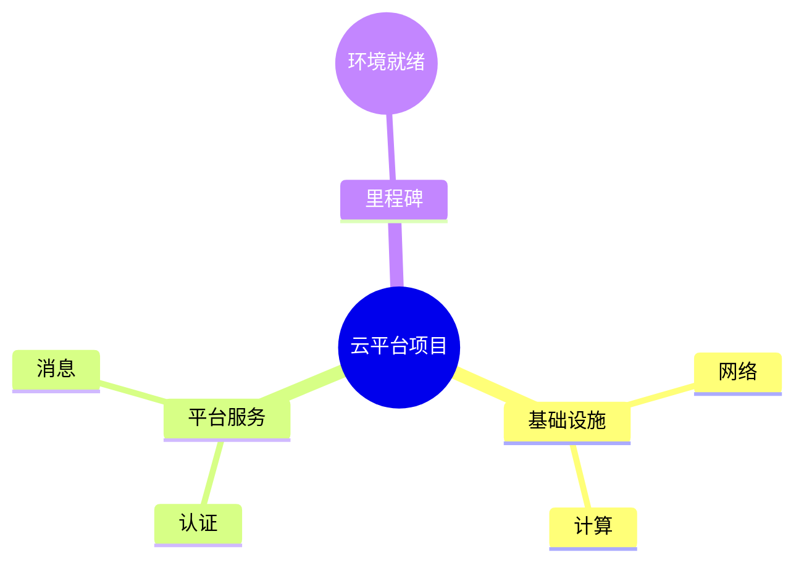

# WBS 工作分解结构（11）

## 1. WBS 定义

- WBS（Work Breakdown Structure）把项目/交付物分解为可管理的工作包；
- 100% 原则：上层 = 下层之和（不重不漏）；
- 分解到「可估算、可分配、可验收」为止。

## 2. 分解原则

1. **按交付物分解**（不是按活动/部门）；
2. **层级 ≤4**（阶段 → 工作包 → 任务 → 子任务）；
3. **叶子节点可估算**（工期/成本）；
4. **唯一归属**：每个节点只有一个父节点。

## 3. PlantUML `@startwbs` 语义回顾

- 层级树 + 左右方向 + 无框节点 + 算术记法（`+_`/`-_` 展开折叠）；
- 这些语义在 Mermaid 的承接：
  - 树结构 → `mindmap`（推荐，原生树）；
  - 左右展开/折叠 → `flowchart LR`（近似）。

## 4. Mermaid 承接（mindmap）

- 100% 原则在图上体现为「父节点 = 子节点全集」；
- 里程碑锚点 `M1/M2` 与甘特图对账（howto/13、14）。

## 5. 信息编码

- 状态色：完成（绿）/进行中（蓝）/未开始（灰）/里程碑（黄）；
- 责任人：`\n【姓名】` 行内编码；
- 有效字号 ≥12px（节点标题越长字号越小——控制标题长度）。

## 6. 交付检查

- 100% 原则核对（漏项/重叠）；
- 叶子可估算；
- 量测三判据（measure-svg-layout.py）；
- 完整操作见 howto/13-wbs-diagram.md。
