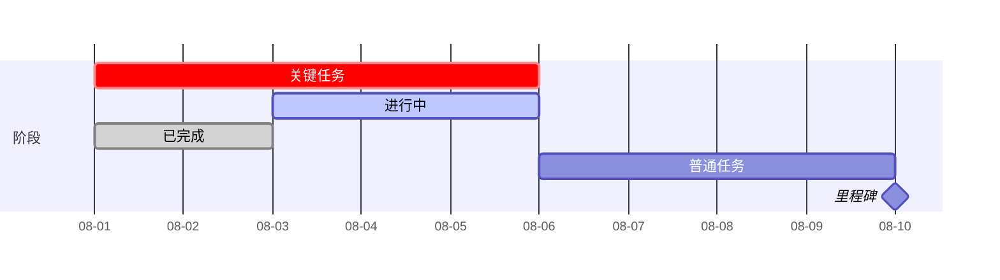
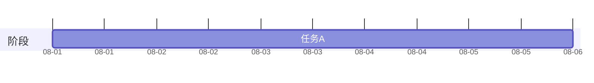

# 甘特图参考（12）

## 1. 语法结构

```mermaid
gantt
  dateFormat YYYY-MM-DD
  axisFormat %m-%d
  title 项目计划
  section 阶段
  任务 : id, 开始, 工期
  里程碑 : milestone, mid, 日期, 0d
  依赖任务 : after id
```

## 2. 指令速查

| 指令 | 说明 |
|------|------|
| `dateFormat` | 日期输入格式：`YYYY-MM-DD`、`YYYY-MM-DD HH:mm` |
| `axisFormat` | 刻度格式：`%Y-%m-%d`、`%m-%d`、`%H:%M`、`%W`（周） |
| `title` | 图表标题 |
| `section` | 分组 |
| `excludes` | 排除日期（逗号分隔） |
| `weekends` | （默认排除周六日） |
| `todayMarker` | `off` 或样式 |
| `progress` | 任务完成度（v11.7+） |

## 3. 任务属性



- 属性顺序：`名称 : 属性..., id, 开始, 工期`；
- `crit`（红）、`active`（蓝）、`done`（灰）可组合。

## 4. 布局配置



## 5. 工作日历

- 默认排除周末；
- 节假日：`excludes 2026-10-01, 2026-10-02`；
- 注意：`excludes` 只对日期匹配生效（跨天任务按天粒度排除）。

## 6. 排期正确性

- 依赖用 `after <id>`（多依赖 `after a1, b1`）；
- 里程碑编号与 WBS 锚点一致（M1/M2…）；
- **改动排期必须 A/B 量测**（`measure-svg-layout.py --compare` 看 `scheduleChanged`）；
- 完整操作见 howto/14-gantt-diagram.md。
