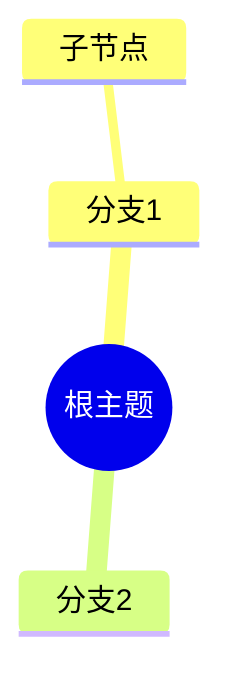

# 思维导图参考（13）

## 1. 语法结构



- 缩进（空格）即层级；缩进不一致会错乱；
- 根节点 `root` 前缀 + 形状。

## 2. 节点形状

| 形状 | 语法 |
|------|------|
| 默认圆角 | `节点` |
| 圆形 | `((节点))` |
| 方形 | `[节点]` |
| 六角 | `{{节点}}` |
| 平行四边形 | `[/节点/]` |
| 反向 | `[\节点\]` |

## 3. 分支与方向

- mindmap 自动分左右两翼（根的子节点按序分配）；
- 无法显式指定某节点在左/右翼——需要精确方向时用 `flowchart LR`；
- 层级 ≤4，每层 ≤6（视觉上限）。

## 4. 样式

```mermaid
%%{init: {"theme": "base", "themeVariables": {
  "primaryColor": "#fff", "primaryBorderColor": "#333",
  "primaryTextColor": "#1a1a1a", "lineColor": "#666"
}}}%%
mindmap
  root((项目))
    核心 :::core
  classDef core fill:#e8f0fe,stroke:#1a73e8
```

- `:::类名` 行尾挂样式类；
- 主题变量：`primaryColor`（节点填充）、`lineColor`（连线）、`fontFamily`、`fontSize`。

## 5. 与 WBS 的关系

- WBS 是项目分解树 → mindmap 原生承接（howto/13）；
- 脑图（发散）与 WBS（收敛分解）语义不同但图型相同；
- 发散场景：保留脑图风格（无状态色）；
- 分解场景：加状态色/责任人编码。

## 6. 常见问题

- 缩进混用空格与 tab；
- 节点文字过长（字号骤降）；
- 形状滥用（一图多种形状 = 噪音）。
