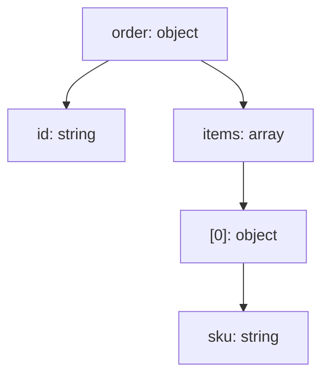

# JSON 可视化参考（14）

## 1. PlantUML `@startjson` 语义回顾

- 对象/数组/标量自动渲染为树；`#highlight` 路径高亮；`jsonDiagram` `<style>` 定制；
- 用途：把 JSON 数据形状变成人眼友好的结构图。

## 2. Mermaid 承接（flowchart 近似）

| PlantUML 能力 | Mermaid 方案 |
|---------------|-------------|
| 对象/嵌套 | flowchart 父节点 + 子节点 |
| 数组 | 下标 `[0]` / `×N` 折叠 |
| 标量类型 | 节点文字 `键: 类型` |
| `#highlight` 路径 | classDef 高亮节点 |
| `<style>` 定制 | themeVariables / classDef |

## 3. 结构树规范

- 节点标题 = `键: 类型`（或 `键: 值` 当值有意义且短）；
- 类型色：object（蓝）/ string（灰）/ number（绿）/ bool（黄）/ null（浅灰）；
- 层级 ≤5；叶子总数 ≤20（超限折叠）。

## 4. 高亮语义

- 与文档/代码中讨论的路径对应（如「关注 `order.items[0].sku`」→ 高亮该链）；
- 高亮 ≤3 处，其余弱化。

## 5. 交付检查

- 类型标注完整；
- 折叠处有 `…` + 文字说明；
- 注明「JSON 可视化（flowchart 近似）」；
- 完整操作见 howto/16-json-diagram.md。
