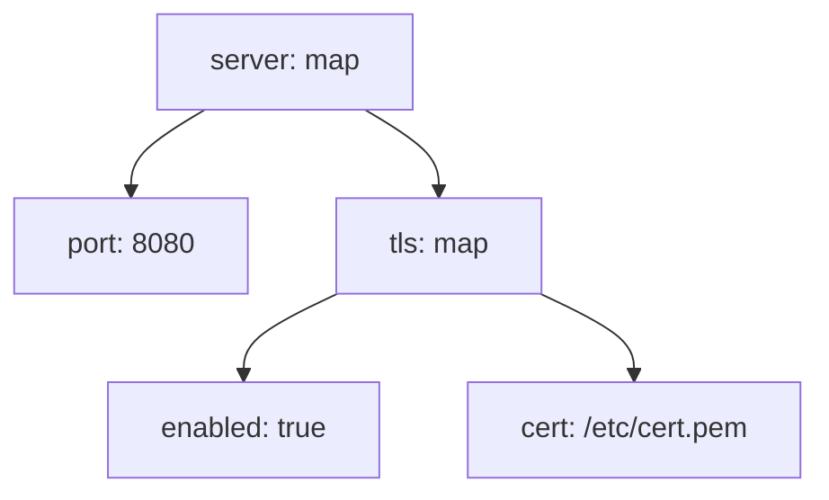

# YAML 可视化参考（15）

## 1. PlantUML `@startyaml` 语义回顾

- 嵌套映射/列表自动渲染；`# highlight` 路径高亮；`yamlDiagram` `<style>`；
- 用途：把 YAML 配置结构变成可讲解的图。

## 2. Mermaid 承接（flowchart 近似）

| PlantUML 能力 | Mermaid 方案 |
|---------------|-------------|
| 映射嵌套 | flowchart 父节点 + 子节点 |
| 列表 | 叶子节点内联 `[a, b]` 或下标展开 |
| 标量 | 节点文字 `键: 值` |
| `# highlight` | classDef 高亮 |
| `<style>` | themeVariables / classDef |

## 3. 结构树规范

- 映射 = 父节点（`键: map`）；标量 = 叶子（`键: 值`）；
- 值过长截断（`+ 说明见文字`）；
- 层级 ≤5；叶子 ≤15。

## 4. 高亮语义

- 关键配置路径高亮（如证书路径、端口）；
- 敏感值可脱敏（`cert: ****`）——安全优先。

## 5. 交付检查

- 键/值标注完整；
- 折叠处有 `…`；
- 注明「YAML 可视化（flowchart 近似）」；
- 完整操作见 howto/17-yaml-diagram.md。
