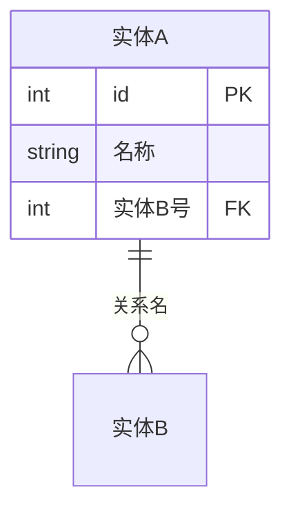
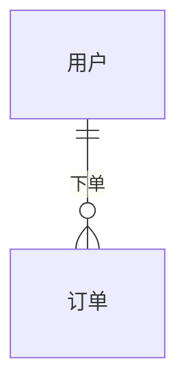

# ER 图参考（16）

## 1. 语法结构

- 关系行：`实体A 基数--基数 实体B : 关系名`；
- 属性块：`类型 名称 [键]`；多键：`PK, FK`（逗号分隔）或 `PK FK`（空格分隔）。

## 2. 乌鸦脚基数（完整）

| 记号 | 语义 |
|------|------|
| `|o` | 零或一（可选一端） |
| `||` | 恰好一（强制一端） |
| `}o` | 零或多 |
| `}|` | 一或多 |
| 组合 | `||--o{`（一对多）、`}o--o{`（多对多）、`||--||`（一对一） |

## 3. 类型与键

- 类型：`int`、`float`、`string`、`bool`、`date`、`datetime`、`timestamp`；
- 键：`PK` 主键、`FK` 外键、`UK` 唯一键；
- 复合主键：`int 订单号 PK` + `int 行号 PK`（同一实体多行 PK）；
- 属性注释：`string 状态 "枚举说明"`。

## 4. 布局配置

- `layout: "leftRight"` 左右布局（默认上下分层）；
- 实体宽度/内边距可调（长属性名时）。

## 5. 建模规范

- 关系名 = 动词短语（`下单`/`包含`），不省略；
- 基数必须显式（缺失 = 语义丢失）；
- 实体 ≤12/图，属性 ≤15/实体；
- 大模型按域拆分 + 概览图。

## 6. 常见错误

- 基数方向写反（读法：从左实体看右实体的数量）；
- FK 不标注；
- 属性类型用中文（Mermaid 仅支持英文类型名）；
- 完整操作见 howto/18-er-diagram.md。
