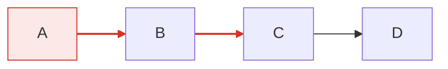

# 样式指南（style）

## 1. 基础模板：统一 init 配置

所有图共用同一套 `%%{init}%%`（复制到每张图的文件首行，保证跨图一致）：

```mermaid
%%{init: {"theme": "default", "themeVariables": {
  "fontSize": "14px",
  "fontFamily": "Noto Sans CJK SC, PingFang SC, Microsoft YaHei, sans-serif",
  "primaryColor": "#ffffff", "primaryBorderColor": "#333333", "primaryTextColor": "#1a1a1a",
  "lineColor": "#555555", "secondaryColor": "#eef2f7", "tertiaryColor": "#f7f9fc",
  "noteBkgColor": "#fff8e1", "noteTextColor": "#4e342e"
}}}%%
```

## 2. 主题选择

| 主题 | 适用 |
|------|------|
| `default` | 常规文档（浅色、蓝色系） |
| `neutral` | 中性灰，适合印刷/灰度 |
| `forest` | 绿色系 |
| `dark` | 深色演示背景 |
| `base` | 全自定义起点（配 themeVariables 使用） |

主题一致优先：同一次交付的所有图用同一主题，不要混用。

## 3. classDef 样式类体系（flowchart / classDiagram）

集中定义样式类，语义化命名：


规则：
- 颜色是语义通道：同一子系统同色相族；控制面 vs 数据面不同色相；
- 用 `classDef` 而非零散 `style`（一处定义，多处复用）；
- 跨图集共享同一套 classDef 定义（复制到每图）。

## 4. 色彩模式

- **单色模式**：`theme: "neutral"` + 少量强调色（仅关键路径/错误路径上色）——适合正式文档；
- **彩色模式**：`theme: "default"` 或自定义 themeVariables——适合教学/演示；
- 判断依据：读者是否需要靠颜色区分语义族；不需要就单色。

## 5. 关键路径着色



- 只给「要说的事」上色（主链路/失败路径/里程碑），其余保持弱色；
- 弱化管线：非关键边用 `-.->` 虚线 + 浅灰 `linkStyle`。

## 6. SVG/PNG 双策略

- **PNG 默认**：`render-mermaid.sh` 产出 PNG 用于 Markdown/HTML 内嵌（预览器友好）；
- **SVG 兜底**：大图/宽图、需无损放大时用 SVG；
- 两者必须同时产出（HTML 用 `<a href=x.svg></a>` 双引用，见 12-rendering-and-output.md）；
- PNG 渲染失败/被裁切时，用 `svg-to-png-cjk.cjs` 从 SVG 转出（带 CJK 字体与内容裁剪）。

## 7. 样式校验要点

- [ ] 全部图首行 init 配置一致（主题/fontFamily/fontSize 统一）？
- [ ] 颜色有语义（同族同色、关键路径突出）？无随机配色？
- [ ] classDef 集中定义，无零散 style 滥用？
- [ ] 字号层级统一，无内联字号/加粗？
- [ ] 深色背景用 dark 主题时，正文颜色对比度足够？
- [ ] 渲染后 Read 检查：颜色是否如预期、是否有渲染警告？
