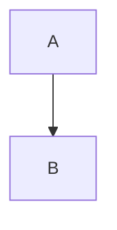
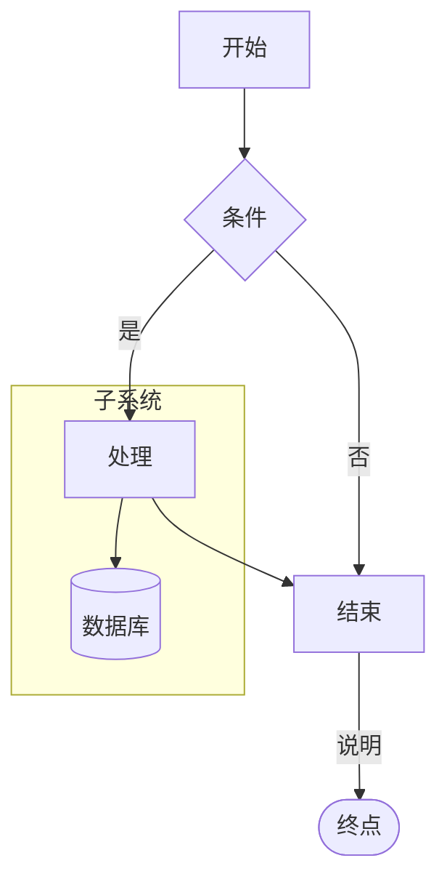
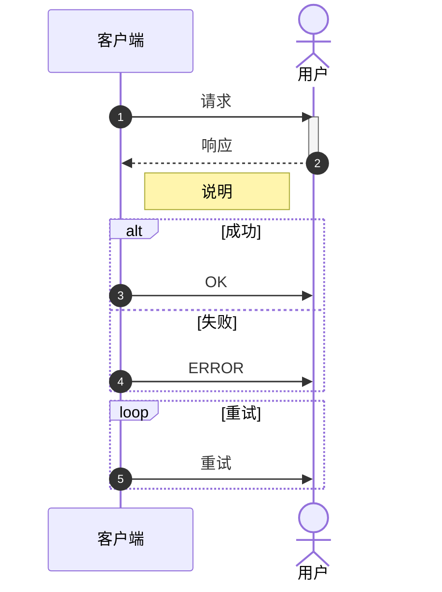
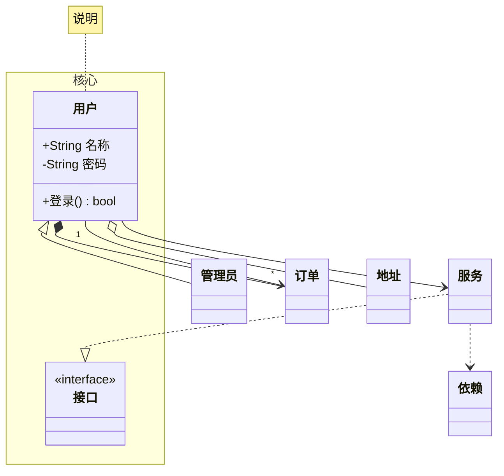
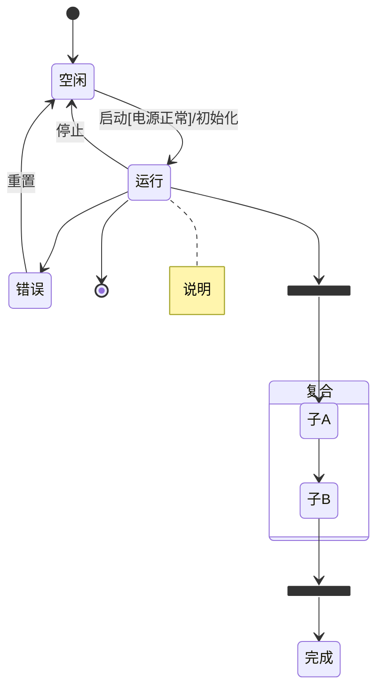
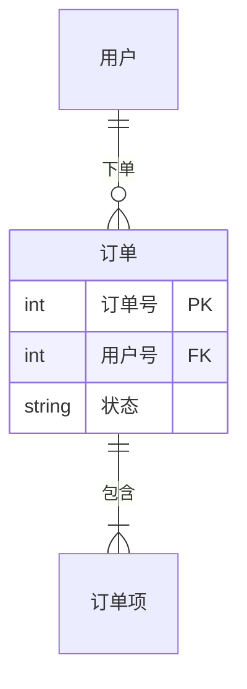
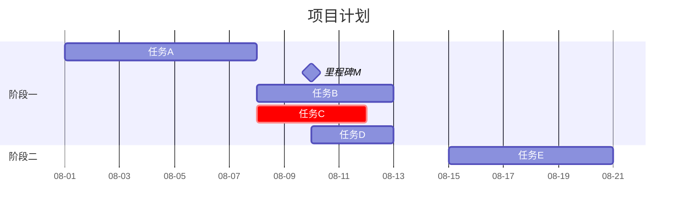
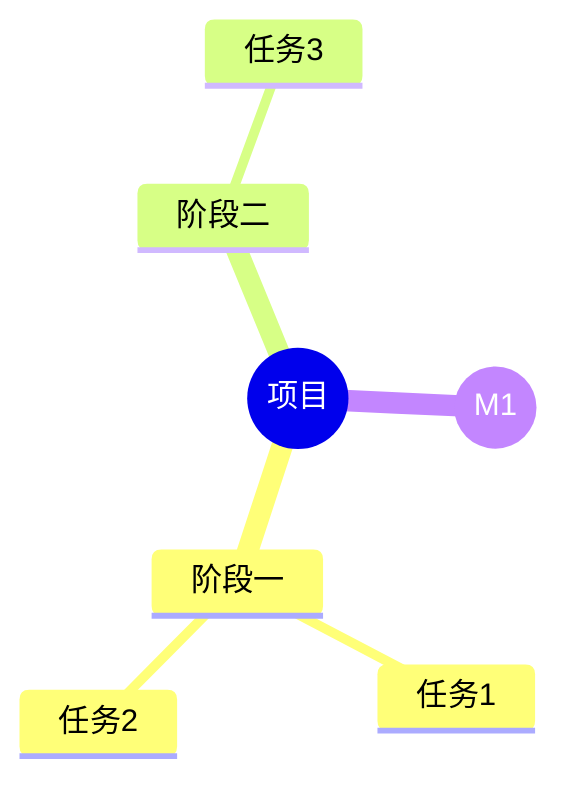
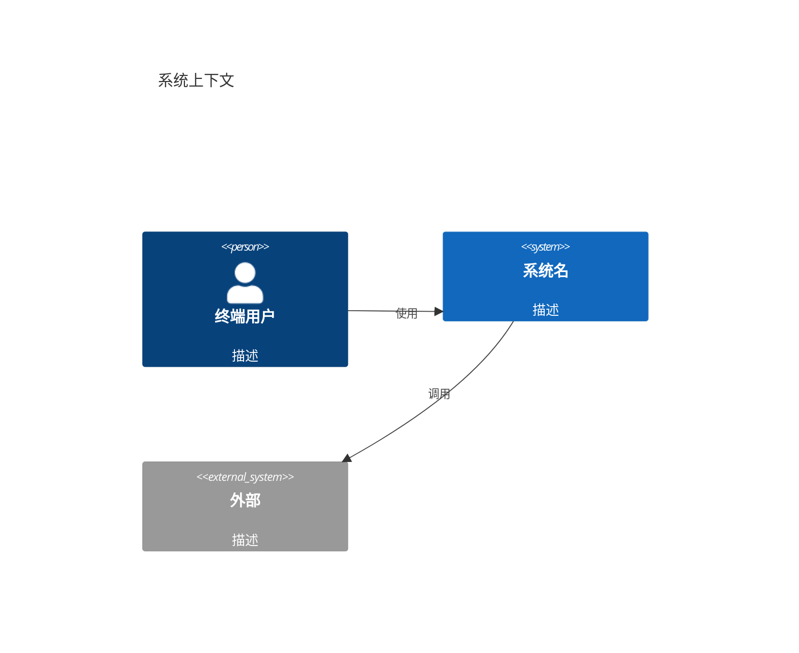

# Mermaid 语法参考（syntax-reference）

> 覆盖本技能用到的全部 Mermaid 图表类型语法。详细官方语义见 `document/` 对应文档；本节是速查。

## 0. 通用：`%%{init}%%` 指令与主题

`%%{init: {...}}%%` 必须出现在**文件首行（图类型声明之前）**。所有图通用：

- 主题：`default`（浅色）/ `neutral` / `dark` / `forest` / `base`（可全定制）；
- `themeVariables` 常用键：`fontSize`、`fontFamily`、`primaryColor`、`primaryBorderColor`、`primaryTextColor`、`lineColor`、`secondaryColor`、`tertiaryColor`、`noteBkgColor`、`noteTextColor`、`background`；
- 也可用 YAML 风格 frontmatter（`---\ntitle: ...\nconfig:\n  theme: ...\n---`，Mermaid v11 支持）；
- 安全性：`securityLevel`（strict/loose）默认 strict，`click` 事件需 loose。

## 1. flowchart（流程图 / 活动图近似）

- 方向：`TD` / `TB` / `BT` / `LR` / `RL`；
- 节点形状：`[矩形]` `(圆角)` `((圆形))` `{菱形}` `[/平行四边形/]` `[[子程序]]` `[(圆柱)]` `>不对称]` `{{六边形}}` `[/梯形/]` `[无边框]` 用 `id["带引号文字"]`；
- 连线：`-->` `---` `-.->`（虚线）`==>`（粗线）`--o` `--x`；边标签 `A -->|标签| B` 或 `A -- 标签 --> B`；边样式 `-->|`…`|`；
- `linkStyle <id> stroke:...` 改单边颜色；
- `classDef <name> fill:...,stroke:...,color:...` + `class <id[,id2...]> <name>`（或节点后 `:::<name>`）；
- `style <id> fill:...,stroke:...` 直接改单节点；
- `subgraph <id>[标题]` … `end`（v10.3+ 可 `subgraph id["标题"]`）；`direction LR` 在 subgraph 内可改内部分向；
- `click id "url"` 交互（需 `securityLevel: loose`）；
- 特殊字符：用引号 `id["文字:()"]`；`&` 需 `&amp;`。
- **`legend` / `legendRight` / `legendLeft` 指令**：单独一行 `legend` … `end` 定义图例。

## 2. sequenceDiagram（时序图）

- 参与者：`participant` / `actor`（人形）；别名 `participant P as 显示名`；`autonumber` 自动编号；
- 消息箭头：`->` 实线、`-->` 虚线、`->>` 实线箭头、`-->>` 虚线箭头、`-x` 带叉、`)` 异步（`-)` `--)`）；
- 激活：`activate` / `deactivate`（可叠加）；
- 注释：`Note left/right/over of 参与者: 文本`；
- 片段：`alt/else`、`opt`、`loop`、`par`、`break`、`critical`、`and`（par 分支）；
- `%%{init: {sequence: {mirrorActors: false, showSequenceNumbers: true}}}%%` 配置。

## 3. classDiagram（类图）

- 类块：`class 类名 { +属性 方法() }`；可见性 `+` 公开 `-` 私有 `#` 保护 `~` 包内；`$` 静态；
- 关系：泛化 `<|--`、实现 `..|>`、组合 `*--`、聚合 `o--`、关联 `-->`、依赖 `..>`；反向 `--|>` `--*` 等；带标签 `--|>|标签|` 或 `--|> : 标签`；多重性 `"1" --> "*"`；
- 构造型：`<<interface>>` `<<abstract>>` `<<enumeration>>` `<<service>>` 自定义；
- `namespace 名 { ... }` 包内组织；
- 样式：`classDef <name> fill:...,stroke:...` + `class <id...> <name>`；`style <id> ...`；
- `note for 类名 "..."`、`note for 类名 left/right of`。

## 4. stateDiagram-v2（状态机图）

- 初态 `[*]`、终态 `[*]`；转换 `状态A --> 状态B: 事件[守卫]/动作`；
- 复合状态 `state 名 { ... }`；`<<fork>>` / `<<join>>` / `<<choice>>`；
- 并发：复合状态内用 `--` 分隔并行区；
- 注释 `note right/left of 状态`。

## 5. erDiagram（ER 图）

- 基数（乌鸦脚）：`|o` `||` `}o` `}|` 组合：`||--||`、`||--o{`、`|o--o{`、`}o--o{`、`}o--||`；
- 属性类型：`int` `string` `float` `bool` `date` `datetime` `timestamp`；键：`PK` 主键、`FK` 外键、`UK` 唯一键；多键空格分隔 `PK, FK`（逗号）或 `PK FK`；
- 实体注释：`%%` 行注释、`comment` 关键字（v11）；属性注释 `string 名称 "说明"`；
- 方向：`%%{init: {er: {layout: "leftRight"}}}%%`（默认上下分层）。

## 6. gantt（甘特图）

- 任务：`名称 : id, 开始, 工期`；依赖 `after <id>`；`milestone` 里程碑；`crit` 关键路径（红色）；`active`（进行中，蓝）；`done`（完成，灰）；
- 完成度：`名称 : id, 开始, 工期` + `%%{init: {gantt: ...}}%%`；v11 支持 `progress 50` 任务属性？——**依赖版本**：用 `任务 : id, 开始, 工期, progress 50`（v11.7+）；
- `dateFormat` / `axisFormat`（`%Y-%m-%d` `%m-%d` `%H:%M`）；`excludes` 排除日期（周末等）；`todayMarker off` 或 `todayMarker stroke-width:0`；`title` 标题；`%%{init: {gantt: {barHeight, barGap, leftPadding, topPadding}}}%%`。

## 7. mindmap（思维导图，含 WBS 承接）

- 缩进即层级；根节点可选形状：`root` 圆、`root(( ))` 双圆、`root([ ])` 方、`root{{ }}` 六角、`root[/ /]` 平行四边形；
- 节点形状：`id` 默认、`(( ))`、`[ ]`、`{{ }}`、`(/ )` 等；行尾可加样式类 `:::`；
- `%%{init: {theme: "default", themeVariables: {primaryColor: ...}}}%%` 配色；
- `flowchart LR` 是左右展开的替代（WBS 需要算术记法时）。

## 8. C4 系列（v10.9+ 原生）

- 五视图：`C4Context`、`C4Container`、`C4Component`、`C4Dynamic`、`C4Deployment`；
- 元素宏：`Person` `Person_Ext` `System` `System_Ext` `Container` `ContainerDb` `Component` `Node` `Node_Ext` `Enterprise_Boundary` `System_Boundary` `Container_Boundary`；
- 关系：`Rel` `Rel_Back` `Rel_D`（下）`Rel_U`（上）`Rel_L`（左）`Rel_R`（右）；`BiRel` 双向；
- 布局：`UpdateLayoutConfig($c4ShapeInRow="3", $c4ShapeInRowWrap="2")`；
- 动态图：`C4Dynamic` 中 `RelIndex` 编号步骤。

## 9. 其他原生类型（速览）

- **pie**：`pie showData` + `"标签": 数值`；
- **quadrantChart**：象限图（`x-axis`/`y-axis` 定义象限标签）；
- **requirementDiagram**：`requirement 需求 { id, text, risk, verifymethod }` + `element 元素` + `需求 - satisfies -> 元素`（`contains` `derives` `traces` `verifies`）；
- **gitGraph**：`commit` `branch 名` `checkout 名` `merge 名` `cherry-pick id`；
- **journey**：`journey` + `section` 任务打分；
- **timeline**：时间线叙事（`timeline` + `title` + `period`/`section`）；
- **sankey-beta**：`sankey-beta` + `源 目标 权重`；
- **xychart-beta**：`xychart-beta` + `line`/`bar` 系列；
- **packet-beta**：报文位域；
- **kanban**：看板（实验性，v11.4+，`kanban` + `column`）；
- **block**：块图（实验性 `block-beta`）。

## 10. 十条实用技巧

1. **首行必须是图类型声明**，`%%{init}%%` 在它之前；
2. 中文/特殊字符标题一律用引号：`id["文字"]`；
3. 标签 ≤10 字符（CJK），详细说明走边标签/note/legend；
4. `classDef` 集中定义样式类，跨图复制同一段 init 配置保持统一；
5. 大图方向优先 `TD`，宽浅图用 `LR`（见 layout.md）；
6. flowchart 内 `direction LR` 可翻转 subgraph 内布局；
7. 需要点击交互才设 `securityLevel: loose`，否则保持 strict；
8. 同一图内不要混用多种箭头语义相近的线型（`-->` vs `-->>`）；
9. 长文本标签会撑爆版面——移入 note 或图集文字说明；
10. 渲染前先本地校验：`render-mermaid.sh` 出 SVG 后立即 Read 检查（图片不显示时先查 URL 编码/引号）。
