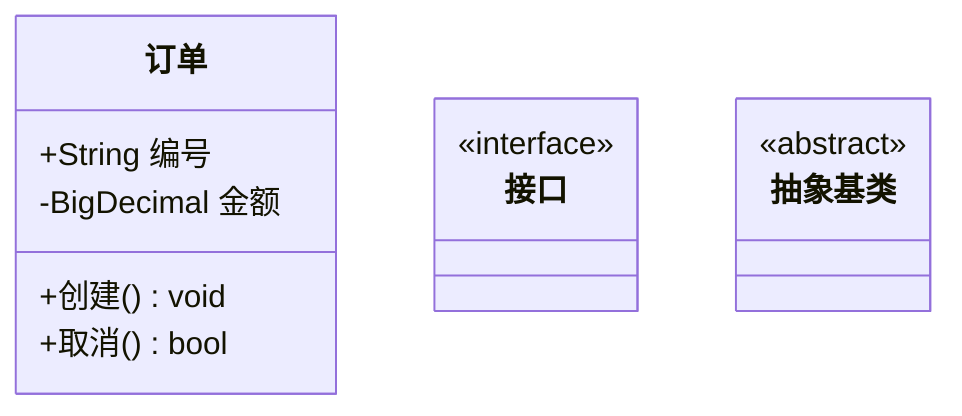
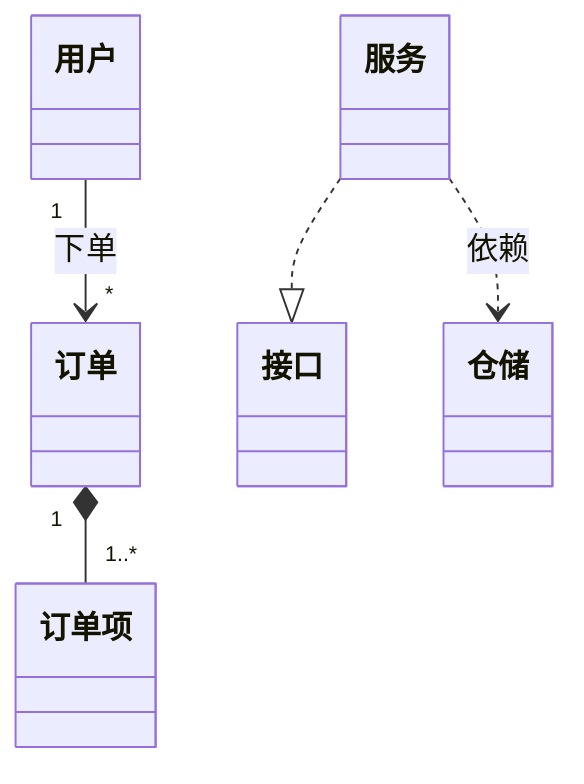
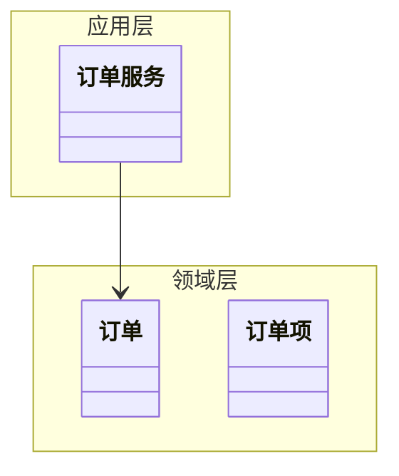

# 类图（02-class-diagram）

## 1. 适用场景

领域模型、类结构、接口契约、包内组织。**静态结构**语义——不画时序、不画流程。

## 2. 基本语法



- 可见性：`+` 公开 / `-` 私有 / `#` 保护 / `~` 包内；`$` 静态成员；
- 泛型/返回类型直接写类型名；
- 中文类名/属性名可直接用（引号包裹特殊字符）。

## 3. 六种关系（UML 语义核心）

| 关系 | 符号 | 语义 |
|------|------|------|
| 泛化 | `A <|-- B` | B 继承 A |
| 实现 | `A ..|> B` | A 实现接口 B |
| 组合 | `A *-- B` | B 是 A 的组成部分（同生命周期） |
| 聚合 | `A o-- B` | B 是 A 的聚合成员（可独立） |
| 关联 | `A --> B` | A 使用/关联 B |
| 依赖 | `A ..> B` | A 依赖 B（弱、临时） |

带标签与多重性：



**常见错误**：把聚合画成泛化、把依赖画成关联、多重性缺失。

## 4. namespace（包内组织）



## 5. 样式

```mermaid
classDiagram
  classDef domain fill:#e8f0fe,stroke:#1a73e8
  classDef service fill:#e6f4ea,stroke:#188038
  class 订单,订单项 domain
  class 订单服务 service
```

## 6. 布局与美观技巧

- 元素数量：核心类 ≤7，硬上限 ≤15；超限按层/域拆图集；
- 关系线交叉：按领域聚类声明顺序，或拆成「类结构图」+「关系图」；
- 长注释用 `note for 类名 "..."`，勿堆在类名上；
- GRASP/SOLID 语义见 document/08、09——类图是检验设计的工具，不只是画图。

## 7. 常见陷阱

- 关系方向写反（`<|--` vs `--|>`）——从子类指向父类；
- 接口实现用 `..|>` 而非 `-->`；
- 属性/方法混写不区分可见性；
- 一张图画 30 个类——必拆。
