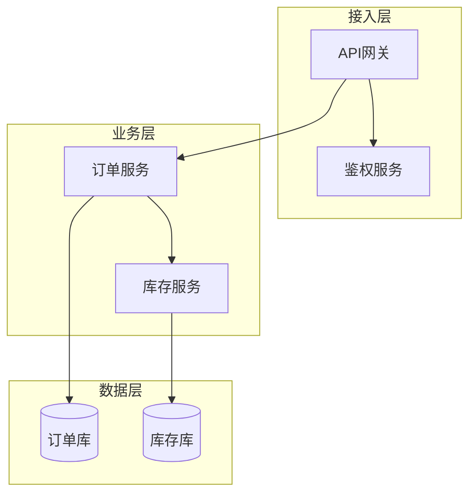

# 组件图（03-component-diagram）

> Mermaid 无原生「组件图」类型，用 `flowchart`（subgraph 边界）承载组件语义；组件级 C4 用 `C4Component`。选择依据：纯结构图 → flowchart；要标准 C4 组件视图 → C4Component。

## 1. 适用场景

模块/服务划分、分层架构、微服务依赖、接口与端口。

## 2. flowchart 组件语义写法



- 层 = subgraph；组件 = 圆角节点；数据存储 = 圆柱 `[( )]`；
- 对外接口：`服务 -->|HTTP/API| 外部系统` 边标签表达契约。

## 3. 微服务模式

- 每服务一个 subgraph（含自身存储）；服务间只画「调用」边，不画内部实现；
- 依赖方向统一（上层→下层），交叉线即设计问题信号；
- 一对多调用：单代表 + `×N`。

## 4. C4Component 写法（标准组件视图）

```mermaid
C4Component
  title 订单服务组件
  Container_Boundary(订单服务) {
    Component(订单接口, "REST 接口层", "提供 HTTP API")
    Component(订单服务层, "应用层", "用例编排")
    Component(订单仓储, "数据访问层", "MyBatis")
  }
  Rel(订单接口, 订单服务层, "调用")
  Rel(订单服务层, 订单仓储, "调用")
```

## 5. 接口与依赖建模要点

- 对外契约（API/消息队列）显式画出：边标签写明协议（HTTP/gRPC/MQ）；
- 依赖方向用箭头表达（被依赖方在箭头端）；
- 不画运行时内部细节（那是时序图的职责）。

## 6. 布局与美观

- 分层方向：接入层→业务层→数据层用 TD；同层并列用 LR 的 subgraph；
- 层内节点 ≤6，超出拆子图；
- 弱化非关键边（灰虚线），突出核心调用链。

## 7. 常见陷阱

- 把数据库画成组件节点而不是存储形状（`[( )]`）；
- 每对服务都画双向边（噪音）——只画真正关心的方向；
- 组件图里塞状态转换/时序语义——拆图。
