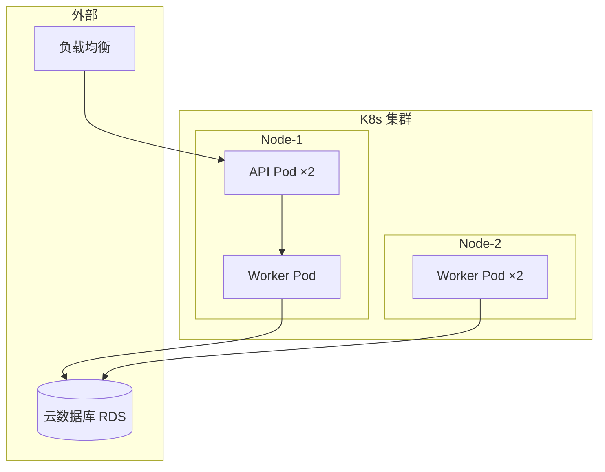

# 部署图（04-deployment-diagram）

> Mermaid 无原生「部署图」类型，用 `flowchart`（subgraph 节点）承载物理拓扑语义；标准 C4 部署视图用 `C4Deployment`。

## 1. 适用场景

物理/云拓扑、Kubernetes、多环境、节点间通信。

## 2. flowchart 部署语义写法



- 节点/机器 = subgraph；容器/Pod = 节点；数据存储 = 圆柱；
- 通信路径 = 边（带协议标签 `|HTTP|` / `|gRPC|`）；
- 副本用 `×N` 标注。

## 3. Kubernetes 语义

- 集群 → Namespace → Deployment/Service → Pod 四级用嵌套 subgraph；
- Service 与 Pod 的映射：边标签注明（`selector`）；
- 外部入口（Ingress/LB）单独 subgraph 或不入框。

## 4. C4Deployment 写法

```mermaid
C4Deployment
  title 生产环境部署
  Deployment_Node(k8s, "Kubernetes 集群", "云") {
    Deployment_Node(node1, "Node-1", "虚拟机") {
      Container(api, "API 服务", "容器")
    }
  }
  Deployment_Node(rds, "RDS", "云数据库")
  Rel(api, rds, "JDBC")
```

## 5. 通信建模

- 通信路径与依赖区分：部署图关注「在哪运行 + 怎么连」；
- 协议/端口写进边标签（`|TCP 3306|`）；
- 不画业务调用链细节（那是组件/时序图职责）。

## 6. 布局与美观

- 环境分区（生产/测试/外部）用顶级 subgraph + 同色系；
- 多层嵌套 ≤3 层，更多拆图；
- 图过宽用 LR，多环境对比用 TD。

## 7. 常见陷阱

- 部署图与组件图混画（运行环境 vs 逻辑组件）——拆图；
- 节点内画业务流程——只画拓扑；
- 副本展开 N 份——用 `×N`。
