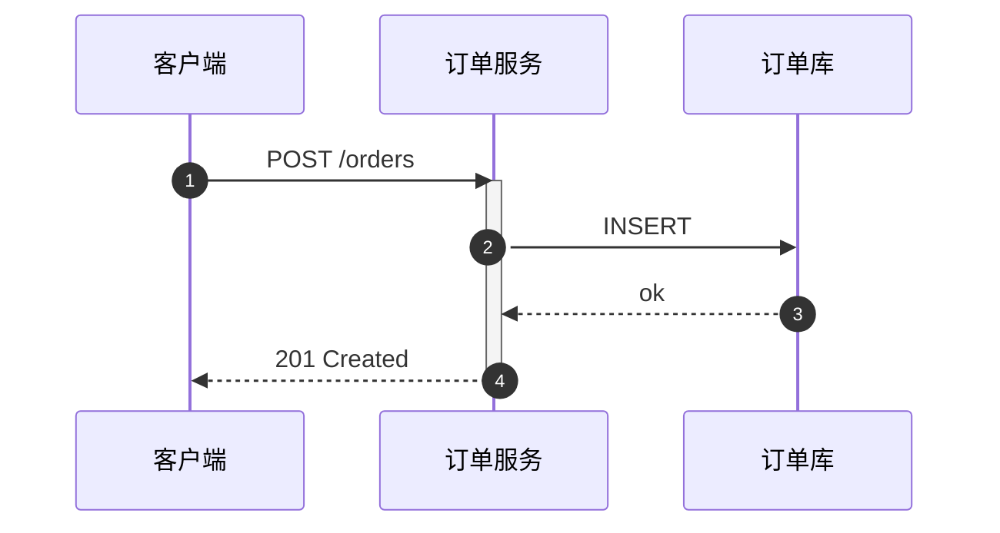
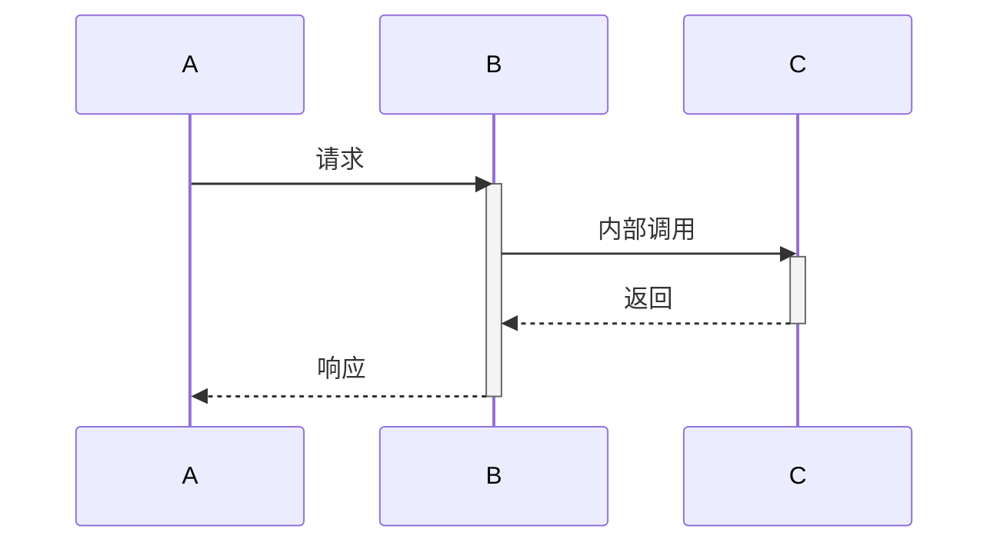
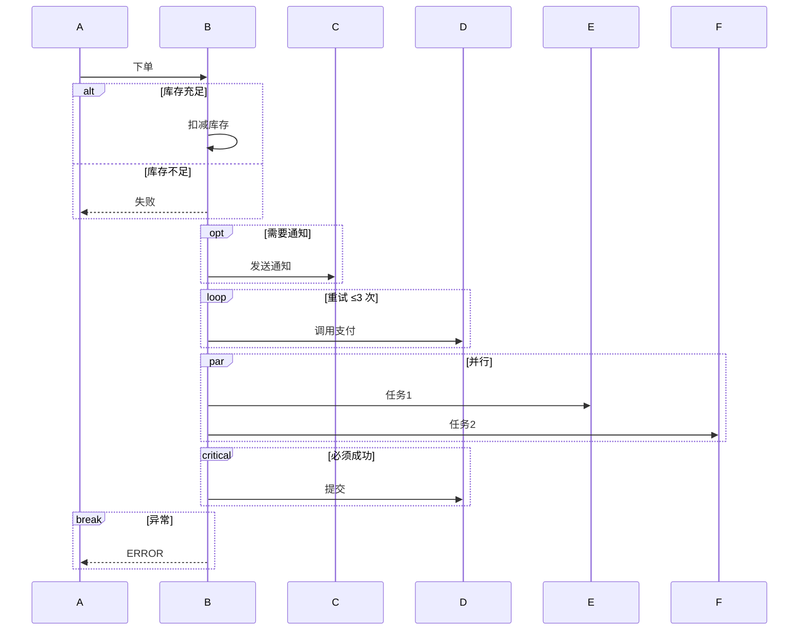
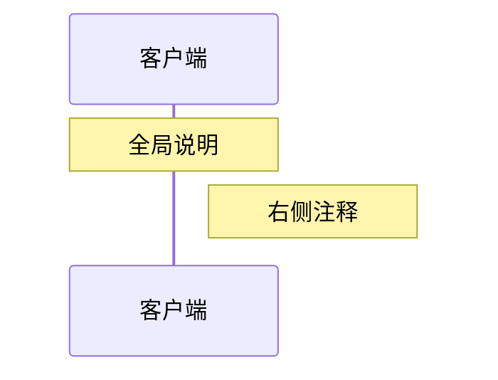
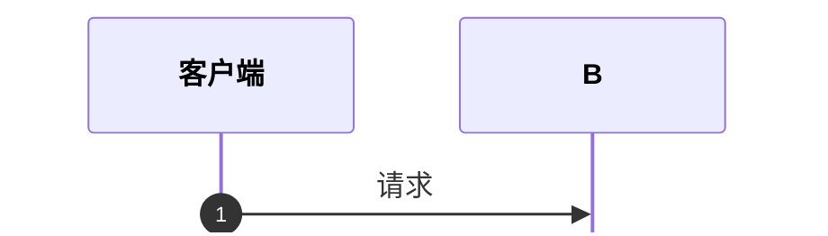

# 时序图（05-sequence-diagram）

## 1. 适用场景

对象/服务间的消息交互顺序、用例场景、协议流程、异常路径。**时序语义**——关注「谁在什么时候调谁」。

## 2. 基本语法

## 3. 消息箭头语义

| 箭头 | 语义 |
|------|------|
| `->` | 同步调用（实线） |
| `->>` | 同步调用带箭头（推荐） |
| `-->>` | 异步返回（虚线箭头） |
| `--)` | 异步消息 |
| `-x` | 失联/终止 |
| `--x` | 返回后失联 |

**规则**：请求用实线箭头，返回用虚线；异步与同步要区分（`-->>` vs `->>`）。

## 4. 激活条（activate/deactivate）

- 嵌套调用层层 activate，直观显示调用栈；
- 忘记 deactivate 会让激活条一直挂着——成对书写。

## 5. 组合片段

- `alt/else` 分支、`opt` 可选、`loop` 循环、`par/and` 并行、`break` 中断、`critical` 关键区；
- 片段标签写清楚条件（`alt 库存充足`），不要只写 `alt`。

## 6. 注释

## 7. 配置

- `mirrorActors: false` 参与者只显示在顶部（节省版面）；
- `showSequenceNumbers` 显示消息编号；
- **字号用 sequence 配置统一**：`actorFontSize` / `messageFontSize` / `noteFontSize`（层级：参与者 > 消息 = 注释）；参与者多（≥8）或渲染偏小时整体上调一档，**不要**用放大 zoom——画布同比放大，有效字号不变；
- 全局粗细：`actorFontWeight` / `messageFontWeight` / `noteFontWeight`（mermaid 不支持单条消息加粗，见 §8.2）。

## 8. 布局与美观

- 参与者 ≤7；超过先合并（网关代表外部系统）或拆场景；
- 消息标签 ≤10 字符（CJK），细节进 Note；
- 消息顺序自上而下即时间顺序——声明顺序即布局顺序；
- 生命周期长的场景：把无关消息放进 `opt` 或拆图。

### 8.1 阶段 Note 样式统一

多阶段场景的阶段标注必须**同一格式**，否则视觉凌乱：

- 统一前缀 + 位置：`Note over X: [阶段 1] 初始化`——全图要么全 `over`、要么全 `right of`，不要混用；
- 底色统一：`themeVariables.noteBkgColor` / `noteTextColor` 全图一套（见 style.md §1 模板），不得每段换色；
- 阶段标签写清序号与含义（`[阶段 1] 初始化`），不要只写「阶段 1」。

### 8.2 关键消息强调

Mermaid 时序图**不支持单条消息加粗/改色**（字号粗细是全局配置）。强调关键消息用结构手段：

- `critical` 片段包裹必须成功的调用（`critical 必须成功`）；
- `autonumber` 编号 + HTML 文字点名（「图 N 中消息 7–9 为恢复流程」）；
- 分支标签写清条件（`alt 池未饱和` / `else 池饱和`）——语义进标签，不靠粗细。

### 8.3 行为完整性自检

上下文摘要里**明确写到的行为**（重试/退避/超时/排队/预算/可选中止）必须逐项体现为片段：`loop`（重试 ≤N 次）、`opt`（可选/超预算才走）、`alt`（饱和分支）、`critical`（必须成功）。交付前对照摘要逐项核对——评审最常见的「缺分支」由此漏掉。

## 9. 常见陷阱

- 返回消息用实线（应为虚线 `-->>`）；
- 循环/分支条件不写标签；
- 一张图画 30 条消息——拆成多个场景图；
- participant 直接写中文长名（应 `as` 别名 + 显示名）。
