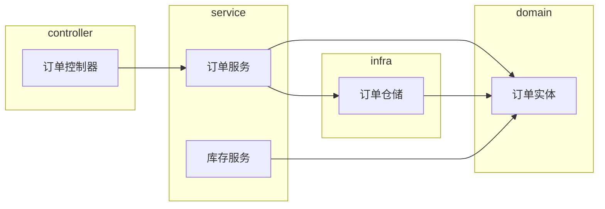
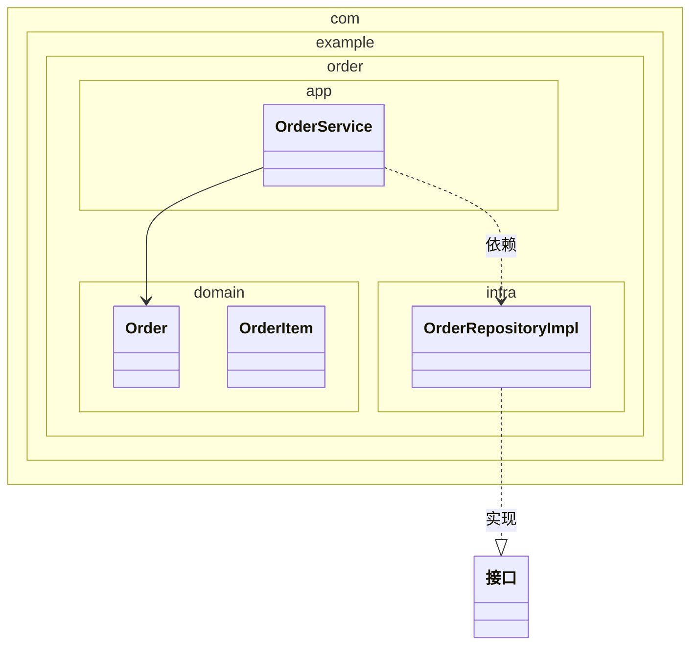

# 包图（06-package-diagram）

> Mermaid 无原生「包图」类型，用 `flowchart`（subgraph）表达包与依赖，或 `classDiagram` + `namespace` 表达类在包内的组织。选型：只画包间依赖 → flowchart；画类归属 → classDiagram namespace。

## 1. 适用场景

模块组织、命名空间层次、分层架构、依赖管理（依赖倒置检查）。

## 2. flowchart 包依赖写法

- 包 = subgraph（具名边界框）；依赖 = 边；
- **依赖方向检查**：跨层箭头只允许上层→下层（依赖倒置时接口在领域层，实现依赖接口）。

## 3. classDiagram namespace 写法

## 4. 分层架构语义

- 依赖方向：controller → service → domain（领域层不依赖基础设施）；
- 反向依赖（infra → domain 实现接口）用 `..|>` 实现关系表达；
- 包间环依赖 = 设计问题，画出即暴露。

## 5. 布局与美观

- 分层用 TD（上层在顶）；平级模块用 LR；
- 包内元素 ≤6，超出细化分包；
- 包边界色：一层一色相（同层同色）。

## 6. 常见陷阱

- 把类图当包图（无 namespace/边界）；
- 依赖方向画反；
- 一张图同时画包依赖 + 类继承——拆图。
