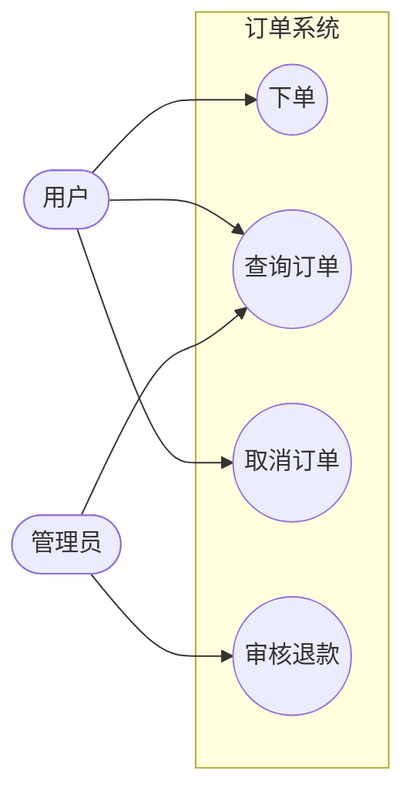

# 用例图（07-usecase-diagram）

> Mermaid **无原生用例图**。用 `flowchart` 语义近似：角色 = 参与者节点，用例 = 椭圆节点，系统边界 = subgraph。请在交付说明中注明「用例图近似」。

## 1. 适用场景

需求范围界定、角色-用例关系、系统边界。**不画时序、不画内部实现**。

## 2. flowchart 近似写法



- 角色 = 双圆 `([角色名])`（人形语义）；用例 = 椭圆 `((用例))`；
- 系统边界 = 具名 subgraph；外部系统/角色在边界外；
- 角色-用例连线 = 关联（参与）。

## 3. include / extend / generalization 语义表达

- **include（必含子流程）**：用例间虚线边 + 标签：
  ```mermaid
  flowchart LR
    下单((下单)) -.->|include| 支付((支付))
  ```
- **extend（可选扩展）**：
  ```mermaid
  flowchart LR
    下单((下单)) <-.->|extend| 优惠券((使用优惠券))
  ```
- **generalization（角色/用例泛化）**：`<|--` 语义用边标签：
  ```mermaid
  flowchart LR
    普通用户([普通用户]) -->|继承| 用户([用户])
  ```

## 4. 数量与范围

- 用例总数 ≤12；角色 ≤6；
- 每个用例名 = 动词短语（「下单」「查询库存」），≤8 字符；
- 系统边界只画一层（不嵌套子系统，除非确实需要）。

## 5. 布局与美观

- 角色靠左（或上下两端），用例居中，边界框住用例；
- 弱化 include/extend 虚线，突出角色-用例主关联；
- 关键用例着色（classDef），辅助用例浅色。

## 6. 常见陷阱

- 把用例图画成流程图（画了内部步骤）——用例图只画「谁做什么」；
- include/extend 方向画反（include 箭头从主用例指向被包含用例）；
- 边界内画了外部系统。
