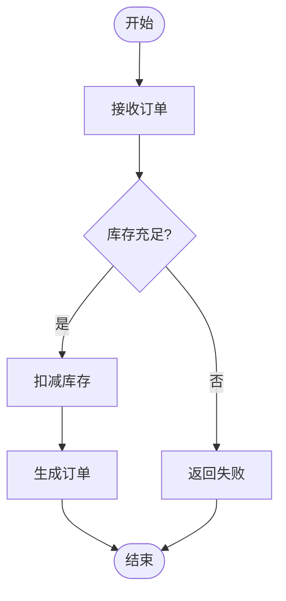
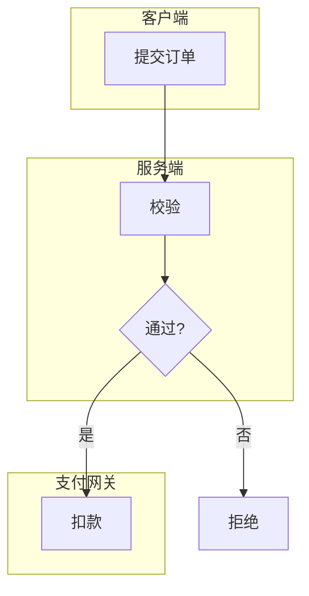
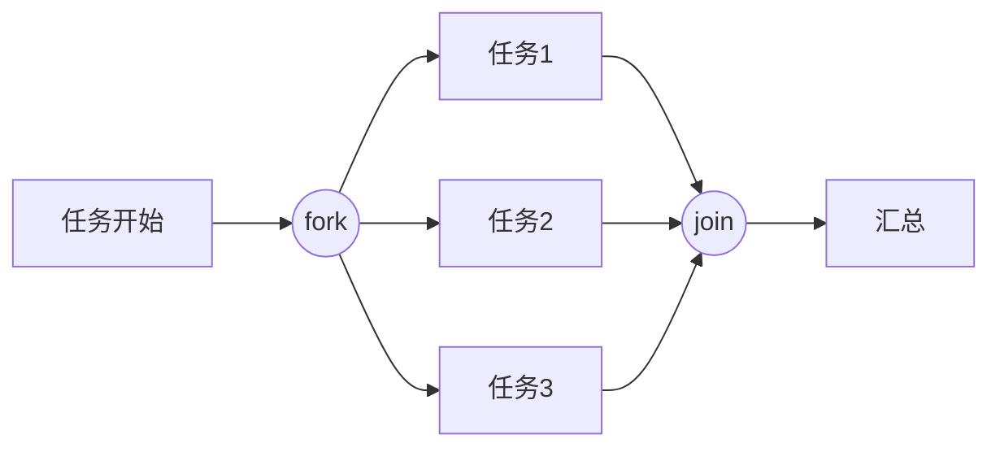

# 活动图（08-activity-diagram）

## 1. 适用场景

业务流程、工作流、用例内部流程、并发与同步。**流程语义**——关注「步骤顺序、分支、并发」。

## 2. 基本语法（flowchart 活动语义）

- 动作 = 圆角矩形 `[ ]`；决策 = 菱形 `{ }`；开始/结束 = 圆形 `( )` / `([ ])`；
- 分支条件写边标签（`-- 是 -->` / `-- 否 -->`）。

## 3. 泳道（subgraph 近似）

- 泳道 = subgraph（角色/系统边界）；跨泳道边 = 协作消息；
- 泳道内步骤 ≤5，超出拆流程。

## 4. fork/join 并发（flowchart 表达）

- fork/join 用圆形节点 `((fork))` / `((join))` 表达（Mermaid flowchart 无原生 fork 记号）；
- 并发分支 3 条封顶，更多用 `×N` 或拆分。

## 5. 布局与美观

- 主路径直线向下（TD）；分支左右展开；
- 决策菱形标签极简（`是`/`否`），条件细节进边标签；
- 长流程（>12 步）按阶段拆图或用 subgraph 分段。

## 6. 常见陷阱

- 流程图塞类/组件语义（结构 vs 流程混淆）；
- 决策出口标签缺失；
- 循环画成展开长链（应画回边：`C -- 重试 --> A`）；
- 一张图 30 个节点——必拆。
