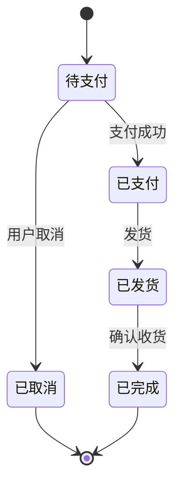
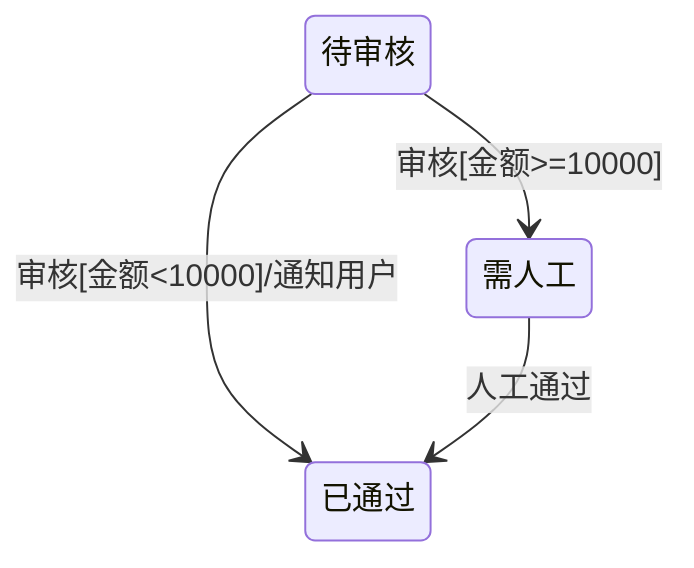
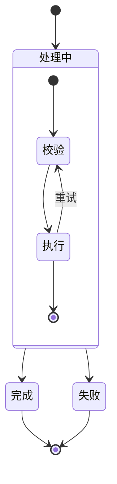
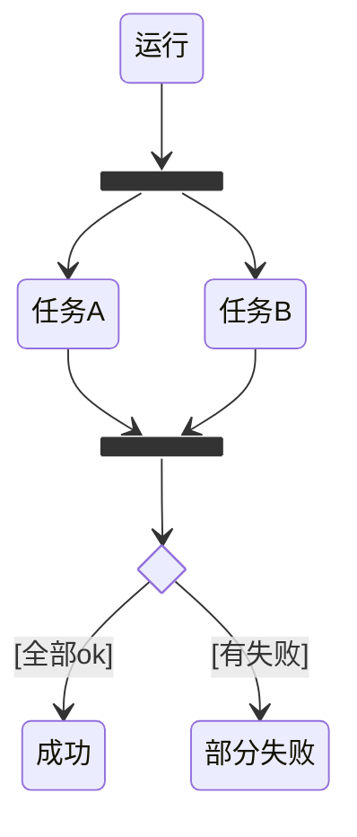
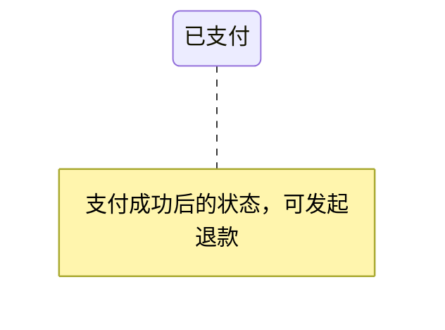

# 状态机图（09-state-machine-diagram）

## 1. 适用场景

对象生命周期、状态转换规则、事件驱动系统、测试路径设计。**状态语义**——关注「对象在什么状态、什么事件触发转换」。

## 2. 基本语法



- 初态 `[*]`（只有一个）；终态 `[*]`（可多个）；
- 转换：`状态A --> 状态B: 事件[守卫]/动作`；
- 转换标签格式：`事件`、`事件[条件]`、`事件/动作`、`[条件]/动作`。

## 3. 守卫与动作



- 守卫 `[条件]` 决定分支；动作 `/动作` 为转换副作用；
- 条件写清楚（`[金额>=10000]`），不写「审核失败」这种含糊词。

## 4. 复合状态



## 5. fork/join 与 choice



## 6. 并发（复合状态内 `--`）

```mermaid
stateDiagram-v2
  state 并行处理 {
    -- 区A
    A1 --> A2
    -- 区B
    B1 --> B2
  }
```

## 7. 注释



## 8. 布局与美观

- 状态 ≤10；转换 ≤20；超限按子状态机拆分；
- 状态名 = 名词短语（`已支付`），事件 = 动词短语（`支付成功`）；
- 主路径直线，异常路径靠边；
- 常见错误：漏了终态、事件与状态名混淆、守卫含糊。

## 9. 常见陷阱

- 把业务流程画成状态机（事件 vs 步骤混淆）；
- 状态与转换标签语义混写；
- 复合状态嵌套超过 2 层。
