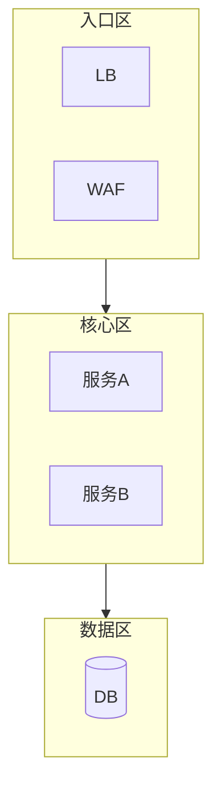

# 布局规划（10-layout-planning）

## 1. 规划流程

编码前先回答：
1. **方向**：数「最宽层宽 B」与「主流深 D」——宽浅用 `TD`，深窄长链用 `LR`；
2. **网格**：`C≈round(sqrt(N×1.3))` 估列数，每行 ≈C 个兄弟节点；
3. **分组**：按架构接缝定 subgraph（分层/域/环境）；
4. **单层兄弟 ≤6**：超出下沉或拆 subgraph。

## 2. 多区域复杂布局

- 顶级 subgraph 沿主流方向（TD），内部可 `direction LR` 翻转；
- 区域顺序即叙事顺序：入口 → 核心 → 数据 → 外部。

## 3. 布局故障排除

| 症状 | 处理 |
|------|------|
| 交叉线多 | 换方向、重排声明顺序、加 subgraph |
| 图过宽（>1.8:1） | 改 TD；或 subgraph 分行 |
| 图过窄长 | 改 LR |
| subgraph 内乱 | 内部 `direction` 显式声明 |
| 节点间距过大/小 | `%%{init: {flowchart: {nodeSpacing, rankSpacing}}}%%` |
| 空白过多 | 减少分组层级、收紧间距 |

## 4. CJK 渲染问题

- 服务器后端（mermaid.ink）CJK 正常；出现方块字 → 本地 mmdc 后端；
- init 中显式 `fontFamily: "Noto Sans CJK SC, PingFang SC, Microsoft YaHei"`；
- 中文标签过长（>10 字符）是 CJK 版面问题的头号来源——精简或换行 `\n`。

## 5. 大图布局检查

- 节点 >15：回到减法与拆分（图集）；
- 层内 >6：下沉；
- 嵌套 subgraph >3 层：拆分；
- 交付前用 measure-svg-layout.py 量宽高比/字号（WBS/甘特必测）。
