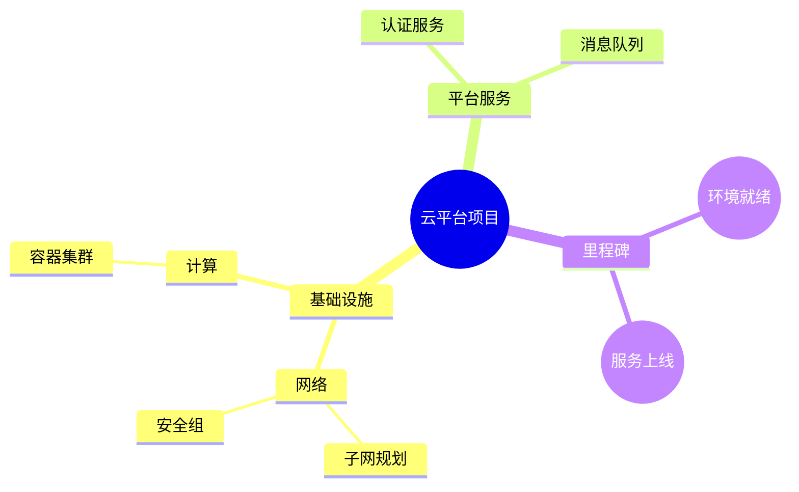
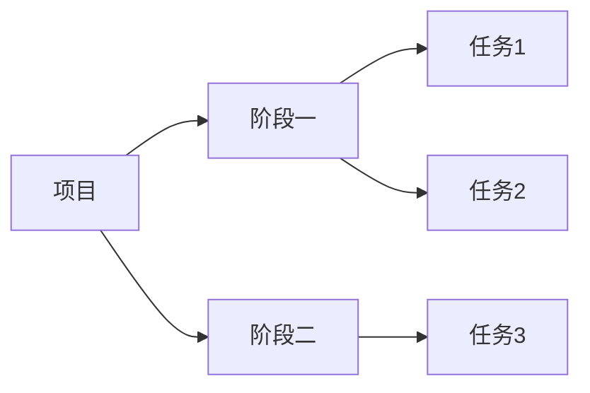

# WBS 工作分解结构（13-wbs-diagram）

> PlantUML `@startwbs` 在 Mermaid 无原生对应。**WBS 即树** → 用 `mindmap` 承接（推荐）；需要左右展开/算术记法时用 `flowchart LR` 近似。交付说明注明「WBS（mindmap 近似）」。

## 1. 适用场景

项目/交付物层级分解、任务拆解、里程碑锚点。

## 2. mindmap 写法



- 缩进即层级（空格/tab）；节点形状：默认圆角、`(( ))` 圆、`[ ]` 方、`{{ }}` 六角；
- 根节点用 `root((标题))`；
- 层级 ≤4 层，超出合并（WBS 粒度与展示粒度分开）。

## 3. 信息编码（状态色 + 责任人 + 里程碑）

```mermaid
mindmap
  root((项目))
    阶段一
      任务A[任务A \n【张三】] :::done
      任务B[任务B \n【李四】] :::active
      任务C[任务C \n【王五】] :::todo
    里程碑
      M1((M1 环境就绪)) :::milestone
```

```mermaid
%%{init: {"theme": "base", "themeVariables": {
  "primaryColor": "#ffffff",
  "primaryBorderColor": "#333333",
  "primaryTextColor": "#1a1a1a",
  "lineColor": "#666666"
}, "mindmap": {"padding": 12}}}%%
mindmap
  root((项目))
    任务A :::done
    任务B :::active
    任务C :::todo
  classDef done fill:#e6f4ea,stroke:#188038
  classDef active fill:#e8f0fe,stroke:#1a73e8
  classDef todo fill:#f1f3f4,stroke:#5f6368
  classDef milestone fill:#fef7e0,stroke:#f9ab00
```

- 状态色：完成（绿）/进行中（蓝）/未开始（灰）/里程碑（黄）——与项目色板统一；
- 责任人：`\n【姓名】` 换行编码在节点标题内；
- 里程碑：`((M1 名称))` + 黄色样式类，锚点编号 `M1` 与甘特图呼应。

## 4. 内联「有效字号」分档

节点标题越长，mindmap 渲染字号自动越小。分档规则：
- 1–4 字符：默认字号（约 14-16px）；
- 5–8 字符：紧凑标题（缩略词/编号优先）；
- >8 字符：拆两行（`\n`）或移到图集文字。
- 交付前用 measure-svg-layout.py 量「正文有效字号 ≥12px」。

## 5. flowchart LR 替代（需算术/左右展开时）



## 6. 布局与美观

- 根节点居中；分支按「阶段 → 任务 → 子任务」；
- 兄弟节点 ≤6（mindmap 自动环形展开，过多会挤）；
- 无框节点（mindmap 默认无框）保持原生风格，不套用 flowchart 样式。

## 7. 量测自检（交付前必做）

```bash
python3 skills/draw-mermaid/scripts/measure-svg-layout.py wbs.svg --display-width 1400
```

三判据：**正文有效字号 ≥12px**、**长宽比 1.2~1.8:1**、**标签不越界**（判断依据见脚本输出 `checks`）。

## 8. 常见陷阱

- 层级 >4（粒度失控）；
- 标题超长（字号骤减）；
- 状态色/责任人未编码（信息丢失）；
- 里程碑没有锚点编号（无法与甘特图对账）。
