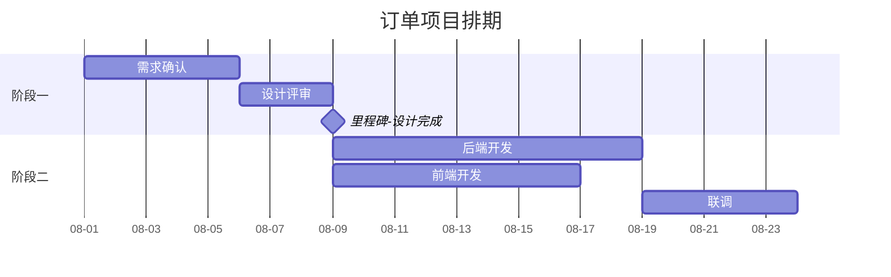
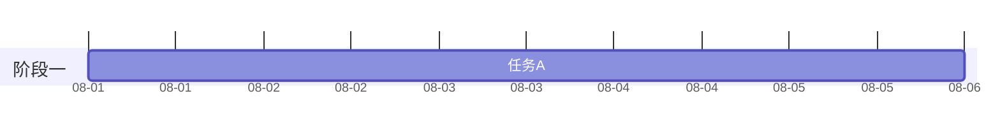
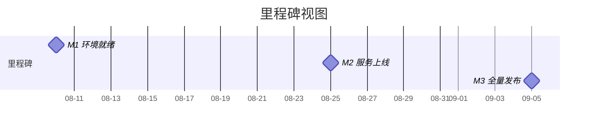

# 甘特图（14-gantt-diagram）

## 1. 适用场景

项目进度、任务依赖、里程碑、资源排期。

## 2. 基本语法



- 任务：`名称 : id, 开始, 工期`；id 用于依赖（`after <id>`）；
- 依赖：`after a1`（也可 `after a1, b1` 多依赖）；
- 里程碑：`milestone`（0d 或指定日期）；
- 状态：`crit`（关键路径，红）、`active`（进行中，蓝）、`done`（完成，灰）；
- 完成度（v11.7+）：`任务 : id, 开始, 工期, progress 60`。

## 3. 日期与刻度

| 指令 | 说明 |
|------|------|
| `dateFormat YYYY-MM-DD` | 输入日期格式（也可 `YYYY-MM-DD HH:mm`） |
| `axisFormat %m-%d` | 横轴刻度格式（`%Y-%m-%d`、`%H:%M`、`%W` 周） |
| `excludes 2026-10-01, 2026-10-02` | 排除日期（节假日） |
| `weekends` / 默认 | 默认排除周末（`excludes` 仅列日期时） |
| `todayMarker off` | 关闭今日线（或 `todayMarker stroke-width:0`） |

## 4. 布局与间距



- 任务名 ≤10 字符，否则条形标签溢出；
- section ≤6 个；每 section 任务 ≤8。

## 5. 里程碑视图写法（管理层交付）



- 里程碑编号（M1/M2/M3）与 WBS 图锚点一致（跨图对账）；
- 只画里程碑时任务全部省略。

## 6. 量测自检（交付前必做）

```bash
python3 skills/draw-mermaid/scripts/measure-svg-layout.py gantt.svg --display-width 1400
```

三判据：**正文有效字号 ≥12px**、**长宽比 1.2~1.8:1**、**标签不越过时间轴右边界**。
A/B 判断某写法是否改写排期：

```bash
python3 skills/draw-mermaid/scripts/measure-svg-layout.py a.svg --compare b.svg
```

看 `scheduleChanged` 字段（依赖箭头、标题字号、zoom 都可能实际影响排期布局）。

## 7. 常见陷阱

- `dateFormat` 与输入日期格式不匹配（渲染报错或错位）；
- 依赖写错 id（`after` 引用了不存在的 id）；
- 里程碑用任务画（0d + milestone 才是里程碑）；
- 任务名过长（标签溢出时间轴）；
- 排期改动靠肉眼判断（必须 `--compare` 量测）。
