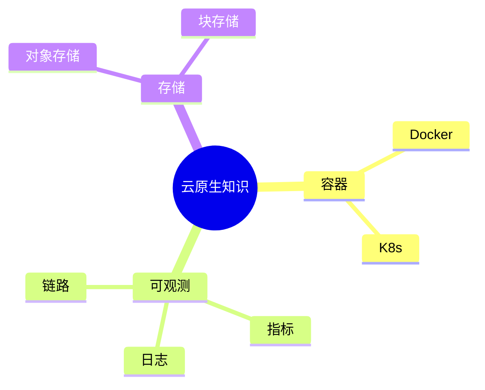
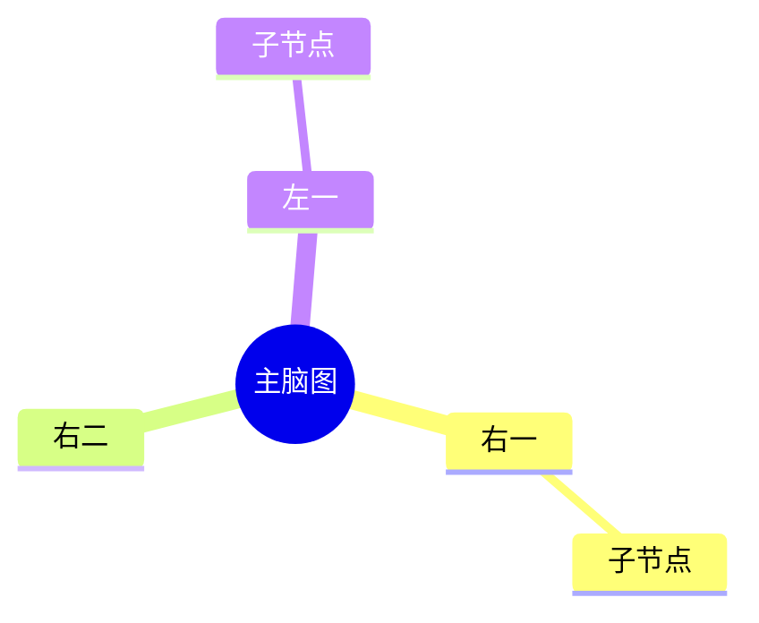

# 思维导图（15-mindmap-diagram）

## 1. 适用场景

知识梳理、发散规划、概念层级、头脑风暴整理。**树形语义**——从根到叶的层级关系。

## 2. 基本语法



- 缩进（2/4 空格或 tab）即层级；
- 根节点：`root((标题))`；
- 节点形状：默认圆角、`(( ))` 圆、`[ ]` 方、`{{ }}` 六角、`(/ )` 平行四边形。

## 3. 左右分支与形状



- mindmap 自动分左右两翼（branch 计数分配）；
- 需要显式控制分支位置/方向的场景用 `flowchart LR` 替代。

## 4. 样式（classDef）

```mermaid
%%{init: {"theme": "base", "themeVariables": {"primaryColor": "#fff", "primaryBorderColor": "#333", "primaryTextColor": "#1a1a1a", "lineColor": "#666"}}}%%
mindmap
  root((项目))
    核心 :::core
    扩展 :::ext
  classDef core fill:#e8f0fe,stroke:#1a73e8
  classDef ext fill:#f1f3f4,stroke:#5f6368
```

- `:::类名` 挂在行尾；classDef 集中定义；
- 同一套 classDef 与 flowchart/classDiagram 语义一致（同色同族）。

## 5. 布局与美观

- 层级 ≤4；每层分支 ≤6；
- 节点文字 ≤10 字符，超长换行 `\n` 或拆节点；
- 叶子节点数量多时合并同类（信息架构优先）。

## 6. 常见陷阱

- 缩进不一致（渲染错乱）——用同一字符（空格）缩进；
- 根节点没写 `root`（默认根在左上，语义弱）；
- 把 mindmap 当流程图（mindmap 无方向语义）。
