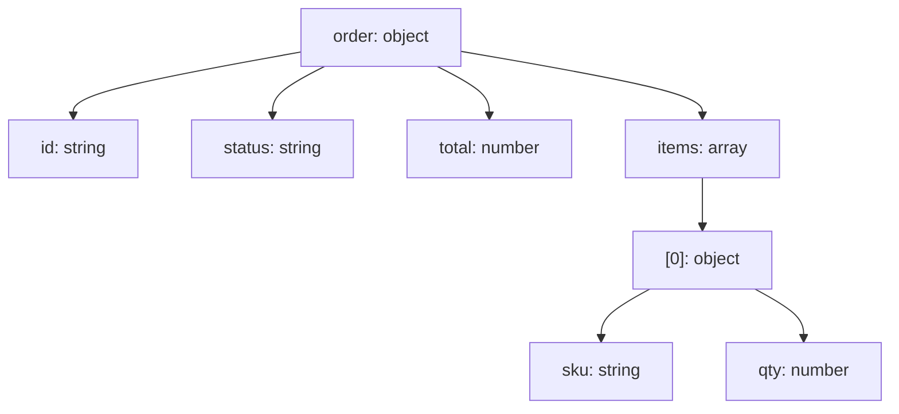

# JSON 数据可视化（16-json-diagram）

> PlantUML `@startjson` 在 Mermaid **无原生对应**。用 `flowchart` 结构树近似：对象 = 父节点，键 = 子节点，值类型标注在节点上。交付说明注明「JSON 可视化（flowchart 近似）」。

## 1. 适用场景

展示 JSON 数据结构（配置、API 响应、嵌套对象）、给非技术读者看数据形状。

## 2. flowchart 结构树写法

```json
{
  "order": {
    "id": "A1001",
    "status": "PAID",
    "items": [ {"sku": "X1", "qty": 2} ],
    "total": 199.0
  }
}
```



- 键名 + 类型标注：`键: 类型`（≤12 字符）；
- 数组下标 `[0]`；对象嵌套逐层展开；
- 层级 ≤5 层，更深用 `…` 折叠 + 图集文字。

## 3. 类型标注与高亮

```mermaid
flowchart TD
  root["config: object"] --> db["database: object"] :::obj
  db --> host["host: string"] :::str
  db --> port["port: number"] :::num
  db --> ssl["ssl: bool"] :::flag
  classDef obj fill:#e8f0fe,stroke:#1a73e8
  classDef str fill:#f1f3f4,stroke:#5f6368
  classDef num fill:#e6f4ea,stroke:#188038
  classDef flag fill:#fef7e0,stroke:#f9ab00
```

- 类型色：object（蓝）/ string（灰）/ number（绿）/ bool（黄）；
- 关键路径高亮（与代码/文档对应字段）。

## 4. 布局与美观

- 方向 `TD`（树）；宽树用 `LR`；
- 叶子节点多时用 `×N`（`items: array ×12`）；
- 大 JSON 只展示关键子树（文档里给全文）。

## 5. 常见陷阱

- 把全部字段画出来（>20 节点必折叠）；
- 类型标注缺失（读者看不出数据类型）；
- 数组下标不标（`[0]` 语义丢失）。
